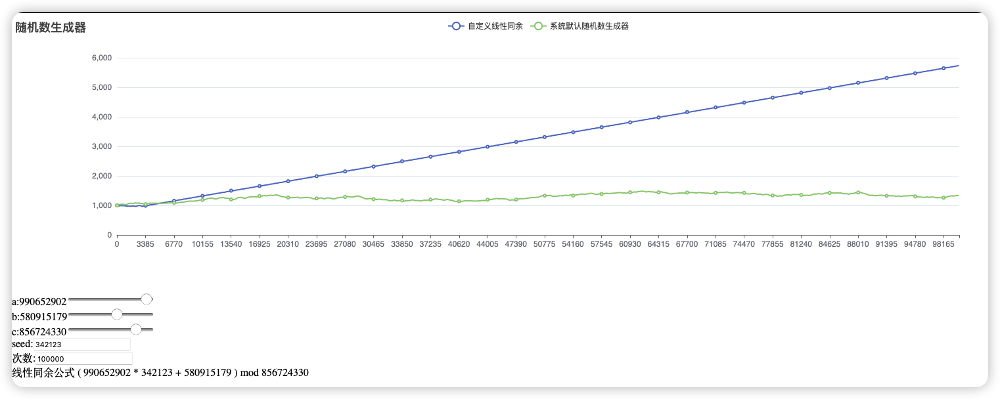
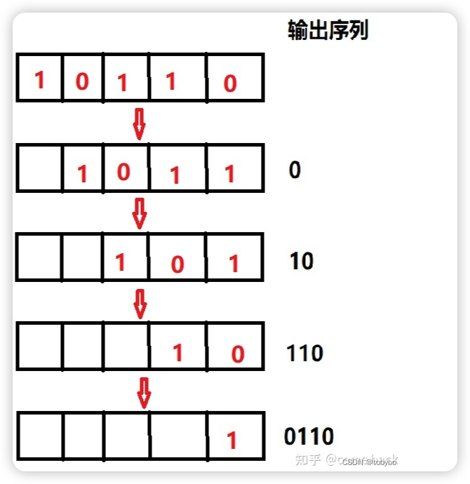
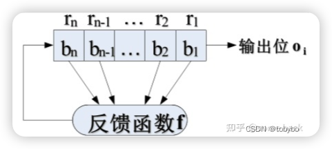
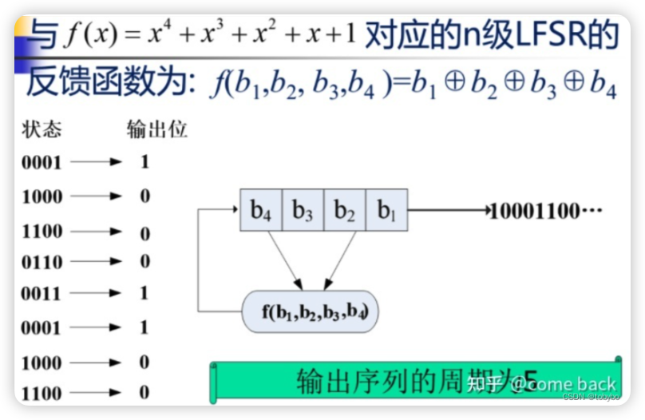
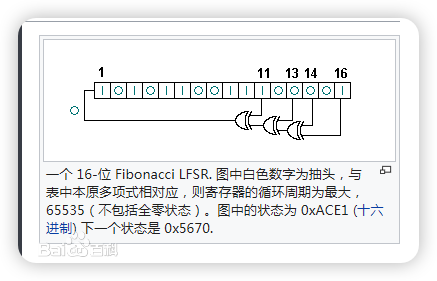

# 计算机生成随机数的原理及代码分析

## 原理

随机数生成是计算机科学和密码学中的一个重要课题.

主要的随机数生成方法包括:

1. 伪随机数生成:
   这种方法利用计算机算法对当前数字或数字集进行混淆处理,产生看似随机的新数字.
   这种方法生成的数字并非真正随机,但在许多实际应用中已经足够随机.
2. 量子随机数生成:
   这种方法利用量子力学系统固有的随机性来生成真正随机的数字.
   量子随机数生成可以提供比伪随机数更高的安全性和不可预测性.
3. 物理随机数生成:
   这种方法利用热噪声或放射性衰变等物理过程来生成随机数.
   生成的数字是真正随机的,但生成过程可能较慢且成本较高,相比之下不如伪随机数或量子方法快捷.

具体采用哪种随机数生成方法,取决于应用的具体需求,如速度,安全性和成本等.
伪随机数生成器广泛应用于一般性模拟中,而量子和物理随机数生成器更适用于需要高安全性的密码学应用.

> [!FAQ] 这里我们提一下为什么是计算机使用的是伪随机
> 首先我们讨论一下真随机数,它们是具有完全不可预测,你不能遇见下一个数值是多少.
> 而对于伪随机数而言,对于小规模问题可能察觉不到规律,但是运算次数多起来会表现出规律性.即周期性
> 举个例子:
> 使用随机数模拟抛硬币的正反面,假设你在澳门赌场有总金币 1000元,有 50% 赢 1 元, 50% 输 1 元,不考虑其他成本,
> 并且允许你全部输完后可以继续赌博,反复无数次,你是亏还是赚?
> [!EXAMPLE] 查看 <a href="./code/计算机生成随机数的原理及代码分析/coin_simulate/">工程模拟</a> ,该工程可以模拟各个参数
> 
> 在此参数下,固然线性同余在短期内有良好的表现,一旦次数达到一定程度,会出现一定的趋势

### 伪随机数生成

伪随机数生成方法:

1. 中间平方法: 由冯·诺依曼提出的早期随机数生成方法,通过计算并截取大整数平方的中间部分作为下一个随机数种子.
2. 梅森旋转算法: 这是一种高性能的伪随机数生成器,因其周期长且通过多项式混沌映射产生的随机性较好而广泛应用于各种编程语言的标准库中.
3. 线性同余生成器: 这是一种简单快速的伪随机数生成算法,基于递归公式生成新的随机数,如: $X_{n+1} = (aX_n + c) \mod m$,其中 a ,c 和 m 是预先设定的常数.
4. 组合线性同余生成器: 为了提高随机数的质量,可以将多个线性同余发生器的结果组合起来. 如设置三个参数各不相同的线性同余发生器,对于同一个种子(seed)生成的下一项随机数进行取平均.

#### 中间平方法

1. 设随机数为 $x_n$，将其平方得到 $x_n^2$
2. 取出 $x_n^2$ 的中间几位作为新的随机数 $x_{n+1}$ 
3. 重复上述步骤，直到生成的随机数满足需要的个数

#### 梅森旋转算法

算法原理:

梅森旋转算法的核心是基于线性反馈移位寄存器(LFSR)生成伪随机数. LFSR 通过简单的异或运算来更新寄存器的状态,从而产生伪随机序列.
为了使 LFSR 达到最大周期,其反馈函数必须是一个本原多项式.本原多项式是不可约多项式，能够整除 $x^{2n-1} + 1$ 不能整除 $x^d + 1$.
其中 $d$ 能整除 $2^n - 1$.

步骤:

1. 获得基础的梅森旋转链: 初始化一个状态数组,并设置种子到数组第一个位置.根据该种子进行一系列操作后逐个生成下一个位置的数字.这里存储的一般是 uint 值.
2. 对于旋转链进行旋转算法: 通过特定的公式更新状态数组中的数值.
3. 对于旋转算法所得的结果进行处理: 生成新的随机数,并通过模运算限制其范围.

> [!NOTE] 一些专属名词解释:
> 梅森 -> 梅森素数: 法国科学家梅森发现有一类素数分布在 $2^n -1$ 这条直线上.数学界把这种数叫做梅森数.
> 位移寄存器: 移位寄存器是产生信号和序列的常用设备. 移位寄存器是指有若干个寄存器排成一,每个寄存器中都存储着一个二进制数
> (0 或 1). 移位寄存器每次把最右端(未端)的数字输出,然后整体向右移动一位.假设一个 5 位移位寄存器中存储着数据 10110，则不断移位,输出的效果如图所示:
> 
> 反馈位移寄存器: 在移位寄存器向右移位一位以后,左边就会空出一位(如上图所示)
> 这时如果采用一个反馈函数,以寄存器中已有的某些序列作为反馈函数 Q 的输入,在函数中经过一定的运算后,将反馈函数输出的结果填充到移位寄存器的最左端.
> 那么这样的移位寄存器就会有源源不断的输出.这样的,拥有反馈函数的移位寄存器称为反馈移位寄存器.
> 
> 线性反馈位移寄存器: 反馈函数是线性函数,就叫做线性反馈寄存器.
> 其反馈函数可以是 $f(x) = c_nx^n + c_{n-1}x^{n-1} + ... + c_1x^1 +1$ , $c_n$ 表示是否是抽头,如果是表示该位参与运算,否则不参与运算.
> 周期: 线性反馈位移寄存器具有周期性.位移到一定程度,一定会出现重复状态.且相同状态的反馈函数结果也是相同的.
> 最大周期: 我们把有 n 个寄存器的线性反馈位移寄存器叫做 n 级线性反馈位移寄存器. 这个寄存器也就能有 $2^n$ 个状态,再减去内容都为 0 的状态(因为反馈函数结果也为0,无意义).
> 所以一共有 $2^n -1$ 个状态,也就是其最大周期.把这个线性反馈位移寄存器生成的序列叫做 m 序列.
> 初始值: 在寄存器中的初始值即为生成器的 seed.
>  

#### 线性同余算法

1. 确定参数: 根据需求选择合适的模数(m), 乘数(a),增量(c)和初始值 $x_0$。
2. 初始化: 将初始值 $X_0$ 赋值给$X_n$.
3. 迭代生成: 根据递推公式$X_n + 1 = (aX_n + c) mod m$ 不断迭代生成随机数序列.
4. 输出随机数: 将生成的随机数用于所需的应用场景，如统计模拟、密码学等。

#### 陶斯沃思算法

1. 获得一个初始随机数种子
2. 通过使用线性反馈位移寄存器(LFSR)生成随机数序列,其中的数列每一位的状态是由前几位的状态决定的,如 $x_n = \sum_{i=1}^{k} x_{n-i}$
3. 得到的随机数序列进行乘以 0 或 1 再对 m 求模.显然 当 $m=2$ 时会得到只有 0 和 1 的数列.

公式为 $(\sum_{i=1}^k x_{n-i} * 0 or 1) mod m$

#### 滞后斐波那契生成器

基于斐波那契数列的思想,通过对序列中相隔一定距离的项进行运算来生成新的随机数.一般形式为$x_n = x_{n-1} \oplus x_{n-2}$,其中 $\oplus$ 是滞后参数,通常是异或运算,但也可以是其他运算

显而易见,此方法可能需要 2 个或者更多的种子(seed).

#### RSA 算法

由于 RSA 生成的内容不知道明文就无法预测,且结果稀奇古怪,无法预测.有人使用不同的 RSA 公私钥来生成随机数.更有甚者通过 RSA 最后一位的奇偶性来生成 0 1 序列

#### 其余生成算法

随着计算机的发展,生成随机数的算法多种多样起来,如: 内存垃圾值生成法,噪声获取法等等.

## 代码分析

### c

#### 使用

```c
#include<stdio.h>
#include<stdlib.h> // rand 和 srand 函数头文件
#include<time.h> // time 函数头文件
int main()
{
	srand((unsigned int)time(NULL)); // 使用 time 函数返回的时间戳作为 srand 函数的参数,产生 rand 函数的种子
	printf("%d\n", rand());
	return  0;
}
```

#### 原理

由于这些函数都是标准库函数,这些函数的定义可能不是直接指定的而是依赖于具体的编译器和运行环境.需要查看 GCC 源码

`git clone git://gcc.gnu.org/git/gcc.git`

在 `glibc` 中的 `stdlib/rand.c` 或者类似的文件中找到 `rand()` 的实现
这里是最新 `gcc rand` 调用的 `random` 函数源码:

```c
long int
random (void)
{
  if (rand_type == TYPE_0)
    {
      state[0] = ((state[0] * 1103515245) + 12345) & LONG_MAX;
      return state[0];
    }
  else
    {
      long int i;
      *fptr += *rptr;
      /* Chucking least random bit.  */
      i = (*fptr >> 1) & LONG_MAX;
      ++fptr;
      if (fptr >= end_ptr)
	{
	  fptr = state;
	  ++rptr;
	}
      else
	{
	  ++rptr;
	  if (rptr >= end_ptr)
	    rptr = state;
	}
      return i;
    }
}
```

显然如果 `rand_type == 0` 时,使用的线性同余算法,否则滞后斐波那契生成器.

对于第二种方法 `fptr` 和 `rptr` 指向了一个有初始值的状态表

---

#### 参考文献

1. [计算机科学技术百科全书](https://books.google.com.sg/books?hl=en&lr=&id=n79Zh2JzBhYC&oi=fnd&pg=PA11&dq=(random+number+generation)+AND+(computational+statistics)+AND+(cryptography)+OR+(随机数生成)+AND+(计算统计学)+AND+(密码学)&ots=bhGuAo6lNw&sig=rDoZqc1Ig3cOcpzcJIKvwOXV71A&redir_esc=y#v=onepage&q&f=false)
2. [线性反馈位移寄存器](https://blog.csdn.net/bo_self_effacing/article/details/130121964)
3. [梅森旋转算法](https://zh.wikipedia.org/zh-cn/梅森旋转算法)
5. [梅森旋转算法具体算法](https://www.bilibili.com/opus/870082944517013569)
