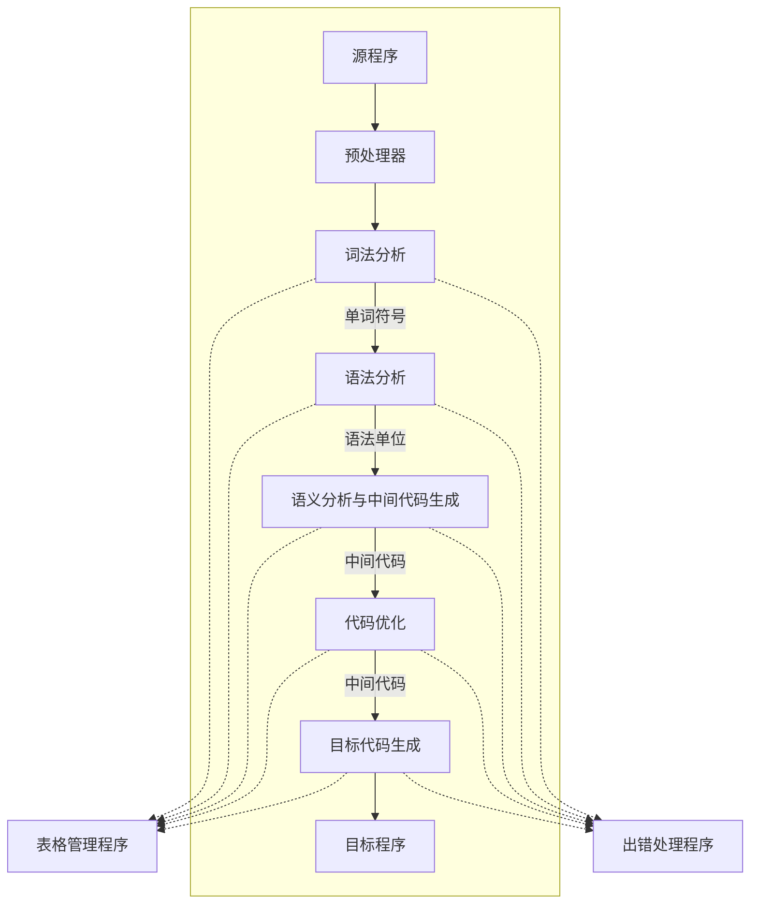
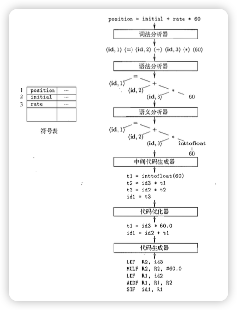

# 引论

## 编译原理

### 编译器

在使用诸如 c、java等程序设计语言时,将其源文件翻译成另一种语言形式叫做编译.完成这项翻译工作的软件系统叫做编译器.

#### 编译前端与后端

我们把编译程序分为**_编译前端_**和**_编译后端_**.

编译前端一般为词法、语法、语义分析与中间代码生成,有的也可能包含代码优化.如果源程序没有按正确的语法构成,必须提供有效信息,使用户改正.

后端与目标机有关的部分,如编译优化、目标代码生成.

后端的实现和计算机硬件密切相关,设计不依赖于源语言,仅依赖中间代码.

如 Java 编译成 Class 文件,在不同平台的虚拟机运行. 

### 解释器

在编译器之外还有一种语言处理器————解释器(interpreter).

解释器通过逐个语句地执行源程序,能更好的提供错误诊断.

为了更快完成输入输出的处理, 会使用 JIT(just in time) 编译,在程序运行时将中间语言（如Java字节码）转换为机器码的动态编译技术.

## 编译程序框架图

### 预处理器

在编译前,由于程序可能分成多个模块,存放于独立的文件中,使用预处理器可以把源程序聚合到一起.同时预处理器也会处理宏的定义和使用.

### 表格管理程序
登记源程序的各类信息、和编译各阶段的进展状况.

### 出错处理程序
编译过程中发现源程序有错误,编译程序应报告错误的性质和错误发生的地点,并且將错误所造成的影响限制在尽可能小的范围内,使得源程序的其余部分能继续编译下去,有些编译程序还能自动校正错误. 

### 词法分析

词法分析器读入源程序字符流,并将它们组合成一个有意义的语素(lexeme)序列.它将产生一下单词符号(token)作为输出:

> `<token-name,attribute-value>`

如对于一个源程序语句: `let position = 40 * x + 7;`
输出可以为 `<keyword,let><str,position>,<=>,<number,40>,<*>,<str,x><+>,<number,7>,<;>`
或者为 `<keyword,let><str,1>,<=>,<number,40>,<*>,<str,2><+>,<number,7>,<;>` ,其中 str 的 `attribute-value` 将会指向符号表.

### 语法分析

构建语法树

### 语义分析

语义分析器（）使⽤语法树和符号表中的信息来检查源程序是否和语⾔定义的语义⼀致它同时也收集类型信息，并把这些信息存放在语法树或符号表中，以便在随后的中间代码⽣成过程中使⽤。

### 遍

所谓的遍(pass)就是对源程序或源程序中间结果从头到位扫描一次,并作有关的加工处理,生成新的中间结果或目标程序.

通常每遍的工作从外存中获得前一遍的中间结果(第一遍获得源程序),再把结果记录于外存.既可以将上图不同阶段合为一遍,亦可以把一阶段的工作分为若干遍.

编译程序分为几遍是很难统一的.遍数多,编译程序的逻辑结构清晰,但也会增加输入输出时间.不是每一个语言都是单遍编译程序实现.

