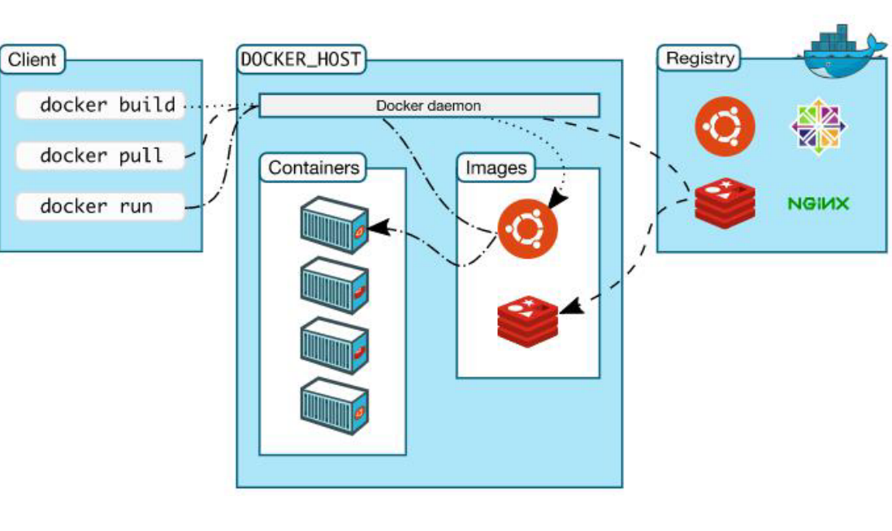
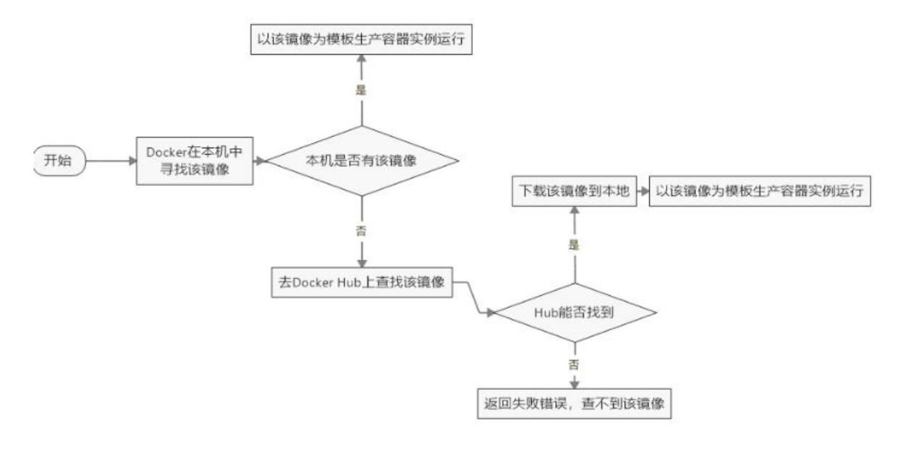
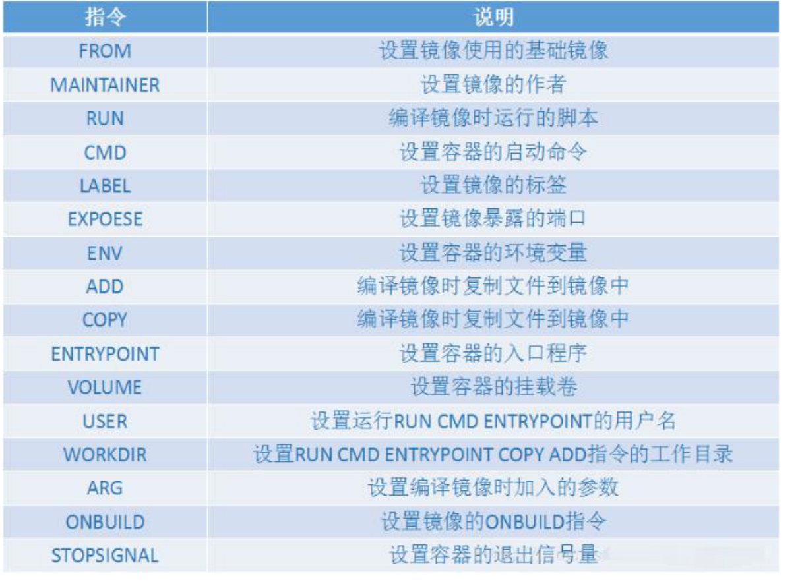
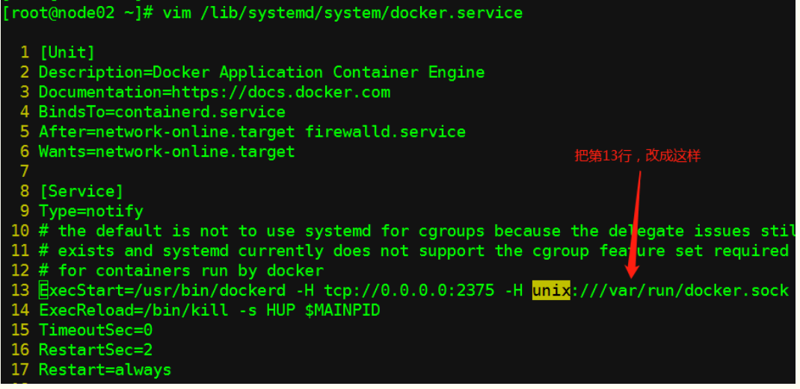
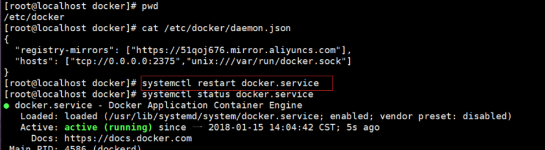

# docker

## 目录

- [Docker 架构](#Docker-架构)
- [安装 docker](#安装docker)
- [卸载 docker](#卸载docker)
- [启动 docker](#启动-docker)
- [设置镜像加速](#设置镜像加速)
- [docker 原理](#docker原理)
- [docker 常用命令](#docker常用命令)
- [docker 的迁移和备份](#docker的迁移和备份)
- [dockerfile](#dockerfile)
- [docker 镜像的分享](#docker镜像的分享)
- [Docker 远程连接设置](#Docker远程连接设置)

#### Docker 架构



docker 主要分为三部分

1. 注册中心-Repostory 里面存放需要的 docker 镜像软件
2. Client 客户端对 dockers 进行操作
3. docker 主机&#x20;
   1. 镜像（image）Docker 镜像（Image）就是一个只读的模板。镜像可以用来创建 Docker 容 器，一个镜像可以创建很多容器。Docker 镜像可以看作是一个特殊的文件系统，除了提供容器运行时所需的程 序、库、资源、配置等文件外，还包含了一些为运行时准备的一些配置参数（如匿名卷、环境变量、用户等）。
   2. 容器 Docker 利用容器（Container）独立运行的一个或一组应用。容器是用镜像创建的运行实例。它可以被启动、 开始、停止、删除。每个容器都是相互隔离的、保证安全的平台。

#### 安装 docker

```text
yum -y install gcc
yum -y install gcc-c++
安装需要的软件包
yum install -y yum-utils device-mapper-persistent-data lvm2
设置 yum 仓库
yum-config-manager --add-repo http://mirrors.aliyun.com/docker-ce/linux/centos/docker-ce.repo #注意：这里不要使用官方仓库，使用阿里仓库，否则后续 yum 安装可能报错。
更新 yum 软件包索引（速度可能较慢）
yum makecache fast
安装 DOCKER CE（容器管理工具）
yum install -y docker-ce docker-ce-cli containerd.io

```

#### 卸载 docker

```text
yum -y remove docker docker-client docker-client-latest docker-common docker-latest docker-latest-logrotate docker-logrotate docker-engine
```

#### 启动 docker

```text
systemctl start docker
systemctl enable docker #设置开机自启动
```

#### 设置镜像加速

```text
mkdir -p /etc/docker
vim /etc/docker/daemon.json
systemctl daemon-reload
systemctl restart docker

daemon.json 文件的内容如下：
{
"registry-mirrors": ["http://hub-mirror.c.163.com"]
}
{
"registry-mirrors": ["自己的阿里云加速器地址"]
}
```

#### docker 原理

1. docker 使用容器的流程

   

2. 工作原理 ：Docker 是一个 Client-Server 结构的系统，Docker 守护进程运行在主机上， 然后通过 Socket 连接从客 户端访问，守护进程从客户端接受命令并管理运行在主机上的容器。 容器，是一个运行时环境，就是我们前面 说到的集装箱。

#### docker 常用命令

1. 基础命令&#x20;

   ```text
   docker version # 查看docker版本信息
   docker info # 查看docker及环境信息
   docker help # 查看帮助文档
   ```

2. 镜像命令（增删改查）

   1. 查询本机镜像

      ```text
      docker images # 列出本地主机上的镜像
      -a #列出本地所有的镜像（含中间映像层）
      -q #只显示镜像ID。
      --digests  #显示镜像的摘要信息
      --no-trunc #显示完整的镜像信息
      ```

   2. 搜索镜像

      镜像的搜索都是到官网搜索（docker hub）,使用命令搜索的结果和在网站上搜索的结果一致。 下载可以通过镜像加速下载，搜索都是在官网搜索的。

      ```text
      docker search [options] <某个XXX镜像名字> # 搜索镜像
      --no-trunc # 显示完整的镜像描述
      -s # 列出收藏数不小于指定值的镜像。
      --automated  # 只列出 automated build类型的镜像

      ```

   3. 下载镜像

      ```text
      docker pull 镜像名字[:TAG] # 默认是最新版本，冒号后接版本号
      如：
      docker pull tomcat:8
      ```

   4. 删除镜像
      ```text
      docker rmi [options] <某个XXX镜像名字ID> # 删除镜像
      -f <镜像ID># 删除单个
      -f <镜像名1:TAG> <镜像名2:TAG> # 删除多个
      -f $(docker images -qa) # 删除全部
      ```

3. 容器命令

   1. 新建容器
      ```text
      docker run [OPTIONS] IMAGE [COMMAND] [ARG...]
      --name="容器新名字" # 为容器指定一个名称；
      -d # 后台运行容器，并返回容器ID，也即启动守护式容器；
      -i # 以交互模式运行容器，通常与 -t 同时使用；
      -t # 为容器重新分配一个伪输入终端，通常与 -i 同时使用；
      -P # 随机端口映射，并将容器内部使用的网络端口映射到我们使用的主机上
      -p # 指定端口映射，有以下四种格式
      ip:hostPort:containerPort
      ip::containerPort
      hostPort:containerPort # 将containerPort映射到主机上的hostPort端口
      containerPort
       -v 主机目录:容器目录 # 挂载 宿主机的目录挂载到容器的指定目录
       -e [键值对]# 设置环境变量；
      方式①：以交互方式运行 docker， 并打开 docker 内的命令行窗口：
      docker run -it --name='mycentos' centos
      方式②：如果要上传文件到 docker 容器，可以使用-v 参数：docker run -itv /opt:/usr/local/opt centos
      ```

   启动停止容器
   `docker start 容器名称 `

   `docker restart 容器名称`

   `docker stop 容器名称`

   1. 查询容器

      ```text
      docker ps [OPTIONS]
      -a # 列出当前所有正在运行的容器+历史上运行过的
      -l # 显示最近创建的容器。
      -n # 显示最近n个创建的容器。 docker ps -n 3
      -q # 静默模式，只显示容器编号。
      --no-trunc # 不截断输出。
      ```

   2. 删除容器

      ```text
      docker rm 容器ID  # 删除指定容器
      docker rm -f $(docker ps -a -q) # 删除所有容器，包括正在运行的容器
      docker ps -a -q | xargs docker rm # 删除所有容器，不包括正在运行的容器
      ```

   3. 查看 docker 容器日志

      ```text
      docker logs -f -t --tail 容器ID # 查看容器日志，
      -t # 是加入时间戳
      -f # 跟随最新的日志打印
      --tail 数字 # 显示最后多少条
      ```

   4. 重新进入 docker
      ```text
      docker exec -it 容器ID|容器名称 /bin/bash # 在容器中打开新的终端，并且可以启动新的进程
      docker attach 容器ID # 直接进入容器启动命令的终端，不会启动新的进程
      docker exec -it 容器ID ls -l /tmp # 在容器外执行docker内命令
      ```

#### docker 的迁移和备份

1. 容器保存为镜像

   ```text
   由容器保存为镜像用 docker commit 命令
   docker commit 容器名称 镜像名称
   ```

2. &#x20;tar 形式的保存和回复

   1. 保存

      ```text
      # 命令形式：docker save –o 文件名.tar.gz 镜像名
      # 保存镜像为文件 -o：表示output 输出的意思
      docker save -o mynginx.tar.gz mynginx_img
      ```

   2. 恢复
      ```text
      #命令形式: docker load -i 文件名.tar.gz
      docker load -i mynginx.tar.gz
      ```

3. 数据持久化

   再对镜像进行备份时，如 mysql 的表不会随着容器保存到镜像时进行储存，这时就要使用文件映射（volume）数据持久化技术

   ```text
   查看 volume: docker volume ls # volume 决定了数据在容器中的数据保存的目录
   .先将多余的删掉：docker volume rm -f $(docker volume ls) .
   查看某个 volume 具体信息: docker volume inspect volume name .
   ```

   使用 Docker 容器保存为镜像的时候，mysql 数据库、表、表中的数据要想一起保存下来，我们一定要在拷贝 镜像的时候，将 volume 卷也拷贝过去。在创建新的 docker 容器的时候，将 volume 卷和容器的 /var/lib/mysql 目录映射一下，即可实现数据恢复

   ```text
   docker run -d --name mysql282 -p 3991:3306 -v /var/lib/docker/volumes/mysql05_volume/_data:/var/lib/mysql -e MYSQL_ROOT_PASSWORD=andy mysql-image
   ```

   需要注意在执行上面这条创建容器的命令时，需要将其它的 mysql 容器关掉。尤其是占用着 mysql05_volume 目录映射的 mysql 容器关掉。否则这里不好使。

   注意：即使 docker 容器被删除了，centos 上的 volume 持久化数据也是不会被删除的。

#### dockerfile

1. 什么是 dockerfile
   前面的课程中已经知道了，要获得镜像，可以从 Docker 仓库中进行下载。那如果我们想自己开发一个镜像，那 该如何做呢？答案是：Dockerfile,也就 dockerfile 可以生成 image 镜像。 Dockerfile 其实就是一个文本文件，由一系列命令和参数构成，Docker 可以读取 Dockerfile 文件并根据 Dockerfile 文件的描述来构建镜像。 1.对于开发人员:可以为开发团队提供一个完全一致的开发环境； 2.对于测试人员:可以直接拿开发时所构建的镜像或者通过 Dockerfile 文件构建一个新的镜像开始工作了。 3.对于运维人员:在部署时，可以实现应用的无缝移植。
2. dockerfile 命令

   

   ```text
   FROM
   指定基础镜像，比如 FROM ubuntu:14.04 FROM ubuntu:14.04
   RUN
   在镜像内部执行一些命令，比如安装软件，配置环境等，换行可以使用
   RUN groupadd -r mysql && useradd -r -g mysql mysql
   ENV
   设置变量的值，ENV MYSQL_MAJOR 5.7，可以通过 docker run --e key=value修改，后面可以直接使 用${MYSQL_MAJOR} ENV MYSQL_MAJOR 5.7
   LABEL 设置镜像标签
   LABEL email="itcrazy2016@163.com" LABEL name="itcrazy2016"
   VOLUME
   指定数据的挂在目录 VOLUME /var/lib/mysql
   COPY
   将主机的文件复制到镜像内，如果目录不存在，会自动创建所需要的目录，注意只是复制，不会提取和 解压:
   COPY docker-entrypoint.sh /usr/local/bin/
   ADD
   将主机的文件复制到镜像内，和 COPY类似，只是 ADD 会对压缩文件提取和解压
   ADD application.yml /etc/itcrazy2016/
   WORKDIR
   指定镜像的工作目录，之后的命令都是基于此目录工作，若不存在则创建 WORKDIR /usr/localWORKDIR tomcat RUN touch test.txt 会在/usr/local/tomcat 下创建 test.txt 文件 WORKDIR /root ADD app.yml test/ 会在/root/test 下多出一个 app.yml 文件
   CMD
   容器启动的时候默认会执行的命令，若有多个 CMD 命令，则最后一个生效 CMD ["mysqld"] 或 CMD mysqld
   ENTRYPOINT
   和 CMD 的使用类似 ENTRYPOINT ["docker-entrypoint.sh"] 和 CMD 的不同 docker run执行时，会覆盖 CMD 的命令，而 ENTRYPOINT 不会
   EXPOSE
   指定镜像要暴露的端口，启动镜像时，可以使用-p 将该端口映射给宿主机 EXPOSE 3306
   ```

   **具体构建**

   使用 Dockerfile 进行镜像构建

   ```text
   docker build [OPTIONS] PATH | URL | -
   docker build
   --tag, -t: 镜像的名字及标签，通常 name:tag 或者 name 格式；可以在一次构建中为一个镜像设置多个标签
   -f :指定要使用的Dockerfile路径；
   如：
   docker build -t runoob/ubuntu:v1 .

   注意后边的空格和点，不要省略

   ```

   基于 jar 包的 dockerfile

   ```text
   #基于java镜像创建新镜像
   FROM java:8
   #镜像作者
   MAINTAINER atguigu
   #将当前路径下的jar包上传到容器/opt目录下
   ADD spring-boot-maven-project01-1.0-SNAPSHOT.jar /opt/spring-boot-maven-project01-1.0-SNAPSHOT.jar
   #运行jar包
   ENTRYPOINT ["nohup","java","-jar","/opt/spring-boot-maven-project01-1.0-SNAPSHOT.jar","--server.port=10000","&"]
   ```

   基于 war 包的 dockerfile

   ```text
   FROM tomcat:8
   MAINTAINER jack
   label name='springboot-war' version='1.0' author='Andy' /usr/local/tomcat/webapps/da.war
   COPY da.war
   RUN cd ./bin CMD ["catalina.sh","run"]
   ```

   总结：对于 jar 工程： java -jar 项目.jar 依赖的是 jdk 环境 对于 war 工程: 通过启动 tomcat 部署 war 工程项目 依赖的是 tomcat 环境

#### docker 镜像的分享

1. 分享到 hub.docker.com

   第一步： [https://www.docker.com/products/docker-hub](https://www.docker.com/products/docker-hub "https://www.docker.com/products/docker-hub") 注册用户名和密码
   第二步 docker login&#x20;

   第三步：在 dockerhub 网页创建仓库

   第四步：给 docker 镜像打标签(必须正确命名映像的名称空间才能在 Docker Hub 上共享) 先查看自己的镜像名称，然后通过 docker tag 给自己的镜像打标签&#x20;

   docker tag 镜像名称 \<Your Docker ID>/\<Repository Name>:\<tag>(同时指定版本)&#x20;

   docker tag dockerjar idocker6/image-repos:1.0
   第五步：将映像推送到 Docker Hub：&#x20;

   docker push 镜像标签名&#x20;

   docker push idocker6/image-repos:1.0

2. 分享到阿里云

   第一步：[https://cr.console.aliyun.com/cn-hangzhou/instances/mirrors](https://cr.console.aliyun.com/cn-hangzhou/instances/mirrors "https://cr.console.aliyun.com/cn-hangzhou/instances/mirrors")注册用户名和密

   第二步：创建仓库

   第三步：登录到阿里云 docker 仓库 sudo docker login --username=aking_hao_a [registry.cn-hangzhou.aliyuncs.com](http://registry.cn-hangzhou.aliyuncs.com "registry.cn-hangzhou.aliyuncs.com")

   第四步给 image 打 tag 标签&#x20;

   格式: sudo docker tag \[ImageId] [registry.cn-hangzhou.aliyuncs.com/mydockerimage_test/war-img:v1.0](http://registry.cn-hangzhou.aliyuncs.com/mydockerimage_test/war-img:v1.0 "registry.cn-hangzhou.aliyuncs.com/mydockerimage_test/war-img:v1.0")

   打标签: sudo docker tag war-img [registry.cn-hangzhou.aliyuncs.com/mydockerimage_test/war-img:v1.0](http://registry.cn-hangzhou.aliyuncs.com/mydockerimage_test/war-img:v1.0 "registry.cn-hangzhou.aliyuncs.com/mydockerimage_test/war-img:v1.0")

   第五步：推送

   sudo docker push [registry.cn-hangzhou.aliyuncs.com/mydockerimage_test/war-img:v1.0](http://registry.cn-hangzhou.aliyuncs.com/mydockerimage_test/war-img:v1.0 "registry.cn-hangzhou.aliyuncs.com/mydockerimage_test/war-img:v1.0")

   别人下载并且运行：&#x20;

   docker pull [registry.cn-hangzhou.aliyuncs.com/mydockerimage_test/war-img:v1.0](http://registry.cn-hangzhou.aliyuncs.com/mydockerimage_test/war-img:v1.0 "registry.cn-hangzhou.aliyuncs.com/mydockerimage_test/war-img:v1.0")

   docker run -d --name docker-war -p 6661:8080 [registry.cn-hangzhou.aliyuncs.com/mydockerimage_test/war-img:v1.0](http://registry.cn-hangzhou.aliyuncs.com/mydockerimage_test/war-img:v1.0 "registry.cn-hangzhou.aliyuncs.com/mydockerimage_test/war-img:v1.0")

#### Docker 远程连接设置

1. 方式一

   

   重启服务

   systemctl daemon-reload && systemctl restart docker

   在另外一台 docker 服务器上远程连接测试：

   docker -H tcp\://192.168.3.201:2375 ps 　　#192.168.3.201：是开启允许远程连接的那一台服务器，2375：端口 ps：docker 命令

   2\. 方式二

   修改/etc/docker/daemon.json 文件，如果没有在该目录创建即可，然后添加 hosts

   

   hosts 分 tcp,uninx,fd 三种模式，第一中时 tcp 指定网络连接方式，0.0.0.0:2375 是指所有网络都可以连接，不安全，因此一般会加上 stl 证书形式，这里我用的局域网，所有没有加证书

   第二种 uninx 时指本地可以自由连接 docker

   重启服务

   systemctl daemon-reload && systemctl restart docker

[常用软件 docker 安装和启动](常用软件docker安装和启动/常用软件docker安装和启动.md "常用软件docker安装和启动")
