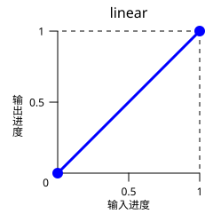
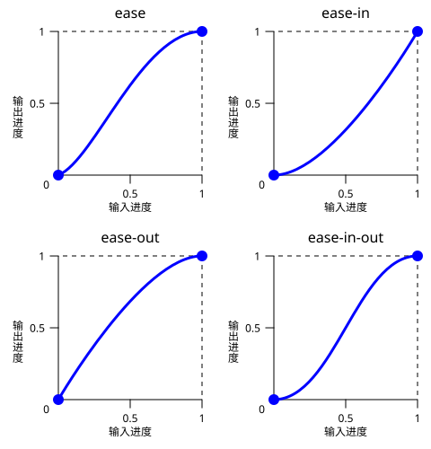
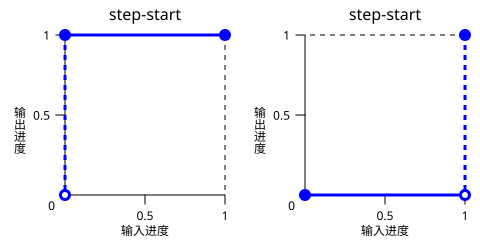
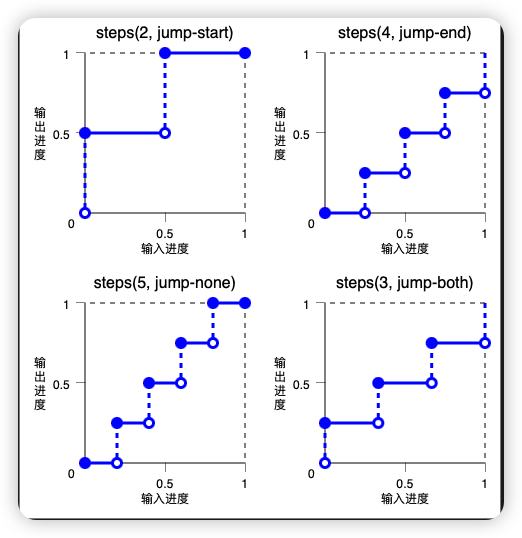
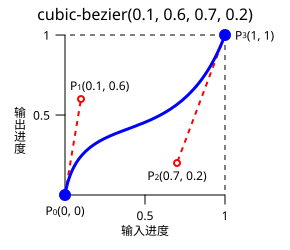
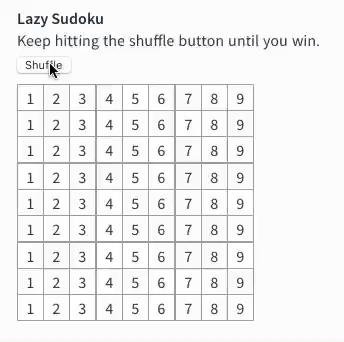

# 动画

## css transition

transition 属性允许你在元素状态改变时控制过渡效果。它可以让你在元素从一种样式变换到另一种样式时产生平滑的过渡效果，比如从一种颜色渐变到另一种颜色，或者从隐藏到显示。

- transition-property: 指定要过渡的 CSS 属性的名称。例如，color、background-color 等。
- transition-duration: 指定过渡效果持续的时间，以秒或毫秒为单位。
- transition-timing-function: 指定过渡效果的速度曲线。它可以是 linear（线性）、ease（渐入渐出）、ease-in（渐入）、ease-out（渐出）、ease-in-out（先渐入后渐出）等等。
- transition-delay: 指定过渡效果开始之前的延迟时间，以秒或毫秒为单位。

:::demo src=frontEnd/css/examples/animation/animationTranstion.vue
:::

## css animation

动画相关的属性:

- animation-name: 规定需要绑定到选择器的 keyframe 名称。
- animation-duration: 规定完成动画所花费的时间，以秒或毫秒计。
- animation-timing-function: 规定动画的速度曲线。

  - cubic-bezier(n,n,n,n) 在 cubic-bezier 函数中自己的值。可能的值是从 0 到 1 的数值。
  - linear(n,n,...)
  - linear 动画从头到尾的速度是相同的。
    
  - ease 默认。动画以低速开始，然后加快，在结束前变慢。
  - ease-in 动画以低速开始。
  - ease-out 动画以低速结束。
  - ease-in-out 动画以低速开始和结束。
    
  - step-start
  - step-end
    

```css
steps(2, jump-start) /* 同 steps(2, start) */
steps(4, jump-end) /* 同 steps(4, end) */
steps(5, jump-none)
steps(3, jump-both)
```



- animation-delay: 规定在动画开始之前的延迟。

  - time 可选。定义动画开始前等待的时间，以秒或毫秒计。默认值是 0。

- animation-iteration-count:规定动画应该播放的次数。

  - n 定义动画播放次数的数值。
  - infinite 规定动画应该无限次播放。

- animation-direction: 规定是否应该轮流反向播放动画

  - normal 默认值。动画应该正常播放。
  - alternate 动画应该轮流反向播放。

- animation-fill-mode: 动画在播放之前或之后，其动画效果是否可见

  - none 不改变默认行为。
  - forwards 当动画完成后，保持最后一个属性值（在最后一个关键帧中定义）。
  - backwards 在 animation-delay 所指定的一段时间内，在动画显示之前，应用开始属性值（在第一个关键帧中定义）。
  - both 向前和向后填充模式都被应用。

- animation-play-state: 规定动画是正在运行还是暂停。
  - paused 规定动画已暂停。
  - running 规定动画正在播放。

还有简写属性:

animation: `<time [0s,∞]> ||  <easing-function>                   ||  <time>                              ||  <single-animation-iteration-count>  ||  <single-animation-direction>        ||  <single-animation-fill-mode>        ||  <single-animation-play-state>       ||  [ none | <keyframes-name> ]`

## @keyframes

定义关键帧,使用方法:

```css
@keyframes important1 {
  from {
    margin-top: 50px;
  }
  50% {
    margin-top: 150px !important;
  } /* 忽略 */
  to {
    margin-top: 100px;
  }
}
```

> 关键帧中出现的 !important 将会被忽略。

from -> 0%

to -> 100%

:::demo src=frontEnd/css/examples/animation/animationSimple.vue
:::

### [贝塞尔曲线 cubic-bezier](https://cubic-bezier.tupulin.com)

cubic-bezier() 定义了三次贝塞尔曲线。属于三次贝塞尔类的缓动函数常被称为“平滑”缓动函数，这是因为这些函数可用于抚平插值的起止。这些函数将输入进度与输出进度相关联，两个进度均以 `<number>` 表示。对于这些值，0.0 表示初始状态，1.0 表示最终状态。



三次贝塞尔曲线由 P0、P1、P2 和 P3 四点所定义。点 P0 和 P3 表示曲线的起止点。在 CSS 中，由于坐标为进度（横坐标为输入进度，纵坐标为输出进度），故这两点为定点。P0 为 (0, 0)，表示初始进度和初始状态。P3 为 (1, 1)，表示最终进度和最终状态。

## [FLIP 动画]

在 vue 文档中有以下动画:



浏览器原生无法实现这种动画，是因为我们会使用 element.appendChild() 等 API 来重新插入 DOM，此时元素瞬间移位，不可能有 CSS 过渡产生。

> css 动画是根据 css 属性来进行的.上面的动画是改变了元素的 dom 结构.

### FLIP 含义

FLIP 这四个字母，分别表示四个单词：“First” 初始位置、“Last” 最终位置、“Invert” 反向、“Play” 播放。
用中文翻译和解释为：“反向播放从最终位置到初始位置的过渡”；从终点回到起点的过程，反向播放，于是负负得正，动画就是正常的从起点到终点。

[FLIP 动画]: https://zhuanlan.zhihu.com/p/712766286

:::demo src=frontEnd/css/examples/animation/animationFlip.vue
:::

:::demo src=frontEnd/css/examples/animation/animationFlip2.vue
:::
