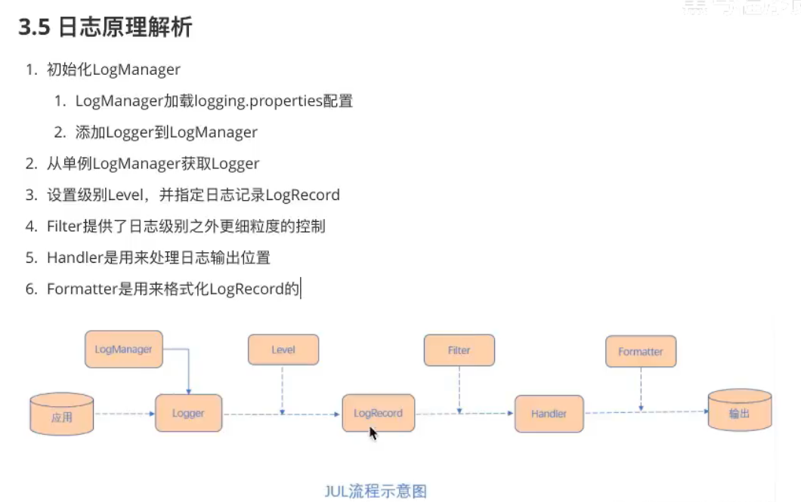

# Log-JUL 的使用

## 目录

- [JUL 定义的日志级别（Level 类）](#JUL定义的日志级别Level类)
- [logger 对象](#logger对象)
- [Log 对象的获取](#Log对象的获取)
  - [通过配置文件，设定 loger 对象的状态](#通过配置文件设定loger对象的状态)
  - [在 java 代码里配置 logger 的设置](#在java代码里配置logger的设置)

[java 日志——JUL](https://blog.csdn.net/DU87680258/article/details/102723095 "java日志——JUL")

### JUL 定义的日志级别（Level 类）

要了解 JUL 的日志级别就要看一下 java.util.logging.Level 这个类，具体的日志级别都定义在了代码里。

```java
// 用于关闭日志功能
public static final Level OFF = new Level("OFF",Integer.MAX_VALUE, defaultBundle);
// 用于表明程序严重的失败或错误
public static final Level SEVERE = new Level("SEVERE",1000, defaultBundle);
// 用于表明潜在的问题
public static final Level WARNING = new Level("WARNING", 900, defaultBundle);
// 信息级别，通过消息会被输入到控制台，所以信息级别一般记录对最终用户或系统管理员有用的信息
public static final Level INFO = new Level("INFO", 800, defaultBundle);
// 配置级别，用于表明系统静态配置的信息
public static final Level CONFIG = new Level("CONFIG", 700, defaultBundle);
// 用于提供跟踪信息的消息级别
public static final Level FINE = new Level("FINE", 500, defaultBundle);
// 用于提供跟踪信息的消息级别
public static final Level FINER = new Level("FINER", 400, defaultBundle);
// 用于提供跟踪信息的消息级别
public static final Level FINEST = new Level("FINEST", 300, defaultBundle);
// 记录所有级别的日志
public static final Level ALL = new Level("ALL", Integer.MIN_VALUE, defaultBundle);
```

JUL 的 Level 提供了三个跟踪信息的级别，FINE、FINER、FINEST 的确切含义在不同子系统之间变化，但通常用 FINEST 记录大量最详细的日志信息，用 FINER 记录记录相比于 FINEST 精简的日志信息，FINEST 记录最精简，也是最重要的日志信息。

### logger 对象



Logger 建造的对象是由根对象的，即 rootlogger

`Logger logger = Logger.getLogger("com.atguigu.journal");`通过次方法获得的 Logger 对象，调用 getParent（）方法即可获得，但是如果又构建了一个新的下面的对象`Logger logger1 = Logger.getLogger("com.atguigu");`第一个 logger 的 parent 变为了 logger1，logger1 的 parent 为 rootlogger

```java
Logger logger = Logger.getLogger("com.atguigu.journal.JUL.JULTest");
Logger logger1 = Logger.getLogger("com.atguigu");
Logger parent = logger.getParent();
System.out.println(parent==logger1);//true
Logger parent1 = logger1.getParent();
//RootLogger  logger对象的顶级父对象
System.out.println(parent1);//java.util.logging.LogManager$RootLogger@f2a0b8e
```

### Log 对象的获取

#### 通过配置文件，设定 loger 对象的状态

```text
#过滤器 控制台和文件打印所有级别
handlers= java.util.logging.ConsoleHandler,java.util.logging.FileHandler
.level= ALL
#设置文件打印位置
java.util.logging.FileHandler.pattern = D:\\develop_java\\program\\study\\logging\\java%u.log
#文件打印行数
java.util.logging.FileHandler.limit = 50000
#文件的数量
java.util.logging.FileHandler.count = 1
#打印的格式
java.util.logging.FileHandler.formatter = java.util.logging.SimpleFormatter
#打印的具体格式，不使用默认
java.util.logging.SimpleFormatter.format=%1$tb %1$td, %1$tY %1$tl:%1$tM:%1$tS %1$Tp %2$s %4$s: %5$s%n
#文件追加在后面，不会使没打印一次文件被刷新
java.util.logging.FileHandler.append=true
#控制台的打印级别
java.util.logging.ConsoleHandler.level = ALL
java.util.logging.ConsoleHandler.formatter = java.util.logging.SimpleFormatter
java.util.logging.ConsoleHandler.encoding=UTF-8
com.xyz.foo.level = SEVERE
```

```java
        //加载配置文件
        InputStream ins = JULTest.class.getClassLoader().getResourceAsStream("logging.properties");
        //通过静态方法得到logManager对象
        LogManager logManager = LogManager.getLogManager();
        //读取配置文件
        logManager.readConfiguration(ins);
        //创建日志记录器
        Logger logger = Logger.getLogger("com.atguigu.journal");
        logger.severe("错误logger");
        logger.warning("警告logger");
        logger.info("IO消息logger");
        /*控制台打印以上三个 默认级别为info*/
        logger.config("配置文件logger");
        logger.fine("消息logger");
        logger.finer("消息logger");
        logger.finest("消息logger");
```

#### 在 java 代码里配置 logger 的设置

```java
        //获取日志记录器对象
        Logger logger = Logger.getLogger("com.atguigu.journal.JULTest");
        //日志输出
        logger.info("第一个日志");
        //对日志设置级别并输出
        logger.log(Level.INFO,"第二个日志");
        /*日志级别：
        * SEVERE 错误 造成程序终止
        * WARING 警告 不会造成程序终止，但程序有问题
        * INFO 消息信息 io信息 网络链接信息 sql查询信息
        * CONFIG 记录配置文件的读取
        * 普通消息
        * FINE 信息最少
        * FINER
        * FINEST 信息最多
        * 开关
        * ALL 开 value最小
        * OFF 关 value最大*/
        //使用占位符
        String name="第三个日志";
        logger.log(Level.INFO,"{0}",name);
        name="好好";
        int age=11;
        logger.log(Level.INFO,"信息为{0},{1}",new Object[]{name,age});

        logger.severe("错误");
        logger.warning("警告");
        logger.info("IO消息");
        /*控制台打印以上三个 默认级别为info*/
        logger.config("配置文件");
        logger.fine("消息");
        logger.finer("消息");
        logger.finest("消息");

        //自定义日志级别
        //关闭系统默认配置
        logger.setUseParentHandlers(false);

        //创建ConsolHandler
        ConsoleHandler consoleHandler = new ConsoleHandler();

        //创建简单格式转换对象
        SimpleFormatter simpleFormatter=new SimpleFormatter();
        //进行关联
        consoleHandler.setFormatter(simpleFormatter);
        logger.addHandler(consoleHandler);
        logger.setLevel(Level.ALL);
        consoleHandler.setLevel(Level.ALL);

        //文件输出
        FileHandler fileHandler = new FileHandler("src\\com\\atguigu\\journal\\JUL\\JUL.log");
        //进相关联
        logger.addHandler(fileHandler);

        logger.severe("错误");
        logger.warning("警告");
        logger.info("IO消息");
        /*控制台打印以上三个 默认级别为info*/
        logger.config("配置文件");
        logger.fine("消息");
        logger.finer("消息");
        logger.finest("消息");
```
