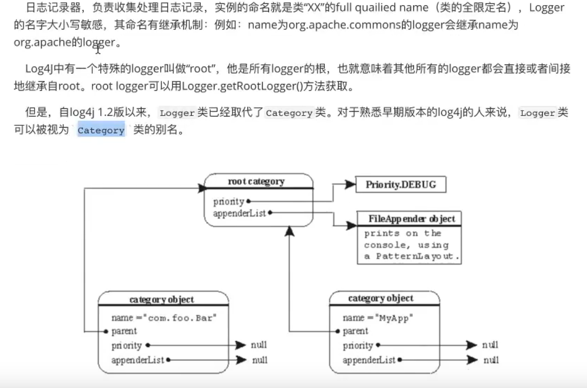
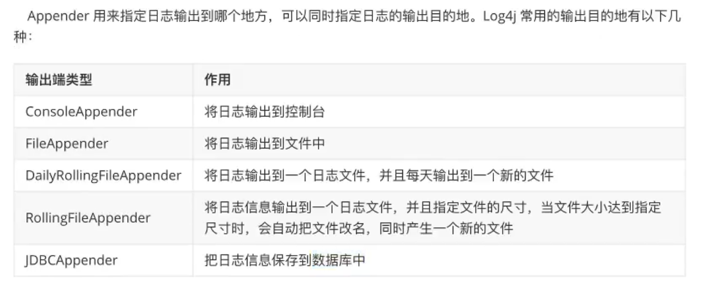
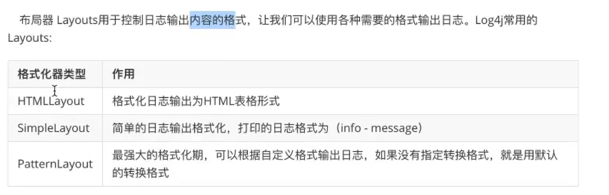
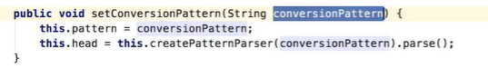

# Log4j 的使用

## 目录

- [使用步骤：](#使用步骤)
- [Log4j 的日志级别](#Log4j的日志级别)
- [log4j 的组件](#log4j的组件)
- [Loggers](#Loggers)
- [Appenders](#Appenders)
- [Layout](#Layout)
- [使用配置文件配置 log4j](#使用配置文件配置log4j)
  - [打开 log4j 运行的日志](#打开log4j运行的日志)
  - [指定 PatternLayout 自定义输出格式](#指定PatternLayout自定义输出格式)
  - [输出到文件](#输出到文件)
  - [使用日志文件分大小](#使用日志文件分大小)
  - [使用日期划分](#使用日期划分)
  - [把日志存储到数据库中](#把日志存储到数据库中)
  - [自定义 logger 对象](#自定义logger对象)

[log4j-1.2.17.jar](file/log4j-1.2.17_dS9B0YmdOh.jar " log4j-1.2.17.jar")

Log4j 使用的对象导航图的格式，在配置文件中使用的是在 java 对应的类的对象，使用 get 和 set 方法，为其对象赋值

#### 使用步骤：

1. 获得 Log4j 的 logger 对象并打印

   ```java
   public class Log4jTest {
       @Test
       public void getLog(){
       //log4j的重载方法传入class文件获得logger对象
       //获取日志记录器对象
           Logger logger=Logger.getLogger(Log4jTest.class);
           logger.info("log4j第一条信息");
       }
   }
   ```

   结果：

   

   说明没有找到 appenders and logger，且要求初始化操作

2. 进行初始化操作 `BasicConfigurator.configure();`

#### Log4j 的日志级别

- fatal //严重错误导致系统崩溃
- error //错误信息，不会影响系统的运行
- wain //警告信息，可能会发生的问题
- info //运行信息，数据库链接、网络链接、IO 操作
- debug（默认级别）//调试信息，记录程序变量参数传递信息
- trace //追踪信息，记录程序所有的流程信息

#### log4j 的组件

log4j 主要由 Loggers（日记记录器，控制日志是否输出）、Appenders（输出器，指定输出方式文件还是控制台）、Layout（日志格式化器，日志的输出格式）

#### Loggers



#### Appenders



#### Layout



### 使用配置文件配置 log4j

```text
#指定顶级父元素rootlogger赋值显示级别和appender
log4j.rootLogger= trace,console
#指定控制台输出控制
log4j.appender.console=org.apache.log4j.ConsoleAppender
#格式转换 指定格式
log4j.appender.console.layout=org.apache.log4j.SimpleLayout
```

```java
public class Log4jTest {
    @Test
    public void getLog(){
        BasicConfigurator.configure();
        Logger logger=Logger.getLogger(Log4jTest.class);
        logger.fatal("fatal");
        logger.error("log4j第一条信息");
        logger.warn("warn");
        logger.info("info");
        logger.debug("debug");
        logger.trace("trace");
    }
}
```

#### 打开 log4j 运行的日志

```java
public void getLog(){
        //打开log4j内置的日志
        LogLog.setInternalDebugging(true);
        ...
```

log4j 内部日志

```text
log4j: Trying to find [log4j.xml] using context classloader sun.misc.Launcher$AppClassLoader@18b4aac2.
log4j: Trying to find [log4j.xml] using sun.misc.Launcher$AppClassLoader@18b4aac2 class loader.
log4j: Trying to find [log4j.xml] using ClassLoader.getSystemResource().
log4j: Trying to find [log4j.properties] using context classloader sun.misc.Launcher$AppClassLoader@18b4aac2.
log4j: Using URL [file:/D:/develop_java/program/log/out/production/log/log4j.properties] for automatic log4j configuration.
log4j: Reading configuration from URL file:/D:/develop_java/program/log/out/production/log/log4j.properties
log4j: Parsing for [root] with value=[trace,console].
log4j: Level token is [trace].
log4j: Category root set to TRACE
log4j: Parsing appender named "console".
log4j: Parsing layout options for "console".
log4j: End of parsing for "console".
log4j: Parsed "console" options.
log4j: Finished configuring.
```

#### 指定 PatternLayout 自定义输出格式

直接查询 PatternLayout，发现有一个 setConversionPattern 的方法(对象导航图)



使用 conversionPattern 来对日志格式进行自定义

```text
log4j.appender.console.layout=org.apache.log4j.PatternLayout

log4j.appender.console.layout.conversionPattern=[%-10p]%r %c %t %F
%d{yyyy年MM月dd日 HH:mm:ss SSS} %m%n
#日期有乱码可以换成-
 #p前的-10表示以左对齐占10个字符的宽度
10表示以右对齐占10个字符的宽度
```

conversionPattern 的参数详解

```text
%m  输出代码中指定的的日志信息
%p  输出优先级[DEBUG INFO]
%n  换行符
%r  输出自应用启动到输出到该log信息消耗的毫秒值
%c  输出打印语句所属的全类名
%t  输出产生该日志线程全名
%d  输出服务器当前时间 可以指定格式
%l  输出日志发生的位置，包括类名，线程，代码所在行数
%F  输出日志消息产生所在文件名称
%L  当前代码的行号
%%   输出一个%
```

#### 输出到文件

```text
log4j.rootLogger= trace,file
log4j.appender.file=org.apache.log4j.FileAppender
log4j.allender.file.file=/log/log.log
log4j.appender.file.layout=org.apache.log4j.PatternLayout
log4j.appender.file.layout.conversionPattern=[%-10p]%r %c %t %F
%d{yyyy年MM月dd日 HH:mm:ss SSS} %m%n
```

#### 使用日志文件分大小

```text
log4j.rootLogger= trace,rolling
log4j.appender.rolling=org.apache.log4j.RollingFileAppender
log4j.appender.rolling.file=/log/log.log
#文件的大小
log4j.appender.rolling.maxFileSize=1KB/1MB/1GB
#文件的个数，超过10个按照时间覆盖
log4j.appender.rolling.maxBackupIndex=10
log4j.appender.rolling.layout=org.apache.log4j.PatternLayout
log4j.appender.rolling.layout.conversionPattern=[%-10p]%r %c %t %F
%d{yyyy年MM月dd日 HH:mm:ss SSS} %m%n

```

#### 使用日期划分

```text
log4j.appender.dailyfile=org.apache.log4j.DailyRollingFileAppender
log4j.appender.dailyfile.file=log\\com\\atguigu\\dailyfile.log
log4j.appender.dailyfile.encoding=UTF-8
#文件按照秒来划分
log4j.appender.dailyfile.datePattern='.'yyyy-MM-dd-hh-mm-ss
#格式转换
log4j.appender.dailyfile.layout=org.apache.log4j.PatternLayout
log4j.appender.dailyfile.layout.conversionPattern=[%-10p] %r %c %t %F %d{yyyy年MM月dd日 HH:mm:ss SSS} %m%n

```

#### 把日志存储到数据库中

```text
#大小写都要一至
log4j.appender.db=org.apache.log4j.jdbc.JDBCAppender
log4j.appender.db.layout=org.apache.log4j.PatternLayout
log4j.appender.db.Driver=com.mysql.jdbc.Driver
log4j.appender.db.URL=jdbc:mysql://localhost:3306/tx
log4j.appender.db.User=root
log4j.appender.db.Password=111111
log4j.appender.db.Sql=insert into log values(null,'%c','%d{yyyy-MM-dd HH:mm:ss SSS}','%p','%L')

```

```sql
#sql
CREATE TABLE `log`(
log_id INT NOT NULL PRIMARY KEY AUTO_INCREMENT,
Program_name VARCHAR(255) NOT NULL,
create_date VARCHAR(255) NOT NULL,
level_log VARCHAR(255) NOT NULL,
line VARCHAR(100) NOT NULL
);
```

#### 自定义 logger 对象

```text
#日志级别会进行覆盖，日志的appender会复用，父对象为rootLogger
log4j.logger.com.atguigu=info,dailyfile
```
