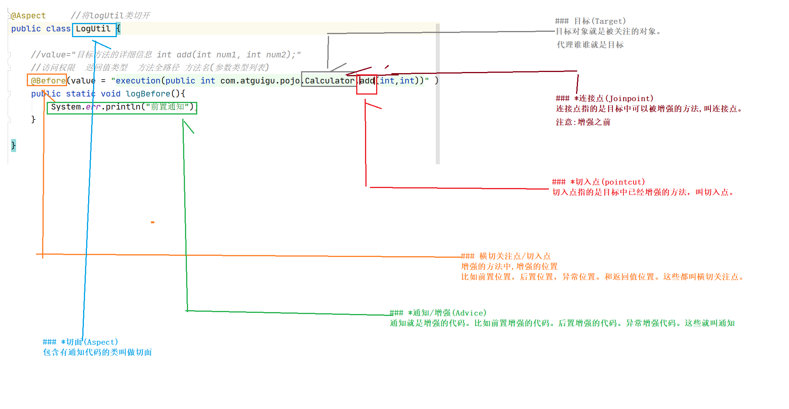
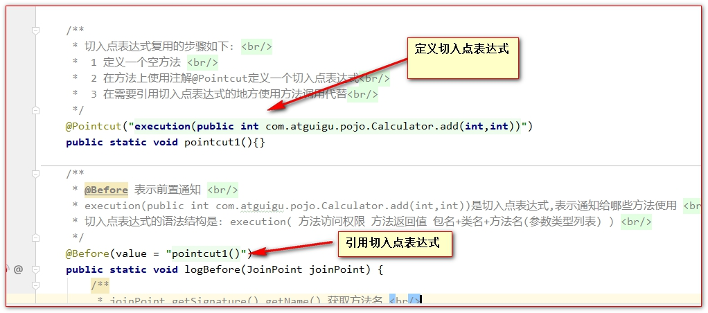
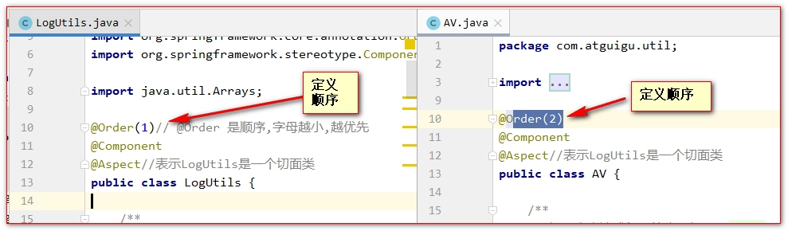
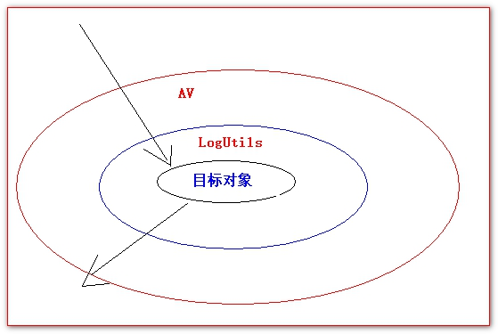

# AOP

## 目录

- [什么是 AOP](#什么是AOP)
- [AOP 编程的专业术语](#AOP编程的专业术语)
  - [目标(Target)](#目标Target)
  - [连接点(Joinpoint)](#连接点Joinpoint)
  - [切入点(pointcut)](#切入点pointcut)
  - [横切关注点/切入点](#横切关注点切入点)
  - [通知/增强(Advice)](#通知增强Advice)
  - [切面(Aspect)](#切面Aspect)
  - [代理(Proxy)](#代理Proxy)
- [使用 Spring 实现 AOP 简单切面编程](#使用Spring实现AOP简单切面编程)
  - [Spring 的切入点表达式](#Spring的切入点表达式)
  - [Spring 通知的执行顺序](#Spring通知的执行顺序)
  - [获取连接点信息](#获取连接点信息)
  - [获取拦截方法的返回值和抛的异常信息](#获取拦截方法的返回值和抛的异常信息)
  - [Spring 的环绕通知](#Spring的环绕通知)
  - [切入点表达式的复用](#切入点表达式的复用)
  - [多个切面的执行顺序](#多个切面的执行顺序)
  - [如何基于 xml 配置 aop 程序](#如何基于xml配置aop程序)
  - [9.15 纯注解 AOP](#915纯注解AOP)

[com.springsource.org.aspectj.weaver-1.6.8.RELEASE.jar](file/com.springsource.org.aspectj.weaver-1.6.8.RELEASE_.jar " com.springsource.org.aspectj.weaver-1.6.8.RELEASE.jar")

[spring-aop-5.2.5.RELEASE.jar](file/spring-aop-5.2.5.RELEASE_3muvUQ2n6n.jar " spring-aop-5.2.5.RELEASE.jar")

[spring-aspects-5.2.5.RELEASE.jar](file/spring-aspects-5.2.5.RELEASE__nrEJ1AWW9.jar " spring-aspects-5.2.5.RELEASE.jar")

### 什么是 AOP

AOP 是面向切面编程。主要使用 的技术是动态代理，这里请看[proxy model](https://www.wolai.com/sK2vDPps4aa3cQQSYkQDv3 "proxy model")

全称：Aspect Oriented Programming

面向切面编程指的是：程序是运行期间，动态地将某段代码插入到原来方法代码的某些位置中。

利用 aop 可以对业务逻辑的各个部分进行隔离,从而使得业务逻辑各部分之间的耦合度降低,提高程序的可重用性,从而提高开发效率,减少冗余代码的编写,方便后期维护

### AOP 编程的专业术语

#### 目标(Target)

目标对象就是被关注的对象。

#### 连接点(Joinpoint)

连接点指的是目标中可以被增强的方法,叫连接点。

#### 切入点(pointcut)

切入点指的是目标中已经增强的方法，叫切入点。

#### 横切关注点/切入点

增强的方法中,增强的位置

比如前置位置，后置位置，异常位置。和返回值位置。这些都叫横切关注点。

#### 通知/增强(Advice)

通知就是增强的代码。比如前置增强的代码。后置增强的代码。异常增强代码。这些就叫通知

#### 切面(Aspect)

包含有通知代码的类叫做切面

#### 代理(Proxy)

增强之前是目标,增强之后是代理



## 使用 Spring 实现 AOP 简单切面编程

目标:使用 spring 方式实现动态代理

[例子](例子/例子.md "例子")

在 Spring 中，可以对有接口的对象和无接口的对象分别进行代理。在使用上有些细微的差别。

```xml
<?xml version="1.0" encoding="UTF-8"?>
<beans xmlns="http://www.springframework.org/schema/beans"
       xmlns:xsi="http://www.w3.org/2001/XMLSchema-instance"
       xmlns:context="http://www.springframework.org/schema/context"
       xmlns:aop="http://www.springframework.org/schema/aop"
       xsi:schemaLocation="http://www.springframework.org/schema/beans http://www.springframework.org/schema/beans/spring-beans.xsd http://www.springframework.org/schema/context https://www.springframework.org/schema/context/spring-context.xsd http://www.springframework.org/schema/aop https://www.springframework.org/schema/aop/spring-aop.xsd">
    <!--扫描注解包-->
    <context:component-scan base-package="com.atguigu"/>
    <!--
        aop:aspectj-autoproxy:面向切面必备标签
        让@Aspect 生效
        expose-proxy:让代理类暴露出来
        proxy-target-class:增强的类型
        true: 使用cglib代理
        false: 根据有无接口框架自动选择是cglib,还是jdk代理
    -->
    <aop:aspectj-autoproxy/>
</beans>
```

#### Spring 的切入点表达式

1. @PointCut 切入点表达式语法格式是：

**execution(public int com.atguigu.pojo.Calculator.add(int,int))**

**execution(访问权限 返回值类型 方法全限定名(参数类型列表))**

1. 限定符：

\*表示任意的意思：

1\) 匹配某全类名下，任意或多个方法。

**execution(public int com.atguigu.pojo.Calculator. \*(int,int))**

以上的星表示方法名任意

- 在 Spring 中只有 public 权限能拦截到，访问权限可以省略（访问权限不能写 \*）。

**execution( int com.atguigu.pojo.Calculator.add(int,int))**

3\) 匹配任意类型的返回值，可以使用 \* 表示

**execution(public \* com.atguigu.pojo.Calculator.add(int,int))**

以上的星表示返回值类型任意.

4\) 匹配任意一层子包。

**execution(public int com.atguigu. \*.Calculator.add(int,int))**

以上的星表示

包必须是 com.atguigu.子包

而且只能是一层的子包

5\) 任意类型参数

**execution(public int com.atguigu.pojo.Calculator.add(int, \*))**

以上的星表示第二个参数类型任意.

..：可以匹配多层路径，或任意多个任意类型参数

1\) 任意层级的包

**execution(public int com.atguigu..Calculator.add(int,int))**

以上的..表示 包名必须是 com.atguigu.所有子包都匹配

2\) 任意个任意类型的参数

**execution(public int com.atguigu.pojo.Calculator.add(..))**

以上的..表示参数是任意个数,参数是任意的参数

模糊匹配：(绝不使用)

// 表示任意返回值，任意方法全限定符，任意参数

_execution(_ _(..))_

// 表示任意返回值，任意包名+任意方法名，任意参数

_execution(_ _._(..))\*

切入点表达式连接：&& 、||&#x20;

&& 表示需要同时满足两个表达式

```text
@Before(value = "execution(public int com.atguigu.pojo.Calculator.add(int,int)) && execution(public int com.atguigu.pojo.Calculator.div(int,int))")
```

|| 表示两个条件只需要满足一个，就会被匹配到

```text
@Before(value = "execution(public int com.atguigu.pojo.Calculator.add(int,int)) || execution(public int com.atguigu.pojo.Calculator.div(int,int))")
```

```text
推荐:  * com.atguigu..service.*.*(..)
```

#### Spring 通知的执行顺序

Spring AOP 编程中提供的常用通知有四种 , 分别是 : 前置通知 , 后置通知 , 返回通知 , 异常通知

Spring 通知的执行顺序是:

正常情况:

前置=====>>>方法=====>>后置=====>>返回

异常情况:

前置=====>>>方法=====>>后置======>>异常

```java
@Component
@Aspect  //表示切面类
public class LogUtils {
    @Before(value = "execution(* com.atguigu.pojo.Calculator.*(..))")
    public static void logBefore() {
        System.out.println("前置通知  Before");
    }
    @After(value = "execution(* com.atguigu.pojo.Calculator.*(..))")
    public static void logAfter() {
        System.err.println("后置通知  After");
    }
    @AfterReturning(value = "execution(* com.atguigu.pojo.Calculator.*(..))")
    public static void logAfterReturning() {
        System.err.println("返回通知  AfterReturning");
    }
    @AfterThrowing(value = "execution(* com.atguigu.pojo.Calculator.*(..))")
    public static void logAfterThrowing() {
        System.err.println("异常通知  AfterThrowing");
    }
}
```

#### 获取连接点信息

JoinPoint 是连接点的信息。

只需要在通知方法的参数中，加入一个 JoinPoint 参数。就可以获取到拦截方法的信息。

注意：是 org.aspectj.lang.JoinPoint 这个接口。

```java
@Component
@Aspect  //表示当前类是一个切面类
public class LogUtils {
    /**
     * 方法级别 返回值 全路径.类名.方法(参数1类型,参数2类型)
     */
    //前置
    @Before(value = "execution(* com.atguigu.pojo.Calculator.*(..))")
    public static void logBefore(JoinPoint joinPoint) {
        System.out.println("前置通知  Before 执行方法:"+joinPoint.getSignature().getName()+"\t 参数:"+Arrays.asList(joinPoint.getArgs()));
    }
    //后置
    @After(value = "execution(* com.atguigu.pojo.Calculator.*(..))")
    public static void logAfter(JoinPoint joinPoint) {
        System.err.println("后置通知  After  执行方法:"+joinPoint.getSignature().getName()+"\t 参数:"+Arrays.asList(joinPoint.getArgs()));
    }
    //返回通知
    @AfterReturning(value = "execution(* com.atguigu.pojo.Calculator.*(..))")
    public static void logAfterReturning(JoinPoint joinPoint) {
        System.err.println("返回通知  AfterReturning 执行方法:"+joinPoint.getSignature().getName()+"\t 参数:"+Arrays.asList(joinPoint.getArgs()));
    }
    //异常
    @AfterThrowing(value = "execution(* com.atguigu.pojo.Calculator.*(..))")
    public static void logAfterThrowing(JoinPoint joinPoint) {
        System.err.println("异常通知  AfterThrowing 执行方法:"+joinPoint.getSignature().getName()+"\t 参数:"+Arrays.asList(joinPoint.getArgs()));
    }
}
```

#### 获取拦截方法的返回值和抛的异常信息

获取方法返回的值分为两个步骤：

1. 在返回值通知的方法中，追加一个参数 Object result
2. 然后在@AfterReturning 注解中添加参数 returning="参数名"

```java
/**
 * @AfterReturning 返回通知 <br/>
 *  1 在返回通知上追加一个参数Object result <br/>
 *  2 在返回通知注解@AfterReturning中使用属性returning = "result"告诉Spring框架,返回值交给哪个参数去接收 <br/>
 */
@AfterReturning(value = "execution(* com.atguigu.pojo.Calculator.*(int,int))", returning = "result")
public static void logAfterReturning(JoinPoint joinPoint, Object result) {
    System.out.println("前置通知 执行方法是 " + joinPoint.getSignature().getName()
                       + "\t 参数是"
                       + Arrays.asList(joinPoint.getArgs())
                       + "结果是 " + result);
}
```

获取方法抛出的异常分为两个步骤：

1、在异常通知的方法中，追加一个参数 Exception exception

2、然后在@AfterThrowing 注解中添加参数 throwing="参数名"

```java
/**
 *@AfterThrowing 是异常通知 <br>
 *  1 在异常通知方法上追加一个参数Exception e 用来接收抛出的异常<br/>
 *  2 在异常通知注解@AfterThrowing上使用属性throwing = "e",告诉Spring抛出的异常用哪个参数来接收<br/>
 */
@AfterThrowing(value = "execution(* com.atguigu.pojo.Calculator.*(int,int))",throwing = "e")
public static void logAfterThrowing(Throwable e) {
    System.out.println(" 异常通知 ,异常类型 "+e);
}
```

#### Spring 的环绕通知

1. 环绕通知使用@Around 注解。
2. 环绕通知如果和其他通知同时执行。环绕通知会优先于其他通知之前执行。
3. 环绕通知一定要有返回值（环绕如果没有返回值。后面的其他通知就无法接收到目标方法执行的结果）。
4. 在环绕通知中。如果拦截异常。一定要往外抛。否则其他的异常通知是无法捕获到异常的。

```java
/**
  * 环绕通知 <br/>
 *  1 使用注解@Around表示环绕通知<br/>
 *  2 环绕通知需要添加一个ProceedingJoinPoint proceedingJoinPoint参数.它可以用来执行目标方法<br/>
 *  3 环绕通知一定要把目标方法的返回值返回.否则普通的返回通知收不到结果<br/>
 *  4 环绕通知捕获到异常,一定要往外抛.否则普通的异常通知不执行<br/>
 *  5 环绕通知会比普通通知优先执行<br/>
 */
@Around(value = "execution(public int com.atguigu.pojo.Calculator.*(..))")
public static Object around(ProceedingJoinPoint proceedingJoinPoint){
    Object proceed = null;
    try {
        try {
            System.err.println("环绕前置");
            //获取参数
            Object[] args = proceedingJoinPoint.getArgs();
            if(args.length>0){
                 //执行连接点的方法
              proceed = proceedingJoinPoint.proceed(args);
            }
            proceed = proceedingJoinPoint.proceed();
        }finally {
            System.err.println("环绕后置");
        }
    } catch (Throwable throwable) {
        System.err.println("环绕异常");
        throw new RuntimeException(throwable);
    }
    System.err.println("环绕返回");
    return proceed;
}
```

#### 切入点表达式的复用



#### 多个切面的执行顺序

当我们有多个切面，多个通知的时候：

1. 通知的执行顺序默认是由切面类的字母先后顺序决定。
2. 在切面类上使用@Order 注解决定通知执行的顺序（值越小，越先执行）





#### 如何基于 xml 配置 aop 程序

```xml
<?xml version="1.0" encoding="UTF-8"?>
<beans xmlns="http://www.springframework.org/schema/beans"
       xmlns:xsi="http://www.w3.org/2001/XMLSchema-instance" xmlns:aop="http://www.springframework.org/schema/aop"
       xsi:schemaLocation="http://www.springframework.org/schema/beans
       http://www.springframework.org/schema/beans/spring-beans.xsd http://www.springframework.org/schema/aop https://www.springframework.org/schema/aop/spring-aop.xsd">
    <!-- 切面类 -->
    <bean id="logUtils" class="com.atguigu.utils.LogUtils"/>
    <!-- 目标 -->
    <bean id="calculator" class="com.atguigu.pojo.Calculator"/>
    <!-- 配置aop -->
    <aop:config>
        <!-- 切面类 -->
        <aop:aspect ref="logUtils">
            <!-- 配置切入点表达式 -->
            <aop:pointcut id="point" expression="execution(* com.atguigu.pojo.Calculator.*(..))"/>
            <!-- 前置通知 -->
            <aop:before method="logBefore" pointcut-ref="point"/>
            <!-- 后置通知 -->
           <aop:after method="logAfter" pointcut-ref="point"/>
            <!-- 异常 -->
            <aop:after-throwing method="logAfterThrowing" pointcut-ref="point" throwing="e"/>
            <!-- 返回  -->
           <aop:after-returning method="logAfterReturning" pointcut-ref="point" returning="result"/>
            <!-- 环绕 -->
            <aop:around method="logAround" pointcut-ref="point"/>
        </aop:aspect>
    </aop:config>
</beans>
```

#### 9.15 纯注解 AOP

```java
@Configuration
@ComponentScan(basePackages = {"com.atguigu"})
/**
 *  proxyTargetClass = true:cglib
 *  false:根据有无接口判断
 */
@EnableAspectJAutoProxy(proxyTargetClass = true)//-->例子中的 <aop:aspectj-autoproxy/>
public class AopConfig {
}
```
