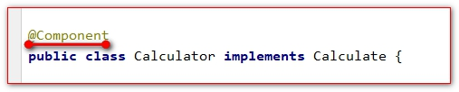
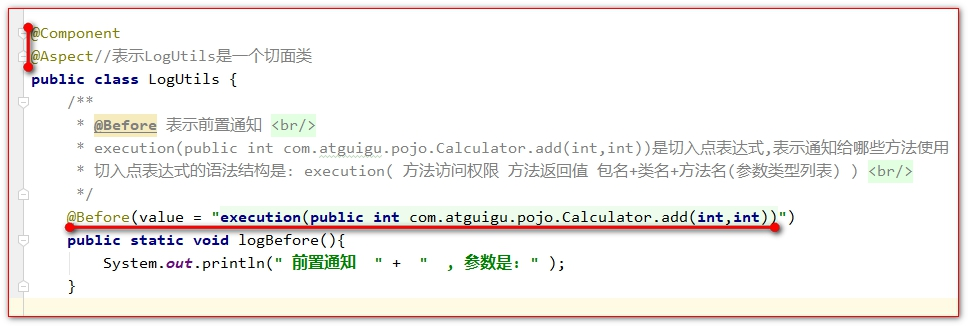

# 例子

代码:





```java
public class LogUtils {
    public static void logBefore() {
        System.err.println("前置通知");
    }
    public static void logAfter() {
        System.out.println(" 后置通知");
    }
    public static void logAfterReturning() {
        System.err.println("最终通知");
    }
    public static void logAfterThrowing() {
        System.err.println("异常通知");
    }
}
```


Spring配置文件内容:

```xml
<?xml version="1.0" encoding="UTF-8"?>
<beans xmlns="http://www.springframework.org/schema/beans"
       xmlns:xsi="http://www.w3.org/2001/XMLSchema-instance"
       xmlns:context="http://www.springframework.org/schema/context"
       xmlns:aop="http://www.springframework.org/schema/aop"
       xsi:schemaLocation="http://www.springframework.org/schema/beans http://www.springframework.org/schema/beans/spring-beans.xsd http://www.springframework.org/schema/context https://www.springframework.org/schema/context/spring-context.xsd http://www.springframework.org/schema/aop https://www.springframework.org/schema/aop/spring-aop.xsd">
    <!--扫描注解包-->
    <context:component-scan base-package="com.atguigu"/>
    <!--切面生效,让@Aspect 生效-->
    <aop:aspectj-autoproxy/>
</beans>
```


测试代码:

```java
@ContextConfiguration(locations = {"classpath:applicationContext.xml"})
@RunWith(SpringJUnit4ClassRunner.class)
public class AopTest {
    @Autowired
    private CalculateEmpty calculateEmpty;
    @Test
    public void test() {
        int result = calculateEmpty.add(1, 2);
        System.out.println("结果是" + result);
    }
}
```
