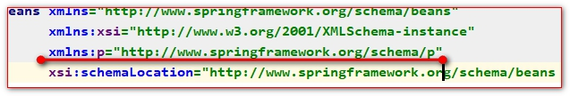

# 使用xml注入

## 目录

- [过程](#过程)
- [建立bean对象的各种配置](#建立bean对象的各种配置)
  - [通过注入方式不同可以分为大致三种](#通过注入方式不同可以分为大致三种)
    - [通过构造器注入](#通过构造器注入)
    - [通过set方法注入](#通过set方法注入)
    - [两种方式一起使用](#两种方式一起使用)
    - [使用p命名空间](#使用p命名空间)
  - [根据注入的属性不同分为以下两种](#根据注入的属性不同分为以下两种)
    - [当注入基本数据类型的时候](#当注入基本数据类型的时候)
    - [当注入引用数据类型的时候](#当注入引用数据类型的时候)
  - [根据注入的内容不同以下几种](#根据注入的内容不同以下几种)
    - [注入空值](#注入空值)
    - [注入一个List](#注入一个List)
    - [注入Map](#注入Map)
    - [注入property](#注入property)
    - [使用util方式在外面定义集合](#使用util方式在外面定义集合)
  - [当引用数据使用工厂方法获得时](#当引用数据使用工厂方法获得时)
    - [静态工厂对象的获得](#静态工厂对象的获得)
    - [实例工厂对象的获得](#实例工厂对象的获得)
  - [bean标签的其他属性配置](#bean标签的其他属性配置)
  - [通过实现FactoryBean类的方式，得到bean对象](#通过实现FactoryBean类的方式得到bean对象)
  - [引入其他配置文件例子：Spring配置管理数据库连接池对象](#引入其他配置文件例子Spring配置管理数据库连接池对象)

[例子1](例子1/例子1.md "例子1")

### 过程

1. 创建需要注入的pojo类，即例子一的pojo类
2. 新建对应的bean\_config.xml。他的主要功能是使再测试类中读取这个配置，使BeanFactory创建对应的bean对象
3. 建立测试类，看pojo 的bean对象是否建立，他的过程就是调用对应api读取配置文件，调用getBean（..）方法，获得bean对象

## 建立bean对象的各种配置

由于一个对象中的属性（域）有多种形式如：基本数据类型,list集合，Map集合，普通引用数据类型或者是由工厂方法获得的他们都对应这不同的注入方式

### 通过注入方式不同可以分为大致三种

#### 通过构造器注入

```java
<bean class="com.blibli.pojo.Cat" id="cat">
  <constructor-arg name="name" value="小花"/>
  <constructor-arg name="age" value="4"/>
  <constructor-arg name="master" ref="person"/>
</bean>

<bean id="person2" class="com.atguigu.pojo.Person">
    <!--
      public Person(Integer id, String name, Integer age,String phone)
      index 是参数索引
      value 是参数值
      type是参数类型,可省略
    -->
    <constructor-arg index="0" value="5" type="java.lang.Integer"/>
    <constructor-arg index="1" value="类型赋值" type="java.lang.String"/>
    <constructor-arg index="2" value="120" type="java.lang.Integer"/>
    <constructor-arg index="3" value="110" type="java.lang.String"/>
</bean> 
```


#### 通过set方法注入

```java
<bean class="com.blibli.pojo.Person" id="person" scope="singleton" lazy-init="true">
            <!-- 使用get和set设置属性 -->
            <property name="name" value="蔚蓝"/>
            <property name="age" value="18"/>
            <property name="id" value="10000198809233345"/>
            </property>
        </bean>
```


#### 两种方式一起使用

```java
<!--通过内置bean对象的方式-->
<bean class="com.blibli.pojo.Person" id="person" scope="singleton" lazy-init="true">
            <!-- 使用get和set设置属性 -->
            <property name="name" value="蔚蓝"/>
            <property name="age" value="18"/>
            <property name="id" value="10000198809233345"/>
            <property name="cat">
                <bean class="com.blibli.pojo.Cat" id="cat">
                    <constructor-arg name="name" value="小花"/>
                    <constructor-arg name="age" value="4"/>
                    <constructor-arg name="master" ref="person"/>
                </bean>
            </property>
</bean>

<!--通过外置bean对象的方式,这种方式使Cat类可以被所有的类扫描到-->
<bean class="com.blibli.pojo.Person" id="person" scope="singleton" lazy-init="true">
            <!-- 使用get和set设置属性 -->
            <property name="name" value="蔚蓝"/>
            <property name="age" value="18"/>
            <property name="id" value="10000198809233345"/>
            <property name="cat" ref="cat">
            </property>
</bean> 
<bean class="com.blibli.pojo.Cat" id="cat">
                    <constructor-arg name="name" value="小花"/>
                    <constructor-arg name="age" value="4"/>
                    <constructor-arg name="master" ref="person"/>
</bean> 
```


#### 使用p命名空间



```java
<!--
        p名称空间的使用格式如下:
        p:属性名="值"
        -->
<bean class="com.atguigu.pojo.Person" id="person3"
      p:id="6" p:name="p名称空间赋值" p:age="18" p:phone="电话"/>
```


### 根据注入的属性不同分为以下两种

#### 当注入基本数据类型的时候

使用perperty或constructor-arg的value属性，以字符串的形式赋和类型匹配的值，工厂自动解析

#### 当注入引用数据类型的时候

使用property或constuctor-arg的ref属性指向在配置文件中bean标签的id（唯一），name（不唯一）属性

### 根据注入的内容不同以下几种

#### 注入空值

不填写property或constuctor-arg的value和ref属性，或使用null标签

```java
<bean class="com.atguigu.pojo.Person" id="person4">
    <property name="id" value="7"/>
    <!-- 我希望赋于null空值 -->
    <property name="name">
        <!-- null标签表示null值 -->
        <null></null>
    </property>
</bean>
```


#### 注入一个List

```java
<bean id="person7" class="com.atguigu.pojo.Person">
    <property name="list">
        <list>
            <value>item1</value>
            <value>item2</value>
            <value>item3</value>
            <value>item4</value>
        </list>
    </property>
</bean>
or
<bean id="person7" class="com.atguigu.pojo.Person">
    <property name="list">
        <array>
            <value>item1</value>
            <value>item2</value>
            <value>item3</value>
            <value>item4</value>
        </array>
    </property>
</bean>
```


#### 注入Map

```java
<bean id="person8" class="com.atguigu.pojo.Person">
    <property name="id" value="11"></property>
    <property name="map">
        <!-- map标签表示赋值的类型的map集合 -->
         <!-- 表示每一个键值对 -->
        <map>
            <entry key="k1" value="v1"/>
            <entry key="k2" value="v2"/>
            <entry key="k3" value="v3"/>
            <entry key="k4" value="v4"/>
        </map>
    </property>
</bean>
or
<bean id="person8" class="com.atguigu.pojo.Person">
    <property name="id" value="11"></property>
    <property name="map">
        <props>
            <prop key="url">jdbc:mysql://localhost:3306/test</prop>
            <prop key="driverClassName">com.mysql.jdbc.Driver</prop>
            <prop key="username">root</prop>
            <prop key="password">root</prop>
        </props>
    </property>
</bean>
```


#### 注入property

```java
<bean id="person9" class="com.atguigu.pojo.Person">
    <property name="id" value="11"></property>
    <property name="props">
        <map>
            <entry key="url" value="jdbc:mysql://localhost:3306/test"/>
            <entry key="driverClassName" value="com.mysql.jdbc.Driver"/>
            <entry key="username" value="root"/>
            <entry key="password" value="root"/>
        </map>
    </property>
</bean>

<bean id="person9" class="com.atguigu.pojo.Person">
    <property name="id" value="11"></property>
    <property name="props">
        <props>
            <prop key="url">jdbc:mysql://localhost:3306/test</prop>
            <prop key="driverClassName">com.mysql.jdbc.Driver</prop>
            <prop key="username">root</prop>
            <prop key="password">root</prop>
        </props>
    </property>
</bean> 
```


#### 使用util方式在外面定义集合

```java
<!-- 可以从容器中直接获取到 也可以给list集合属性赋值使用 -->
<util:list id="list01">
    <value>01</value>
    <value>02</value>
    <value>03</value>
</util:list>


<!-- 使用 -->
<bean id="person10" class="com.atguigu.pojo.Person">
    <property name="list" ref="list01"/>
</bean>
```


### 当引用数据使用工厂方法获得时

#### 静态工厂对象的获得

```java
工厂类
public class PersonFactory {
    public static Person getPerson(){
        return new Person(15,"静态工厂方法","123456789", 18);
    }
}
配置
<!--    静态工厂方法使用class属性和factory-method属性组合使用
        class表示工厂的全类名
        factory-method属性静态方法名
    //Person person11 = PersonFactory.getPerson();
     -->
<bean id="person11" class="com.atguigu.pojo.PersonFactory" factory-method="getPerson">
</bean> 
```


#### 实例工厂对象的获得

```java
工厂类
public class PersonFactory {
    public Person createPerson2(){
        return new Person(16,"工厂实例方法","123456789", 18);
    }
}
配置
<!-- 工厂实例方法创建Bean对象,需要由 bean + factory-bean + factory-method组合实现 -->
<bean id="person12" class="com.atguigu.pojo.PersonFactory"></bean>

<!--
      factory-bean   工厂实例对象
      factory-method  工厂方法名
    PersonFactory person12 = new PersonFactory();
      Person person13 = person12.createPerson2();
    -->
<bean id="person13" factory-bean="person12" factory-method="createPerson2"/> 
```


### bean标签的其他属性配置

1. 继承  parent属性指向父类id
2. 抽象  abstract属性
   ```java
   <bean id="parent" class="com.atguigu.pojo.Person" abstract="true">
       <property name="id" value="100"/>
       <property name="name" value="父配置"/>
       <property name="age" value="100"/>
       <property name="phone" value="110"/>
   </bean>

   <bean id="person15" class="com.atguigu.pojo.Person" parent="parent">
       <property name="id" value="18"/>
       <property name="phone" value="1234567890"/>
   </bean>
   ```

3. 初始化前后调用方法
   ```java
   <!--
           init-method:初始化方法
           destroy-method:容器销毁orbean销毁调用,ClassPathXmlApplicationContext 在close()方法调用
           scope="prototype":多例不会调用close(),原因是gc调用
        -->
   <bean id="person20" class="com.atguigu.pojo.Person"
         init-method="init" destroy-method="destroy" scope="prototype">
       <property name="id" value="20"/>
   </bean>
   ```

4. 注入顺序
   ```java
   <!--
     1 在Spring容器中.Bean对象的创建顺序默认是他们在配置文件中,从上到下的顺序决定.
     2 可以在bean的配置上,使用属性depends-on表示前置创建
   -->
   <bean class="com.atguigu.depends.A" id="a" depends-on="c,b"/>
   <bean class="com.atguigu.depends.B" id="b" />
   <bean class="com.atguigu.depends.C" id="c" />
   ```

5. 单例/原型
   ```java
   <!--
           scope:指定bean的范围
               singleton:单例
                   默认
                   会跟着Spring容器一起被创建:立即加载
                   多次调用getBean()方法都会返回一个对象

               prototype:多例
                   不会跟着Spring容器一起被创建:延迟加载
                   每次调用getBean()会重新创建一个新的

      request:表示一次请求内多次调用getBean都返回同一个对象
               session:表示一个会话内多次调用getBean都返回同一个对象
               globalsession: 全局session
        -->
   <bean id="person18" class="com.atguigu.pojo.Person" scope="prototype">
       <property name="id" value="20"/>
   </bean>
   ```

6. 懒加载
   ```java
   <bean id="user30" class="com.atguigu.pojo.User" lazy-init="true">
       <property name="id" value="26"/>
       <property name="name" value="小村"/>
   </bean>
   ```

7. 自动注入
   ```java
   <bean id="car" class="com.atguigu.pojo.Car">
   ...
   </bean>
   <bean id="car1" class="com.atguigu.pojo.Car">
   ...
   </bean>
   <!--
           自动注入:按照某种指定的算法,自动给子对象赋值
           autowire:
               default  || no :不会自动赋值子对象
               constructor: 表示按照构造器参数超找并注入
           Person(Car car)
                   1: 根据类型查找,找到就赋值 (唯一一个)
                   2: 如果类型找到多个,那么就用参数名称去注入
                   3: 如果类型有多个,名称没有匹配,则不会注入
               byName:    根据名称自动去容器中找这个bean,名称不一致则为null
               byType:    根据类型自动去容器中找这个bean,多个类型会报错 ===getBean(Class class)
       -->
   <bean id="person19" class="com.atguigu.pojo.Person" autowire="constructor">
       <property name="id" value="20"/>
       <!--<property name="car" ref="car"/>-->
   </bean>
   <!-- car被注掉后因类型多个，使用id名称唯一，能通过构造器自动注入--> 
   ```


### 通过实现FactoryBean类的方式，得到bean对象

配置FactoryBean接口创建Bean对象

1. 创建一个类去实现FactoryBean接口
2. 实现它的方法
3. 到Spring的配置文件中去配置

FactroryBean接口实现类:

```java
public class PersonFactoryBean implements FactoryBean<Person> {
    /**
     * 创建bean对象,将当前方法的返回值放入容器
     * @return
     * @throws Exception
     */
    @Override
    public Person getObject() throws Exception {
        return new Person(17,"FactoryBean接口方式","120",18);
    }
    /**
     * 获取bean的Class类型
     * @return
     */
    @Override
    public Class<?> getObjectType() {
        return Person.class;
    }
    /**
     * 是否为单例
     * @return
     */
    @Override
    public boolean isSingleton() {
        return false;
    }
}
```


配置文件:

```xml
<bean id="person14" class="com.atguigu.factory.PersonFactoryBean"/>
```


测试的代码:&#x20;

```java
@Test
public void test15(){
    ApplicationContext context =new ClassPathXmlApplicationContext("applicationContext.xml");
    Person person = context.getBean("person14", Person.class);
    System.err.println(person);
}
```


面试:Spring整合第三方类库暴露的接口是什么?

FacotryBean

### 引入其他配置文件[例子：Spring配置管理数据库连接池对象](../例子：Spring配置管理数据库连接池对象/例子：Spring配置管理数据库连接池对象.md "例子：Spring配置管理数据库连接池对象")

1. 使用PropertyPlaceholderConfigurer类
   ```xml
    <bean class="org.springframework.beans.factory.config.PropertyPlaceholderConfigurer">
           <!--
               location:加载文件
               classpath*:jdbc.properties:类路径下jdbc.properties文件
           -->
           <property name="location" value="classpath:jdbc.properties"/>
       </bean>
   ```

2. 使用context
   ```xml
   <context:property-placeholder location="classpath:jdbc.properties"/>
   ```
