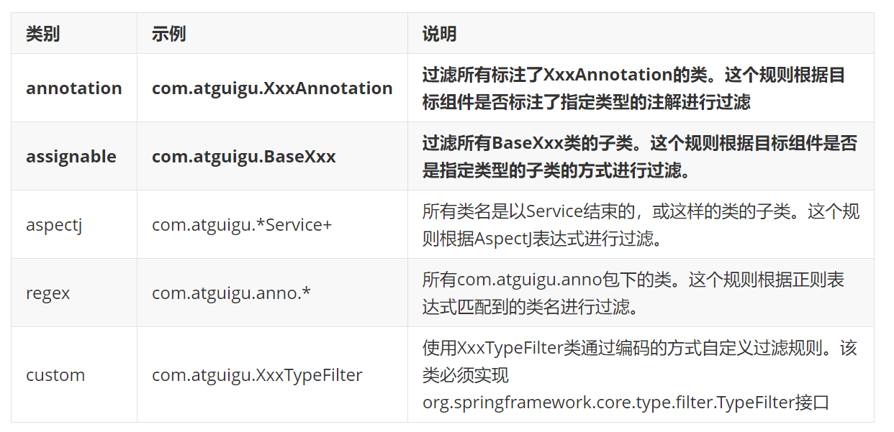

# 使用注解注入

## 目录

- [使用注解配置Dao、Service、Controller组件](#使用注解配置DaoServiceController组件)
  - [Spring配置bean的常用注解有](#Spring配置bean的常用注解有)
  - [指定扫描包时的过滤内容](#指定扫描包时的过滤内容)
  - [bean的自动装配@autowried](#bean的自动装配autowried)
  - [使用@Qualifier装配指定id的bean对象](#使用Qualifier装配指定id的bean对象)
  - [纯注解](#纯注解)
  - [使用注解配置连接池Spring的数据访问](#使用注解配置连接池Spring的数据访问)

[例子1](例子1/例子1.md "例子1")

### 使用注解配置Dao、Service、Controller组件

#### Spring配置bean的常用注解有

@Component  配置Web层,Servcie层,DAO层之外的Bean对象.使用@Component

@Controller 配置Web层的组件.

@Service  配置Service层的组件

@Repository 配置DAO组件

@Scope 配置Bean的作用域 (单例.多例)

@PostConstruct  init-method

@PreDestory       destory-method

@Value("abc") 给基本类型注入

@Configuraction 表明当前类是一个配置文件类

@ComponentScan(basePackages={}) 扫描其它包下的注解

@Import 导入其它配置文件类

@Bean 将当前方法返回值放入容器内,bean的Id是方法名

#### 指定扫描包时的过滤内容

1. 使用xml

   自定义排除示例:
   ```xml
   <!--扫描其它注解的包-->
   <context:component-scan base-package="com.atguigu">
       <!--
               context:exclude-filter:排除
               type:排除类型  annotation:排除注解,并且包含子注解
               expression:排除注解
           -->
       <context:exclude-filter type="annotation" expression="org.springframework.stereotype.Repository"/>
       <!--
               assignable:类型排除
               PersonService:排除的类,包含子类
           -->
       <context:exclude-filter type="assignable" expression="com.atguigu.service.PersonService"/>
   </context:component-scan>
   ```

   自定义包含示例:
   ```xml
   <context:component-scan base-package="com.atguigu" use-default-filters="false">
       <!-- context:include-filter标签是自定义包含(必须要和use-default-filters="false"一起组合使用)
               type属性指定使用哪种算法过滤
               expression属性指定需要的表达式
         annotation:只加载注解,包含子注解
         assignable:只加载类,包含子类
           -->
       <context:include-filter type="annotation" expression="org.springframework.stereotype.Controller"/>
       <!--  assignable算法,也会包含子类 -->
       <context:include-filter type="assignable" expression="com.atguigu.service.PersonService"/>
   </context:component-scan>
   <!--
   1. @Controller   @Service 和     @Repository  都继承了    @Component        
   2. 自定义排除和包含,一定要先写自定义包含否则会出错
   --> 
   ```

   
2. 使用注解

   配置类
   ```java
   @ComponentScan(basePackages = "com.bilibili",excludeFilters = {@ComponentScan.Filter(pattern = "com.bilibili.pojo")})
   public class cMyConfig {
   }
   ```


#### bean的自动装配@autowried

如果资源类型的bean不止一个，默认根据@Autowired注解标记的成员变量名作为id查找bean，进行装配★

```java
@Repository
public class PersonDaoExt extends PersonDao {}
```


```java
@Service
public class PersonService {
     /**
     * @Autowried:将容器中bean给变量赋值
     * 1:先根据类型找注入
     * 2:如果有多个类型则根据被注入的名称与beanId一致则注入 byName
     */ 
    @Autowired
    private PersonDao PersonDaoExt;
    @Override
    public String toString() {
        return "PersonService{" +
            "PersonDao=" + PersonDaoExt +
            '}';
    }
}
```


#### 使用@Qualifier装配指定id的bean对象

如果根据成员变量名作为id还是找不到bean，可以使用@Qualifier注解明确指定目标bean的id

```java
@Service
public class PersonService {
    /**
     * @Autowried:将容器中bean给变量赋值
     * 1:先根据类型找注入
     * 2:如果有多个类型则根据被注入的名称与beanId一致则注入
     * 3:类型有多个,但是名称都不一致?
     *      @Qualifier(value = "PersonDaoExt") 当前value的值要与bean id一致,组合注解优先使用@Qualifier
     * 4:@Resource(name="bean的id")根据当前bean的id去配置== @Autowired+@Qualifier(value = "PersonDaoExt")
     */
    @Autowired
    @Qualifier(value = "personDaoExt")
    private PersonDao personDaos;
    @Override
    public String toString() {
        return "PersonService{" +
            "PersonDao=" + PersonDaos +
            '}';
    }
}
```


@Autowired注解的required属性作用

@Autowired注解的required属性指定某个属性允许不被设置

```java
@Service
public class PersonService {
    /**
     * @Autowried:将容器中bean给变量赋值
     * 1:先根据类型找注入
     * 2:如果有多个类型则根据被注入的名称与beanId一致则注入
     * 3:类型有多个,但是名称都不一致?
     *      @Qualifier(value = "PersonDaoExt") 当前value的值要与bean id一致,组合注解优先使用@Qualifier
     * 4:@Autowired(required = false) 当找不到bean时,则注入null
     */
    @Qualifier(value = "PersonDaos")
    @Autowired(required = false)
    private PersonDao PersonDaos;
    @Override
    public String toString() {
        return "PersonService{" +
            "PersonDao=" + PersonDaos +
            '}';
    }
}
```


@Autowired和@Qualifier在方法上的使用。

在方法的形参位置使用@Qualifier注解

```java
@Service
public class PersonService {
    public PersonService(){
        System.err.println("无参构造");
    }
    @Qualifier(value = "PersonDaoExt")
    @Autowired(required = false)
    private PersonDao PersonDao;
    /**
     * @Autowried:将容器中bean给变量赋值
     * 1:先根据类型找注入
     * 2:如果有多个类型则根据被注入的名称与beanId一致则注入
     * 3:类型有多个,但是名称都不一致?
     *      @Qualifier(value = "PersonDaoExt") 当前value的值要与bean id一致,组合注解优先使用@Qualifier
     * 4:@Autowired(required = false) 当找不到bean时,则注入null
     * 5:@Autowired 标记在方法上,则当前方法会在构造后执行
     * 6:方法内的参数会自动去容器中找bean,自动注入
     * 7:@Qualifier("PersonDaoExt") PersonDao PersonDaos 可以指定容器内bean 的id是PersonDaoExt 进行注入
     *     @Bean修饰在方法上,那么方法的参数会自动去容器中找也会进行自动注入
     */
    @Autowired
    public void show(@Qualifier("personDaoExt") PersonDao personDaos){
        System.err.println("@Autowried");
        System.err.println(PersonDaos+"=======================");
    }
} 
```


#### 纯注解

```java
@Configuration
@ComponentScan(basePackages = {"com.atguigu"})
public class SpringConfig {

    /*
        <bean id="user" class="com.atguigu.pojo.User"/>
        @Bean =  <bean id="user" class="com.atguigu.pojo.User"/>
         @Bean("bean的Id"):将当前方法的返回值放入ioc容器中,如果没有beanId,当前方法名称是bean的id 
    * */
    @Bean("user1")
    public User getUser(){
         //在此处进行调用set或使用构造器new对象 
        return new User();
    }
    
}
```


#### 使用注解配置连接池[Spring的数据访问](../../Spring的数据访问/Spring的数据访问.md "Spring的数据访问")

`@PropertySource(value = {"classpath:jdbc.properties"}) //加载外置配置文件` 修饰类&#x20;
