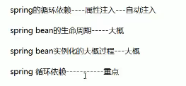
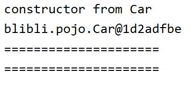
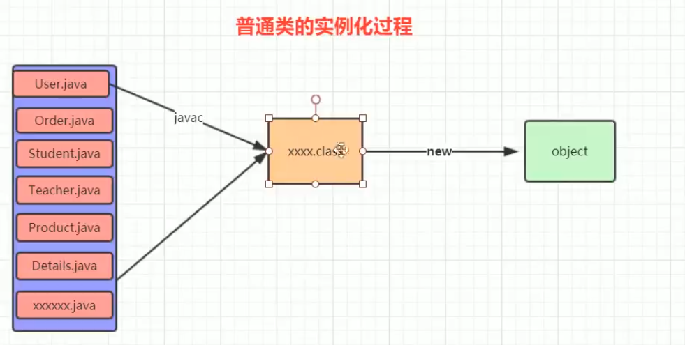

# 循环依赖



1. 要解决的问题

   Spring是循环依赖是怎么解决的？
   1. Spring是默认支持循环依赖的
   2. 怎么证明它默认支持的？怎么关闭循环依赖（必须是单例的）
   3. Spring中解决循环依赖的细节
2. 什么是循环依赖
   1. 循环依赖就是自己注入自己的对象实例
   2. 两个类都要注入对方类，形成循环
      配置文件
   ```java
   @Configuration
   @ComponentScan(basePackages={"blibli"})
   public class Myconfig {
   }
   ```

   自循环
   ```java
   @Component
   public class Car {
       @Autowired
       private Car car;

       public Car() {
           System.out.println("constructor from Car");
       }

       public Car getCar() {
           return car;
       }
   }
   ```

   测试代码
   ```java
   @ContextConfiguration(classes = Myconfig.class)
   @RunWith(SpringJUnit4ClassRunner.class)
   public class CarTest {
       @Autowired
       private Car car;

       @Test
       public void one(){
           System.out.println(car);
           System.out.println("=====================");
           car.getCar();
           System.out.println("=====================");
           car.getCar().getCar();
       }
   }
   ```

   运行结果

   

   两个循环
   ```java
   @Component
   public class Cat {
       @Autowired
       private Person master;

       public Person getMaster() {
           System.out.println("我的主人是"+master);
           return master;
       }
   }

   @Component
   public class Person {
       @Autowired
       private Cat cat;

       public Cat getCat() {
           System.out.println("我的猫是"+cat);
           return cat;
       }
   }

   @ContextConfiguration(classes= Myconfig.class)
   @RunWith(SpringJUnit4ClassRunner.class)
   public class PersonTest {
       @Autowired
       private Person person;
       @Test
       public void one(){
           person.getCat();
           System.out.println("=====================");
           person.getCat().getMaster();
           System.out.println("=====================");
           person.getCat().getMaster().getCat();
           System.out.println("=====================");
           System.out.println(person);
       }
   }

   ```


2\. 了解知识：

1. Spring再对文件扫描时完成对象的初始化==>即再使用如以下代码时完成（必须是单例的）—>依赖注入再初始化的时候完成
   ```java
   ClassPathXmlApplicationContext classPathXmlApplicationContext = new ClassPathXmlApplicationContext("bean.xml");
   FileSystemXmlApplicationContext fileSystemXmlApplicationContext = new FileSystemXmlApplicationContext("bean.xml");
   AnnotationConfigApplicationContext annotationConfigApplicationContext = new AnnotationConfigApplicationContext(config.class);


   ```

   这里需要了解Spring的生命周期（产生过程），了解如何初始化一个bean

***

3\. bean和java对象

Spring bean是经历过Sping的生命周期的,通过getBean得到

Java 只是new出来的


