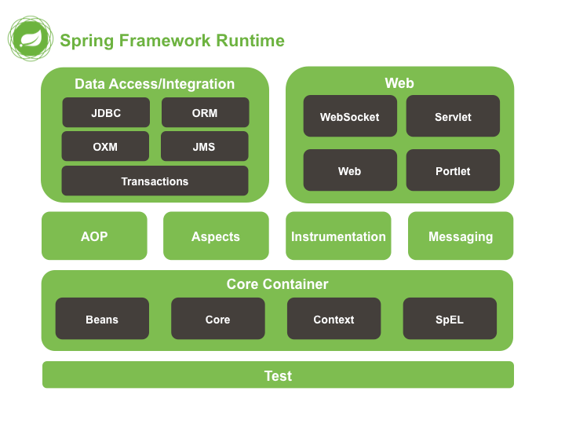

# Spring

## 目录

- [Spring 简介](#Spring简介)
  - [Spring can benefit from the Spring plaform](#Spring-can-benefit-from-the-Spring-plaform)
  - [Dependency Injection and Inversion of Control](#Dependency-Injection-and-Inversion-of-Control)
- [框架模块](#框架模块)
  - [核心容器](#核心容器)
  - [AOP 和检测](#AOP-和检测)
  - [Test](#Test)
  - [尚硅谷学习内容](#尚硅谷学习内容)

[Spring 中文文档](https://www.docs4dev.com/docs/zh/spring-framework/4.3.21.RELEASE/reference/spring-introduction.html "Spring中文文档")

[Spring 英文文档](https://docs.spring.io/spring/docs/3.0.x/spring-framework-reference/html/index.html "Spring英文文档")

### Spring 简介

The Spring Framework is a Java platform that provides comprehensive infrastructure support for developing Java applications. Spring handles the infrastructure so you can focus on your application.

Spring enables you to build applications from "plain old Java objects" (POJOs) and to apply enterprise services non-invasively to POJOs. This capability applies to the Java SE programming model and to full and partial Java EE.

#### Spring can benefit from the Spring plaform

- Make a Java method execute in a database transaction without having to deal with transaction APIs.
- Make a local Java method an HTTP endpoint without having to deal with the Servlet API.
- Make a local Java method a message handler without having to deal with the JMS API.
- Make a local Java method a management operation without having to deal with the JMX API.

#### Dependency Injection and Inversion of Control

Spring 框架控制反转(IoC)组件通过提供一种形式化的方法来将不同的组件组成一个可以正常使用的应用程序，从而解决了这一问题。 Spring 框架将形式化的设计模式编码为一流的对象，您可以将其集成到自己的应用程序中。许多组织和机构都以这种方式使用 Spring Framework 来设计健壮的，"可维护的“应用程序。

尽管 Java 平台提供了丰富的应用程序开发功能，但它缺乏将基本构建块组织成一个连贯的整体的方法，而将任务留给了架构师和开发人员。尽管您可以使用诸如\* Factory ， Abstract Factory ， Builder ， Decorator 和 Service Locator \*之类的设计模式来构成组成应用程序的各种类和对象实例，但是这些模式仅是：给出最佳名称的最佳做法，并描述该模式的作用，应用方式，解决的问题等等。模式是形式化的最佳实践，您必须在应用程序中实现自己。

### 框架模块

Spring 框架包含组织为约 20 个模块的功能。这些模块分为核心容器，数据访问/集成，Web，AOP(面向切面编程)，检测，消息传递和测试，如下图所示。

Spring 框架分为四大模块：

Core 核心模块。负责管理组件的 Bean 对象

- spring-beans-4.0.0.RELEASE.jar
- spring-context-4.0.0.RELEASE.jar
- spring-core-4.0.0.RELEASE.jar
- spring-expression-4.0.0.RELEASE.jar

面向切面编程

- spring-aop-4.0.0.RELEASE.jar
- spring-aspects-4.0.0.RELEASE.jar

数据库操作

- spring-jdbc-4.0.0.RELEASE.jar
- spring-orm-4.0.0.RELEASE.jar
- spring-tx-4.0.0.RELEASE.jar
- spring-jms-4.0.0.RELEASE.jar

Web 模块

- spring-web-4.0.0.RELEASE.jar
- spring-webmvc-4.0.0.RELEASE.jar
- spring-websocket-4.0.0.RELEASE.jar
- spring-webmvc-portlet-4.0.0.RELEASE.jar

#### 核心容器

[IOC](IOC/IOC.md "IOC")

[Core Container](https://www.docs4dev.com/docs/zh/spring-framework/4.3.21.RELEASE/reference/beans.html#beans-introduction "Core Container")由`spring-core`，`spring-beans`，`spring-context`，`spring-context-support`和`spring-expression`(Spring 表达语言)模块组成。

`spring-core`和`spring-beans`模块[提供框架的基本部分](https://www.docs4dev.com/docs/zh/spring-framework/4.3.21.RELEASE/reference/beans.html#beans-introduction "提供框架的基本部分")，包括 IOC 和依赖注入功能。 `BeanFactory`是工厂模式的复杂实现。它消除了对编程单例的需求，并允许您将依赖项的配置和规范与实际程序逻辑脱钩。

[Context](https://www.docs4dev.com/docs/zh/spring-framework/4.3.21.RELEASE/reference/beans.html#context-introduction "Context")(`spring-context`)模块构建在[核心和 bean 类](https://www.docs4dev.com/docs/zh/spring-framework/4.3.21.RELEASE/reference/beans.html#beans-introduction "核心和 bean 类")模块提供的坚实基础上：这是一种以类似于 JNDI 注册表的框架样式方式访问对象的方法。 Context 模块从 Beans 模块继承其功能，并增加了对国际化(例如，使用资源束)，事件传播，资源加载以及通过 Servlet 容器透明创建上下文的支持。上下文模块还支持 Java EE 功能，例如 EJB，JMX 和基本远程处理。 `ApplicationContext`接口是上下文模块的焦点。 `spring-context-support`支持将常见的第三方库集成到 Spring 应用程序上下文中以进行缓存(EhCache，Guava，JCache)，邮件(JavaMail)，调度(CommonJ，Quartz)和模板引擎(FreeMarker，JasperReports，Velocity)。

`spring-expression`模块提供了功能强大的[Expression Language](https://www.docs4dev.com/docs/zh/spring-framework/4.3.21.RELEASE/reference/expressions.html "Expression Language")，用于在运行时查询和操作对象图。它是对 JSP 2.1 规范中指定的统一表达语言(统一 EL)的扩展。该语言支持设置和获取属性值，属性分配，方法调用，访问数组，集合和索引器，逻辑和算术运算符，命名变量以及按名称从 Spring 的 IoC 容器中检索对象的内容。它还支持列表投影和选择以及常见的列表聚合。

#### AOP 和检测

[AOP](AOP/AOP.md "AOP")

spring-aop 模块提供了 AOP Alliance 兼容的面向方面的编程实现，例如，您可以定义方法拦截器和切入点，以干净地解耦实现应分离功能的代码。使用源级元数据功能，您还可以将行为信息以类似于.NET 属性的方式合并到代码中。

单独的 spring-aspects 模块提供与 AspectJ 的集成。

spring-instrument 模块提供了在某些应用程序服务器中使用的类检测支持和类加载器实现。 spring-instrument-tomcat 模块包含 Spring 的 Tomcat 的检测代理。

#### Test

[Test](Test/Test.md "Test")

spring-test 模块通过 JUnit 或 TestNG 支持 Spring 组件的 unit testing 和 integration testing。它提供了 Spring ApplicationContext 的 loading 和那些上下文的 caching。它还提供了 mock objects，可用于隔离测试代码。

---

#### 尚硅谷学习内容

[Spring01.md](file/Spring01_6CEwJeed9-.md "/ Spring01.md")

[Spring 是如何解析 xml 的](https://www.cnblogs.com/Snail-1174158844/p/9952337.html "Spring是如何解析xml的")

Spring 的后置处理器：

BeanFactoryPostPrecessor==>最大的处理器

BeanDefinitionRegistry

[spring02.md](file/spring02_qh6F0rWoXJ.md "/ spring02.md")

[Spring 的数据访问](Spring的数据访问/Spring的数据访问.md "Spring的数据访问")

[Transaction](Transaction/Transaction.md "Transaction")

[Spring 整合 Web](Spring整合Web/Spring整合Web.md "Spring整合Web")

[JNDI](JNDI/JNDI.md "JNDI")
