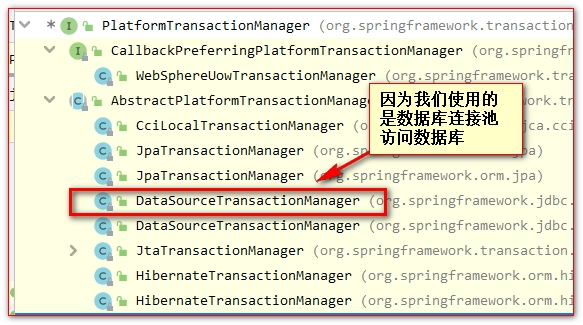
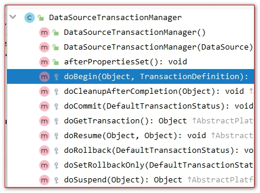
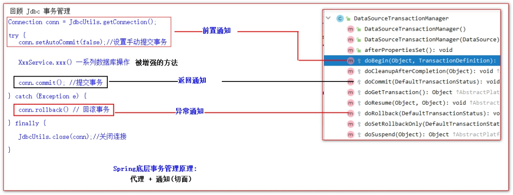
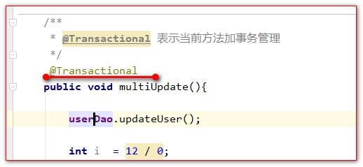
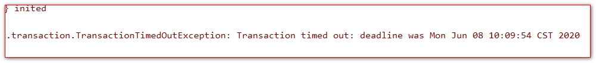
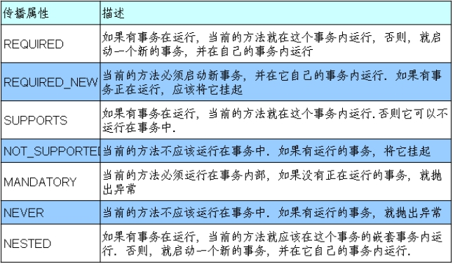
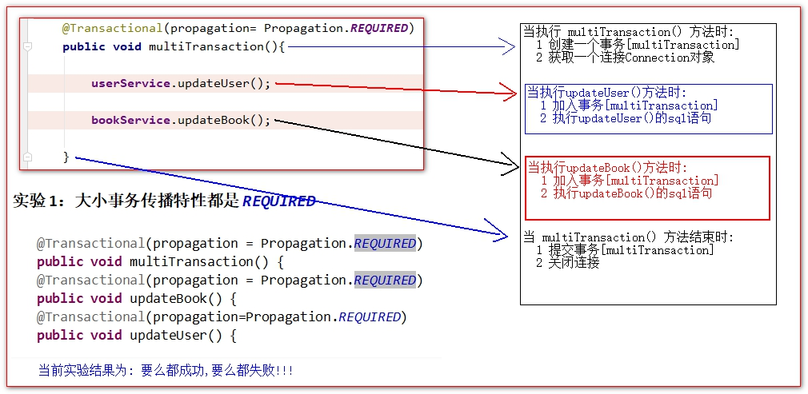
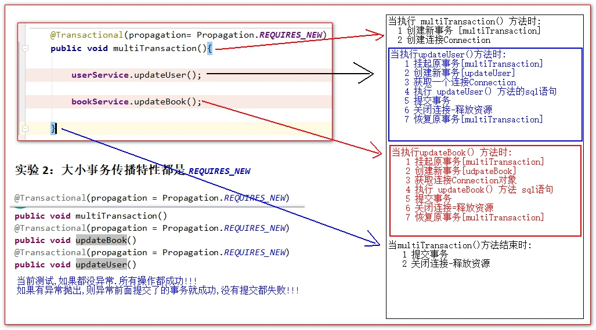
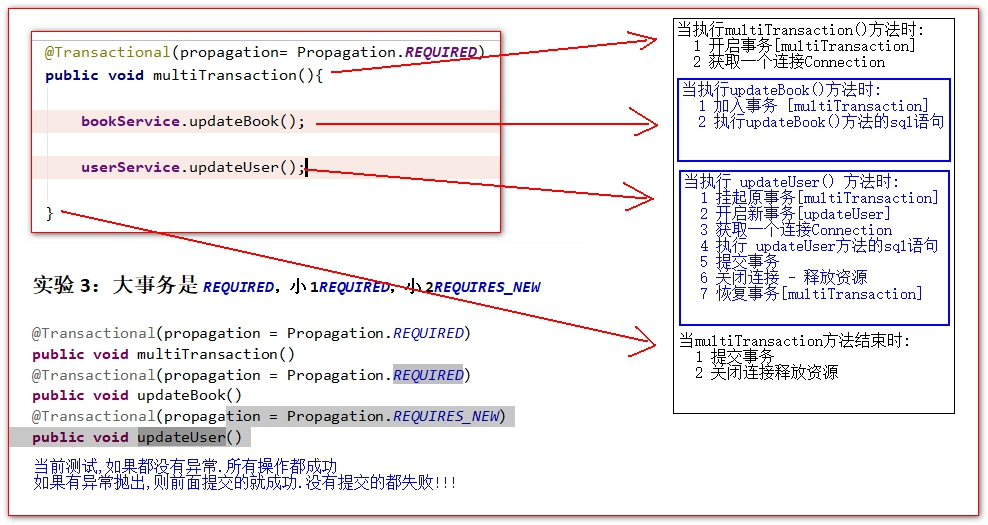

# Transaction

## 目录

- [声明式事务](#声明式事务)
- [Spring 事务引入的分析------PlatformTransactionManager 类简单介绍](#Spring事务引入的分析------PlatformTransactionManager类简单介绍)
- [使用 Spring 的注解声明事务管制](#使用Spring的注解声明事务管制)
  - [noRollbackFor 和 noRollbackForClassName 测试不回滚的异常](#noRollbackFor和noRollbackForClassName测试不回滚的异常)
  - [自定义设置回滚异常 rollbackFor 和 rollbackForClassName 回滚的异常](#自定义设置回滚异常rollbackFor和rollbackForClassName回滚的异常)
  - [事务的只读属性](#事务的只读属性)
  - [事务超时属性 timeout(秒为单位,了解内容)](#事务超时属性timeout秒为单位了解内容)
- [事务的传播特性](#事务的传播特性)
  - [注解演示事物传播特性](#注解演示事物传播特性)
  - [大小事务传播特性都是 REQUIRED](#大小事务传播特性都是REQUIRED)
  - [大小事务传播特性都是 REQUIRES_NEW](#大小事务传播特性都是REQUIRES_NEW)
  - [大事务是 REQUIRED，小 1REQUIRED，小 2REQUIRES_NEW](#大事务是REQUIRED小1REQUIRED小2REQUIRES_NEW)
- [xml 配置式事务声明](#xml配置式事务声明)
- [事务的隔离级别-read 事务隔离级别演示](#事务的隔离级别-read事务隔离级别演示)

Spring 关于事务的操作

### 声明式事务

```text
容器:
begin; 开启事务
sql1
sql2
sql3.
.....
commit; 提交事务 || rollback 回滚
```

事务分为声明式和编程式两种:

1. 声明式事务：声明式事务是指通过注解的形式或 xml 配置的形式对事务的各种特性进行控制和管理。
2. 编码式（编程式）事务：指的是通过编码的方式实现事务的声明。&#x20;

[例子：声明式事务环境搭建](例子：声明式事务环境搭建/例子：声明式事务环境搭建.md "例子：声明式事务环境搭建")

### Spring 事务引入的分析------PlatformTransactionManager 类简单介绍

PlatformTransactionManager 是一个接口.

这个接口是 Spring 中提供的专门用来处理事务的接口.

```java
public interface PlatformTransactionManager extends TransactionManager {
    // 获取连接,开启事务,设置为手动管理事务
    TransactionStatus getTransaction(@Nullable TransactionDefinition var1) throws TransactionException;
    // 提交事务
    void commit(TransactionStatus var1) throws TransactionException;
    // 回滚事务
    void rollback(TransactionStatus var1) throws TransactionException;
}
```

PlatformTransactionManager 接口有很多实现类:



DataSourceTransactionManager 是我们要重点关心的事务管理器实现类



doBegin() 会由获取一个连接 Connection, 并设置为手动管理事务&#x20;

doCommit() 方法 提交事务 connection.commit()&#x20;

doRollback() 方法 回滚事务 connection.rollback()

Spring&#x20;

事务管理底层原理:



### 使用 Spring 的注解声明事务管制

测试 Spring 的声明式事务

applicationContext.xml 配置文件:

```xml
<bean id="transactionManager" class="org.springframework.jdbc.datasource.DataSourceTransactionManager">
    <!-- 必须引用当前连接的数据库连接池? 因为事务需要在同一个connection中 -->
    <property name="dataSource" ref="dataSource"/>
</bean>
<!--
            (tx:annotation-driven表示代理 + 注解@transactional)组合使用
            transaction-manager="transactionManager" 配置使用哪个事务管理器
            transaction-manager属性的默认值是: transactionManager
    -->
 <tx:annotation-driven transaction-manager="transactionManager"/>
```

在需要使用事务的方法上,添加注解&#x20;



#### noRollbackFor 和 noRollbackForClassName 测试不回滚的异常

noRollbackFor 和 noRollbackForClassName 测试不回滚的异常

**Spring 默认情况下.是对 RuntimeException 运行时异常.和它的子异常,进行事务回滚.**

```java
//@Transactional(noRollbackFor = ArithmeticException.class)  指定不回滚异常类的class
//指定异常类的全路径
@Transactional(noRollbackForClassName = "java.lang.ArithmeticException")
public void multiUpdate() throws FileNotFoundException {
    userDao.updateUser();
    //Spring默认对RuntimeException异常进行回滚
    //if (true) throw new FileNotFoundException();
    int i = 10 / 0;
    bookDao.updateBook();
}
```

#### 自定义设置回滚异常 rollbackFor 和 rollbackForClassName 回滚的异常

```java
/
  * @Transactional 表示当前方法加事务管理 <br/>
  * noRollbackFor = ArithmeticException.class 表示如果抛ArithmeticException则不回滚事务 <br/>
 * noRollbackForClassName表示指定的哪个全类名的异常不回滚事务<br/>
 * rollbackFor指定哪些异常需要回滚事务 <br/>
 * rollbackForClassName指定哪些全类名的异常.需要回滚事务
 */
@Transactional(rollbackFor = FileNotFoundException.class,
               rollbackForClassName = "java.io.FileNotFoundException"     )
public void multiUpdate() throws FileNotFoundException {
  userDao.updateUser();
  if  (true) {
    throw  new FileNotFoundException("文件未找到异常,默认不回滚");
  }
  bookDao.updateBook();
}
```

#### 事务的只读属性

只读,是指,只能执行 select 查询操作,不允许执行 insert , update , delete 写操作( 如果执行写操作,抛异常 )

测试 readOnly 只读属性

```java
/
 * @Transactional 表示当前方法加事务管理 <br/>
 * readOnly设置是否只读,readOnly = true  表示 不允许写操作<br/>
 */
@Transactional(readOnly = true)
public void multiUpdate() throws FileNotFoundException {
  userDao.updateUser();
  bookDao.updateBook();
}
```

#### 事务超时属性 timeout(秒为单位,了解内容)

```java
/
 * @Transactional 表示当前方法加事务管理 <br/>
 * <p>
 * timeout 属性设置几秒内不允许再执行sql语句
 */
@Transactional(timeout = 3)
public void multiUpdate() throws InterruptedException {
  userDao.updateUser();
  Thread.sleep(4000);
  bookDao.updateBook();
}
```

事务超时的异常信息:



### 事务的传播特性

什么是事务的传播行为 ( 传播特性又叫传播行为 )：

当事务方法被另一个事务方法调用时，必须指定事务应该如何传播。

例如：方法可能继续在现有事务中运行，也可能开启一个新事务，并在自己的事务中运行。

事务的传播行为可以由传播属性指定。Spring 定义了 7 种类传播行为。

事务的传播特性，有以下几种类型：



required required_new supports not_supports mandatory never nested

#### 注解演示事物传播特性

UserService

BookService

TransactionService

#### 大小事务传播特性都是 REQUIRED

```java
@Transactional(propagation = Propagation.REQUIRED)
void multiTransaction()
@Transactional(propagation = Propagation.REQUIRED)
void updateBook()
@Transactional(propagation=Propagation.REQUIRED)
void updateUser()
```



#### 大小事务传播特性都是 REQUIRES_NEW

```java
@Transactional(propagation = Propagation.REQUIRES_NEW)
void multiTransaction()

@Transactional(propagation = Propagation.REQUIRES_NEW)
void updateBook()

@Transactional(propagation = Propagation.REQUIRES_NEW)
void updateUser()
```



#### 大事务是 REQUIRED，小 1REQUIRED，小 2REQUIRES_NEW

```java
@Transactional(propagation = Propagation.REQUIRED)
void multiTransaction()

@Transactional(propagation = Propagation.REQUIRES_NEW)
void updateUser()
@Transactional(propagation = Propagation.REQUIRED)
void updateBook()
```



### xml 配置式事务声明

去掉。所有@Transactional 的注解。

```xml
<?xml version="1.0" encoding="UTF-8"?>
<beans xmlns="http://www.springframework.org/schema/beans"
       xmlns:xsi="http://www.w3.org/2001/XMLSchema-instance"
       xmlns:context="http://www.springframework.org/schema/context" xmlns:tx="http://www.springframework.org/schema/tx"
       xmlns:aop="http://www.springframework.org/schema/aop"
       xsi:schemaLocation="http://www.springframework.org/schema/beans http://www.springframework.org/schema/beans/spring-beans.xsd http://www.springframework.org/schema/context https://www.springframework.org/schema/context/spring-context.xsd http://www.springframework.org/schema/tx http://www.springframework.org/schema/tx/spring-tx.xsd http://www.springframework.org/schema/aop https://www.springframework.org/schema/aop/spring-aop.xsd">
    <!--
        加载jdbc.properties属性配置文件
    -->
    <context:property-placeholder location="classpath:jdbc.properties"/>
    <!-- 配置包扫描 -->
    <context:component-scan base-package="com.atguigu"/>
    <!-- 数据库连接池 -->
    <bean class="com.alibaba.druid.pool.DruidDataSource" id="dataSource">
        <property name="username" value="${db.user}"/>
        <property name="password" value="${db.password}"/>
        <property name="url" value="${db.url}"/>
        <property name="driverClassName" value="${db.driverClassName}"/>
        <property name="initialSize" value="${db.initialSize}"/>
        <property name="maxActive" value="${db.maxActive}"/>
    </bean>
    <!-- 配置sql执行的工具类 -->
    <bean class="org.springframework.jdbc.core.JdbcTemplate" id="jdbcTemplate">
        <property name="dataSource" ref="dataSource"/>
    </bean>
    <bean id="transactionManager" class="org.springframework.jdbc.datasource.DataSourceTransactionManager">
        <!-- 必须引用当前连接的数据库连接池? 因为事务需要在同一个connection中 -->
        <property name="dataSource" ref="dataSource"/>
    </bean>
    <!-- 事务管理 -->
    <tx:advice transaction-manager="transactionManager" id="tx_advice">
        <tx:attributes>
            <!-- 注意不要忘了multiUpdate和multiTransaction单独配置 -->
            <tx:method name="multiUpdate" propagation="REQUIRED"/>
            <!-- 表示 udpateBook方法的传播特性是REQUIRES_NEW  -->
            <tx:method name="update*" propagation="REQUIRED"/>
            <!-- 以save打头的方法   -->
            <tx:method name="save*" propagation="REQUIRED"/>
            <tx:method name="del*" propagation="REQUIRED"/>
            <tx:method name="insert*" propagation="REQUIRED"/>
            <!-- 剩下的方法 设置只读
                name="updateBook" 精确
                name="save*" 半模糊
                method name="*" 全模糊
                匹配的规则是,越精确,越优先
            -->
            <tx:method name="*" read-only="true"/>
        </tx:attributes>
    </tx:advice>
    <aop:config>
        <aop:advisor advice-ref="tx_advice" pointcut="execution(public * com.atguigu..*Service*.*(..))"/>
    </aop:config>
</beans>
```

### 事务的隔离级别-read[事务隔离级别演示](https://www.wolai.com/cX13tBSd2uRFRWjecGHVjd "事务隔离级别演示")
