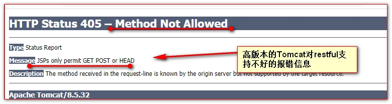
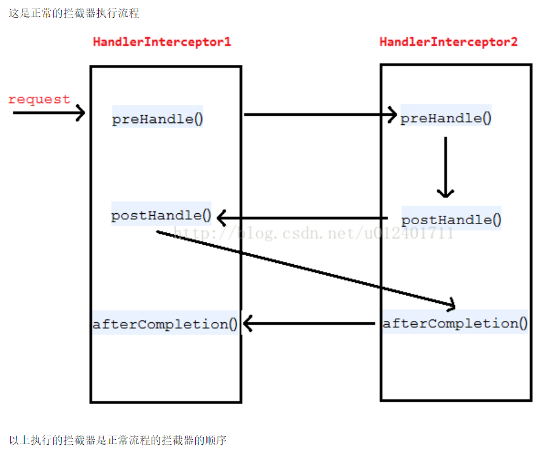

# Restful 和拦截器

## 目录

- [Restful 风格](#Restful风格)
  - [Restful 风格的介绍](#Restful-风格的介绍)
    - [原则条件](#原则条件)
  - [如何学习 restful 风格，这里需要明确两点：](#如何学习restful风格这里需要明确两点)
    - [就是把传统的请求参数加入到请求地址是什么样子？](#就是把传统的请求参数加入到请求地址是什么样子)
    - [restful 风格中请求方式 GET、POST、PUT、DELETE 分别表示查、增、改、删。](#restful风格中请求方式GETPOSTPUTDELETE分别表示查增改删)
    - [SpringMVC 中如何发送 GET 请求、POST 请求、PUT 请求、DELETE 请求。](#SpringMVC中如何发送GET请求POST请求PUT请求DELETE请求)
  - [Restful 风格的 Controller 如何实现](#Restful风格的Controller如何实现)
  - [Restful 风格在高版本 Tomcat 中无法转发到 jsp 页面](#Restful风格在高版本Tomcat中无法转发到jsp页面)
  - [@PathVariable 路径参数获取](#PathVariable-路径参数获取)
- [文件上传](#文件上传)
  - [准备一个文件上传的表单](#准备一个文件上传的表单)
  - [导入文件上传需要的 jar 包](#导入文件上传需要的jar包)
  - [配置文件上传解析器](#配置文件上传解析器)
  - [编写文件上传的 Controller 控制器中的代码：](#编写文件上传的Controller控制器中的代码)
  - [使用 ResponseEntity 返回值处理文件下载](#使用ResponseEntity返回值处理文件下载)
- [HandlerInterceptor 拦截器](#HandlerInterceptor拦截器)
  - [HandlerInterceptor 拦截器的介绍](#HandlerInterceptor拦截器的介绍)
  - [单个 HandlerInterceptor 拦截器的示例](#单个HandlerInterceptor拦截器的示例)
  - [单个拦截器异常时的执行顺序](#单个拦截器异常时的执行顺序)
  - [多个拦截器的执行介绍：](#多个拦截器的执行介绍)

# Restful 风格

## Restful 风格的介绍

Restful 一种软件架构风格、设计风格，而不是标准，只是提供了一组设计原则和约束条件。它主要用于客户端和服务器交互类的软件。基于这个风格设计的软件可以更简洁，更有层次，更易于实现缓存等机制。

### 原则条件

REST 指的是一组架构[约束条件](https://baike.baidu.com/item/%E7%BA%A6%E6%9D%9F%E6%9D%A1%E4%BB%B6 "约束条件")和原则。满足这些约束条件和原则的应用程序或设计就是 RESTful。Web 应用程序最重要的 REST 原则是，客户端和服务器之间的交互在请求之间是无状态的。从客户端到服务器的每个请求都必须包含理解请求所必需的信息。如果服务器在请求之间的任何时间点重启，客户端不会得到通知。此外，无状态请求可以由任何可用服务器回答，这十分适合[云计算](https://baike.baidu.com/item/%E4%BA%91%E8%AE%A1%E7%AE%97 "云计算")之类的环境。客户端可以缓存数据以改进性能。

在服务器端，应用程序状态和功能可以分为各种资源。资源是一个有趣的概念实体，它向客户端公开。资源的例子有：应用程序对象、数据库记录、算法等等。每个资源都使用 URI (Universal Resource Identifier) 得到一个唯一的地址。**所有资源都共享统一的接口**，以便在客户端和服务器之间传输状态。使用的是标准的 **HTTP 方法**，比如 GET、PUT、[POST](https://baike.baidu.com/item/POST "POST") 和 [DELETE](https://baike.baidu.com/item/DELETE "DELETE")。[Hypermedia](https://baike.baidu.com/item/Hypermedia "Hypermedia") 是应用程序状态的[引擎](https://baike.baidu.com/item/%E5%BC%95%E6%93%8E/2874935 "引擎")，资源表示通过[超链接](https://baike.baidu.com/item/%E8%B6%85%E9%93%BE%E6%8E%A5 "超链接")互联。

```java
http://localhost:8080/user/findAll    html,jsp,安卓,ios,java,只要可以发送http协议的变成语言
@RequestMapping(vaule="user/findAll",method=RequestMethod.GET)
public @ResponseBody List<Person> findAll(){
    .....
    return List<Person>;
}
```

**Restful 是一种设计风格。对于我们 Web 开发人员来说。就是使用一个 url 地址表示一个唯一的资源。然后把原来的请求参数加入到请求资源地址中。然后原来请求的增，删，改，查操作。改为使用 HTTP 协议中请求方式 GET、POST、PUT、DELETE 表示。**

1. 把请求参数加入到请求的资源地址中
2. 原来的增，删，改，查。使用 HTTP 请求方式，POST、DELETE、PUT、GET 分别一一对应。

## 如何学习 restful 风格，这里需要明确两点：

### 就是把传统的请求参数加入到请求地址是什么样子？

传统的方式是：

比如：[http://ip](http://ip "http://ip"):port/工程名/资源名?请求参数

举例：[http://127.0.0.1:8080/springmvc/book?action=delete\&id=1](http://127.0.0.1:8080/springmvc/book?action=delete&id=1 "http://127.0.0.1:8080/springmvc/book?action=delete&id=1")

restful 风格是：

比如：[http://ip](http://ip "http://ip"):port/工程名/资源名/请求参数/请求参数

举例：[http://127.0.0.1:8080/springmvc/book/delete/1](http://127.0.0.1:8080/springmvc/book/delete/1 "http://127.0.0.1:8080/springmvc/book/delete/1")

请求的动作删除由请求方式 delete 决定

### restful 风格中请求方式 GET、POST、PUT、DELETE 分别表示查、增、改、删。

GET 请求 对应 查询

[http://ip](http://ip "http://ip"):port/工程名/book/1 HTTP 请求 GET 表示要查询 id 为 1 的图书

[http://ip](http://ip "http://ip"):port/工程名/book HTTP 请求 GET 表示查询全部的图书

POST 请求 对应 添加

[http://ip](http://ip "http://ip"):port/工程名/book HTTP 请求 POST 表示要添加一个图书

PUT 请求 对应 修改

[http://ip](http://ip "http://ip"):port/工程名/book/1 HTTP 请求 PUT 表示要修改 id 为 1 的图书信息

DELETE 请求 对应 删除

[http://ip](http://ip "http://ip"):port/工程名/book/1 HTTP 请求 DELETE 表示要删除 id 为 1 的图书信息

### SpringMVC 中如何发送 GET 请求、POST 请求、PUT 请求、DELETE 请求。

我们知道发起 GET 请求和 POST 请求，只需要在表单的 form 标签中，设置 method=“get“ 就是 GET 请求。

设置 form 标签的 method=“post“。就会发起 POST 请求。而 PUT 请求和 DELETE 请求。要如何发起呢。

1. 要有 post 请求的 form 标签
2. 在 form 表单中，添加一个额外的隐藏域\_method=“PUT“或\_method=“DELETE“
3. 在 web.xml 中配置一个 Filter 过滤器 org.springframework.web.filter.HiddenHttpMethodFilter（注意，这个 Filter 一定要在处理乱码的 Filter 后面）

## Restful 风格的 Controller 如何实现

jsp:

```java
<%--get--%>
<a href="${pageContext.request.contextPath}/book/1">通过id查询图书信息</a>
<a href="${pageContext.request.contextPath}/book">查询全部图书信息</a>
<%--post--%>
<form action="${pageContext.request.contextPath}/book" method="post">
  <input type="submit" value="添加图书" />
</form>
<%--put--%>
<form action="${pageContext.request.contextPath}/book/1" method="post">
  <%-- 隐藏域表示请求方式PUT --%>
  <input type="hidden"  name ="_method"  value="PUT" />
  <input type="submit" value="修改图书" />
</form>
<%--delete--%>
<form action="${pageContext.request.contextPath}/book/1" method="post">
  <%-- 隐藏域表示请求方式 DELETE --%>
  <input type="hidden"  name ="_method"  value="DELETE" />
  <input type="submit" value="删除图书" />
</form>
```

controller

```java
@RequestMapping(value = "/book/1", method = RequestMethod.GET)
public String findBookById() {
    System.err.println("通过id查询一个图书");
    return "redirect:/index.jsp";
}
@GetMapping()
@RequestMapping(value = "/book", method = RequestMethod.GET)
public String findBookAll() {
    System.err.println("查询全部图书信息");
    return "redirect:/index.jsp";
}
@PostMapping()
@RequestMapping(value = "/book", method = RequestMethod.POST)
public String addBook() {
    System.err.println("添加书籍信息");
    return "redirect:/index.jsp";
}
@RequestMapping(value = "/book/1", method = RequestMethod.PUT)
public String updateBookById() {
    System.err.println("通过id修改一个图书");
    return "redirect:/index.jsp";
}
@RequestMapping(value = "/book/1", method = RequestMethod.DELETE)
public String deleteBookById() {
    System.err.println("通过id删除一个图书");
    return "redirect:/index.jsp";
}
```

## Restful 风格在高版本 Tomcat 中无法转发到 jsp 页面

在 Tomcat8 之后的一些高版本，使用 restful 风格访问然后转发到 jsp 页面。就会有如下的错误提示：

1. 使用请求重定向 \<br/>
2. 在 jsp 页面的 page 指定中设置 isErrorPage=true.



## @PathVariable 路径参数获取

前面我们已经知道如何编写和配置 restful 风格的请求和控制器。

那么 现在的问题是。如何接收 restful 风格请求的参数。比如前面的 id 值。

```java
/**
     * 查询id为1的图书 <br/>
     * value = "/book/{id} 请求地址中 {id} 表示路径参数(路径变量). 大括号中的id,是参数名(变量名) <br/>
     *
     * @return
     * @PathVariable("id") Integer id ,@PathVariable表示取路径变量的值(取参数名或变量名为 id的值)赋给方法参数id
     * 注意:{name}如果不传递,则405
     * book/1/xixi
     * @RequestHeader("")获取请求头的数据
     */
@RequestMapping(value = "/book/{id}/{name}", method = RequestMethod.GET)
public String findBookById(
    @PathVariable(value = "id") Integer id,@PathVariable(value = "name",required = false)String name) {
    System.err.println("通过id查询一个图书");
    System.err.println(id);
    System.err.println(name);
    return "forward:/index.jsp";
}
```

# 文件上传

文件上传在 SpringMVC 中如何实现：

准备工作前端控制器 , SpringMVC 两个标配

1. 准备一个文件上传的表单
2. 导入文件上传需要的 jar 包

- commons-fileupload-1.2.1.jar
- commons-io-1.4.jar

1. 配置文件上传解析器 **CommonsMultipartResolver**
2. 配置 Controller 控制器的代码

## 准备一个文件上传的表单

```html
<html>
    
  <head>
        
    <title>$Title$</title>
      
  </head>
  <body>
        <%-- 准备一个文件上传的表单 --%>    
    <form
      action="${pageContext.request.contextPath}/upload"
      enctype="multipart/form-data"
      method="post"
    >
      用户名:<input type="text" name="username" />  <br />         头像:
      <input type="file" name="photo" /> <br />        
      <input name="send" type="submit" />    
    </form>
  </body>
</html>
```

## 导入文件上传需要的 jar 包

commons-fileupload-1.2.1.jar

commons-io-1.4.jar

## 配置文件上传解析器

```xml
<!-- 配置解析上传数据的解析器
      而且要求id值必须是: multipartResolver ( 否则不能使用 )
 -->
<bean id="multipartResolver"
      class="org.springframework.web.multipart.commons.CommonsMultipartResolver">
    <!-- 配置字符集,防止中文乱码 -->
    <property name="defaultEncoding" value="UTF-8" />
</bean>
```

## 编写文件上传的 Controller 控制器中的代码：

```java
/**
     * 文件上传
     *
     * @return
     */
    @RequestMapping("fileUpload")
    public String fileUpload(@RequestParam("username") String username, @RequestParam("photo") MultipartFile photo) {
        System.err.println("用户名称是" + username);
        //生成一个文件名称
        String fileName = UUID.randomUUID().toString().replaceAll("-", "") + ".";
        //substring:字符串截取(start,end)
        String fileNameExt = photo.getOriginalFilename().substring(photo.getOriginalFilename().lastIndexOf(".") + 1);
        //具体文件名称
        fileName += fileNameExt;
        //上传文件
        try {
            File file = new File("C:/workspace/0621/" + fileName);
            photo.transferTo(file);
            String path = file.getAbsolutePath();
            //
            //存入数据库---关联与当前文件有关的是其他数据
        } catch (IOException e) {
            e.printStackTrace();
        }
        return "success";
    }
```

## 使用 ResponseEntity 返回值处理文件下载

```java
/**
     * @param fileName 下载的文件名
     * @return
     */
    @RequestMapping(value = "/download")
    public ResponseEntity<byte[]> download(String fileName, HttpSession session) throws IOException {
    // 获取ServletContext对象
    ServletContext context = session.getServletContext();
    // 1 读取需要下载的文件内容( 获取它的数据 )
    InputStream resourceAsStream = context.getResourceAsStream("/files/" + fileName);
    // 将流中听数据直接转换字节数组
    byte[] bytes = IOUtils.toByteArray(resourceAsStream);
    resourceAsStream.close();
    // 获取指定文件的数据类型
    String mimeType = context.getMimeType("/files/" + fileName);
    // 文件下载大概的步骤如下:
    // 3 设置响应头 ContentType 告诉浏览器 返回的数据类型
    // 4 设置响应头,Content-Disposition 告诉浏览器,收到的数据,怎么处理
    MultiValueMap headers = new HttpHeaders();
    headers.add("Content-Type", mimeType); // 添加一个响应头
    headers.add("Content-Disposition", "attachement; filename=" + fileName);
    /**
         * 第一个参数是 : 响应体 <br/>
         * 第二个参数是 : 响应头 <br/>
         * 第三个参数是 : 响应行( 响应状态码 )
         */
    // 2 将下载的文件内容保存到,响应体中
    ResponseEntity<byte[]> responseEntity = new ResponseEntity<>(bytes, headers, HttpStatus.OK);
    return responseEntity;
}
```

# HandlerInterceptor 拦截器

## HandlerInterceptor 拦截器的介绍

SpringMVC 的拦截器和 JavaWeb 的 Filter 过滤器非常接近.( 就是对请求的目标资源进行拦截,做一些操作,然后决定是否放行. )

使用的步骤如下:

1. 先编写一个类去实现 HandlerInterceptor 接口
2. 实现拦截器的方法
3. 到 springMVC.xml 中去配置拦截器的拦截路径

## 单个 HandlerInterceptor 拦截器的示例

1、编写一个类去实现 HandlerInterceptor 接口

2、到 Spring 的容器配置文件中去配置拦截器，让 SpringMVC 知道都拦截哪些目标方法

Controller 中的代码:

```java
@Controller
public class HelloController {
    @RequestMapping(value = "/hello")
    public String hello() {
        System.out.println(" 这是controller#hello() ");
        return "ok";
   }
}
```

拦截器:

```java
public class FirstHandlerInceptor implements HandlerInterceptor {
    /**
     * 目标方法之前的操作 <br/>
     * * @return
     *
     * @throws Exception
     */
    @Override
    public boolean preHandle(HttpServletRequest request, HttpServletResponse response, Object handler) throws Exception {
        System.out.println(" frist preHandle() ");
        // 返回值决定是否放行==目标资源
        // 返回true 表示可以访问目标资源
        // 返回false 表示不允许访问目标资源
        return true;
    }
    /**
     * 目标方法之后的操作
     *
     * @throws Exception
     */
    @Override
    public void postHandle(HttpServletRequest request, HttpServletResponse response, Object handler, ModelAndView modelAndView) throws Exception {
        System.out.println(" frist postHandle() ");
    }
    /**
     * 页面渲染完毕
     *
     * @param request
     * @param response
     * @param handler
     * @param ex
     * @throws Exception
     */
    @Override
    public void afterCompletion(HttpServletRequest request, HttpServletResponse response, Object handler, Exception ex) throws Exception {
        System.err.println("页面渲染完毕");
    }
}
```

SpringMVC 的配置文件:

```xml
<!-- 配置拦截器 -->
<mvc:interceptors>
    <mvc:interceptor>
        <!-- path配置拦截的路径 -->
        <mvc:mapping path="/hello"/>
        <!-- 拦截器是哪个类 -->
        <bean class="com.atguigu.interceptor.FirstHandlerInceptor"/>
    </mvc:interceptor>
</mvc:interceptors>
拦截全部
<mvc:interceptors>
    <!-- 拦截器是哪个类 -->
    <bean class="com.atguigu.interceptor.FirstHandlerInceptor"/>
</mvc:interceptors>
```

正常情况下.它拉执行顺序是:

preHandle() ==>> 目标方法 ==>> postHandle() ==>> 渲染页面 ==>> afterCompletion()&#x20;

## 单个拦截器异常时的执行顺序

一：目标方法前返回 false 的情况：

1. 目标方法前执行 返回 false
2. 这是目标方法 不执行
3. 目标方法之后 不执行
4. 这是渲染页面 不执行
5. 页面渲染完成！ 不执行

二：目标方法前返回 true 的情况，目标方法异常

1. 目标方法前执行 返回 true
2. 这是目标方法 异常
3. 目标方法之后 不执行
4. 这是渲染页面 渲染异常页面
5. 页面渲染完成！ 执行

三：目标方法前返回 true 的情况，目标方法后异常

1. 目标方法前执行 返回 true
2. 这是目标方法 执行
3. 目标方法之后 异常
4. 这是渲染页面 渲染异常页面
5. 页面渲染完成！ 执行

四：目标方法前返回 true 的情况，渲染页面异常

1. 目标方法前执行 返回 true
2. 这是目标方法 执行
3. 目标方法之后 执行
4. 这是渲染页面 异常
5. 页面渲染完成！ 执行

## 多个拦截器的执行介绍：



frist preHandle() 第一个前置

second preHandle() 第一个前置

这是 controller#hello() 目标方法

second postHandle() 第二个后置

frist postHandle() 第一个后置

这是 ok.jsp 页面 渲染页面

second afterCompletion() 第二个页面渲染完成

frist afterCompletion() 第一个页面渲染完成

多个拦截器异常情况下,我们只需要记住一点 : **如果 preHandle() 方法返回了 true.它的 afterCompletion() 方法就一定会执行,由于目标方法不执行,所以 postHandle()不会执行**

```xml
<mvc:interceptors>
        <mvc:interceptor>
            <mvc:mapping path="/hello"/>
            <bean class="com.atguigu.intercepter.FirstHandlerInceptor"></bean>
        </mvc:interceptor>
        <mvc:interceptor>
            <mvc:mapping path="/hello"/>
            <bean class="com.atguigu.intercepter.SecondHandlerInceptor"></bean>
        </mvc:interceptor>
    </mvc:interceptors>
```

[Restful 风格实现的 CRUD 图书](Restful风格实现的CRUD图书/Restful风格实现的CRUD图书.md "Restful风格实现的CRUD图书")
