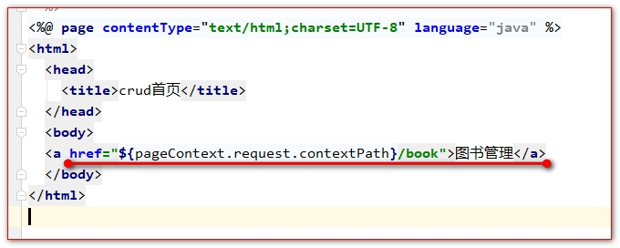
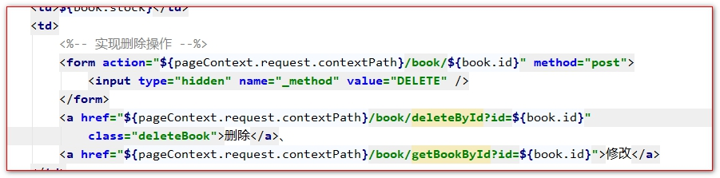
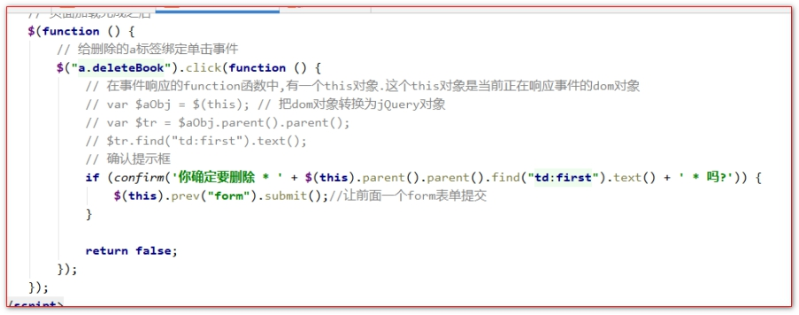
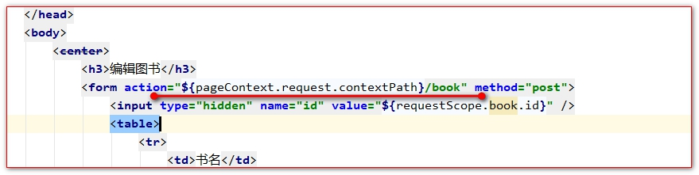
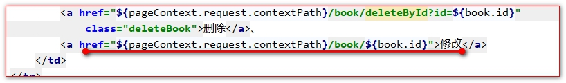
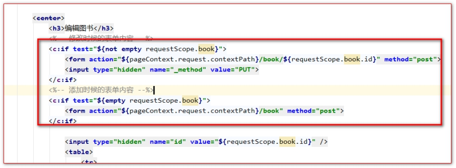

# Restful风格实现的CRUD图书

## 目录

- [列表功能实现](#列表功能实现)
- [删除功能实现](#删除功能实现)
- [添加功能实现](#添加功能实现)
- [中文乱码](#中文乱码)
  - [更新功能实现](#更新功能实现)
    - [查询需要更新的图书，填充到更新页面](#查询需要更新的图书填充到更新页面)
    - [提交请求，发送数据给服务器更新保存修改。](#提交请求发送数据给服务器更新保存修改)

把前面的传统请求方式的图书的CRUD换成刚刚讲的Restful风格的图书模块的CRUD。只需要修改页面端的请求方式和地址，以及服务器端Controller的接收。

## 列表功能实现

Controller中的代码:

```java
@RequestMapping(value = "",method = RequestMethod.GET)
public String list(Map<String, Object> map) {
    List<Book> list = bookService.queryAllBooks();
    map.put("list", list);
    return "bookList";
}
```


页面中请求方式修改:



## 删除功能实现

Controller中的代码:

```java
@RequestMapping(value = "/delete/{id}",method = RequestMethod.DELETE)
public String delete(@PathVariable("id") Integer id) {
    //通过调用bookService.deleteBookById()删除图书
    bookService.deleteBookById(id);
    //重定向到查询页面
    return "redirect:/book";
}
```






## 添加功能实现

Controller中的修改代码:

```java
@RequestMapping(value = "/book" , method = RequestMethod.POST)
public String add(Book book) {
    /**
   * 中文乱码解决方法有两个 <br>
   *   1 请求转为get请求,在Tomcat8之后get请求没有中文乱码 <br/>
   *   2 使用Spring提供的Filter过滤器解决中文乱码问题 <br/>
   */
    // 调用bookService.saveBook()添加图书
    bookService.saveBook(book);
    // 重定向回图书列表管理页面
    return "redirect:/book";
}
```


jsp页面中的修改:



# 中文乱码

```xml
配置最上边
<filter>
    <filter-name>encoding</filter-name>
    <filter-class>org.springframework.web.filter.CharacterEncodingFilter</filter-class>
    <init-param>
        <param-name>encoding</param-name>
        <param-value>utf-8</param-value>
    </init-param>
    <init-param>
        <param-name>forceRequestEncoding</param-name>
        <param-value>true</param-value>
    </init-param>
    <init-param>
        <param-name>forceResponseEncoding</param-name>
        <param-value>true</param-value>
    </init-param>
</filter>
<filter-mapping>
    <filter-name>encoding</filter-name>
    <url-pattern>/*</url-pattern>
</filter-mapping>
```


## 更新功能实现

更新图书分为两个步骤：

1. 查询需要更新的图书，填充到更新页面
2. 提交请求，发送数据给服务器更新保存修改。

### 查询需要更新的图书，填充到更新页面

Controller中的代码:

```java
@RequestMapping(value = "/{id}",method = RequestMethod.GET)
public String getABook(@PathVariable("id") Integer id, Map<String, Object> map) {
    Book book = bookService.queryBookbyId(id);
    map.put("book", book);
    return "bookEdit";
}
```


jsp页面中修改



### 提交请求，发送数据给服务器更新保存修改。

Controller代码中的修改:

```java
@RequestMapping(value = "",method = RequestMethod.PUT)
public String update(Book book) {
    // 调用bookService.updateBook()修改图书
    bookService.updateBookById(book);
    // 重定向到图书列表管理页面
    return "redirect:/book";
}
```


jsp页面中的修改:


