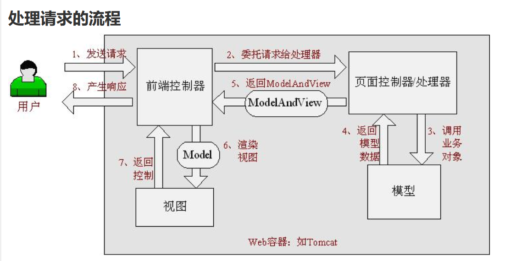
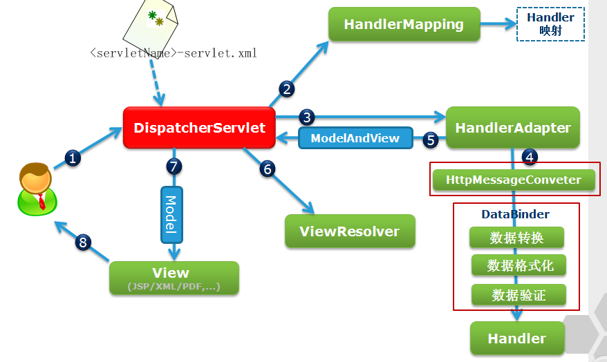

# SpringMVC

## 目录

- [SpringMVC优势](#SpringMVC优势)

SpringMVC主要是通过前端控制器controller中的注解来完成请求处理的。前段请求从web.xml中servlet的配置开始，根据servlet拦截的url-parttern，来进行请求转发控制。

**SpringMVC处理流程：**

<!--  -->

具体执行步骤如下：

1、首先用户发送请求————>前端控制器，前端控制器根据请求信息（如URL）来决定选择哪一个页面控制器进行处理并把请求委托给它，即以前的控制器的控制逻辑部分；图2-1中的1、2步骤；

2、页面控制器接收到请求后，进行功能处理，首先需要收集和绑定请求参数到一个对象，这个对象在Spring Web MVC中叫命令对象，并进行验证，然后将命令对象委托给业务对象进行处理；处理完毕后返回一个ModelAndView（模型数据和逻辑视图名）；图2-1中的3、4、5步骤；

3、前端控制器收回控制权，然后根据返回的逻辑视图名，选择相应的视图进行渲染，并把模型数据传入以便视图渲染；图2-1中的步骤6、7；

4、前端控制器再次收回控制权，将响应返回给用户，图2-1中的步骤8；至此整个结束。

工作流程描述如下:

1. 用户向服务器发送请求，请求被Spring 前端控制Servelt DispatcherServlet捕获；
2. DispatcherServlet对请求URL进行解析，得到请求资源标识符（URI）。然后根据该URI，调用HandlerMapping获得该Handler配置的所有相关的对象（包括Handler对象以及Handler对象对应的拦截器），最后以HandlerExecutionChain对象的形式返回；
3. DispatcherServlet 根据获得的Handler，选择一个合适的HandlerAdapter。（附注：如果成功获得HandlerAdapter后，此时将开始执行拦截器的preHandler(...)方法）
4. 提取Request中的模型数据，填充Handler入参，开始执行Handler（Controller)。 在填充Handler的入参过程中，根据你的配置，Spring将帮你做一些额外的工作：  HttpMessageConveter： 将请求消息（如Json、xml等数据）转换成一个对象，将对象转换为指定的响应信息数据转换：对请求消息进行数据转换。如String转换成Integer、Double等数据根式化：对请求消息进行数据格式化。 如将字符串转换成格式化数字或格式化日期等数据验证： 验证数据的有效性（长度、格式等），验证结果存储到BindingResult或Error中.
5. Handler执行完成后，向DispatcherServlet 返回一个ModelAndView对象；
6. 根据返回的ModelAndView，选择一个适合的ViewResolver（必须是已经注册到Spring容器中的ViewResolver)返回给DispatcherServlet ； &#x20;
7. ViewResolver 结合Model和View，来渲染视图
8. 将渲染结果返回给客户端。

#### SpringMVC优势

1、清晰的角色划分：前端控制器（DispatcherServlet）、请求到处理器映射（HandlerMapping）、处理器适配器（HandlerAdapter）、视图解析器（ViewResolver）、处理器或页面控制器（Controller）、验证器（   Validator）、命令对象（Command  请求参数绑定到的对象就叫命令对象）、表单对象（Form Object 提供给表单展示和提交到的对象就叫表单对象）。

2、分工明确，而且扩展点相当灵活，可以很容易扩展，虽然几乎不需要；

3、由于命令对象就是一个POJO，无需继承框架特定API，可以使用命令对象直接作为业务对象；

4、和Spring 其他框架无缝集成，是其它Web框架所不具备的；

5、可适配，通过HandlerAdapter可以支持任意的类作为处理器；

6、可定制性，HandlerMapping、ViewResolver等能够非常简单的定制；

7、功能强大的数据验证、格式化、绑定机制；

8、利用Spring提供的Mock对象能够非常简单的进行Web层单元测试；

9、本地化、主题的解析的支持，使我们更容易进行国际化和主题的切换。

10、强大的JSP标签库，使JSP编写更容易。

***

SpringMVC Hello 流程：

执行doDispatcher做请求分发处理

1.1、调用getHandler()     获取请求处理器      处理器中包含请求的方法和拦截器信息

getHandlerInternal()      根据请求地址获取对应的请求方法

getHandlerExecutionChain()  获取请求地址对应的所有拦截器信息

1.2、调用getHandlerAdapter()    方法获取 适配处理器

1.3、mappedHandler.applyPreHandle(processedRequest, response)  执行所有拦截器 preHandle()方法

1.4、调用ha.handle();    调用Controller目标方法，并将结果封装成为ModelAndView返回

1.5、mappedHandler.applyPostHandle()        执行拦截器PostHandler()后置方法

1.6、processDispatchResult();          处理结果，渲染页面

1.7、mappedHandler.triggerAfterCompletion();      执行拦截器 渲染完成方法

***

注意点：

[matters needing attention](https://www.wolai.com/mhV3yxYVQyzwmNn5QEscf1 "matters needing attention")

[前端控制器和识图解析器](前端控制器和识图解析器/前端控制器和识图解析器.md "前端控制器和识图解析器")

[Restful和拦截器](Restful和拦截器/Restful和拦截器.md "Restful和拦截器")

[异常处理](异常处理/异常处理.md "异常处理")

[三大框架ssm的整合](三大框架ssm的整合/三大框架ssm的整合.md "三大框架ssm的整合")
