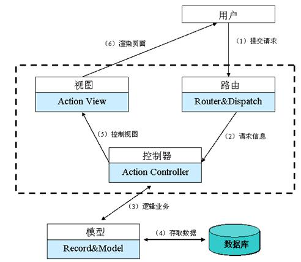
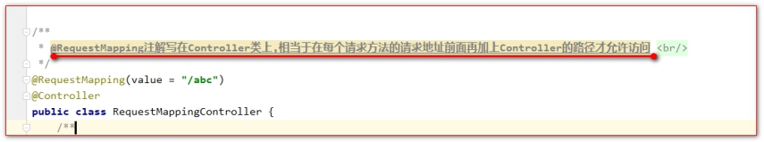
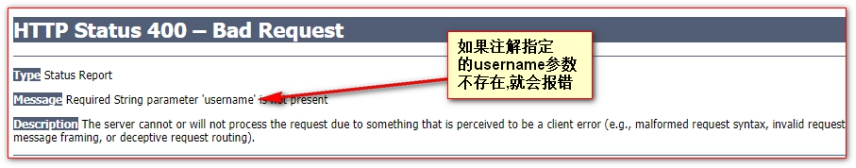

# 前端控制器和识图解析器

## 目录

- [1、SpringMVC 的概述](#1SpringMVC的概述)
- [2、SpringMVC 的核心 DispatcherServlet 程序](#2SpringMVC的核心DispatcherServlet程序)
- [3、视图解析器](#3视图解析器)
- [4、@RequestMapping 注解详解](#4RequestMapping注解详解)
  - [4.1、value 属性（重点）](#41value属性重点)
  - [4.2、params 属性](#42params属性)
  - [4.3、headers 属性](#43headers属性)
  - [4.4、method 属性](#44method属性)
  - [4.5、@RequestMapping 标注在 Controller 类上](#45RequestMapping标注在Controller类上)
  - [4.6、ant 模式地址通配符](#46ant模式地址通配符)
    - [1、绝对匹配](#1绝对匹配)
    - [2、? 问号 匹配资源路径](#2-问号-匹配资源路径)
    - [3、\* 星号 匹配资源路径](#3-星号-匹配资源路径)
    - [4、? 问号 匹配一个字符的一层目录](#4-问号-匹配一个字符的一层目录)
    - [5、\* 星号匹配多个字符的一层目录](#5-星号匹配多个字符的一层目录)
    - [6、\*\* 星星号 匹配多层目录](#6-星星号-匹配多层目录)
- [5、Controller 中如何接收请求参数](#5Controller中如何接收请求参数)
  - [5.1、原生 API 参数类型](#51原生API参数类型)
    - [5.1.1、HttpServletRequest 类、HttpSession 类、HttpServletResponse 类](#511HttpServletRequest类HttpSession类HttpServletResponse类)
  - [5.2、普通类型入参](#52普通类型入参)
  - [5.3、普通类型数组的参数](#53普通类型数组的参数)
  - [5.4、普通类型使用@RequestParam 入参](#54普通类型使用RequestParam入参)
  - [5.5、@RequestHeader 获取请求头入参](#55RequestHeader获取请求头入参)
  - [5.6、@CookieValue 获取 Cookie 值入参](#56CookieValue获取Cookie值入参)
  - [5.7、一个 Pojo 对象类型的参数](#57一个Pojo对象类型的参数)
  - [5.8、对象中套对象（级联属性）](#58对象中套对象级联属性)
  - [5.9 使用 list 接受请求参数](#59-使用list接受请求参数)
- [6、返回值的设置](#6返回值的设置)
  - [6.1、返回 String](#61返回String)
    - [6.1.1、返回 String 默认情况](#611返回String默认情况)
    - [6.1.2、显示转发](#612显示转发)
    - [6.1.3、显示重定向](#613显示重定向)
  - [6.2、返回 ModelAndView](#62返回ModelAndView)
    - [6.2.1、返回 modelAndView 的默认情况](#621返回modelAndView的默认情况)
    - [6.2.2、显示请求转发](#622显示请求转发)
    - [6.2.3、显示请求重定向](#623显示请求重定向)
- [7、数据在域中的保存](#7数据在域中的保存)
  - [7.1、Request 对象中保存数据](#71Request对象中保存数据)
  - [7.2、Session 域中保存数据](#72Session域中保存数据)
  - [7.3、ServletContext 域中保存数据](#73ServletContext域中保存数据)
  - [7.4、Map 或 Model 或 ModelMap 形式保存数据在 request 域中](#74Map或Model或ModelMap形式保存数据在request域中)
  - [7.5、ModelAndView 方式保存数据到 request 域中](#75ModelAndView方式保存数据到request域中)
  - [7.6、@SessionAttributes 保存数据到 Session 域中（了解内容）](#76SessionAttributes保存数据到Session域中了解内容)
  - [7.7、@ModelAttribute 注解](#77ModelAttribute注解)

# 1、SpringMVC 的概述

Spring MVC 框架是一个开源的 Java 平台，为开发强大的基于 JavaWeb 应用程序提供全面的基础架构支持，并且使用起来非常简单容易。

Spring web MVC 框架提供了 MVC(模型 - 视图 - 控制器)架构，用于开发灵活和松散耦合的 Web 应用程序的组件。 MVC 模式使应用程序的不同组件(输入逻辑，业务逻辑和 UI 逻辑)合理有效的分离，同时又有效的将各组件组合一起完成功能。

**画图解释 MVC:**



# 2、SpringMVC 的核心 DispatcherServlet 程序

在 SpringMVC 框架中有一个非常非常重要的程序是 DispatcherServlet 程序

1. 它是一个 servlet 程序
2. 它负责把所有请求分发给 Controller 控制中的业务方法( 相当于 JavaWeb 的 XxxServlet 程序的 xxx 业务方法 )
3. 我们管它叫前端控制器.

<!--  -->

# 3、视图解析器

视图解析器可以解析 SpringMVC 框架中 Controller 控制器里方法的返回值为请求跳转的路径.

SpringMVC 配置文件中的视图解析器.

```xml
<!-- 视图解析器 -->
<bean id="viewResolver" class="org.springframework.web.servlet.view.InternalResourceViewResolver">
    <!-- 前缀 -->
    <property name="prefix" value="/page/"/>
    <!-- 后缀 -->
    <property name="suffix" value=".jsp"/>
</bean>
```

视图解析器的好处:&#x20;

1. 方法我们返回值里只需要写上简短的内容即可
2. 视图解析器会把 Controller 方法的返回值,做前缀和后缀的拼接操作,然后再跳转
3. 方便我们移动资源的目录

```java
/**     
     * @RequestMapping表示Hello方法的访问地址 <br/>
     *  ==>> 在web工程中表示路径为:http://ip:port/工程路径<br/>
     *  /hello  ==>> 表示地址为:http://ip:port/工程路径/hello <br/>     * @return     
     *
     */
@RequestMapping(value = "/hello")
public String hello() {
    System.err.println("spring 第一个 小demo");
    /**
         * / ==>> 在web工程中表示路径为:http://ip:port/工程路径<br/>
         * 映射到代码的web目录 <br/>
         * 默认情况下,springmvc使用请求转发做为默认的页面跳转方式<br/>
         * 如果没有视图解析器,我们需要写上完整的路径也就是 ==>>/pages/ok.jsp
         */
    return "ok";
}
```

视图解析器,工作的时候,会把 Controller 方法中的返回值做字符串拼接操作:

拼接的规则是: 前缀 + 返回值 + 后缀

注: 视图解析器它只做一个工作,就是把返回值转换为需要的视图 View ( 就是最后的跳转 )

# 4、@RequestMapping 注解详解

@RequestMapping 是给个方法配置一个访问地址。就比如 web 学习的 Servlet 程序，在 web.xml 中配置了访问地址之后，它们之间就有一个访问映射关系。

## 4.1、value 属性（重点）

value 属性是给方法配置访问地址使用.

它可以配置一个或者多个请求路径.

注意: 一个方法可以有多个请求路径 , 一个路径只能分配给一个方法

```java
/**
 * @RequestMapping它的作用是给方法配置一个访问地址 <br/>
 * 1 一般情况下是以斜杠打头 <br/>
 * 2 斜杠表示地址为:http://ip:port/工程路径/ <br/>
 * 3 /斜杠映射到代码的web目录 <br/>
 */
@RequestMapping(value = {"map1","xxx","sss"})
public String map1(){
    System.err.println("requestMapping");
    return "ok";
}
```

## 4.2、params 属性

params 是要求此请求的参数匹配

params="username" 表示 请求地址必须带有 username 参数

params="username=abc" 表示 请求参数中必须要有 username，而且值还必须是 abc

params="username!=abc" 表示 1、请求参数中不能有 username 参数。2、有 username 参数，但值不能等于 abc

params="!username" 表示 请求地址不能带有 username 参数

params= {"username!=abc","!password"} params 可以有多个值,每个值之间是&&关系

以上条件表示要求:

( 请求地址中不能有 username 参数 || username 参数值不能等于 abc && 不能有 password 参数 )

```java
/*
    params="username"  表示  请求地址必须带有username参数
    params="username=abc"表示  请求参数中必须要有username，而且值还必须是abc
    params="username!=abc"
        表示
          1、请求参数中不能有username参数。
            2、有username参数，但值不能等于abc
    params="!username"   表示 请求地址不能带有username参数
    params= {"username!=abc","!password"}  params可以有多个值,每个值之间是&&关系
   */
@RequestMapping(value = "map2", params = {"username!=abc","!password"})
public String map2() {
    System.err.println("requestMapping");
    return "ok";
}
```

## 4.3、headers 属性

headers 表示对请求头的匹配要求 , 用法上跟 params 完全一样.只是要求匹配的内容不同.

```java
/**
     *  headers = "User-Agent" 表示要求请求头中必须有User-Agent请求头 <br/>
     * @return
     */
@RequestMapping(value = "map3",headers = {"User-Agent"})
public String map3() {
    System.err.println("head");
    return "ok";
}
```

## 4.4、method 属性

method 属性要求请求的方式必须匹配.也就是 GET 请求,或 POST 请求( 其他请求也一样 ).

如果没有标识 method 属性值,表示任意的请求方式都可以

GET 请求演示：

```java
@RequestMapping(value = "map4",method = RequestMethod.GET)
public String map4() {
    System.err.println("method");
    return "ok";
}
```

POST 请求演示：

```java
@RequestMapping(value = "map4",method = RequestMethod.POST)
public String map4() {
    System.err.println("method");
    return "ok";
}
```

## 4.5、@RequestMapping 标注在 Controller 类上



## 4.6、ant 模式地址通配符

### 1、绝对匹配

```java
/**
     * fun  绝对匹配
     * @return
     */
@RequestMapping("fun")
public String fun(){
    System.err.println("fun");
    return "ok";
}
```

### 2、? 问号 匹配资源路径

? 问号表示一个任意字符,比如匹配 fu\[0-9a-zA-Z]

```java
/**
     * fu? fu开头,?代表一个字符
     * @return
     */
@RequestMapping("fu?")
public String fun1(){
    System.err.println("fu?");
    return "ok";
}
```

### 3、\* 星号 匹配资源路径

\\\* 星号 可以匹配任意个字符

```java
/**
     * fu? fu开头,*代表n个字符串,可以没有
     * @return
     */
@RequestMapping("fu*")
public String fun2(){
    System.err.println("fu*");
    return "ok";
}
```

匹配规则:

精确匹配====>?匹配========>\*匹配

### 4、? 问号 匹配一个字符的一层目录

```java
/**
     * /?/fu?  /任意一个字符的路径/fu
     * @return
     */
@RequestMapping("/?/fun")
public String fun3(){
    System.err.println("/?/fu?");
    return "ok";
}
```

### 5、\* 星号匹配多个字符的一层目录

```java
/**
     * /\*\/fu?  /n个字符的路径/fu
     * @return
     */
@RequestMapping("/*/fun")
public String fun4(){
    System.err.println("/*/fun");
    return "ok";
}
```

### 6、\*\* 星星号 匹配多层目录

```java
/**
     * /\**\/fu?  /n个字符的路径/fu
     * @return
     */
@RequestMapping("/**/fun")
public String fun5(){
    System.err.println("/**/fun");
    return "ok";
}
```

多个路径匹配时,越精确越优先

# 5、Controller 中如何接收请求参数

## 5.1、原生 API 参数类型

### 5.1.1、HttpServletRequest 类、HttpSession 类、HttpServletResponse 类

注 : 只需要在 Controller 的方法上.直接写上需要的参数即可.

```java
@RequestMapping("param1")
public String param1(HttpSession session, HttpServletResponse response, HttpServletRequest request){
    System.err.println(request);
    System.err.println(request.getContextPath());
    System.err.println(request.getParameter("username"));
    System.err.println("=====================");
    System.err.println(session.getId());
    System.err.println("=================");
    System.err.println(response.getHeaderNames());
    return "ok";
}
```

## 5.2、普通类型入参

如果想要在 Controller 方法上直接获取请求的参数有如下的要求:

要求 : 方法的参数名一定要和请求的参数名一致!!!

```java
/**
     * 方法中的参数与请求参数name一致则会自动映射
     * @param username
     * @param password
     * @return
     */
@RequestMapping("param2")
public String param2(String username,String password){
    System.err.println(username);
    System.err.println(password);
    return "ok";
}
```

## 5.3、普通类型数组的参数

```java
/**
     * 多个请求参数name一致时可使用数组接收
     * @param hobby
     * @return
     */
@RequestMapping("param3")
public String param3(String [] hobby){
    System.err.println(hobby[0]);
    System.err.println(hobby[1]);
    System.err.println(hobby[2]);
    return "ok";
}
```

## 5.4、普通类型使用@RequestParam 入参

如果请求的参数名和方法的参数名不一致 , 也可以使用注解@RequestParam 获取相应的值 .&#x20;

```java
/**
     *@RequestParam("username") String user 将传递过来的username直接赋值给user
     * required = false:可以不传递
     * defaultValue = "hehe" 默认值是hehe
     * @param user
     * @return
     */
@RequestMapping("param4")
public String param4(@RequestParam(value = "username",required = false,defaultValue = "hehe") String user){
    System.err.println(user);
    return "ok";
}
```



## 5.5、@RequestHeader 获取请求头入参

```java
/**
     * @param userAgent
     * @return
     * @RequestHeader( name = "User-Agent") 从请求头中获取User-Agent的值
     */
@RequestMapping("param5")
public String param5(@RequestHeader(name = "User-Agent") String userAgent) {
    System.err.println(userAgent);
    return "ok";
}
```

## 5.6、@CookieValue 获取 Cookie 值入参

```java
/**
     * @CookieValue("JSESSIONID") 从cook中获取JSESSIONID的值
     * @param jsessionId
     * @return
     */
@RequestMapping("param6")
public String param6(@CookieValue("JSESSIONID") String jsessionId) {
    System.err.println(jsessionId);
    return "ok";
}
```

## 5.7、一个 Pojo 对象类型的参数

JavaBean 是:

```java
public class Person {
  private Integer id;
  private String name;
  private String phone;
  private Integer age;
}
```

表单:

```html
<form action="${pageContext.request.contextPath}/param7" method="post">
  编号:<input type="text" name="id" id="id" /> <br />
  姓名:<input type="text" name="name" id="name" /><br />
  电话:<input type="text" name="phone" id="phone" /><br />
  年龄:<input type="text" name="age" id="age" /><br />
  <input type="submit" value="提交" /><br />
</form>
```

Controller 的代码:

```java
/**
     * 表单中的表单项可以直接映射给person属性,但是person属性名称必须与表单项的name属性值一致
     * @param person
     * @return
     */
@RequestMapping("param7")
public String param7(Person person) {
    System.err.println(person);
    return "ok";
}
```

## 5.8、对象中套对象（级联属性）

```java
public class Car {
    private String type;
    private String carNo;
}
public class Person {
    private Integer id;
    private String name;
    private String phone;
    private Integer age;
    private Car car;
}
```

表单:

```html
<form action="${pageContext.request.contextPath}/param7" method="get">
  编号:<input type="text" name="id" id="id" /> <br />
  姓名:<input type="text" name="name" id="name" /><br />
  电话:<input type="text" name="phone" id="phone" /><br />
  年龄:<input type="text" name="age" id="age" /><br />
  车名:<input type="text" name="car.name" id="car.name" /><br />
  车版号:<input type="text" name="car.carNo" id="car.carNo" /><br />
  <input type="submit" value="提交" /><br />
</form>
```

Controller 中的代码:

```java
/**
     * 表单中的表单项可以直接映射给person属性,但是person属性名称必须与表单项的name属性值一致
     * @param person
     * @return
     */
@RequestMapping("param7")
public String param7(Person person) {
    System.err.println(person);
    return "ok";
}
```

## 5.9 使用 list 接受请求参数

前端页面绑定

```java
$("#batchDelAdminsBtn").click(function () {
        //获取选中的tbody内的管理员id列表提交给后台删除
        var $checkedIpu = $("table tbody :checkbox:checked");
        //遍历集合，将每个input的管理员id获取到
        var idsArr = new Array();//js的数组
        $checkedIpu.each(function () {
            //jquery的增强for循环，会自动对jquery对象进行遍历，使用遍历的dom对象调用传入的函数
            //this就代表正在遍历的dom对象
            idsArr.push($(this).attr("adminid"));//向数组中添加元素
        });
        //console.log(idsArr);
        // idsArr.join(","); 将数组中的元素每两个使用逗号连接成一个字符串  ，例如：[1,2,3] ==   1,2,3
        if(idsArr.length==0){
            layer.msg("请选择要删除的管理员");
            return;
        }
        //提交批量删除的请求
        layer.confirm("您真的要删除吗?" , function () {
            window.location = "${PATH}/admin/batchDelAdmins?ids="+idsArr.join();
        })
    });

```

```java
    /**
     *  一个键多个值的提交方式：
     *         url?hobby=football&hobby=basketball&hobby=pingp
     *  springmvc中对参数提交进行了优化：
     *         入参类型：
     *         1、简单类型： 只要提交参数的key和方法的形参名一样就可以绑定入参
     *         2、对象类型：pojo，只要提交参数的key和pojo的属性名一样就可以绑定入参
     *              TAdmin：
     *                  String loginacct
 *                     Integer id
     *                 String email
     *         3、同一个键有多个值：使用List集合接受
     *              浏览器提交参数：url?ids=1,2,3,4
     *              springmvc接受时可以使用 @RequestParam("ids")List<Integer>ids
     */
    //集合类型的参数入参
    // url?id=1&id=2&id=3
    @RequestMapping(value = "/batchDelAdmins")
    public String batchDelAdmins(@RequestParam("ids")List<Integer> ids,HttpSession session){
        //System.out.println("ids = " + ids);
        adminService.batchDelAdmins(ids);
        Integer currentPageNum = (Integer) session.getAttribute("currentPageNum");
        //跳转到删除之前的页面
        return "redirect:/admin/index?pageNum="+currentPageNum;
    }
```

# 6、返回值的设置

## 6.1、返回 String

### 6.1.1、返回 String 默认情况

```java
/**
     * 1:默认情况下
     *     1.1:有视图解析器   走视图解析器 拼接 /page/ok.jsp
     *          只需要写全路径去掉前缀和后缀的内容成为视图名,只写视图名即可
     *     1.2: 无视图解析器   return /page/ok.jsp
     *           /page/ok.jsp 中   /表示 http://ip:post/工程路径,也表示当前项目的web目录
     * 2:默认情况下springMVC为转发跳转页面
     *
     * @return
     */
@RequestMapping("return1")
public String return1(){
    System.err.println("return1");
    return "ok";
}
```

### 6.1.2、显示转发

```java
@RequestMapping("return2")
public String return2(){
    System.err.println("return2");
    /**
         * 要求SpringMVC进行转发
         *      1:使用forward:字符串
         *      2:转发不会使用视图解析器
         *      3:forward:完整的映射路径
         *      4:转发路径分为相对路径和绝对路径:
         *              绝对路径:
         *                  /打头路径
         *                  /page/ok.jsp====>>>http://localhost:8080/01_SpringMVC_war_exploded/page/ok.jsp
         *              相对路径:
         *                  page/ok.jsp
         *                      success:http://localhost:8080/01_SpringMVC_war_exploded/page/ok.jsp
         *                      fail:http://localhost:8080/01_SpringMVC_war_exploded/return/return2
         *                           page/ok.jsp会将"/return"此处替换,所以当没有模块划分时可以使用相对路径,但是禁止使用
         */
    return "forward:/page/ok.jsp";
}
```

### 6.1.3、显示重定向

```java
@RequestMapping("return3")
public String return3() {
    System.err.println("return3");
    /**
         * 显示的要求SpringMVC使用请求重定向跳转页面<br/>
         *  1 显示的*请求重定向*需要在返回值前面添加 redirect: 字符串<br/>
         *  2 显示的*请求重定向*不和视图解析器的前后缀做拼接操作 <br/>
         *  3 显示的*请求重定向*后面一定要写上.完整的跳转路径 <br/>
         *  4 在SpringMVC中,返回的地址的斜杠表示地址为 : http://ip:port/工程路径/ <br/>
         */
    return "redirect:/page/ok.jsp";
}
```

## 6.2、返回 ModelAndView

### 6.2.1、返回 modelAndView 的默认情况

```java
/**
     * ModelAndView可以理解为两部分,一部分是Model(明天的内容),一部分是View <br/>
     * View(视图) 就是跳转路径, 默认情况下.它会跟视图解析器一起工作 <br/>
     * 有两种方式可以指定跳转路径 <br/>
     *  1 在构造器中直接传入<br/>
     *  2 setViewName()设置视图名 <br/>
     *  默认情况下.只需要写视图名即可,它会跟视图解析器一起工作.默认情况下,SpringMVC也是使用请求转发来进行跳转 <br/>
     * modelAndView.setViewName("ok");
     */
@RequestMapping("mv1")
public ModelAndView mv1() {
    System.err.println("mv1");
    ModelAndView modelAndView = new ModelAndView("ok");
    return modelAndView;
}
```

### 6.2.2、显示请求转发

```java
@RequestMapping("mv2")
public ModelAndView mv2() {
    System.err.println("mv2");
    ModelAndView modelAndView = new ModelAndView("forward:/page/ok.jsp");
    return modelAndView;
}
```

### 6.2.3、显示请求重定向

```java
@RequestMapping("mv3")
public ModelAndView mv3() {
    System.err.println("mv3");
    ModelAndView modelAndView = new ModelAndView("redirect:/page/ok.jsp");
    return modelAndView;
}
```

[SpringMVC 的第一个 Hello 示例程序](SpringMVC的第一个Hello示例程序/SpringMVC的第一个Hello示例程序.md "SpringMVC的第一个Hello示例程序")

# 7、数据在域中的保存

## 7.1、Request 对象中保存数据

Controller 中的代码:

```java
@RequestMapping("/requestScope")
public String requestScope(HttpServletRequest request){
    System.println( "requestScope() 方法调用了" );
    request.setAttribute("reqKey1", "reqValue1");
    request.setAttribute("reqKey2", "reqValue2");
    return "scope";
}
```

jsp 页面的输出测试:

request 域中 reqKey1 的值是 ==>> \${requestScope.reqKey1} \<br/>

request 域中 reqKey2 的值是 ==>> \${requestScope.reqKey2} \<br/>

## 7.2、Session 域中保存数据

Controller 中的代码:

```java
@RequestMapping("/sessionScope")
public String sessionScope(HttpSession session){
    System.out.println( "sessionScope() 方法调用了" );
    session.setAttribute("sessionKey1", "sessionValue1");
    session.setAttribute("sessionKey2", "sessionValue2");
    return "scope";
}
```

jsp 页面的输出:

session 域中 sessionKey1 的值是 ==>> \${sessionScope.sessionKey1} \<br/>

session 域中 sessionKey2 的值是 ==>> \${sessionScope.sessionKey2} \<br/>

## 7.3、ServletContext 域中保存数据

在 Controller 中的代码。在 Controller 的中获取 SerlvetContext 对象有两种方法，

一种是@Autowired 注入，

一种是通过 Session 获取。

Context 中的代码: &#x20;

```java
pageContext.setAttribute(k,v,(1,2,3,4))
//获取ServletContext对象
@Autowired
ServletContext context;
@RequestMapping("/servletContextScope")
public String servletContextScope(HttpSession session){
    //从session中获取ServletContext对象
    ServletContext context = session.getServletContext();
    System.out.println( "servletContextScope() 方法调用了" );
    context.setAttribute("contextKey1", "contextValue1");
    context.setAttribute("contextKey2", "contextValue2");
    return "scope";
}
```

jsp 页面的输出:

ServletContext 域中 contextKey1 的值是 ==>> \${applicationScope.contextKey1} \<br/>

ServletContext 域中 contextKey2 的值是 ==>> \${applicationScope.contextKey2} \<br/>

## 7.4、Map 或 Model 或 ModelMap 形式保存数据在 request 域中

在四个域中，我们使用最频繁的域就是 request 对象。往 request 域对象中，保存数据，还在以下的几种形式。

我们可以在 Controller 的方法中，添加 Map 类型的参数，或者是 Model 类型的参数。或者是 ModelMap 类型的参数。都可以直接用来保存域数据到 Request 对象中。

Map 全类名是： java.util.Map

Model 全类名是： org.springframework.ui.Model

ModelMap 全类名是： org.springframework.ui.ModelMap

Map 形式保存数据到 Reqeust 域中:

```java
@RequestMapping("/mapToRequest")
public String mapToRequest(Map<String,Object> map){
  System.out.println( " mapToRequest () 方法调用了" );
  // 这些数据同时也会同步到Reqeust域中
  map.put("key1", "value1");
  map.put("key2", "value2");
  return "scope";
}
```

```text
map 中 key1 的值是 ==>> ${requestScope.key1} <br/>
map 中 key2 的值是 ==>> ${requestScope.key1} <br/>
```

Model 形式保存数据到 Reqeust 域 中:

```java
@RequestMapping("/modelToRequest")
public String modelToRequest(Model model){
  System.out.println( " modelToRequest () 方法调用了" );
  // 这些数据同时也会同步到Reqeust域中
  model.addAttribute("modelKey1", "modelValue1");
  model.addAttribute("modelKey2", "modelValue2");
  return "scope";
}
```

```text
Model 中 key1 的值是 ==>> ${requestScope.modelKey1} <br/>
Model 中 key2 的值是 ==>> ${requestScope.modelKey1} <br/>
```

ModelMap 形式保存数据到 Request 域中.

```java
@RequestMapping("/modelMapToRequest")
public String modelMapToRequest(ModelMap modelMap){
  System.out.println( " modelMapToRequest () 方法调用了" );
  // 这些数据同时也会同步到Reqeust域中
  modelMap.addAttribute("modelMapKey1", "modelMapValue1");
  modelMap.addAttribute("modelMapKey2", "modelMapValue2");
  return "scope";
}
```

```text
ModelMap 中 modelMapKey1 的值是 ==>> ${requestScope.modelMapKey1} <br/>
ModelMap 中 modelMapKey1 的值是 ==>> ${requestScope.modelMapKey1} <br/>
```

BindingAwareModelMap 隐含模型对象的介绍

```java
/**
     *  
     * BindingAwareModelMap 对象,我们管它叫隐含模型对象 <br/> 
     *  隐含模型对象的作用是 :  给视图准备需要渲染的数据<br/> 
     *  隐含,是不需要你自己手动定义<br/> 
     *  模型保存数据的对象<br/> 
     *  视图,就是用户最终收到的数据的一个载体 (html页面,jsp页面) <br/> 
     *  渲染,就是执行视图的代码叫渲染<br/> 
     *  视图需要的数据,其实就是 页面上显示的数据 <br/> 
     *  
     * class org.springframework.validation.support.BindingAwareModelMap 类                                
     * BindingAwareModelMap extends ExtendedModelMap          
     * ExtendedModelMap extends ModelMap implements Model         
     * ModelMap extends LinkedHashMap<String, Object> 
     */
    @RequestMapping("/mapAndModelAndModelMap")
    public String mapAndModelAndModelMap(Map<String, Object> map, Model model, ModelMap modelMap) {
        System.out.println(map);
        System.out.println(model);
        System.out.println(modelMap);
        System.out.println("==================================================");
        map.put("map1", "mapv1");
        System.out.println(map);
        System.out.println(model);
        System.out.println(modelMap);
        System.out.println("==================================================");
        model.addAttribute("model1", "modelv1");
        System.out.println(map);
        System.out.println(model);
        System.out.println(modelMap);
        System.out.println("==================================================");
        modelMap.addAttribute("modelMap1", "modelMapv1");
        System.out.println(map);
        System.out.println(model);
        System.out.println(modelMap);
        System.out.println("==================================================");
        System.out.println(map.getClass());
        System.out.println(model.getClass());
        System.out.println(modelMap.getClass());
        return "scope";
    }
```

## 7.5、ModelAndView 方式保存数据到 request 域中

ModelAndView 分为两部分:

一 , 是 Model ,就是模型数据( 同隐含模型数据一样,就是给页面视图渲染使用 )

二 , 是 view 视图

Controller 代码:

```java
@RequestMapping("/modelAndViewToRequest")
public ModelAndView modelAndViewToRequest(){
    //创建模型和视图对象
    ModelAndView modelAndView = new ModelAndView("scope");
    System.out.println(" modelAndViewToRequest () 方法调用了");
    // 这些数据也会同步 到 Reqeust 域中
    modelAndView.addObject("mavKey1","mavValue1");
    modelAndView.addObject("mavKey2","mavValue2");
    return modelAndView;
}
```

jsp 输出测试:

\<hr>

Request 域中 mavKey1 的值是 ==>> \${requestScope.mavKey1} \<br/>

Request 域中 mavKey2 的值是 ==>> \${requestScope.mavKey2} \<br/>

## 7.6、@SessionAttributes 保存数据到 Session 域中（了解内容）

@SessionAttributes 注解可以标注在类上。它的作用是指定隐含模型中哪些数据也同步到 Session 域中。@SessionAttributes(value = { "key1","key2" }, types = { String.class, Book.class })

value 属性，它表示把 request 域中 key 为 key1，key2 的键值对信息，也保存到 Session 中

types 属性，它表示把 request 域中 value 类型为 String.class\\\*\*或 Book.class 类型的键值对，也保存到 Session 中

Controller 中的代码:

```java
/**
 * @SessionAttributes 是指定隐含模型中哪些数据可以同步到Session域中 <br/>
 * names   指定 哪些 key 的数据同步 到Session域 <br/>
 * names = {"key1","key2"} 表示key1,和key2的数据,也同步 到Session域中 <br/>
 * types   指定 哪些value 类型的 数据,同步 到Session域中<br/>
 */
@SessionAttributes(types = {Integer.class,Person.class})
@Controller
public class ScopeController {
    @RequestMapping("/sessionAttributesToSession")
    public String sessionAttributesToSession(Map<String,Object> map){
        map.put("key1", "value1");
        map.put("key2",new Integer(100));
        return "scope";
    }
}
```

jsp 测试输出:

```html
<h1>测试数据也同步到Session中</h1>
Request 域中 key1 的值是 ==>> ${requestScope.key1} <br />
Request 域中 key2 的值是 ==>> ${requestScope.key2} <br />
SessionAttributes 中 key1 的值是 ==>> ${sessionScope.key1} <br />
SessionAttributes 中 key2 的值是 ==>> ${sessionScope.key2} <br />
```

## 7.7、@ModelAttribute 注解

@ModelAttribute 这个注解可以标注在方法和参数上。

@ModelAttribute 三个常见作用：

1. 被标注了@ModelAttribute 的方法都会在 Controller 的目标方法之前执行。
2. 目标方法的参数（JavaBean 对象）会先从隐含模型中获取值传入。
3. 被标注在参数上，参数值会按照指定的 key 从隐含模型中获取值。

```java
@ModelAttribute
public void abc(Map<String,Object> map){
    System.out.println("  @ModelAttribute 标识 的方法 abc() ");
    map.put("person1", new Person(100, "技多不压身"));
}
/**
 * 当取值的时候,以是参数的类型的类名,首字母改小写.做为key到隐含模型中取值<br/>
 * 不一致时可以使用@ModelAttribute("person1") 取出指定的key赋值
 * 先拿到@ModelAttribute中的值,再执行我们自己的
 * Person => person
 */
@RequestMapping("/target")
public String target(@ModelAttribute("person1") Person person){
    System.out.println(" target() 方法 ==>> " + person);
    return "scope";
}
```

```html
<form action="${pageContext.request.contextPath}/param7" method="post">
       编号:<input type="text" name="id" id="id" /> <br />     姓名:<input
    type="text"
    name="name"
    id="name"
  /><br />     电话:<input type="text" name="phone" id="phone" /><br />    
  年龄:<input type="text" name="age" id="age" /><br />      

  <input type="submit" value="提交" /><br />
</form>
```
