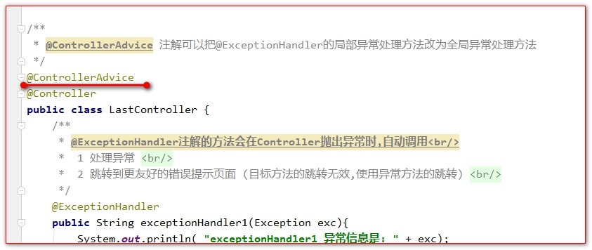
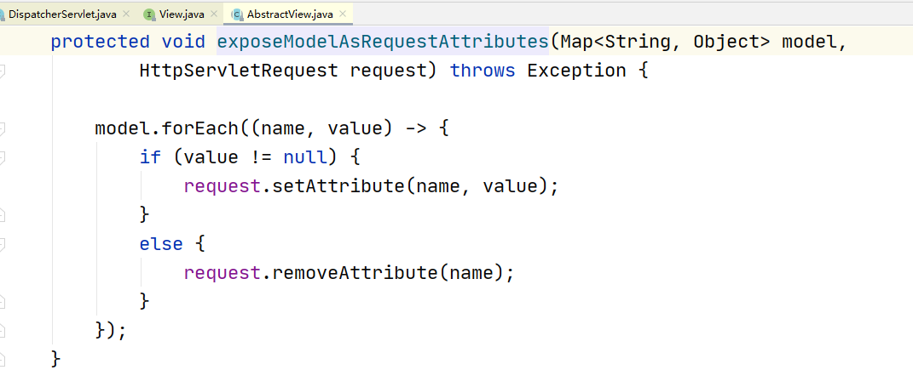
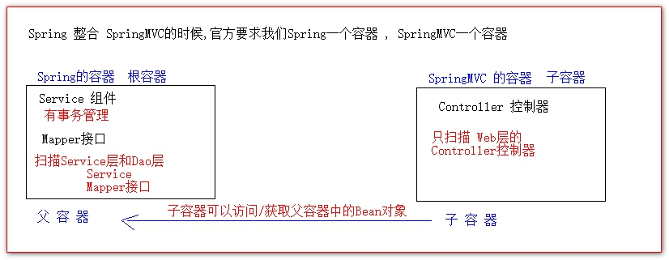

# 异常处理

## 目录

- [使用@ExceptionHandler 注解处理异常](#使用ExceptionHandler注解处理异常)
- [使用@ControllerAdvice 注解处理异常](#使用ControllerAdvice注解处理异常)
- [异常处理优先顺序](#异常处理优先顺序)
- [使用 SimpleMappingExceptionResolver 类映射异常跳转](#使用SimpleMappingExceptionResolver类映射异常跳转)
- [使用 ConversionService 进行类型转换(了解)](#使用ConversionService进行类型转换了解)
- [国际化(了解)](#国际化了解)
- [使用@ResponseBody 将返回的数据转成 json ( 重点 )](#使用ResponseBody将返回的数据转成json--重点-)
  - [使用的步骤如下：](#使用的步骤如下)
  - [Controller 中的代码：](#Controller中的代码)
  - [使用@RequestBody 接收 json 数据](#使用RequestBody接收json数据)
- [演示父子容器](#演示父子容器)

## 使用@ExceptionHandler 注解处理异常

@ExceptionHandler 注解标识的方法叫异常处理方法

它可以标识多个方法,异常类越精确,越优先调用.

```java
@Controller
public class LastController {
    /**
     * * @ExceptionHandler注解的方法会在Controller抛出异常时,自动调用<br/> 
     * *  1 处理异常 <br/> 
     * *  2 跳转到更友好的错误提示页面 (目标方法的跳转无效,使用异常方法的跳转) <br/> 
     */
    @ExceptionHandler
    public String exceptionHandler1(Exception exc) {
        System.out.println("exceptionHandler1 异常信息是: " + exc);
        return "error1";
    }
    /**
     *  * @ExceptionHandler注解的方法会在Controller抛出异常时,自动调用<br/> 
     * *  1 处理异常 <br/> 
     * *  2 跳转到更友好的错误提示页面 (目标方法的跳转无效,使用异常方法的跳转) <br/> 
     */
    @ExceptionHandler
    public String exceptionHandler2(RuntimeException exc) {
        System.out.println("exceptionHandler2 异常信息是: " + exc);
        return "error1";
    }
    /**
     *  * @ExceptionHandler注解的方法会在Controller抛出异常时,自动调用<br/> 
     * *  1 处理异常 <br/> 
     * *  2 跳转到更友好的错误提示页面 (目标方法的跳转无效,使用异常方法的跳转) <br/> 
     */
    @ExceptionHandler
    public String exceptionHandler3(ArithmeticException exc) {
        System.out.println("exceptionHandler3 异常信息是: " + exc);
        return "error1";
    }
    @RequestMapping(value = "/hello")
    public String hello() {
        System.out.println(" 这是hello方法() ");
        int i = 12 / 0;
        return "redirect:/index.jsp";
    }
}
```

## 使用@ControllerAdvice 注解处理异常

@ControllerAdvice 注解标识在 Controller 类上(放在 bean 上).

它可以让当前 Controller 中所有的异常处理方法改为全局异常处理方法

当有局部异常处理方法和全局异常处理方法同时存在时.他们的优先顺序是 : 局部优先 --->>> 精确优先



```java
@Controller
public class OneController {
    @RequestMapping(value = "/abc")
    public String hello() {
        System.out.println(" 这是abc方法() ");
        int i = 12 / 0;
        return "redirect:/index.jsp";
    }
}
```

## 异常处理优先顺序

在局部异常处理和全局异常处理同时存在的时候，优先顺序是：

1、局部优先 ---->>>> 2、精确优化

## 使用 SimpleMappingExceptionResolver 类映射异常跳转

```xml
<!--异常配置-->
<bean id="exceptionResolver" class="org.springframework.web.servlet.handler.SimpleMappingExceptionResolver">
    <property name="exceptionMappings">
        <props>
            <!-- 每一个prop标签表示一种类型的异常.和对应的一个错误跳转路径
                     key是具体的异常全类名
                     error1 , error2 , error3 是视图名( 跳转的路径 )
                -->
            <prop key="java.lang.Exception">error1</prop>
            <prop key="java.lang.RuntimeException">error2</prop>
            <prop key="java.lang.ArithmeticException">error3</prop>
        </props>
    </property>
</bean>
```

# 使用 ConversionService 进行类型转换(了解)

SpringMVC 接收参数的时候会默认做出类型转换

```java
public class StringToDateConvert implements Converter<String, Date> {
    @Override
    public Date convert(String s) {
        try {
            return new SimpleDateFormat("yyyy-MM-dd hh:mm:ss").parse(s);
        } catch (ParseException e) {
            e.printStackTrace();
        }
        return null;
    }
}
```

```xml
<bean id="conversionServiceFactoryBean" class="org.springframework.format.support.FormattingConversionServiceFactoryBean">
    <property name="converters">
        <set>
            <bean class="com.atguigu.convert.StringToDateConvert"/>
        </set>
    </property>
</bean>
<MVC:annotation-driven conversion-service="conversionServiceFactoryBean"/>
```

```java
@RequestMapping("param9")
public String param9(Date date){
    System.err.println(date+"==============");
    return "ok";
}
```

# 国际化(了解)

国际化（internationalization）是设计和制造容易适应不同区域要求的产品的一种方式。它要求从产品中抽离所有[地域](https://baike.baidu.com/item/%E5%9C%B0%E5%9F%9F/4437973 "地域")语言，国家/地区和文化相关的[元素](https://baike.baidu.com/item/%E5%85%83%E7%B4%A0/373563 "元素")。换言之，应用程序的功能和代码设计考虑在不同地区运行的需要，其[代码](https://baike.baidu.com/item/%E4%BB%A3%E7%A0%81/86048 "代码")简化了不同本地版本的生产。开发这样的程序的过程，就称为国际化。

1:编写配置文件



2:message_en_US.properties

```java
MESSAGE.TITLE = useEnglish
MESSAGE.USERNAME = UserName
MESSAGE.PASSWORD = PassWord
MESSAGE.LOGIN = Login
```

3:message_zh_CN.properties

```java
MESSAGE.TITLE = useChinese
MESSAGE.USERNAME = 用户名
MESSAGE.PASSWORD = 密码
MESSAGE.LOGIN = 登陆
```

4:编写配置

```xml
<!-- 存储区域设置信息
    SessionLocaleResolver类通过一个预定义会话名将区域化信息存储在会话中
    从session判断用户语言defaultLocale :默认语言-->
<bean id="localeResolver" class="org.springframework.web.servlet.i18n.SessionLocaleResolver">
    <property name="defaultLocale" value="zh_CN"/>
</bean>
<!-- 国际化资源文件
        messageSource配置的是国际化资源文件的路径，
        classpath:messages指的是classpath路径下的
        messages_zh_CN.properties文件和messages_en_US.properties文件
        设置"useCodeAsDefaultMessage“，默认为false，这样当Spring在ResourceBundle中找不到messageKey的话，就抛出NoSuchMessageException，
        把它设置为True，则找不到不会抛出异常，而是使用messageKey作为返回值。 -->
<bean id="messageSource" class="org.springframework.context.support.ReloadableResourceBundleMessageSource">
    <property name="defaultEncoding" value="UTF-8" />
    <property name="useCodeAsDefaultMessage" value="true" />
    <property name="basenames" >
        <list>
            <value>classpath:messages/message</value>
        </list>
    </property>
</bean>
<!--该拦截器通过名为“lang“的参数来拦截HTTP请求，使其重新设置页面的区域化信息-->
<mvc:interceptors>
    <mvc:interceptor>
        <mvc:mapping path="/login"/>
        <bean id="localeChangeInterceptor"
              class="org.springframework.web.servlet.i18n.LocaleChangeInterceptor">
            <property name="paramName" value="lang" />
        </bean>
    </mvc:interceptor>
</mvc:interceptors>
```

5:java

```java
@RequestMapping(value = "login")
public String login(){
    System.err.println("login");
    return "result";
}
```

6:index.jsp

```java
<a href="${pageContext.request.contextPath}/login?lang=zh_CN">中文</a><br/>
<a href="${pageContext.request.contextPath}/login?lang=en_US">英文</a><br/>
```

7:result.jsp

```java
<%@ page contentType="text/html;charset=UTF-8" language="java" %>
<%@taglib prefix="spring" uri="http://www.springframework.org/tags" %>
<html>
    <head>
        <title>Title</title>
    </head>
    <body>
        <div class="login">
            <h1><spring:message code="MESSAGE.TITLE" /> </h1>
            <form action="test.do" method="post">
                <input type="text" name="name" placeholder=<spring:message code="MESSAGE.USERNAME" /> required="required" value="" />
                <input type="password" name="password" placeholder=<spring:message code="MESSAGE.PASSWORD" /> required="required" value="" />
                <button type="submit" class="btn btn-primary btn-block btn-large"><spring:message code="MESSAGE.LOGIN" /> </button>
            </form>
        </div>
    </body>
</html>
```

# 使用@ResponseBody 将返回的数据转成 json ( 重点 )

json 的使用无法就两种情况,

1. 返回 json 数据
2. 接收 json 数据,转换为 Java 对象( )而我们在使用 json 的时候,一般大多是和 Ajax 请求一起使用.)

## 使用的步骤如下：

1、导入 json 相关的包到 web 工程中

- jackson-annotations-2.1.5.jar
- jackson-core-2.1.5.jar
- jackson-databind-2.1.5.jar

2、编写一个请求的方法接收请求，并返回数据对象

3、在方法上添加注解@ResponseBody 自动将返回值 json 化

## Controller 中的代码：

```java
@RestController == @Controller + @ResponseBody
@Controller
public class JsonController {
    @RequestMapping("/queryPersonById")
    public @ResponseBody
        Person queryPersonById(){
        System.err.println("queryPersonById");
        return new Person(100,"思密达");
    }
    @ResponseBody
    @RequestMapping(value = "/queryPersons")
    public List<Person> queryPersons() {
        System.out.println(" queryPersons() 方法调用了 ");
        List<Person> personList = new ArrayList<>();
        personList.add(new Person(1, "a"));
        personList.add(new Person(2, "b"));
        personList.add(new Person(3, "c"));
        personList.add(new Person(4, "d"));
        return personList;
    }
    @ResponseBody
    @RequestMapping(value = "/queryForMap")
    public Map<String, Object> queryForMap() {
        System.out.println(" queryForMap() 方法调用了 ");
        Map<String, Object> map = new HashMap<>();
        map.put("key1", "呵呵");
        map.put("key1", "嘻嘻");
        map.put("key1", true);
        map.put("key1", 100);
        map.put("key1", new Person(99, "哔哔"));
        return map;
    }
}
```

## 使用@RequestBody 接收 json 数据

1. @ResponseBody 负责告诉 SpringMVC 框架,将返回值的对象转换为 json 字符串
2. @RequestBody 负责告诉 SpringMVC 框架,将请求体的数据转换为 JavaBean 对象
3. ContentType:“application/json“ 和 @RequestBody 组合使用
4. ContentType:“application/json“ 表示发送的数据格式为 json 字符串

客户端页面的代码:

```html
<%@ page contentType="text/html;charset=UTF-8" language="java" %>
<html>
  <head>
    <title>Title</title>
    <script
      type="text/javascript"
      src="${pageContext.request.contextPath}/script/jquery-1.7.2.js"
    ></script>
    <script type="text/javascript">
      $(function () {
        //页面加载完毕之后
        $("#sendOne").click(function () {
          $.ajax({
            url: "${pageContext.request.contextPath}/savePerson",
            type: "post",
            data: JSON.stringify(jsonPerson),
            success: function (result) {
              /*成功的回调函数*/
              console.log(result);
            },
            dataType: "json" /*返回的数据类型*/,
            contentType: "application/json" /* 发json字符串给服务器,需要添加 */,
          });
        });
        $("#sendMore").click(function () {
          var jsonPersons = [
            { id: 100, name: "华仔" },
            { id: 100, name: "福利姬" },
          ]; //在js中中括号是数组,大括号是对象
          $.ajax({
            url: "${pageContext.request.contextPath}/savePersons",
            type: "post" /*请求方式   必须是post,服务器才能将json字符串转换为java对象*/,
            data: JSON.stringify(jsonPersons) /*发送给服务器的数据json字符串*/,
            success: function (result) {
              /*成功的回调函数*/
              console.log(result);
            },
            dataType: "json" /*返回的数据类型*/,
            contentType: "application/json" /* 发json字符串给服务器,需要添加 */,
          });
        });
      });
    </script>
  </head>
  <body>
     <a id="sendOne" href="#">发一个Java对象</a> <br />     <a
      id="sendMore"
      href="#"
      >发一个多个Java对象</a
    > <br /> 
  </body>
</html>
```

Controller 的代码:

```java
//当前请求必须是post
@RequestMapping(value = "/savePerson")
public Person savePerson(@RequestBody Person person) {
    System.out.println("保存person ==>> " + person);
    return person;
}
@RequestMapping(value = "/savePersons")
public List<Person> savePersons(@RequestBody List<Person> personList) {
    System.out.println(" 保存persons ==>> " + personList);
    return personList;
}
```

# 演示父子容器


