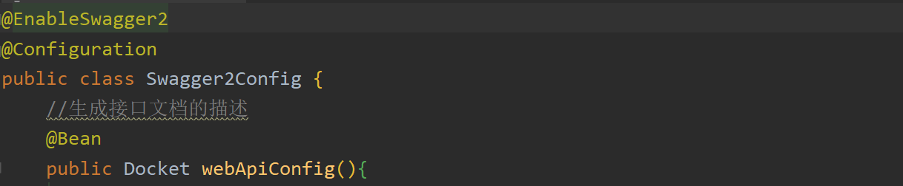
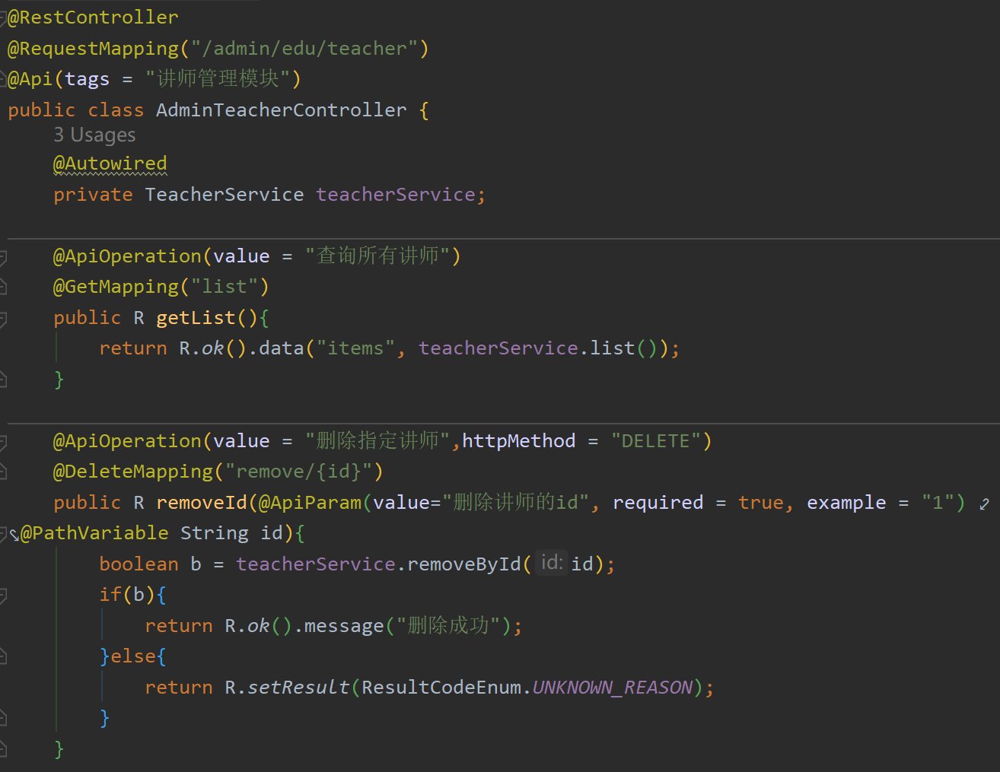
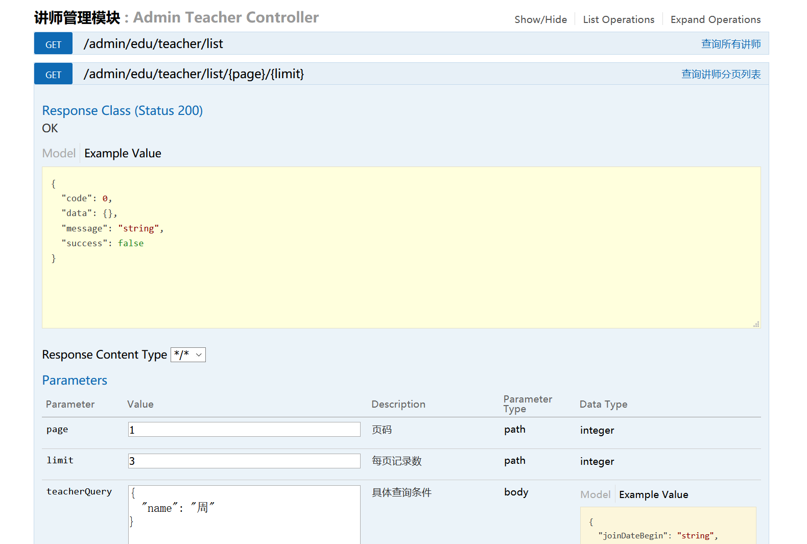
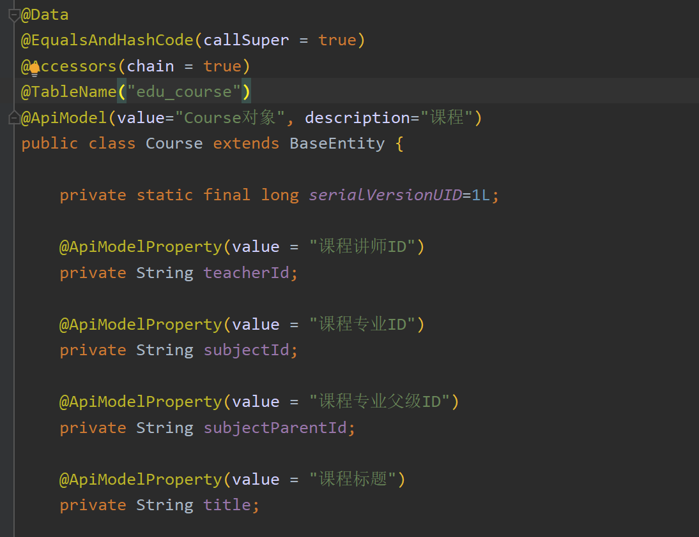

# Swagger

## 目录

- [Swagger 配置到 springboot](#Swagger配置到springboot)
- [Swagger 常用注解](#Swagger常用注解)

Swagger 可以用来自动生成 webapi 接口文档，并对接口进行单独测试

#### Swagger 配置到 springboot

添加依赖

```text
<dependency>
    <groupId>io.springfox</groupId>
    <artifactId>springfox-swagger2</artifactId>
</dependency>
<dependency>
    <groupId>io.springfox</groupId>
    <artifactId>springfox-swagger-ui</artifactId>
</dependency>
```

在配置类加入@enableSwagger2



配置 Swagger 配置类，生成接口文档的描述

```java
@EnableSwagger2
@Configuration
public class Swagger2Config {
    //生成接口文档的描述
    @Bean
    public Docket webApiConfig(){

        return new Docket(DocumentationType.SWAGGER_2)
                .groupName("webApi")
                .apiInfo(webApiInfo())
                .select()
                //只显示api路径下的页面
                .paths(Predicates.and(PathSelectors.regex("/api/.*")))
                .build();

    }

    @Bean
    public Docket adminApiConfig(){

        return new Docket(DocumentationType.SWAGGER_2)
                .groupName("adminApi")
                .apiInfo(adminApiInfo())
                .select()
                //只显示admin路径下的页面
                .paths(Predicates.and(PathSelectors.regex("/admin/.*")))
                .build();

    }

    private ApiInfo webApiInfo(){

        return new ApiInfoBuilder()
                .title("网站-API文档")
                .description("本文档描述了网站微服务接口定义")
                .version("1.0")
                .contact(new Contact("Atguigu", "http://atguigu.com", "xg114747411@126.com"))
                .build();
    }

    private ApiInfo adminApiInfo(){

        return new ApiInfoBuilder()
                .title("后台管理系统-API文档")
                .description("本文档描述了后台管理系统微服务接口定义")
                .version("1.0")
                .contact(new Contact("Atguigu", "http://atguigu.com", "xg114747411@126.com"))
                .build();
    }
}
```

#### Swagger 常用注解

Api

注释在 controller 类上

ApiOperation

注释在 controller 类里的 handle 方法上

ApiParam

注释在 controller 类里的 handle 方法的参数上





ApiModel

注释在 entity 类上

ApiModelProperty

注释 entity 属性上



Swagger2 的一些注意事项

Swagger2 在使用 json 数据传输时，正确传输，使用 PostMapperh 注解
