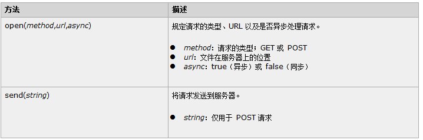
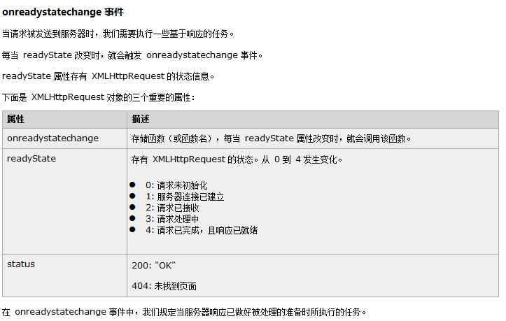

# 原生 AJAX 使用(js 中的使用)

AJAX 要处理对服务器的请求和响应首先需要创建 XHR 对象调用

请求：需要调用 open 和 send 方法把信息发送给服务器

- Get 和 Post 请求

  与 POST 相比，GET 更简单也更快，并且在大部分情况下都能用。

  然而，在以下情况中，请使用 POST 请求：

  - 无法使用缓存文件（更新服务器上的文件或数据库）
  - 向服务器发送大量数据（POST 没有数据量限制）
  - 发送包含未知字符的用户输入时，POST 比 GET 更稳定也更可靠



响应：需要给 SHR 对象绑定**onreadystatechange 事件，并且判断服务器和网页状态。** 如果状态正确，调用 responseText 方法获取响应数据



AJAX 在 html 中和服务器交互

```html
<!DOCTYPE html PUBLIC "-//W3C//DTD HTML 4.01 Transitional//EN" "http://www.w3.org/TR/html4/loose.dtd">
<html>
  <head>
    <meta http-equiv="pragma" content="no-cache" />
    <meta http-equiv="cache-control" content="no-cache" />
    <meta http-equiv="Expires" content="0" />
    <meta http-equiv="Content-Type" content="text/html; charset=UTF-8" />
    <title>Ajax请求示例</title>
    <script type="text/javascript">
      function ajaxRequest() {
        //              1、我们首先要创建XMLHttpRequest
        var xhr = new XMLHttpRequest();
        //              2、调用open方法设置请求参数
        xhr.open(
          "GET",
          "http://localhost:8080/16_json_ajax_i18n/ajaxServlet?action=javaScriptAjax",
          true
        );
        //              4、在send方法前绑定onreadystatechange事件，处理请求完成后的操作。
        xhr.onreadystatechange = function () {
          // 要同时判断两个值,才可以获取响应信息
          if (xhr.readyState == 4 && xhr.status == 200) {
            // alert( xhr.responseText );
            // document.getElementById("div01").innerHTML = xhr.responseText;
            // 把服务器返回的数据转换为json对象
            var jsonObj = JSON.parse(xhr.responseText);
            document.getElementById("div01").innerHTML =
              "编号:" + jsonObj.id + " , 姓名:" + jsonObj.name;
          }
        };
        //     3、调用send方法发送请求
        xhr.send();
      }
    </script>
  </head>
  <body>
    <button onclick="ajaxRequest()">ajax request</button>
    <div id="div01"></div>
  </body>
</html>
```

服务器

```java
@WebServlet(name = "AjaxServlet",value = "/ajaxServlet")
public class AjaxServlet extends BaseServlet {
    /**
     * 表示我们演示的第一个Ajax请求的方法
     * @param request
     * @param response
     * @throws ServletException
     * @throws IOException
     */
    protected void javaScriptAjax(HttpServletRequest request, HttpServletResponse response) throws ServletException, IOException {
        System.out.println("ajax 兄弟,你来了!!!");

        Person person = new Person(1,"0211.你们好帅!");
        // 先把要返回的数据转为json字符串
        Gson gson = new Gson();
        String json = gson.toJson(person);
        response.getWriter().write(json);

    }
}

```
