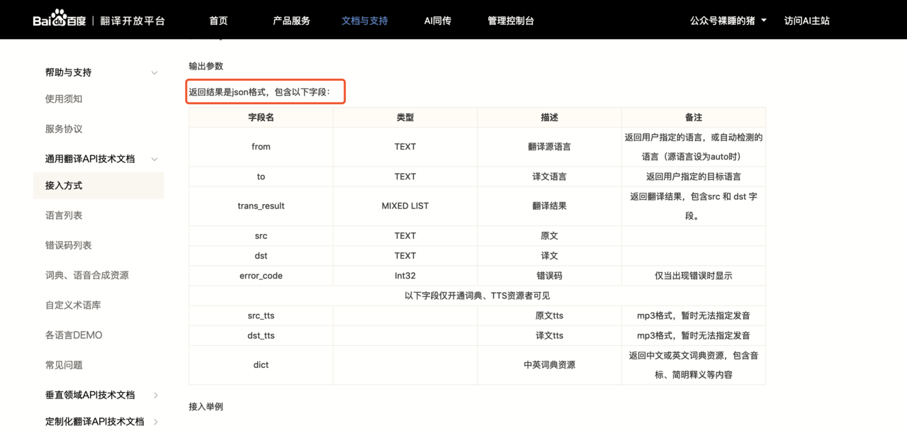

# json应用场景

## 目录

- [应用场景:](#应用场景)
- [1.接口返回数据](#1接口返回数据)
- [2.序列化](#2序列化)
- [3.生成Token](#3生成Token)
- [4.配置文件](#4配置文件)

### [应用场景](https://www.lagou.com/lgeduarticle/76438.html "应用场景"):

### 1.接口返回数据

JSON用的最多的地方莫过于Web了，现在的数据接口基本上都是返回的JSON，具体细化的场景有：

1. Ajxa异步访问数据
2. RPC远程调用
3. 前后端分离后端返回的数据
4. 开放API，如百度、高德等一些开放接口
5. 企业间合作接口

这种API接口一般都会提供一个接口文档，说明接口的入参、出参等，

一般的接口返回数据都会封装成JSON格式，比如类似下面这种



```json
{
"code": 1,

"msg": "success",

"data": {

    "name": "pig",

    "age": "18",

    "sex": "man",

    "hometown": {

        "province": "江西省",

        "city": "抚州市",

        "county": "崇仁县"

    }

}
}
```


### 2.序列化

程序在运行时所有的变量都是保存在内存当中的，如果出现程序重启或者机器宕机的情况，那这些数据就丢失了。一般情况运行时变量并不是那么重要丢了就丢了，但有些内存中的数据是需要保存起来供下次程序或者其他程序使用。

保存内存中的数据要么保存在数据库，要么保存直接到文件中，而**将内存中的数据变成可保存或可传输的数据的过程叫做序列化**，在Python中叫pickling，在其他语言中也被称之为serialization，marshalling，flattening等等，都是一个意思。

正常的序列化是将编程语言中的**对象直接转成可保存或可传输的，这样会保存对象的类型信息，而JSON序列化则不会保留对象类型！**

为了让大家更直观的感受区别，猪哥用代码做一个测试，大家一目了然

1. Python对象直接序列化会保存class信息，下次使用loads加载到内存时直接变成Python对象。
2. JSON对象序列化只保存属性数据，不保留class信息，下次使用loads加载到内存可以直接转成dict对象，当然也可以转为Person对象，但是需要写辅助方法。


对于JSON序列化不能保存class信息的特点，那JSON序列化还有什么用？答案是当然游有用，对于不同编程语言序列化读取有用，比如：**我用Python爬取数据然后转成对象，现在我需要将它序列化磁盘，然后使用Java语言读取这份数据，这个时候由于跨语言数据类型不同，所以就需要用到JSON序列化。**

存在即合理，两种序列化可根据需求自行选择！

### 3.生成Token

首先声明Token的形式多种多样，有JSON、字符串、数字等等，只要能满足需求即可，没有规定用哪种形式。

JSON格式的Token最有代表性的莫过于JWT（JSON Web Tokens）。


随着技术的发展，分布式web应用的普及，通过Session管理用户登录状态成本越来越高，因此慢慢发展成为Token的方式做登录身份校验，然后通过Token去取Redis中的缓存的用户信息，随着之后JWT的出现，校验方式更加简单便捷化，无需通过Redis缓存，而是直接根据Token取出保存的用户信息，以及对Token可用性校验，单点登录更为简单。


猪哥也曾经使用JWT做过app的登录系统，大概的流程就是：

1. 用户输入用户名密码
2. app请求登录中心验证用户名密码
3. 如果验证通过则生成一个Token，其中Token中包含：用户的uid、Token过期时间、过期延期时间等，然后返回给app
4. app获得Token，保存在cookie中，下次请求其他服务则带上
5. 其他服务获取到Token之后调用登录中心接口验证
6. 验证通过则响应

JWT登录认证有哪些优势：

1. 性能好：服务器不需要保存大量的session
2. 单点登录（登录一个应用，同一个企业的其他应用都可以访问）：使用JWT做一个登录中心基本搞定，很容易实现。
3. 兼容性好：支持移动设备，支持跨程序调用，Cookie 是不允许垮域访问的，而 Token 则不存在这个问题。
4. 安全性好：因为有签名，所以JWT可以防止被篡改。

更多JWT相关知识自行在网上学习，本文不过多介绍！

### 4.配置文件

说实话JSON作为配置文件使用场景并不多，最具代表性的就是npm的package.json包管理配置文件了，下面就是一个npm的package.json配置文件内容。

```json
{

"name": "server",       //项目名称

"version": "0.0.0",

"private": true,

"main": "server.js",   //项目入口地址，即执行npm后会执行的项目

"scripts": {

    "start": "node ./bin/www"  ///scripts指定了运行脚本命令的npm命令行缩写

},

"dependencies": {

    "cookie-parser": "~1.4.3",  //指定项目开发所需的模块

    "debug": "~2.6.9",

    "express": "~4.16.0",

    "http-errors": "~1.6.2",

    "jade": "~1.11.0",

    "morgan": "~1.9.0"

}
}
```


但其实**JSON并不合适做配置文件，因为它不能写注释、作为配置文件的可读性差等原因。**

配置文件的格式有很多种如：toml、yaml、xml、ini等，目前很多地方开始使用yaml作为配置文件。
