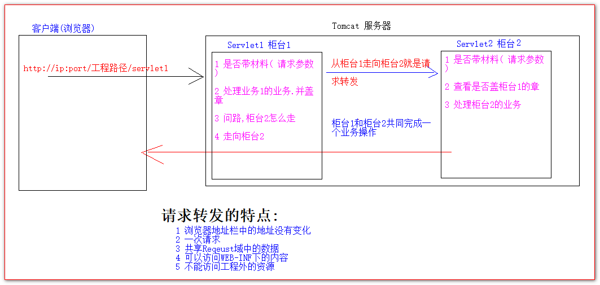
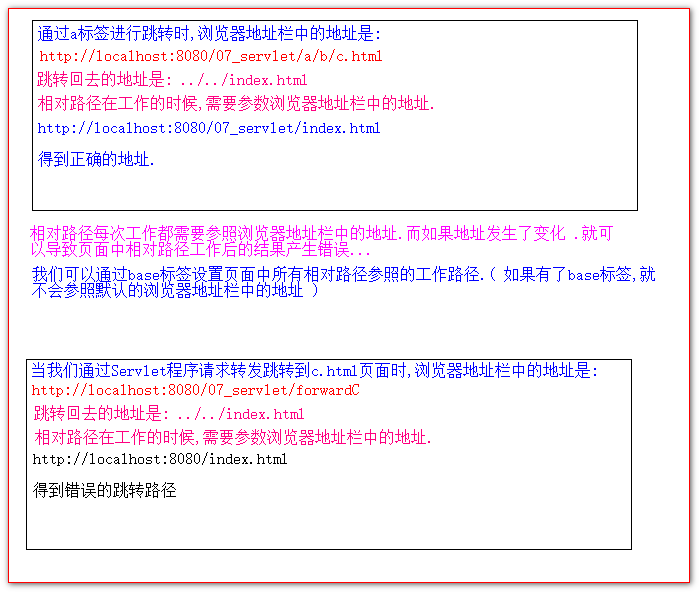

# HttpServletRequest 类

## 目录

- [HttpServletRequest 类有什么作用。](#HttpServletRequest类有什么作用)
- [HttpServletRequest 类的常用方法](#HttpServletRequest类的常用方法)
- [如何获取请求参数](#如何获取请求参数)
- [GET 请求的中文乱码解决](#GET请求的中文乱码解决)
- [POST 请求的中文乱码解决](#POST请求的中文乱码解决)
  - [请求乱码：](#请求乱码)
- [请求的转发(不能到别的服务器)](#请求的转发不能到别的服务器)
- [base 标签的作用](#base标签的作用)
- [Web 中的相对路径和绝对路径](#Web中的相对路径和绝对路径)
- [web 中/斜杠的不同意义](#web中斜杠的不同意义)

## HttpServletRequest 类有什么作用。

HttpServletRequest 对象表示请求的所有信息.

每次只要有请求进入 Tomcat 服务器, 服务器都会创建一个 HttpServletRequest 对象.

Tomcat 服务器会把 请求过来的 HTTP 协议内容. 解析好,封装到 HttpServletRequest 对象中.

我们可以通过 HttpServletReqeust 对象获取到请求过来的信息.

## HttpServletRequest 类的常用方法

1. getRequestURI() 获取请求的资源路径
2. getRequestURL() 获取请求的统一资源定位符( 绝对路径 )
3. getRemoteHost() 获取远程的主机 ( 客户端 ip )
4. getHeader() 获取请求头
5. getParameter() 获取请求的参数值
6. getParameterValues() 获取请求的参数值( 多个值的情况 )
7. getMethod() 获取请求的方式 GET 或 POST 域对象
8. setAttribute(key, value); 保存域数据——getAttribute(key); 获取域数据
9. getRequestDispatcher() 获取请求转发对象.

```java
@WebServlet(value = "/reqeustAPIServlet")
public class ReqeustAPIServlet extends HttpServlet {

    protected void doGet(HttpServletRequest request, HttpServletResponse response) throws ServletException, IOException {
//        i.getRequestURI()                获取请求的资源路径
        System.out.println(request.getRequestURI());
//        ii.getRequestURL()               获取请求的统一资源定位符( 绝对路径 )
        System.out.println( request.getRequestURL() );
//        iii.getRemoteHost()           获取远程的主机 ( 客户端ip )
        /**
         * 如果访问服务器时ip是:localhost,则客户端ip是:0:0:0:0:0:0:0:1 <br/>
         * 如果访问服务器时ip是:127.0.0.1,则客户端ip是:127.0.0.1 <br/>
         * 如果访问服务器时,ip是真实ip.则可以得到真实客户端地址 <br/>
         */
        System.out.println( request.getRemoteHost() );
//        iv.getHeader()                  获取请求头
        System.out.println(request.getHeader("Host"));
        System.out.println(request.getHeader("Accept"));
        System.out.println(request.getHeader("User-Agent"));
//        vii.getMethod()              获取请求的方式GET或POST
        System.out.println( request.getMethod() );

    }
}

```

## 如何获取请求参数

form 表单的代码:

```java
<form action="http://localhost:8080/07_servlet/paramServlet" method="get">
    用户名:<input type="text" name="username" id="username"> <br>
    密  码:<input type="password" name="password" id="password"> <br>
    兴趣爱好:
        <input type="checkbox" name="hobby" value="java"> java
        <input type="checkbox" name="hobby" value="cpp"> C++
        <input type="checkbox" name="hobby" value="js"> javaScript <br>
    <input type="submit" value="提交">
</form>

```

Servlet 程序的代码:

```java
@WebServlet(value = "/paramServlet")
public class ParamServlet extends HttpServlet {

    protected void doGet(HttpServletRequest request, HttpServletResponse response) throws ServletException, IOException {
        // 获取表单项username的参数值
        String username = request.getParameter("username");
        String password = request.getParameter("password");
        String[] hobby = request.getParameterValues("hobby");

        System.out.println(" 用户名 => " + username);
        System.out.println(" 密码 => " + password);
        System.out.println(" 兴趣爱好 => " + Arrays.asList(hobby));

    }
}

```

## GET 请求的中文乱码解决

在 Tomcat8.0 之前 GET 请求,如果得到的值是中文,会有乱码问题.

在 Tomcat8.0 之后,就再没有 GET 请求的中文乱码问题

## POST 请求的中文乱码解决

```java
// 解决post请求的中文乱码
// 设置请求体的字符集
// 这个api一定要在获取请求参数之前或得到流之前调用才有效
request.setCharacterEncoding("UTF-8");

```

#### 请求乱码：

请求的数据和解析的方式不匹配，更换字符编码

## 请求的转发(不能到别的服务器)

请求转发是指服务器由多个资源共同完成一个业务操作.

一资源收到请求后.跳转到另一个资源去执行.叫请求转发



Servlet1 代码:

```java
@WebServlet(value = "/servlet1")
public class Servlet1 extends HttpServlet {

    protected void doGet(HttpServletRequest request, HttpServletResponse response) throws ServletException, IOException {
        //1 查看材料(请求参数)
        String username = request.getParameter("username");
        System.out.println("柜台1, 查看材料 ==>> " + username);
        //2 盖柜台1的章
        request.setAttribute("key","柜台1的章");
        request.setAttribute("key1","随便");
        //3 问路, Servlet2(柜台2)怎么走
        /**
         * 请求转发的路径( 地址 )要以斜杠/打头,表示http://ip:port/工程路径/  映射代码的web目录
         */
        RequestDispatcher requestDispatcher = request.getRequestDispatcher("/servlet2");
//        RequestDispatcher requestDispatcher = request.getRequestDispatcher("http://www.baidu.com");
        System.out.println(" 得到柜台2的路径 ==>> " + requestDispatcher);
        //4 走向柜台2
        requestDispatcher.forward(request,response);
    }
}

```

Servlet2 代码:

```java
@WebServlet(value = "/servlet2")
public class Servlet2 extends HttpServlet {

    protected void doGet(HttpServletRequest request, HttpServletResponse response) throws ServletException, IOException {
        // 查看材料
        String username = request.getParameter("username");
        System.out.println(" 柜台2 查看材料 => " + username);
        // 看柜台1有没有盖章
        Object requestAttribute = request.getAttribute("key");
        Object requestAttribute1 = request.getAttribute("key1");
        System.out.println("柜台1的章是 => " + requestAttribute);
        System.out.println("柜台1的章是 => " + requestAttribute1);
        System.out.println(" 处理柜台2的业务,完成整个内容 ");
    }
}

```

## base 标签的作用



## Web 中的相对路径和绝对路径

相对路径是 :

. 表示当前目录

.. 表示上一级目录

资源名 表示当前目录/资源名 相当于./资源名, ./可以省略

绝对路径是:

[http://ip](http://ip "http://ip"):port/工程路径/资源路径

在开发的时候不要简单的使用相对路径.

开发的时候只允许使用绝对路径.

1 [http://ip:port/工程路径/资源路径](http://ip:port/%E5%B7%A5%E7%A8%8B%E8%B7%AF%E5%BE%84/%E8%B5%84%E6%BA%90%E8%B7%AF%E5%BE%84 "http://ip:port/工程路径/资源路径")

2 base 标签+相对.

3 斜杠打头的地址是绝对路径.

## web 中/斜杠的不同意义

在 web 中,斜杠打头的地址是绝对路径.

1. 被服务器解析得到的绝对路径是: [http://ip:port/工程路径/](http://ip:port/%E5%B7%A5%E7%A8%8B%E8%B7%AF%E5%BE%84/ "http://ip:port/工程路径/")

   比如:

   1 <**url-pattern**>/hello\</**url-pattern**>

   **2 getRealPath("/")**

   **3 getRequestDispatcher("/servlet2")**

2. 如果是被浏览器解析.得到的绝对路径是 : [http://ip:port](http://ip:port "http://ip:port")

   比如:

   1 **\<a href="/"**>斜杠\</**a**>

有一个特殊的情况:

response.sendredirect("/”); 把斜杠发送给浏览器解析. [http://ip:port](http://ip:port "http://ip:port")
