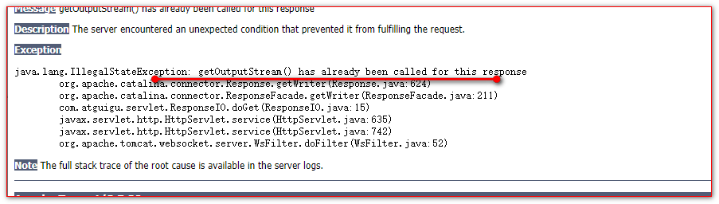
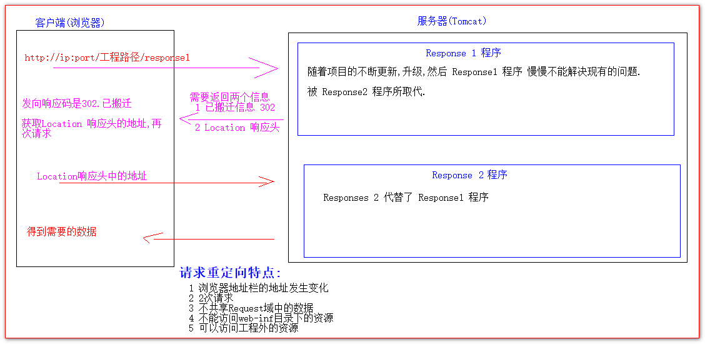

# HttpServletResponse类

## 目录

- [HttpServletResponse类的作用](#HttpServletResponse类的作用)
- [两个输出流的说明。](#两个输出流的说明)
- [如何往客户端回传数据](#如何往客户端回传数据)
- [响应的乱码解决](#响应的乱码解决)
- [请求重定向(可以指向外网)](#请求重定向可以指向外网)

## HttpServletResponse类的作用

HttpServletResponose类表示响应,当每次请求进来的时候Tomcat服务器,不仅创建一个HttpServletRequest对象,还创建一个HttpServletResponse对象实例.并传递到service() 方法中给程序员使用.

所有返回给客户的内容都可以通过HttpServletResponse对象来进行设置.

请求和响应是成对出现的.

## 两个输出流的说明。

字节流 : response.getOutputStream(); 返回二进制数据( 文件下载 )

字符流 : response.getWriter(); 返回字符串

两个流互斥. 只能使用一个,使用了字符流,就不要再使用字节流.使用字节流,就不能再获取字符流使用.

如果同时使用两个流,就会报错.



## 如何往客户端回传数据

需要 : 给客户端回传字符串

```java
@WebServlet(value = "/responseIO")
public class ResponseIO extends HttpServlet {

    protected void doGet(HttpServletRequest request, HttpServletResponse response) throws ServletException, IOException {
        PrintWriter writer = response.getWriter();
//        需要 : 给客户端回传字符串
        writer.write(" this is the content of responseIO! ");
    }
}

```


## [响应的乱码解决](https://www.cnblogs.com/callmegaga/p/9640087.html "响应的乱码解决")

```java
方案一 ( 不推荐使用 )
//设置服务器，响应字符集为ＵＴＦ－８
response.setCharacterEncoding("UTF-8");
// 通过响应设置客户端也使用UTF-8字符集
// Content-Type 是返回的数据类型是啥
// text/html; charset=UTF-8 表示返回的是html字符串,使用的是UTF-8
response.setHeader("Content-Type","text/html; charset=UTF-8");

方案二( 推荐使用 )

// 设置服务器响应的字符集为UTF-8,还同时设置响应头Content-Type的值
// 一定要在获取流之前调用才有效
response.setContentType("text/html; charset=UTF-8");

```


响应的乱码：

浏览器解析数据的字符集和发送数据的编码类型不匹配，设置浏览器的解析方式

## 请求重定向(可以指向外网)

请求重定向是指客户端请求了一次服务器之后,服务器告诉客户端说,你当前这个请求已经失效,你需要去请求一个新的地址,然后客户端又按照服务器指定的新地址再一次发起请求.叫请求重定向.

```java
  方案一:

// 告诉人家 已搬迁
response.setStatus(302); // 设置响应码 302 表示已搬家
// 设置响应头
response.setHeader("Location","http://localhost:8080/07_servlet/response2");

  方案二:
  // 请求重定向
response.sendRedirect("http://localhost:8080/07_servlet/response2");

```



