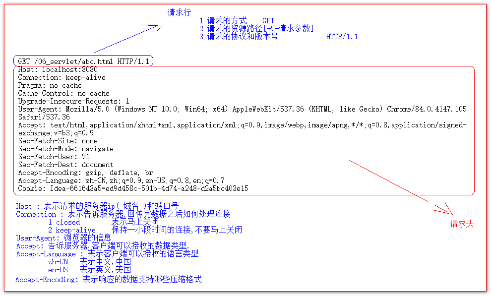
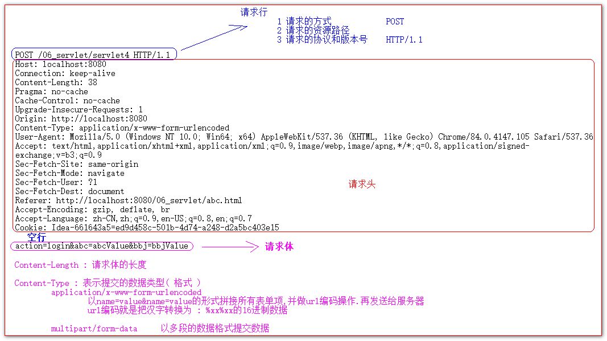
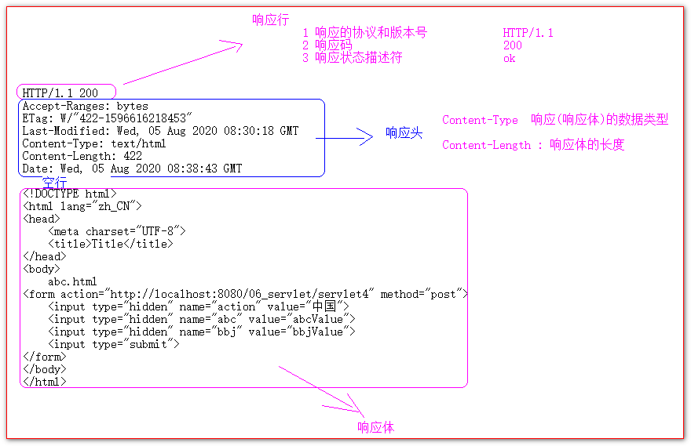
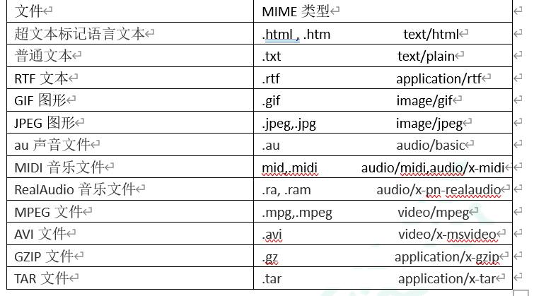

# Http 协议

## 目录

- [什么是 HTTP 协议](#什么是HTTP协议)
- [请求的 HTTP 协议格式](#请求的HTTP协议格式)
  - [GET 请求](#GET请求)
  - [POST 请求](#POST请求)
  - [常用请求头的说明](#常用请求头的说明)
  - [哪些是 GET 请求，哪些是 POST 请求](#哪些是GET请求哪些是POST请求)
  - [响应的 HTTP 协议格式](#响应的HTTP协议格式)
  - [常用的响应码说明](#常用的响应码说明)
  - [MIME 类型说明](#MIME类型说明)

## 什么是 HTTP 协议

什么协议?

双方,或者多方相互约定好的规则,这些规则大家都需要遵守,这些规则叫协议 .

什么是 http 协议?

http 协议 是指客户端的服务器之间相互通信时,发送的数据,需要遵守的规则叫 http 协议.

http 协议中的数据我们又习惯性的叫报文.

## 请求的 HTTP 协议格式

客户端给服务器发送数据叫请求

服务器给客户端回传数据叫响应.

所以 http 协议又分为请求协议 和 响应协议

请求又分为 GET 请求,和 POST 请求.

### GET 请求

GET 请求的 http 协议 由两分部组成

1 请求行

- 1\. 请求的方式 GET
  1. 请求的资源路径+\[?+请求参数]
  2. 请求的协议和版本号 HTTP/1.1

2 请求头

key : value&#x20;

不同的请求头,有其不同的含义

### POST 请求

1 请求行

- 1\. 请求的方式 POST
  1. 请求的资源路径\[+?+请求参数]
  2. 请求的协议和版本号 HTTP/1.1

2 请求头

key : value 不同的请求头,有其不同的含义

**空行**

3 请求体

发送给服务器的数据 ( 请求参数 或 上传的数据&#x20;

)

### 常用请求头的说明

Host 表示服务器的域名,ip,或端口号

User-Agent 浏览器的信息

Connection 如何处理连接

Accept 客户端可以接收的数据类型

Accept-Language 客户端接收的语言类型

### 哪些是 GET 请求，哪些是 POST 请求

哪些是 GET 请求

1 form 标签 method=get

2 a 标签是 get 请求

3 script 标签引入 js

4 link 标签引入 css

5 img 标签引入图片

6 iframe 引入页面

7 在浏览器地址栏中输入地址敲回车

哪些是 POST 请求

1 form 标签 method=post

### 响应的 HTTP 协议格式

1 响应行

1 响应协议 HTTP/1.1

2 响应码 数字

3 响应状态描述符 对前面数字的描述 ( 可省略 )

2 响应头

key : value 不同的响应头,有不同的含义

空行

3 响应体

返回给客户端的数据

### 常用的响应码说明

200 表示请求成功

302 表示请求重定向 ( 明天讲 )

404 表示请求服务器已经收到,但是请求的资源不存在

500 表示请求服务器已经收到,但是服务器内部错误.

### MIME 类型说明

MIME 是 HTTP 协议中数据类型。

MIME 的英文全称是"Multipurpose Internet Mail Extensions" 多功能 Internet 邮件扩充服务。MIME 类型的格式是

"大类型/小类型“，并与某一种文件的扩展名相对应。

常见的 MIME 类型：

