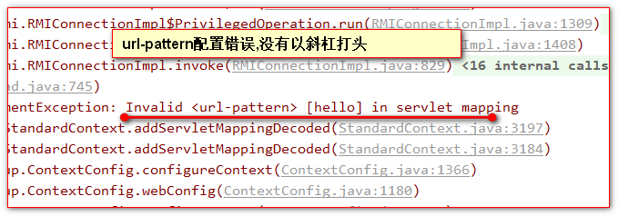
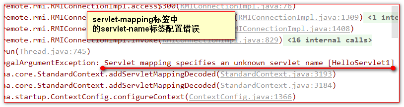
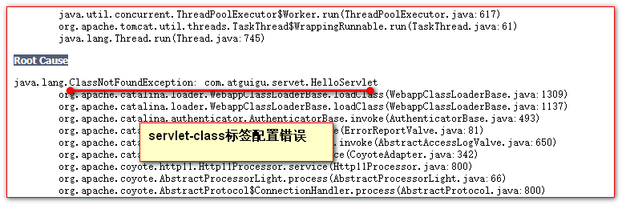
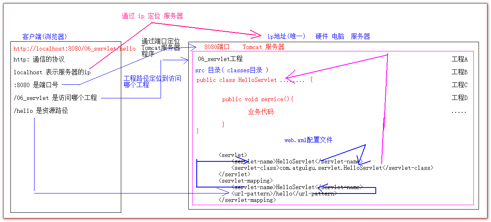
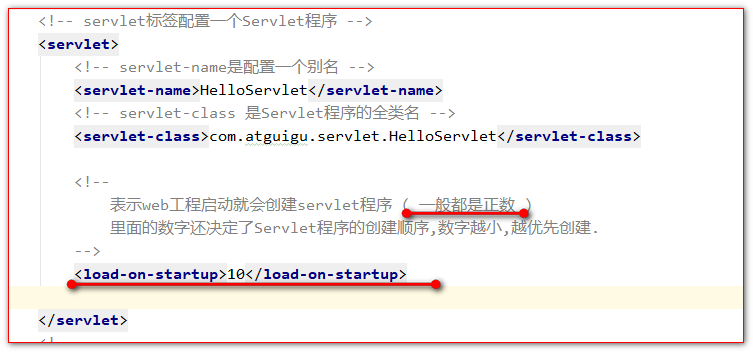
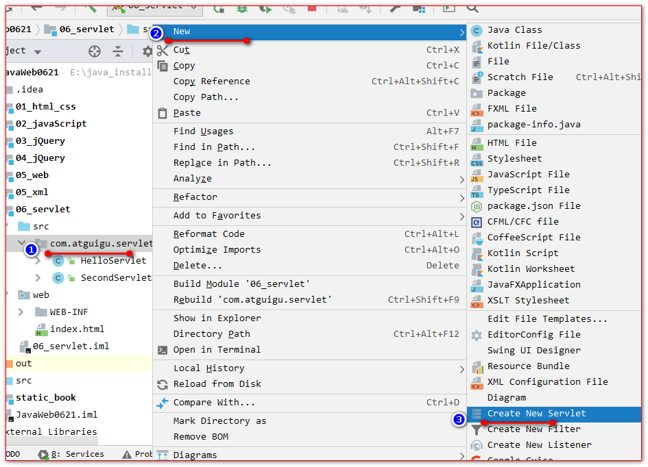
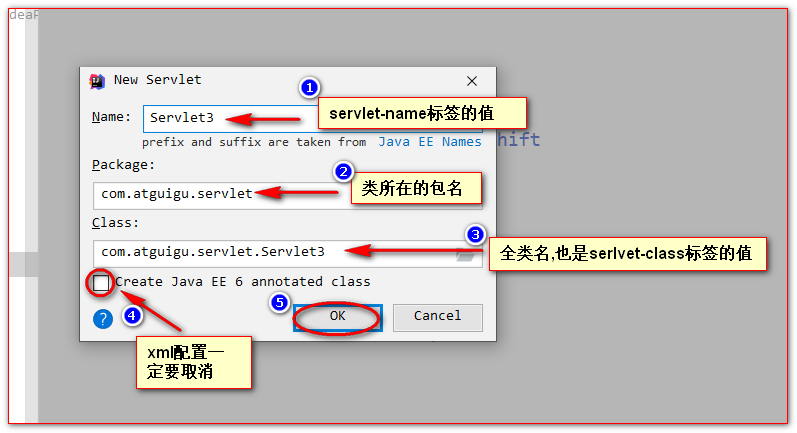
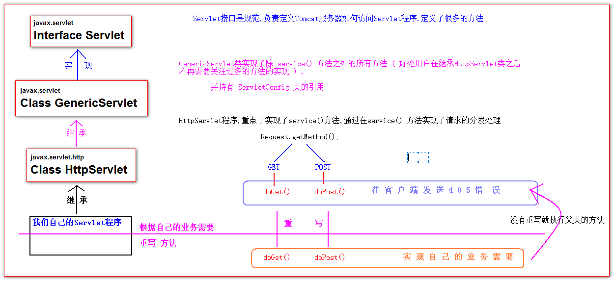
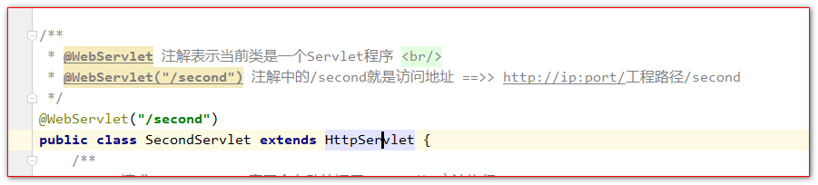

# Servlet

## 目录

- [Servlet技术](#Servlet技术)
  - [什么是Servlet](#什么是Servlet)
  - [手动实现Servlet程序](#手动实现Servlet程序)
  - [url地址到Servlet程序的访问](#url地址到Servlet程序的访问)
  - [Servlet的生命周期(重要)](#Servlet的生命周期重要)
  - [GET和POST请求的分发处理](#GET和POST请求的分发处理)
  - [通过继承HttpServlet实现Servlet程序](#通过继承HttpServlet实现Servlet程序)
  - [使用IDEA创建Servlet程序](#使用IDEA创建Servlet程序)
  - [Servlet类的继承体系](#Servlet类的继承体系)
  - [JavaEE3.0规范：注解配置Servlet程序](#JavaEE30规范注解配置Servlet程序)
- [Servlet涉及到的类](#Servlet涉及到的类)

# Servlet技术

## 什么是Servlet

1 Servlet是一个接口,是JavaEE的规范之一.

2 Servlet 是 JavaWeb的三大组件之一. 三大组件分别是: Servlet程序, Filter过滤器, Listener监听器.

3 Servlet是运行在服务器上的一个java小程序 . 它可以接收客户端发送过来的请求,并响应数据.

## 手动实现Servlet程序

1 编写一个类去实现Servlet接口

2 实现 service() 业务方法

3 到web.xml中去配置Servlet程序的访问地址.

Servlet程序的代码:

```java
public class HelloServlet implements Servlet {  
    /**  
        - service() 是每次请求进来的时候,都会调用的方法.  
        */  
    @Override  
    public void service(ServletRequest servletRequest, ServletResponse servletResponse) throws ServletException, IOException {  
        System.out.println(" 你来了 HelloServlet ");  
    }  
}
```


到web.xml中的配置:

```xml
<?xml version="1.0" encoding="UTF-8"?>
<web-app xmlns="http://xmlns.jcp.org/xml/ns/javaee"
         xmlns:xsi="http://www.w3.org/2001/XMLSchema-instance"
         xsi:schemaLocation="http://xmlns.jcp.org/xml/ns/javaee http://xmlns.jcp.org/xml/ns/javaee/web-app_4_0.xsd"
         version="4.0">
    <!-- servlet标签配置一个Servlet程序 -->
    <servlet>
        <!-- servlet-name是配置一个别名 -->
        <servlet-name>HelloServlet</servlet-name>
        <!-- servlet-class 是Servlet程序的全类名 -->
        <servlet-class>com.atguigu.servlet.HelloServlet</servlet-class>
    </servlet>
    <!--
        servlet-mapping标签就是给Servlet程序映射一个访问地址
     -->
    <servlet-mapping>
        <!--
            servlet-name给哪个Servlet程序配置访问地址
        -->
        <servlet-name>HelloServlet</servlet-name>
        <!--
            url-pattern标签是配置访问地址
            / 在服务器中表示地址为: http://ip:port/工程路径/
            /hello 表示地址为: http://ip:port/工程路径/hello
        -->
        <url-pattern>/hello</url-pattern>
    </servlet-mapping>

</web-app>

```


Servlet程序配置上常见的错误有:

一 url-patter请求地址配置错误



二: servlet-mapping标签中的servlet-name标签配置错误



三:servlet-class标签全类名配置错误:



## url地址到Servlet程序的访问



## Servlet的生命周期(重要)

生命周期是指从创建Servlet程序,到Servlet程序被销毁叫生命周期( 中间顺序执行的几个方法 )

1 Servlet程序的构造器方法

2 执行 init(ServletConfig) 初始化方法

第1,2步,是在我们第一次访问Servlet程序的时候执行.( 单例 )

3 执行 service() 业务方法

每次访问都会执行.

4 执行 destory 销毁方法

在web工程停止的时候

\<load-on-startup>1\</load-on-startup>标签作用

可以在servlet标签中进行配置.从而改变 Servlet&#x20;

程序从第一次访问被创建到web工程启动就自动创建.



## GET和POST请求的分发处理

```java
public class HelloServlet implements Servlet {
    /**
     * service() 是每次请求进来的时候,都会调用的方法.
     */
    @Override
    public void service(ServletRequest servletRequest, ServletResponse servletResponse) throws ServletException, IOException {
        System.out.println("3 service() 你来了 HelloServlet ");
        // 如何在service方法中处理不同的业务请求 GET和POST

        HttpServletRequest httpServletRequest = (HttpServletRequest) servletRequest;
        // 先知道请求是GET,还是POST
        String method = httpServletRequest.getMethod();
        if ("GET".equals(method)) {
            doGet();
        } else if ("POST".equals(method)) {
            doPost();
        }
    }
    public void doGet(){
        System.out.println("get doGet 请求的业务");
    }
    public void doPost(){
        System.out.println("POST doPost 请求的业务");
    }
}

```


## 通过继承HttpServlet实现Servlet程序

在实际的开发中,我们并不需要自己去实现Servlet接口,而是只需要继承HttpServlet抽象类即可.

1 编写一个类去继承HttpServlet抽象类

2 重写doGet或doPost方法

3 到web.xml中去配置访问地址

Servlet程序代码:

```java
public class SecondServlet extends HttpServlet {
    /**
     * GET请求,HttpServlet底层会自动的调用 doGet() 方法执行
     */
    protected void doGet(HttpServletRequest req, HttpServletResponse resp) throws ServletException, IOException {
        System.out.println("get 请求");
    }

    /**
     * POST请求,HttpServlet底层会自动的调用 doPost() 方法执行
     */
    protected void doPost(HttpServletRequest req, HttpServletResponse resp) throws ServletException, IOException {
        System.out.println("post 请求");
    }
}

```


web.xml中的配置:

```xml
<servlet>
    <servlet-name>SecondServlet</servlet-name>
    <servlet-class>com.atguigu.servlet.SecondServlet</servlet-class>

    <load-on-startup>2</load-on-startup>
</servlet>
<servlet-mapping>
    <servlet-name>SecondServlet</servlet-name>
    <url-pattern>/second</url-pattern>
</servlet-mapping>

```


## 使用IDEA创建Servlet程序





## Servlet类的继承体系



## JavaEE3.0规范：注解配置Servlet程序

在JavaEE3.0的Sevlet规范中.不需要我们去web.xml中去配置访问地址.

而是可以简单的使用一个注解来进行配置.

@WebServlet&#x20;

表示当前类是一个Servlet程序.



***

# Servlet涉及到的类

[ServletConfig类](ServletConfig类/ServletConfig类.md "ServletConfig类")

[ServletContext类](ServletContext类/ServletContext类.md "ServletContext类")

[Http协议](Http协议/Http协议.md "Http协议")

[HttpServletRequest类](HttpServletRequest类/HttpServletRequest类.md "HttpServletRequest类")

[HttpServletResponse类](HttpServletResponse类/HttpServletResponse类.md "HttpServletResponse类")

[重定向和转发的路径问题](重定向和转发的路径问题/重定向和转发的路径问题.md "重定向和转发的路径问题")
