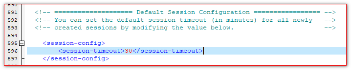
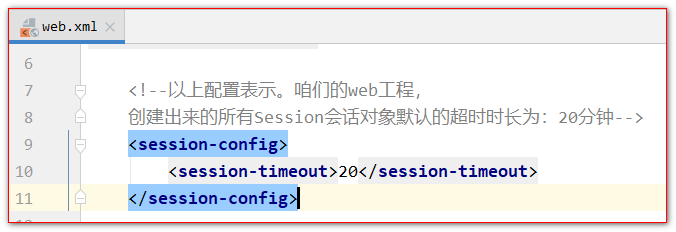
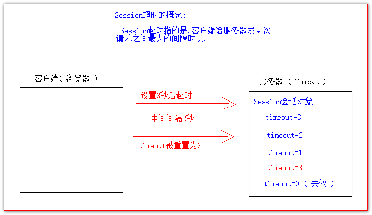
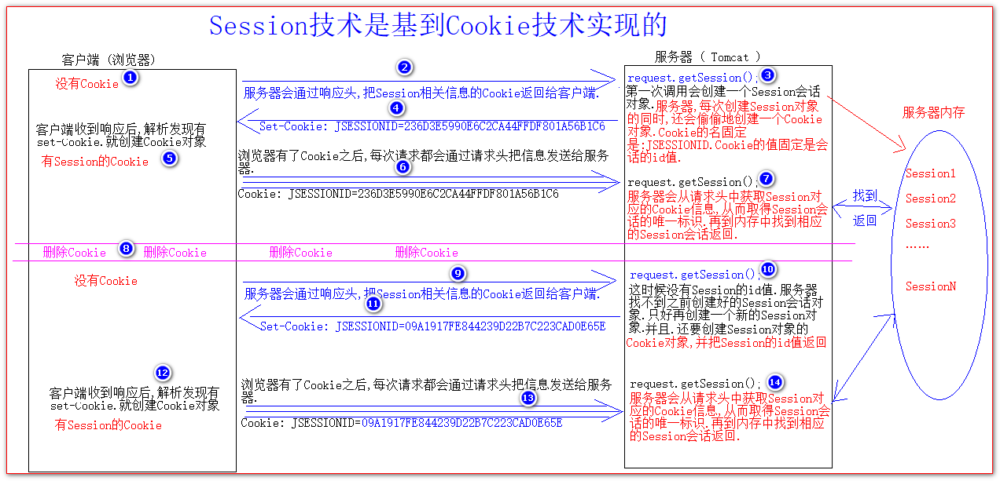

# Session

## 目录

- [如何创建Session和获取(id号,是否为新)](#如何创建Session和获取id号是否为新)
- [Session域数据的存取](#Session域数据的存取)
- [Session的超时控制](#Session的超时控制)
- [浏览器和服务器Session之间关联的技术内幕](#浏览器和服务器Session之间关联的技术内幕)

## 如何创建Session和获取(id号,是否为新)

会话是用来表示一个客户端的对象.为了区分每个客户端的不同.每个会话对象都会有一个唯一的标识,我们管它叫会话id.

会话如何创建?又如何获取呢?

Session会话的创建和获取是同一个API =====>>>> request.getSession();

使用request对象调用getSession()方法获得session对象

第一次调用 request.getSession() 是创建

之后调用 request.getSession() 是获取

注意：getSession方法既可以创建对象也可以提供对象。如果没有Session对象，创建对象并提供；有对象，提供该对象。

Session是否是刚创建出来,还是创建好了获取到的.也可以通过一个API ===>>> isNew() 获取到它的状态是否是新的

isNew() 方法如果返回true表示刚创建出来的.

isNew() 方法如果返回false 表示是前面创建好之后,获取到的.

如何获取Session会话的唯一标识 ====>>>>> getId()

```java
@WebServlet(name = "SessionServlet",value = "/sessionServlet")
public class SessionServlet extends BaseServlet {

    protected void createOrGetSession(HttpServletRequest request, HttpServletResponse response) throws ServletException, IOException {
        // 创建或获取
        HttpSession session = request.getSession();
        // 获取Session是否是新创建出来的状态  ，true表示新创建的，false表示前面创建好，获取的
        boolean isNew = session.isNew();
        // 获取会话的唯一标识
        String sessionId = session.getId();

        response.getWriter().write("创建或获取Session对象 <br/>");
        response.getWriter().write("isNew ==>> " + isNew + " <br/>");
        response.getWriter().write("session id ==>> " + sessionId + " <br/>");
    }
}

```


## Session域数据的存取

参数和域数据有什么不同?

参数是客户端在发请求的时候,发给服务器的额外数据 .这些数据的格式是: name=value\&name=value

域数据,是服务器在实现业务过程中,自己给自己保存下来方便后面的程序使用的数据叫域数据.

setAttribute() 保存数据

getAttribute() 获取域数据

```java
protected void setAttribute(HttpServletRequest request, HttpServletResponse response) throws ServletException, IOException {
    request.getSession().setAttribute("key","keyData");
    response.getWriter().write("已经往Session中保存了数据");
}

protected void getAttribute(HttpServletRequest request, HttpServletResponse response) throws ServletException, IOException {
    Object attribute = request.getSession().getAttribute("key");
    response.getWriter().write("从Session中获取前面保存的数据：" + attribute);
}

```


## Session的超时控制

Session会话,一旦超时之后,Session对象就会无效( 被销毁 )

有一个API可以获取Session会话的超时时长

getMaxInactiveInterval():int 以秒为单位

Session默认的超时时长是多少?

Session默认的超时时长为: 30分钟.

因为在Tomcat服务器的web.xml配置文件中.早已有了如下的配置:



以上的配置表示.所有使用了Tomcat服务器的所有web工程.创建出来的所有Session会话对象.默认的超时时长为30分钟.

当然我们也可以单独为自己的web工程进行单独的配置.使得我们自己的web工程创建出来的所有的Session会话的默认时长.

只需要在自己的web工程的web.xml配置文件中做以下配置即可( 修改web.xml配置文件一定要重启tomcat服务器才能生效 ).



如果你想给某个特殊的Session会话单独设置超时时长,也可以通过以下api进行设置.

setMaxInactiveInterval( int ) 以秒为单位

设置值为正数时,表示在指定的秒数后Session自动超时( 超时就是失效 )



设置3秒后超时:

```java
    // 设置当前Session会话对象。超时时长为3秒（ 也就是3秒后自动失效 ）。
    request.getSession().setMaxInactiveInterval(3);
    response.getWriter().write("当前Session会话3秒后超时！");
}

```


如果我们有特殊的需要,也可以在不需要等待Session到达超时时长之后.让它马上超时.

只需要调用 一个api即可 ====>>>> invalidate();

```java
protected void deleteNow(HttpServletRequest request, HttpServletResponse response) throws ServletException, IOException {
    // invalidate() 让Session会话马上无效
    request.getSession().invalidate();
    response.getWriter().write("当前会话Session已经失效");
}

```


## 浏览器和服务器Session之间关联的技术内幕

服务器会为每个客户端创建一个Session会话对象. 这个会话对象用于区分每个客户端.



会话Session是浏览器打开后,访问服务器,Session就会被创建,浏览器关闭Session就会销毁( 无效 )

如果Session会话还没有超时,就已经关闭了浏览器,为什么也找不到原来的Session会话了.

因为浏览器一关闭Session对应的Cookie就被删除了

创建Session时,默认创建的Cookie的存活时间,就是浏览器一关,Cookie也被删除了
