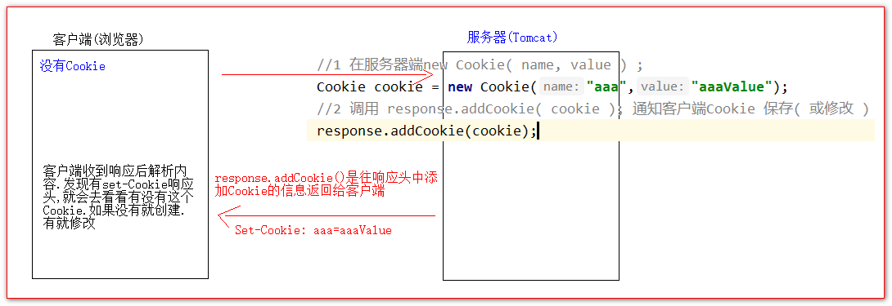
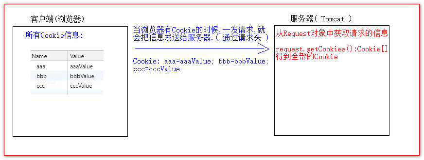

# cookie

## 目录

- [cookie的创建](#cookie的创建)
- [服务器如何获取客户端发送过来的Cookie](#服务器如何获取客户端发送过来的Cookie)
- [Cookie值的修改](#Cookie值的修改)
  - [Cookie生命控制](#Cookie生命控制)
  - [Cookie有效路径Path的设置（cookie路径问题）](#Cookie有效路径Path的设置cookie路径问题)

### cookie的创建

创建cookie对象，构造器传入键值对

调用request的addCookie(传入cookie)把cookie添加到请求域中



```java
@WebServlet(name = "CookieServlet", value = "/cookieServlet")
public class CookieServlet extends BaseServlet {
    /**
     * 创建Cookie对象
     *
     * @param request
     * @param response
     * @throws ServletException
     * @throws IOException
     */
    protected void createCookie(HttpServletRequest request, HttpServletResponse response) throws ServletException, IOException {
        //1 在服务器端new Cookie( name, value ) ;
        Cookie cookie = new Cookie("bbb", "bbbValue");
        //2 调用 response.addCookie( cookie ); 通知客户端Cookie 保存( 或修改 )
        response.addCookie(cookie);

        Cookie cookie1 = new Cookie("ccc","cccValue");
        response.addCookie(cookie1);
        
        response.getWriter().write("已经创建了Cookie返回!!!");
    }
}

```


## 服务器如何获取客户端发送过来的Cookie

调用getCookies方法得到全部Cookie



```java
public class CookieUtils {
    /**
     * 查找指定名称的Cookie
     * @param name 要找的Cookie名称
     * @param cookies 全部的Cookie
     * @return
     */
    public static Cookie findCookie(String name,Cookie[] cookies){
        if (cookies == null || name == null || cookies.length == 0) {
            return null;
        }

        for (Cookie cookie : cookies) {
            if (name.equals(cookie.getName())) {
                return cookie;
            }
        }
        return null;
    }
}

    /**
     * 获取客户端发送过来的Cookie
     * @param request
     * @param response
     * @throws ServletException
     * @throws IOException
     */
protected void getCookie(HttpServletRequest request, HttpServletResponse response) throws ServletException, IOException {
        // 只需要调用一个api即可.
        Cookie[] cookies = request.getCookies();//:Cookie[]得到全部Cookie

        if (cookies != null && cookies.length > 0) {
            // 遍历Cookie输出
            for (Cookie cookie : cookies) {
                // cookie.getName() 获取Cookie的键或名称  值
                // cookie.getValue() 获取当前Cookie的值
                response.getWriter().write("Cookie[" + cookie.getName()
                        + " = " + cookie.getValue() + " ] <br/>");
            }
        }

//        比如我需要获取aaa的Cookie

        Cookie iWantCookie = null;

        iWantCookie = CookieUtils.findCookie("bbb", cookies);

        // 判断是否找到
        if (iWantCookie != null) {
            response.getWriter().write(" 亲爱的.我找到了你要的Cookie <br>");
        }
 }


```


## Cookie值的修改

方案一:

1. 直接在服务器端创建一个同名的cookie对象
2. 在创建的构造器方法中直接赋于新值
3. 调用 response.addCookie( cookie ); 通知客户端保存修改
   ```java
   //        方案一:
   //        1 直接在服务器端创建一个同名的cookie对象   === 修改aaa值为aaaNewValue
   //        2 在创建的构造器方法中直接赋于新值
           Cookie cookie = new Cookie("aaa","aaaNewValue");
   //        3 调用 response.addCookie( cookie ); 通知客户端保存修改
           response.addCookie(cookie);

   ```


方案二:

1. 先查找到需要修改的Cookie对象
2. 调用 setValue() 方法设置新的值
3. 调用 response.addCookie() 通知客户端保存
   ```java
   //        方案二:
   //        1 先查找到需要修改的Cookie对象
           Cookie iWantCookie = CookieUtils.findCookie("bbb",request.getCookies());
           if (iWantCookie != null) {
               //2 调用 setValue() 方法设置新的值
               iWantCookie.setValue("bbbNewValue");//如果Cookie值为中文，建议使用BASE64编码后再保存
   //        3 调用 response.addCookie() 通知客户端保存悠
               response.addCookie(iWantCookie);
           }

   ```


### Cookie生命控制

Cookie也是有存活时长的.Cookie的存活时长由一个api设置决定.

setMaxAge()

1 正数 表示浏览器在指定的秒数后被删除 ( 或失效 )

2 负数 表示浏览器关闭,Cookie就会被删除( 默认值也是-1 )

3 零    表示浏览器收到响应后,马上删除Cookie

```java
// 创建可以存活3600秒的Cookie
protected void life3600(HttpServletRequest request, HttpServletResponse response) throws ServletException, IOException {
    Cookie cookie = new Cookie("life3600", "life3600");
    cookie.setMaxAge(60 * 60);//存活1小时
    response.addCookie(cookie);
    response.getWriter().write("创建一个可以存活一小时的Cookie");
}


protected void deleteNow(HttpServletRequest req, HttpServletResponse resp) throws ServletException, IOException {
    // 删除bbb的Cookie
    Cookie bbb = CookieUtils.findCookie("bbb", req.getCookies());
    if (bbb != null) {
        bbb.setMaxAge(0); // 表示马上删除，不需要等浏览器关闭
        resp.addCookie(bbb);//通知客户端对cookie的操作
        resp.getWriter().write("已经删除了bbb的Cookie");
    }
}

protected void defaultLife(HttpServletRequest req, HttpServletResponse resp) throws ServletException, IOException {
    Cookie cookie = new Cookie("defaultLife", "defaultLife");
    cookie.setMaxAge(-1);//负数其实就是默认值
    resp.addCookie(cookie);
    resp.getWriter().write("创建了一个默认存活时长的Cookie");
}

```


### Cookie有效路径Path的设置（[cookie路径问题）](https://www.cnblogs.com/handsomecui/p/6117149.html "cookie路径问题）")

优点：节省流量，对于不需要特定cookie的程序进行设置

Cookie的path路径,可以设置Cookie在哪些请求下才发送给服务器.

Cookie1 的path为: /工程路径 表示请求地址为: [http://ip:port/工程路径/所有资料](http://ip:port/工程路径/所有资料 "http://ip:port/工程路径/所有资料") 都会发送给服务器.

cookie2 的path为:/工程路径/abc 表示请求地址为: [http://ip:port/工程路径/abc/\*](http://ip:port/工程路径/abc/* "http://ip:port/工程路径/abc/*") 都会发给服器.

比如现在有两个Cookie&#x20;

CookieA path=/工程路径

CookieB path/工程路径/abc

请求有以下几个:

[http://ip:port/工程路径/a.html](:port/工程路径/a.html "http://ip:port/工程路径/a.html")

CookieA 会发

CookieB 不发

[http://ip:port/工程路径/abc/a.html](:port/工程路径/abc/a.html "http://ip:port/工程路径/abc/a.html")

CookieA 会发

CookieB 会发

```java
protected void testPath(HttpServletRequest request, HttpServletResponse response) throws ServletException, IOException {
    Cookie cookieA = new Cookie("cookieA", "aValue");
    cookieA.setPath(request.getContextPath()); // 设置为工程路径 ==>>> /13_cookie_session  也是默认值
    response.addCookie(cookieA);

    Cookie cookieB = new Cookie("cookieB", "bValue");
    cookieB.setPath(request.getContextPath() + "/abc"); // 设置为工程路径 ==>>> /13_cookie_session/abc
    response.addCookie(cookieB);

    response.getWriter().write("创建了两个Cookie用于对比");
}

```
