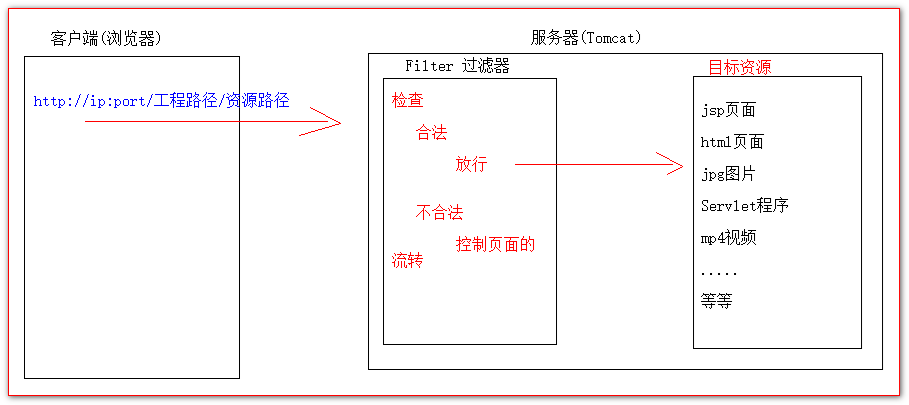

# Filter的Hello示例

需求: 现在比如在web目录下有一个admin目录.这个admin目录下存放着.jsp页面,html页面.jpg图片等地很多资源.

而这些资源都要求用户登录之后才允许访问.

用户登录有什么特性? 怎么识别用户登录?

思路: 我们可以在jsp页面中通过session域对象检查是否有保存用户登录的信息.如果有说明用户之前登录过.如果没有说明用户还没有登录.

实现代码如下:

```java
<%
    // 获取Session域中用户登录的信息
    Object user = session.getAttribute("user");
    // 判断是否已经登录
    if (user == null) {
        request.getRequestDispatcher("/login.jsp").forward(request,response);
        return;
    }
%>
```


但是,以上这种方法,仅仅是适用于jsp页面.而无法在html页面和jpg图片上使用.

这种情况下,我们就可以使用Filter过滤器来实现这个权限拦截检查.

Filter过滤器工作示意图:



如何使用Filter过滤器:

1. 编写一个类去实现Filter接口
2. 实现doFilter() 过滤方法
3. 到web.xml中去配置拦截的路径

- 代码

  AdminFilter过滤器代码:

```java
public class AdminFilter implements Filter {
    /**
     * doFilter() 方法专门用于拦截请求,过滤响应( 权限检查 ) <br>
     *     每次拦截到资源的请求后,就会调用的方法.在这里可以做一些检查工作.
     */
    @Override
    public void doFilter(ServletRequest request, ServletResponse response, FilterChain chain) throws IOException, ServletException {
        System.out.println("AdminFilter工作了");
        // 强转为子接口
        HttpServletRequest httpServletRequest = (HttpServletRequest) request;
        // 获取Session域中用户登录的信息
        Object user = httpServletRequest.getSession().getAttribute("user");
        // 判断是否已经登录
        if (user == null) {
            // 没有登录.你可以任意指定程序的流转 ===>>> 比较让它跳到登录页面
            request.getRequestDispatcher("/login.jsp").forward(request,response);
        } else {
            // 放行 ===>>> 让程序去执行用户访问的资源
            chain.doFilter(request,response);
        }
    }
}
```


web.xml中的配置:

```xml
<!--配置Filter过滤器和配置Servlet程序几乎一样-->
<!--filter标签是配置Filter过滤器-->
<filter>
    <!--filter-name标签是起一个别名-->
    <filter-name>AdminFilter</filter-name>
    <!--filter-class标签配置Filter过滤器的全类名-->
    <filter-class>com.atguigu.filter.AdminFilter</filter-class>
</filter>
<!--还要使用filter-mapping配置Filter的拦截路径-->
<filter-mapping>
    <!--表示当前配置的路径给哪个Filter使用-->
    <filter-name>AdminFilter</filter-name>
    <!--
        url-pattern 是配置拦截路径
        / 表示: http://ip:port/工程路径/  映射到代码的WEB目录
        /admin/*  表示地址为: http://ip:port/工程路径/admin/* 所有资源
    -->
    <url-pattern>/admin/*</url-pattern>
</filter-mapping>
```


login.jsp页面:

```html
<body>
  这是login.jsp登录页面
  <form action="http://localhost:8080/14_filter/login" method="get">
    用户名:<input type="text" name="username" id="username"/> <br>
    密码: <input type="password" name="password" id="password" /> <br>
    <input type="submit" value="登录">
  </form>
</body>
```


LoginServlet程序:

```java
public class LoginServlet extends HttpServlet {
    protected void doPost(HttpServletRequest request, HttpServletResponse response) throws ServletException, IOException {
        doGet(request,response);
    }
    protected void doGet(HttpServletRequest request, HttpServletResponse response) throws ServletException, IOException {
        // 获取用户名和密码
        String username = request.getParameter("username");
        String password = request.getParameter("password");
        // 比较用户名和密码是否正确
        if ("wzg168".equals(username) && "666666".equals(password)) {
            request.getSession().setAttribute("user", username);
            System.out.println("登录成功");
        } else {
            System.out.println("登录失败");
        }
    }
}
```
