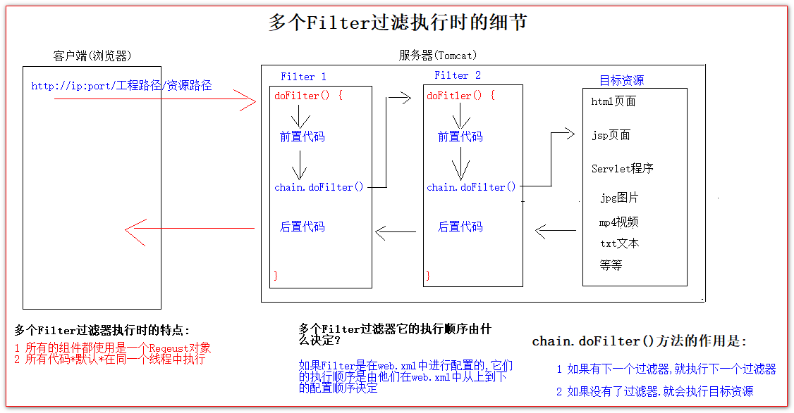
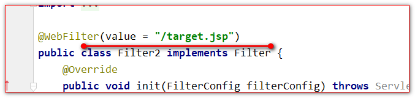

# filter过滤器

## 目录

- [Filter什么是过滤器](#Filter什么是过滤器)
  - [Filter例子](#Filter例子)
- [Filter的生命周期](#Filter的生命周期)
- [FilterConfig 类](#FilterConfig-类)
- [FilterChain 过滤器链](#FilterChain-过滤器链)
- [Filter的拦截路径](#Filter的拦截路径)
- [JavaEE3.0规范注解@Filter配置Filter过滤器](#JavaEE30规范注解Filter配置Filter过滤器)

## Filter什么是过滤器

1 Filter过滤器是JavaWeb的三大组件之一. JavaWeb的三大组件分别是:Servlet程序、 Listener监听器（[ServletContextListener监听器](../jsp/ServletContextListener监听器/ServletContextListener监听器.md "ServletContextListener监听器")）、Filter过滤器

2 Filter过滤器是一个接口

3 Filter过滤器可以拦截请求,过滤响应

常见的应用场景是:

1 权限检查

2 日记记录

3 性能检测

### Filter例子

[Filter的Hello示例](Filter的Hello示例/Filter的Hello示例.md "Filter的Hello示例")

# Filter的生命周期

1. 先执行Filter的构造器方法
2. 执行init初始化方法

   第1,2步,是在web工程启动的时候调用.
3. 执行doFilter() 过滤方法

   每次拦截到请求都会调用
4. 执行detroy销毁方法

   在web工程停止的时候调用.

# FilterConfig 类

FilterConfig和ServletConfig非常像.

ServletConfig是Servlet程序在Tomcat服务器创建Servlet程序的时候,就会创建一个ServletConfig对象实例.

**Servletconfig对象实例是封装有Servlet程序的配置信息类**

FilterConfig是Tomcat服务器每次创建Filter过滤器的时候,也会创建一个FilterConfig对象实例.

**这个FilterConfig对象实例中也封装有Filter过滤器的配置信息**

FilterConfig类的作用:

1. 获取在Filter配置的别名
2. 获取Filter过滤器的初始化参数
3. 获取ServletConetxt对象

- 测试代码
  ```java
  @Override
  public void init(FilterConfig filterConfig) throws ServletException {
          System.out.println("2 init() 初始化方法");
  //        FilterConfig类的作用:
  //        1 获取在Filter配置的别名
          System.out.println(filterConfig.getFilterName());
  //        2 获取Filter过滤器的初始化参数 init-param
          System.out.println(filterConfig.getInitParameter("url"));
          System.out.println(filterConfig.getInitParameter("myLove"));
  //        3 获取ServletConetxt对象
          System.out.println(filterConfig.getServletContext());
  }

  web.xml中的配置:
  <init-param>
      <param-name>url</param-name>
      <param-value>jdbc:mysql://localhost:3306/book</param-value>
  </init-param>
  <init-param>
      <param-name>myLove</param-name>
      <param-value>1.jpg</param-value>
  </init-param>

  ```


# FilterChain 过滤器链

FilterChain 是过滤器链 ( 多个Filter过滤器 )

Filter 过滤器

Chain 链 锁链

要讲的就是多个Filter过滤器执行的细节.



# Filter的拦截路径

\--精确匹配

<**url-pattern**>/target.jsp\</**url-pattern**>

以上配置要求请求地址必须是: [http://ip:port/工程路径/target.jsp](:port/工程路径/target.jsp "http://ip:port/工程路径/target.jsp") 才会拦截到

\--目录匹配

<**url-pattern**/admin/ \*\</**url-pattern**>

以上配置要求请求地址必须是: [http://ip:port/工程路径/admin/所有资源](http://ip:port/工程路径/admin/所有资源 "http://ip:port/工程路径/admin/所有资源")

\--后缀名匹配

<**url-pattern**\*.jsp\</**url-pattern**>

以上配置要求请求地址必须是以 .jsp结尾 , 请求才会被拦截到

<**url-pattern**\*.html\</**url-pattern**>

以上配置要求请求地址必须是以 .html 结尾 , 请求才会被拦截到

<**url-pattern**\*.do\</**url-pattern**>

以上配置要求请求地址必须是以 .do 结尾 , 请求才会被拦截到

<**url-pattern**\*.abc\</**url-pattern**>

以上配置要求请求地址必须是以 .abc 结尾 , 请求才会被拦截到

Filter的拦截请求地址,只关心地址的字符串是否匹配,不关心请求的资源是否存在!!!

# JavaEE3.0规范注解@Filter配置Filter过滤器

JavaEE的三大组件,不仅可以在web.xml中进行配置,也可以使用注解来进行配置.



如果是使用注解的方式配置多个Filiter过滤器.他们的执行顺序由类名的字母顺序决定.
