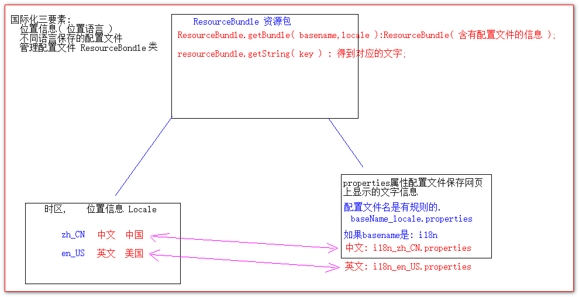
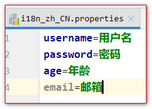
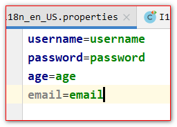

# i18n国际化

## 目录

- [1、什么是i18n国际化？](#1什么是i18n国际化)
- [2、国际化相关要素介绍](#2国际化相关要素介绍)
- [3、国际化资源properties测试](#3国际化资源properties测试)
- [6、JSTL标签库实现国际化](#6JSTL标签库实现国际化)

## 1、什么是i18n国际化？

Ø 国际化（Internationalization）指的是同一个网站可以支持多种不同的语言，以方便不同国家，不同语种的用户访问。

Ø 关于国际化我们想到的最简单的方案就是为不同的国家创建不同的网站，比如苹果公司，他的英文官网是：[http://www.apple.com而中国官网是http](http://www.apple.xn--comhttp-i43k486d4qkbl3a696dm8b "http://www.apple.com而中国官网是http")://[www.apple.com/cn](http://www.apple.com/cn)

Ø 苹果公司这种方案并不适合全部公司，而我们希望相同的一个网站，而不同人访问的时候可以根据用户所在的区域显示不同的语言文字，而网站的布局样式等不发生改变。

Ø 于是就有了我们说的国际化，国际化总的来说就是同一个网站不同国家的人来访问可以显示出不同的语言。但实际上这种需求并不强烈，一般真的有国际化需求的公司，主流采用的依然是苹果公司的那种方案，为不同的国家创建不同的页面。所以国际化的内容我们了解一下即可。

Ø 国际化的英文Internationalization，但是由于拼写过长，老外想了一个简单的写法叫做I18N，代表的是Internationalization这个单词，以I开头，以N结尾，而中间是18个字母，所以简写为I18N。以后我们说I18N和国际化是一个意思。

## 2、国际化相关要素介绍



## 3、国际化资源properties测试

- i18n\_zh\_CN.peroperties

  
- i18n\_en\_US.properties

  
- 代码
  ```java
  public class I18nTest {
      @Test
      public void testLocale() {
  //        Locale// 表示位置,时区,语言信息
          Locale locale = Locale.getDefault();
          System.out.println(locale); // zh_CN 中文 中国
          System.out.println(Locale.US); // en_US 英文  美国
          // 查看全部Locale信息
          for (Locale availableLocale : Locale.getAvailableLocales()) {
              System.out.println(availableLocale);
          }
      }

      @Test
      public void testI18n() {
          Locale locale = Locale.US;
          System.out.println(locale);
          // 根据给定的basename和locale信息,读取配置文件
          ResourceBundle resourceBundle = ResourceBundle.getBundle("i18n",locale );

          System.out.println(resourceBundle.getString("username"));
          System.out.println(resourceBundle.getString("password"));
          System.out.println(resourceBundle.getString("age"));
      }
  }


  ```


## 6、JSTL标签库实现国际化

```javascript
<%--1 使用标签设置Locale信息--%>
<fmt:setLocale value="" />
<%--2 使用标签设置baseName--%>
<fmt:setBundle basename=""/>
<%--3 输出指定key的国际化信息--%>
<fmt:message key="" />

```


- 代码
  ```html
  <%@ taglib prefix="fmt" uri="http://java.sun.com/jsp/jstl/fmt" %>
  <%@ page language="java" contentType="text/html; charset=UTF-8"
     pageEncoding="UTF-8"%>
  <!DOCTYPE html PUBLIC "-//W3C//DTD HTML 4.01 Transitional//EN" "http://www.w3.org/TR/html4/loose.dtd">
  <html>
  <head>
  <meta http-equiv="pragma" content="no-cache" />
  <meta http-equiv="cache-control" content="no-cache" />
  <meta http-equiv="Expires" content="0" />
  <meta http-equiv="Content-Type" content="text/html; charset=UTF-8">
  <title>Insert title here</title>
  </head>
  <body>
  <%--
     接下来/我们要使用 EL表达式和JSTL标签库代替原来的表达式脚本和代码脚本实现国际化

     使用JSTL标签库实现为际化,只需要做三点
        1 .设置locale信息
           <fmt:setLocale value="${param.country}"/>
        2 .设置basename信息
           <fmt:setBundle basename="i18n" />
        3 .输出指定key的国际化信息
           <fmt:message key="regist"/>
  --%>
  <fmt:setLocale value="${param.country}"/>
  <fmt:setBundle basename="i18n" />
     <a href="i18n_fmt.jsp?country=zh_CN">中文</a>|
     <a href="i18n_fmt.jsp?country=en_US">english</a>
     <center>
        <h1><fmt:message key="regist"/></h1>
        <table>
        <form>
           <tr>
              <td><fmt:message key="username"/></td>
              <td><input name="username" type="text" /></td>
           </tr>
           <tr>
              <td><fmt:message key="password"/></td>
              <td><input type="password" /></td>
           </tr>
           <tr>
              <td><fmt:message key="sex"/></td>
              <td>
                 <input type="radio" /><fmt:message key="boy"/>
                 <input type="radio" /><fmt:message key="girl"/>
              </td>
           </tr>
           <tr>
              <td><fmt:message key="email"/></td>
              <td><input type="text" /></td>
           </tr>
           <tr>
              <td colspan="2" align="center">
              <input type="reset" value="<fmt:message key="reset"/>" />&nbsp;&nbsp;
              <input type="submit" value="<fmt:message key="submit"/>" /></td>
           </tr>
           </form>
        </table>
        <br /> <br /> <br /> <br />
     </center>
  </body>
  </html>


  ```
