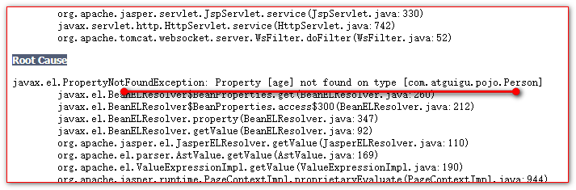
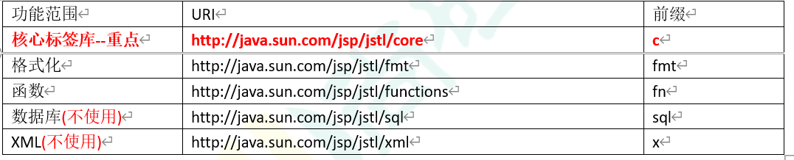

# jsp

## 目录

- [jsp](#jsp)
  - [什么是 Jsp,以及它的作用](#什么是Jsp以及它的作用)
  - [jsp 的本质是什么。](#jsp的本质是什么)
  - [jsp 的三种语法](#jsp的三种语法)
  - [ jsp 九大内置对象](#-jsp九大内置对象)
  - [jsp 的常用标签](#jsp的常用标签)
- [监听器](#监听器)
- [EL 表达式](#EL表达式)
  - [什么是 EL 表达式](#什么是EL表达式)
  - [EL 表达式，获取域对象数据（重点）](#EL表达式获取域对象数据重点)
  - [运算](#运算)
  - [EL 表达式中 11 个隐含对象。](#EL表达式中11个隐含对象)
  - [EL 表达式获取域对象中的数据（重点）](#EL表达式获取域对象中的数据重点-)
  - [pageContext 对象的使用](#pageContext对象的使用)
  - [EL 表达式其他隐含对象的使用](#EL表达式其他隐含对象的使用)
- [JSTL 标签库(次重点)](#JSTL标签库次重点)
  - [什么是 JSTL 标签库](#什么是JSTL标签库)
- [JSTL 标签库的使用步骤](#JSTL标签库的使用步骤)
- [core 核心库使用](#core核心库使用)

## jsp

### 什么是 Jsp,以及它的作用

jsp 的全称是 java Server pages. 也就是 java 的服务器页面.

jsp 是 sun 公司为了解决 Servlet 程序回传 html 页面数据过于繁锁,而提供的一种技术.

jsp 页面的访问和 html 页面的访问一样.

html 页面和 jsp 页面都放在 web 目录下.

比如: &#x20;

web 目录

a. html 页面 ====>>>>> [http://ip](http://ip "http://ip"):port/工程路径/a.html

b. jsp 页面 ====>>>>> [http://ip](http://ip "http://ip"):port/工程路径/b.jsp

### jsp 的本质是什么。

jsp 其实它就是一个 Servlet 程序.

当我们第一次访问 jsp 页面的时候.Tomcat 服务器会把 jsp 页面翻译成为一个 java 源文件, 并编译成为.class 字节码文件

翻译出来的文件存放在 IDEA 拷贝的 Tomcat 实例的 work 目录下. 那么我们使用编辑器打开.java 源文件,发现.它是一个类.并且继承了 HttpJspBase 类.

### jsp 的三种语法

[jsp 头部的 page 指令](jsp头部的page指令/jsp头部的page指令.md "jsp头部的page指令")

[jsp 中的常用脚本](jsp中的常用脚本/jsp中的常用脚本.md "jsp中的常用脚本")

[jsp 中的三种注释](jsp中的三种注释/jsp中的三种注释.md "jsp中的三种注释")

### &#x20;jsp 九大内置对象

在 jsp 页面被翻译成为 java 源代码中,有九个对象是我们可以去使用的.

这九个对象都分别在 \_jspService() 方法中有定义.

[jsp 四大域对象](jsp四大域对象/jsp四大域对象.md "jsp四大域对象")

### jsp 的常用标签

[jsp 静态包含](jsp静态包含/jsp静态包含.md "jsp静态包含")

[jsp 动态包含](jsp动态包含/jsp动态包含.md "jsp动态包含")

[jsp 标签-转发](jsp标签-转发/jsp标签-转发.md "jsp标签-转发")

## 监听器

[ServletContextListener 监听器](ServletContextListener监听器/ServletContextListener监听器.md "ServletContextListener监听器")

## EL 表达式

### 什么是 EL 表达式

[EL 表达式的初步使用](EL表达式的初步使用/EL表达式的初步使用.md "EL表达式的初步使用")

### EL 表达式，获取域对象数据（重点）

使用 EL 表达式获取数据的语法： "\${标识符}”

第一点：当 EL 表达式输出的 key 不存在的时候，输出的是空串""

第二点：EL 表达式在域对象中搜索属性的顺序是 pageContext，request，session。Application

EL 表达式可以从域对象中获取数据

1、EL 表达式获取域数据的顺序\*\*

EL 表达式语句在执行时，会用标识符为关键字分别从 page、request、session、application 四个域中查找对应 key 的对象。

找到则返回相应数据。找不到则返回空串。（注意，不是 null，而是空字符串）

2、获取 javaBean 普通属性、数组属性、List 集合属性，以 map 属性中的数据。&#x20;

- 例如 &#x20;

  ```javascript
  ${ user.username }  // 获取user对象中。username属性值
  ${ list[下标] }     // 访问有序集合（或数组）中给定索引的元素
  ${ map.key }       // 访问map集合中指定key的属性值
  ${  map["key”]  }  // 访问特殊字符串的key的属性值


  <%@ page contentType="text/html;charset=UTF-8" language="java" %>
  <html>
  <head>
      <title>Title</title>
  </head>
  <body>
      <%
          Person person = new Person();
          person.setId(100);
          person.setPhones(new String[]{"18610541354","18666668888","13988889999"});
          List<String> cities = new ArrayList<>();
          cities.add("北京");
          cities.add("上海");
          cities.add("深圳");
          person.setCities(cities);
          Map<String,Object> map = new HashMap<>();
          map.put("aaaa", "aaaaValue");
          map.put("bbbb", "bbbbValue");
          map.put("cccc", "ccccValue");
          person.setMap(map);

          request.setAttribute("p", person);
      %>
      输出person对象: ${p} <br>
      输出id属性的值:${p.id} <br>
      输出phones属性的值:${p.phones[0]} <br>
      输出phones属性的值:${p.phones[1]} <br>
      输出phones属性的值:${p.phones[2]} <br>
      输出 list 集合的值:${p.cities} <br>
      输出 list 元素的值:${p.cities[0]} <br>
      输出 list 元素的值:${p.cities[1]} <br>
      输出 list 元素的值:${p.cities[2]} <br>
      输出 map 集合的值:${p.map} <br>
      输出 map 某个key的值:${p.map.aaaa} <br>
      输出 map 某个key的值:${p.map.bbbb} <br>
      输出 map 某个key的值:${p.map.cccc} <br>
      输出 age 属性的值: ${p.age} <br>
  </body>
  </html>

  ```

注意：\[] 中括号 除了可以访问带有顺序的集合和数组的元素之外。 还可以访问特殊的 key 值

需求：创建一个 User 类对象，添加字符串属性，数组属性，List 集合属性。map 属性。 然后创建一个对象实例添加到 request 域对象中测试获取

在 EL 表达式中,输出属性值的时候,其实找的不是属性.而是其属性的对应读方法.也就是 getXxx() 或 isXxx() 方法

当以下错误出现的时候,其实就是你的读方法,不存在.



一定要记住一点，EL 表达式获取数据的时候，是通过对应的 get 方法获取的 BeanUtils 是通过 set 方法设置值

### 运算

[JSP 运算 ](JSP运算-/JSP运算-.md "JSP运算 ")

### EL 表达式中 11 个隐含对象。

EL 表达式 中隐含 11 个对象，这 11 个对象我们都可以直接使用！！！

变量 类型 作用描述

pageContext PageContextImpl 获取 jsp 中的九大内置对象 &#x20;

pageScope Map\<String,Object> 获取 pageContetxt 域中的数据

requestScope Map\<String,Object> 获取 Request 域中的数据

sessionScope Map\<String,Object> 获取 Session 域中的数据

applicationScope Map\<String,Object> 获取 ServletContext 域中的数据

param Map\<String,String> 获取请求的参数值

paramValues Map\<String,String\[]> 获取请求的参数值( 多个值 )

header Map\<String,String> 获取请求头的值

headerValues Map\<String,String\[]> 获取请求头的值(多个值)

cookie Map\<String,Cookie> 获取当前请求的 cookie 信息

initParam Map\<String,String> 获取 web.xml 中配置的 context-param 参数

### EL 表达式获取域对象中的数据（重点）

pageScope <=== 对应 ===> pageContext 域中的属性&#x20;

requestScope <=== 对应 ===> request 域中的属性&#x20;

sessionScope <=== 对应 ===> session 域中的属性&#x20;

applicationScope <=== 对应 ===> ServletContext 域中的属性

### pageContext 对象的使用

pageContext 它的作用是获取 jsp 中的九大内置对象.

- 然后调用内置对象的方法,从而获取需要的信息.

  1. 协议：
  2. 服务器 ip：
  3. &#x20;服务器端口：
  4. **获取工程路径：**
  5. 获取请求方法：
  6. 获取客户端 ip 地址：
  7. 获取会话的 id 编号：

  ```java
  <%@ page contentType="text/html;charset=UTF-8" language="java" %>
  <html>
  <head>
      <title>Title</title>
  </head>
  <body>
      <%--
          request.getScheme()  获取请求的协议
          request.getServerName()  获取服务器的ip
          request.getServerPort() 获取服务器的端口号
          request.getContextPath() 获取工程路径
          request.getMethod() 获取请求的方式GET或POST
          request.getRemoteHost()  获取客户端ip地址
          session.getId() 获取会话的id
      --%>
      <%=session.getId()  %> <br>
      <%
          pageContext.setAttribute("req", request);
      %>
      1.协议：${ req.scheme } <br>
      2.服务器ip：${ pageContext.request.serverName }<br>
      3.服务器端口：${ pageContext.request.serverPort }<br>
      4.获取工程路径：${ pageContext.request.contextPath }<br>
      5.获取请求方法：${ pageContext.request.method }<br>
      6.获取客户端ip地址：${ pageContext.request.remoteHost }<br>
      7.获取会话的id编号：${ pageContext.session.id }<br>

  </body>
  </html>

  ```

### EL 表达式其他隐含对象的使用

param Map\<String,String> 获取请求的参数值

paramValues Map\<String,String\[]> 获取请求的参数值(获取多个值)

```html
获取请求参数 username 的值: ${ param.username } <br />
获取请求参数 password 的值: ${ param.password } <br />
获取请求参数 hobby 的值: ${ paramValues.hobby[0] } <br />
获取请求参数 hobby 的值: ${ paramValues.hobby[1] } <br />
```

header Map\<String,String> 获取请求头的值

headerValues Map\<String,String\[]> 获取请求头的值(多个值的情况)

```java
获取请求头 host 的值: ${ header.host } <br>
获取请求头 user-Agent 的值: ${ header['user-agent'] } <br>
获取请求头 Accept 的值: ${ header.accept } <br>
获取请求头 host 的值,值headerValues : ${ headerValues.host[0] }

```

cookie Map\<String,Cookie> 获取 Cookie 信息

initParam Map\<String,String> 获取 web.xml 中配置的 Context-param 参数

```java
cookie 的 name 值: ${ cookie.JSESSIONID.name } <br>
cookie 的 value 值: ${ cookie.JSESSIONID.value } <br>

<hr>

获取context-param url 的值 : ${ initParam.url } <br>
获取context-param girl 的值 : ${ initParam.girl } <br>

```

## JSTL 标签库(次重点)

### 什么是 JSTL 标签库

JSTL 标签库 全称是指 JSP Standard Tag Library JSP 标准标签库。是一个不断完善的开放源代码的 JSP 标签库。

EL 表达式主要是为了替换 jsp 中的表达式脚本，而标签库则是为了替换代码脚本。这样使得整个 jsp 页面变得更佳简洁。

JSTL 由五个不同功能的标签库组成。



在 jsp 标签库中使用 taglib 指令引入标签库

```javascript
  CORE 标签库
    <%@ taglib prefix="c" uri="http://java.sun.com/jsp/jstl/core" %>
  XML 标签库
    <%@ taglib prefix="x" uri="http://java.sun.com/jsp/jstl/xml" %>
  FMT 标签库
    <%@ taglib prefix="fmt" uri="http://java.sun.com/jsp/jstl/fmt" %>
  SQL 标签库
    <%@ taglib prefix="sql" uri="http://java.sun.com/jsp/jstl/sql" %>
  FUNCTIONS 标签库
    <%@ taglib prefix="fn" uri="http://java.sun.com/jsp/jstl/functions" %>

```

## JSTL 标签库的使用步骤

1 先导入 jstl 标签库的 jar 包

taglibs-standard-impl-1.2.1.jar

taglibs-standard-spec-1.2.1.jar

2 使用 taglib 指令讯入标签库

<%@ **taglib** **prefix**="**c**" **uri**="[**http://java.sun.com/jsp/jstl/core**](http://java.sun.com/jsp/jstl/core "http://java.sun.com/jsp/jstl/core")" %>

## core 核心库使用

[核心库的使用](核心库的使用/核心库的使用.md "核心库的使用")
