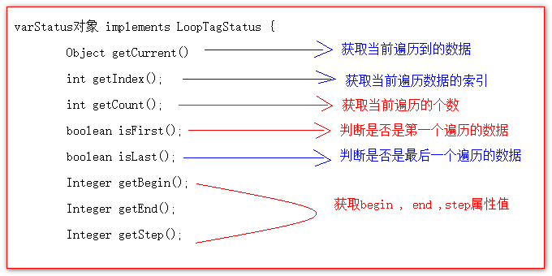

# 核心库的使用

## 目录

- [\<c:set />标签](#cset-标签)
- [\<c:if />标签](#cif-标签)
- [\<c:choose> \<c:when> \<c:otherwise>标签](#cchoose-cwhen-cotherwise标签)
- [iv. \<c:forEach />标签](#iv-cforEach-标签)
  - [1. 遍历1到10，输出](#1-遍历1到10输出)
  - [2. 遍历Object数组](#2-遍历Object数组)
  - [3. 遍历Map集合](#3-遍历Map集合)
  - [4. 遍历List集合---list中存放 Student类，有属性：编号，用户名，密码，年龄，电话信息](#4-遍历List集合---list中存放-Student类有属性编号用户名密码年龄电话信息)

### \<c:set />标签

作用:可以往域中保存数据.

```java
<%--i.<c:set />标签
作用:可以往域中保存数据.
   域对象.setAttribute(key,value);

   scope 表示使用哪个域对象
        page            表示pageContext域(默认值)
        reqeust         表示request域
        session         表示session域
        application     表示ServletContext域
   var 表示 key 值
   value  要保存的值
--%>
保存之前 : ${ requestScope.abc } <br>
<c:set scope="request" value="国哥真棒,棒棒哒!" var="abc"></c:set>
保存之后 : ${ requestScope.abc } <br>

```


### \<c:if />标签

if标签专门用于做if判断.

```java
<%--    ii.<c:if />标签
    if标签专门用于做if判断.
        if标签用于做if判断
            test属性表示判断的表达式( 要使用EL表达式来写 )
--%>
    <c:if test="${ 12 > 11 }">
        <c:if test="${ 11 > 10 }">
            <h1>国哥,又棒,又帅!</h1>
        </c:if>
    </c:if>

```


### \<c:choose> \<c:when> \<c:otherwise>标签

用于做多路判断选择.使用特别像switch..case..default..

```java
<%--
    choose 表示选择判断
    when 表示判断的一种条件
        test 是判断条件(也是使用EL表达式来写)
    otherwise 表示剩下的情况

    choose , when , otherwise标签使用需要注意的点:
        1 在标签内不能使用html注释.要使用jsp注释
        2 when标签的父标签必须是choose标签
--%>
<c:choose>
    <%-- html注释 --%>
    <c:when test="${ requestScope.height > 189 }">
        <h1>小巨人</h1>
    </c:when>
    <c:when test="${ requestScope.height > 179 }">
        <h1>很高</h1>
    </c:when>
    <c:when test="${ requestScope.height > 169 }">
        <h1>还可以</h1>
    </c:when>
    <c:otherwise>
        <c:choose>
            <c:when test="${ requestScope.height > 159 }"> 大 159 </c:when>
            <c:when test="${ requestScope.height > 149 }"> 大 149 </c:when>
            <c:otherwise> 真正剩下的 </c:otherwise>
        </c:choose>
    </c:otherwise>
</c:choose>

```


### iv. \<c:forEach />标签

作用是用于遍历数据.

#### 1. 遍历1到10，输出

```java
<%--1.遍历1到10，输出
        begin 属性设置遍历的开始索引
        end 属性设置遍历的结束索引
        var 遍历当前遍历到的数据
   for (int i = 1;  i<=10; i++)
--%>
<c:forEach begin="1" end="10" var="i">
    <div>${ i } </div>
</c:forEach>

```


#### 2. 遍历Object数组

```java
<%
    request.setAttribute("arr", new String[]{"史丹阳","朱斌","李哲","韩妹妹","王灿侨"});
%>
<%--
    items  遍历的数据源
    var     当前遍历到的数据
--%>
<table>
    <c:forEach items="${ requestScope.arr }" var="item">
        <tr>
            <td>${item} </td>
        </tr>
    </c:forEach>
</table>

```


#### 3. 遍历Map集合

```java
 <%
        Map<String,Object> map = new HashMap<>();
        map.put("aaa", "aaaValue");
        map.put("bbb", "bbbValue");
        request.setAttribute("map", map);
    %>
<%--    3.遍历Map集合--%>
    <c:forEach items="${ requestScope.map }" var="entry">
        ${ entry.key } = ${ entry.value }<br>
    </c:forEach>

```


#### 4. 遍历List集合---list中存放 Student类，有属性：编号，用户名，密码，年龄，电话信息

```java
<%
    List<Student> studentList = new ArrayList<>();
    for (int i = 1; i <= 20; i++) {
        studentList.add(new Student(i, "name"+i,"pass"+i,18+i,"phone"+i));
    }
    request.setAttribute("stus", studentList);
%>
<%--
    items 表示遍历的数据源
    var 表示当前遍历到的数据
--%>
<table>
    <tr>
        <th>编号</th>
        <th>姓名</th>
        <th>密码</th>
        <th>年龄</th>
        <th>电话</th>
        <th>操作</th>
    </tr>
    <%--
        begin 设置遍历开始的索引
        end 设置结束的索引
        step 设置遍历的步长
        varStatus 是当前遍历数据的状态对象
    --%>
    <c:forEach begin="5" end="10" step="2" varStatus="status"
               items="${ requestScope.stus }" var="stu">
        <tr>
            <td>${stu.id}</td>
            <td>${stu.name}</td>
            <td>${stu.password}</td>
            <td>${stu.age}</td>
            <td>${stu.phone}</td>
            <td>${ status.step }</td>
        </tr>
    </c:forEach>
</table>

```


varStatus属性介绍:


