# elasticsearch

## 目录

- [安装 elasticsearch](#安装-elasticsearch)
- [Kibana 介绍及安装](#Kibana-介绍及安装)
- [Ik 分词器](#Ik-分词器)
- [elasticsearch 基本概念：](#elasticsearch-基本概念)
- [索引操作（index）](#索引操作index)
  - [创建索引](#创建索引)
  - [查询所有索引库信息](#查询所有索引库信息)
  - [查看某个索引库信息](#查看某个索引库信息)
  - [删除索引](#删除索引)
- [类型(type)与映射(\_mapping)配置](#类型type与映射_mapping配置)
  - [创建类型映射](#创建类型映射)
  - [查看映射关系](#查看映射关系)
  - [创建索引库同时进行映射配置(常用)](#创建索引库同时进行映射配置常用)
- [文档操作](#文档操作)
  - [新增文档](#新增文档)
    - [自动生成 id](#自动生成-id)
    - [自定义 id](#自定义-id)
    - [查询指定索引库中所有的文档](#查询指定索引库中所有的文档)
    - [查看某个文档](#查看某个文档)
    - [智能判断](#智能判断)
  - [删除数据](#删除数据)
    - [根据 id 进行删除](#根据-id-进行删除)
    - [根据条件删除](#根据条件删除)
  - [修改数据](#修改数据)
    - [整体覆盖](#整体覆盖)
    - [更新字段](#更新字段)
  - [查询数据](#查询数据)
    - [在 query 里的匹配查询](#在query里的匹配查询)
- [聚合](#聚合)
  - [桶（bucket）](#桶bucket)
  - [度量（metrics）](#度量metrics)

这里需要安装三个软件

```text
elasticsearch：https://www.elastic.co/cn/downloads/past-releases#elasticsearch
kibana：https://www.elastic.co/cn/downloads/past-releases#kibana
ik分词器： https://github.com/medcl/elasticsearch-analysis-ik/releases

kibana使elasticsearch的图形化界面
ik分词器提供了最新的分词资料。且使用ik（或其他分词器）的远程调用在更新词库时可以做到热更新
注意：kibana、elasticsearch 和 IK 分词器的版本号要一致，否则可能带来兼容性问题 另外，需要 jdk1.8以上环境。
```

#### 安装 elasticsearch

1. 拿到软件包后，进行安装
2. 为 elasticsearch 配置 jdk：vim /etc/sysconfig/elasticsearch

   

3. 配置 elasticsearch 的 jvm.options 和 elasticsearch.yml

   1. cd /etc/elasticsearch
   2. 首先修改 jvm.options。elasticsearch 默认占用所有内存，导致虚拟机很慢，可以改的小一点。

      vim /etc/elasticsearch/jvm.options

      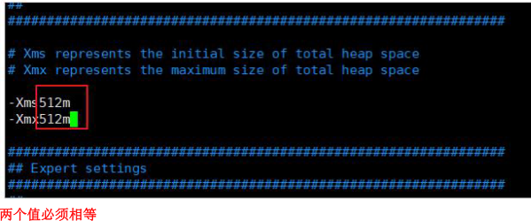

   3. 修改 elasticsearch.yml 配置文件

      第一步：集群名称，同一集群名称必须相同（可选，集群必须配置）&#x20;

      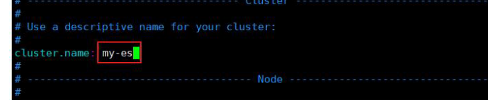

      第二步：单个节点名称 （可选，集群必须配置）&#x20;

      

      第三步：默认只允许本机访问，修改为 0.0.0.0 后则可以远程访问；端口使用默认：9200&#x20;

      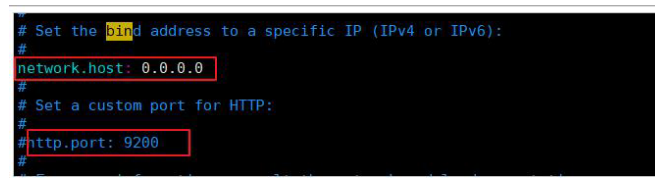

      第四步：把 bootstrap 自检程序关掉

      

      `bootstrap.memory_lock: false`&#x20;

      `bootstrap.system_call_filter: false`
      第五步：配置集群列表，这里只有一个。可以配置计算机名，也可以配置 ip 主机名是你计算机名，一定不可以写错！！

      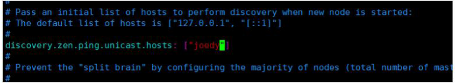

   4. 启动&#x20;

      systemctl start elasticsearch

      访问

      需要在防火墙放开端口号：
      `firewall-cmd --add-port=9200/tcp --permanent `

      `firewall-cmd --reload`

#### Kibana 介绍及安装

Kibana 是 ElasticSearch 的数据可视化和实时分析的工具，利用 ElasticSearch 的聚合功能，生成各种 图表，如柱形图，线状图，饼图等。

1. &#x20;解压缩进入 kibana 的 config 目录
2. 修改配置文件，允许访问的 ip 地址与服务器列表,修改为虚拟机 IP 地址&#x20;

   

3. 配置 elasticsearch 服务器列表：

   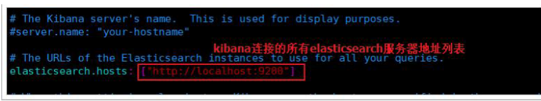

4. 启动：切换到 kibana 的 bin 目录下

   ```text
   ./kibana # 会输出日志，并独占当前窗口
   nohup ./kibana & # 后台启动(注意：&一定要加哦)
   ```

   开放 kibana 默认端口 5601

   `firewall-cmd --add-port=5601/tcp --permanent `

   `firewall-cmd --reload`

   Kibana 支持中文
   在 kibana 安装目录下的 config/kibana.yml 中修改即可。 添加 i18n.locale: "zh-CN" 重新启动即可.（先将原来的 kill 掉,然后重新启动） 注意, 上面冒号: 和 zhe-CN 之间必须有个空格，否则 kibana 无法启动 。

#### Ik 分词器

1. 把 ik 分词器 zip 文件解 压 到 ： /usr/share/elasticsearch/plugins/

   `unzip elasticsearch-analysis-ik-6.8.1.zip -d ik-analyzer`

2. 重启 elasticsearch : 再次测试：
   ```text
   GET _analyze {
   "analyzer": "ik_smart", #ik_max_word
   "text": "我是中国人"
   }
   ```

配置远程词库

1. 创建可以被访问的静态静态链接，可以达到远程资源

   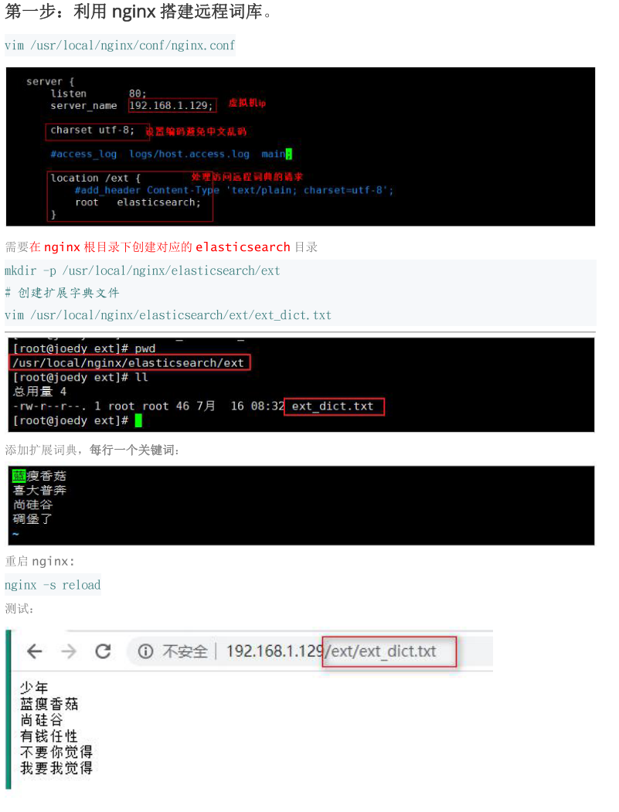

2. 在 ik 分词器中引用远程词库&#x20;

   进入 ik 分词器的 conf 目录：

   `cd /usr/share/elasticsearch/plugins/ik-analyzer/config/ `

   `vim /usr/share/elasticsearch/plugins/ik-analyzer/config/IKAnalyzer.cfg.xml`

   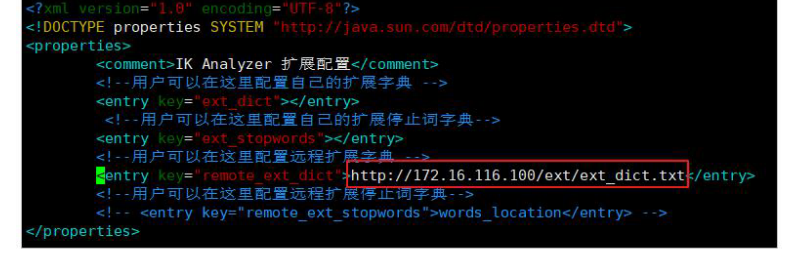

3. 重启 elasticsearch 服务&#x20;

   再次测试
   systemctl restart elasticsearch

### elasticsearch 基本概念：

Elasticsearch 也是基于 Lucene 的全文检索库，本质也是存储数据，很多概念与 MySQL 类似的。

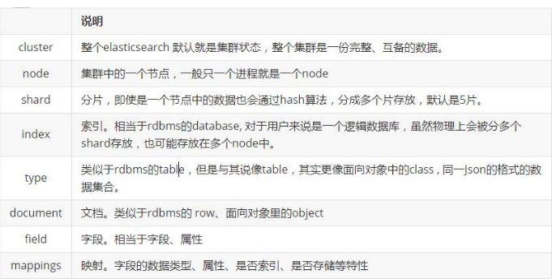

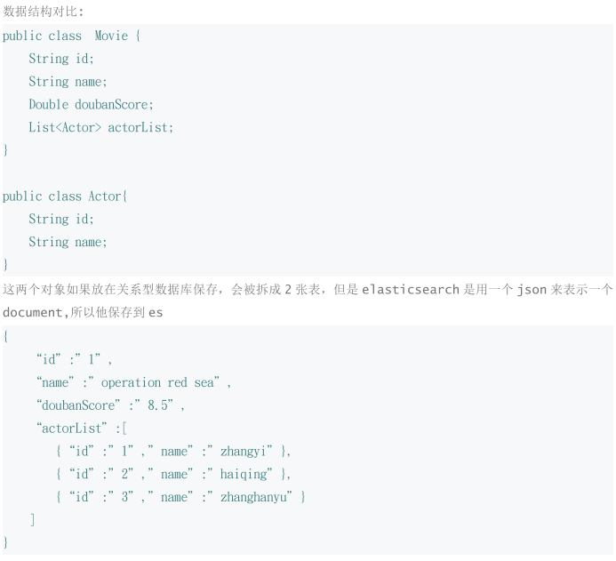

要注意的是：Elasticsearch 本身就是分布式的，因此即便你只有一个节点，Elasticsearch 默认也会对你 的数据进行分片和副本操作，当你向集群添加新数据时，数据也会在新加入的节点中进行平衡。

### 索引操作（index）

#### 创建索引

PUT /索引名&#x20;

```java
PUT /atguigu
{
"settings": { "number_of_shards": 3, "number_of_replicas": 2}
}

```

#### 查询所有索引库信息

GET /\_cat/indices?v

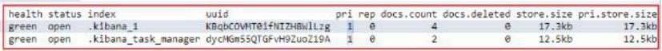

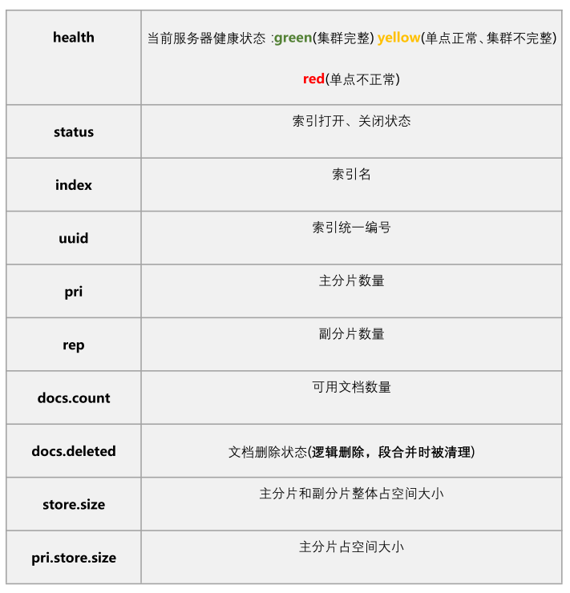

#### 查看某个索引库信息

GET /索引名

#### 删除索引

DELETE /索引库名

### 类型(type)与映射(\_mapping)配置

#### 创建类型映射

```java
PUT /atguigu/_mapping/goods { //或为PUT /atguigu/goods/_mapping {
  "properties": {
    "title": {
    "type": "text",
    "analyzer": "ik_max_word"
    },
    "images": {
    "type": "keyword",
    "index": "false"
    },
    "price": {
    "type": "long"
    }
  }
}
```

类型名称：就是前面将的 type 的概念，类似于数据库中的表&#x20;

字段名：任意填写，下面指定许多属性，例如：title、subtitle、images、price&#x20;

1. type：类型，Elasticsearch 中支持的数据类型非常丰富，说几个关键的：&#x20;

   ①String 类型，又分两种： text：可分词 keyword：不可分词，数据会作为完整字段进行匹配
   ②Numerical：数值类型，分两类 基本数据类型：long、interger、short、byte、double、float、half_float 浮点数的高精度类型：scaled_float
   ③Date：日期类型&#x20;

   ④Array：数组类型

   ⑤Object：对象

2. index：是否索引，默认为 true，也就是说你不进行任何配置，所有字段都会被索引。 true：字段会被索引，则可以用来进行搜索 false：字段不会被索引，不能用来搜索
3. store：是否将数据进行独立存储，默认为 false 原始的文本会存储在\_source 里面，默认情况下其他提取出来的字段都不是独立存储的，是从\_source 里面提取出来的。当然你也可以独立的存储某个字段，只要设置"store": true 即可，获取独立存储 的字段要比从\_source 中解析快得多，但是也会占用更多的空间，所以要根据实际业务需求来设置。
4. analyzer：分词器，这里的 ik_max_word(最大限度 ik 分词),ik_smart(粗粒度 ik 分词器)即使用 ik 分词器

#### 查看映射关系

语法： GET /索引库名/\_mapping .&#x20;

示例： GET /atguigu/\_mapping .

#### 创建索引库同时进行映射配置(常用)

```java
# 请求方法：
PUT PUT /shopping2
{
  "settings": {},
  "mappings": {
    "product":{
      "properties": {
        "title":{"type": "text", "analyzer": "ik_max_word"},
        "subtitle":{ "type": "text", "analyzer": "ik_max_word"},
        "images":{ "type": "keyword", "index": false},
        "price":{ "type": "float", "index": true}
      }
    }
  }
}
```

## 文档操作

### 新增文档

#### 自动生成 id

```java
POST /索引库名/类型名
{
"key":"value"
}
```

#### 自定义 id

```java
POST /索引库名/类型/id值
{
...
}
```

#### 查询指定索引库中所有的文档

GET /atguigu/\_search

#### 查看某个文档

请求方法：GET GET /atguigu/goods/Pbso9dsfdsfs7I（id 值）

#### 智能判断

你不需要给索引库设置任何 mapping 映射，它也可以根据你输入的数据来 判断类型，动态添加数据映射。测试一下：

```java
POST /atguigu/goods/2
{
"title":"小米手机",
"images":"http://image.jd.com/12479122.jpg",
"price":2899,
"stock": 200,
"saleable":true,
"attr": { "category": "手机", "brand": "小米"}
}
//运行结果stock，saleable，attr都被成功映射了。
```

### 删除数据

#### 根据 id 进行删除

DELETE /索引库名/类型名/id 值

实例：DELETE /atguigu/goods/3

#### 根据条件删除

```java
# 请求方式：POST
POST /atguigu/_delete_by_query {
"query":{ "match":{ "title":"手机"}
 }
}
#这样写表示在atguigu索引库中将所有表中的title字段带有‘手机’的文档删除
#当然也可以指定在某个库的某个表中直接按着查询条件删除，例如：
POST /atguigu/goods/_delete_by_query {
  "query":{
    "match":{ "title":"手机"}
   }
 }
```

### 修改数据

#### 整体覆盖

把刚才新增的请求方式改为 PUT 或者 POST。不过必须指定 id，

- id 对应文档存在，则修改 - id 对应文档不存在，则新增

比如，我们把 id 为 2 的数据进行修改：

```java
PUT|POST /atguigu/goods/2
{
  "title":"超米手机",
  "images":"http://image.jd.com/12479122.jpg",
  "price":2999,
  "stock": 200,
  "saleable":true,
  "attr": { "category": "手机", "brand": "小米"}
}
```

#### 更新字段

更新使用 POST 请求,语法：

```java
POST /{index}/{type}/{id}/_update
{
"doc": { 字段名: 字段值}
}
```

### 查询数据

#### 在 query 里的匹配查询

使用 elasticsearch 进行数据查询通常的一般形式为

```java
GET /{index}/_search
{
"query":{
  "查询的类型":{}
 }
}
```

1. 匹配所有

   ```java
   GET /atguigu/_search
   {
     "query":{
     "match_all": {}
     }
   }
   ```

2. 模糊匹配

   ```java
   GET /atguigu/_search
   {
     "query": {
       "match": {
         "title": "小米手机"
       }
     }
   }
   #注意：title默认会分词哦，而且分词之后的的‘小米’和’手机’是”或”的关系

   GET /atguigu/_search
   {
     "query": {
       "match": {
         "title": "小米手机",
         "operator": "and"
       }
     }
   }
   #子属性匹配:
   GET /atguigu/_search
   {
     "query": {
       "match": {
       "attr.brand": "小米"
       }
     }
   }
   ```

3. 短语匹配(match_phrase)

   ```java
   GET /atguigu/_search
   {
     "query": {
       "match_phrase": {
       "title": "小米手机"
       }
     }
   }
   ```

4. 多字段匹配查询(multi_match)

   ```java
   GET /atguigu/_search
   {
     "query":{
       "multi_match": {
       "query": "小米",
       "fields": ["title", "attr.brand.keyword"]
       }
     }
   }
   ```

5. 精准词条(单值)查询（term）

   ```java
   GET /atguigu/_search
   {
     "query":{
       "term":{
       "price": 4999
       }
     }
   }
   ```

6. 多词条(值)精确查询(terms)

   ```java
   GET /atguigu/_search
   {
     "query":{
       "terms":{
       "price":[2699,3999]
       }
     }
   }
   ```

7. 范围查询（range）

   ```java
   GET /atguigu/_search
   {
     "query":{
       "range": {
         "price": {
         "gte": 1000,
         "lt":
         3000
         }
       }
     }
   }
   ```

   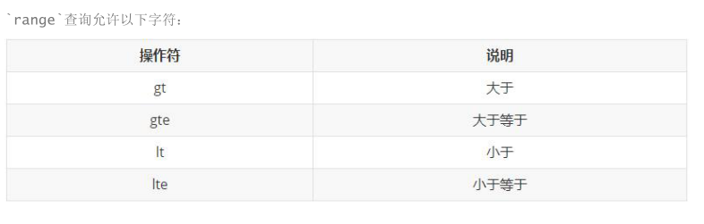

8. 偏差查询（fuzzy）

   ```java
   GET /atguigu/_search
   {
     "query": {
       "fuzzy": {
         "title": {
         "value": "oppe",
         "fuzziness": 1
         }
       }
     }
   }
   ```

9. 布尔组合（bool)

   布尔查询又叫组合查询 `bool`把各种其它查询通过`must`（与）、`must_not`（非）、`should`（或）的方式进行组合,可以实 现组合查询，格式{"bool":{"must":\[],"should":\[],"must_not":\[]}}

   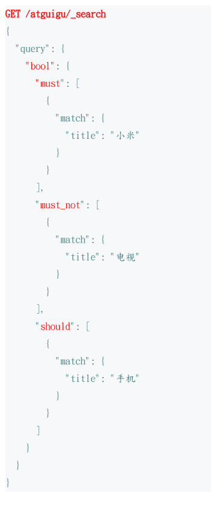

10. 过滤（filter）

    所有的查询都会影响到文档的评分及排名。如果我们需要在查询结果中进行过滤，并且不希望过滤条件影响评分， 那么就不要把过滤条件作为查询条件来用。而是使用`filter`方式：filter 可以对 bool 组合结果进一步过 滤

    ```java
    GET /atguigu/_search
    {
      "query": {
        "bool": {
        "must": [{ "match": { "title": "小米手机" }}],
        "filter": { "range": { "price": { "gt": 1000, "lt": 2000 }}}
        }
      }
    }
    ```

在 query 同级的查询过滤

1. 排序（sort）

   ```java
   GET /atguigu/_search
   {
     "query": {
       "match": {
       "title": "小米手机"
       }
     },
     "sort": [ {"price": { "order": "desc" }}, {"_score": { "order": "desc"} } ]
   }
   #desc降序
   #asc升序
   ```

2. 分页（from/size）

   ```java
   GET /atguigu/_search
   {
     "query": { "match": { "title": "小米手机"}},
     "from": 2,
     "size": 2
   }
   ```

   from：从那一条开始,从 0 开始&#x20;

   size：取多少条,这两个字段和 query 并列哦

3. 高亮（highlight）

   ```java
   GET /atguigu/_search
   {
     "query": {
       "match": {
       "title": "小米"
       }
     },
     "highlight": {
     "fields": {"title": {}},
     "pre_tags": "<em class=’color:red’>",
     "post_tags": "</em>"
     }
   }
   ```

   fields：高亮字段&#x20;

   pre_tags：前置标签&#x20;

   post_tags：后置标签

4. 结果过滤（\_source）

   默认情况下，elasticsearch 在搜索的结果中，会把文档中保存在`_source`的所有字段都返回。 如果我们只想获取其中的部分字段，可以添加`_source`的过滤

   ```java
   GET /atguigu/_search
   {
     "_source": ["title","price"],
     "query": { "term": { "price": 2699} }
   }
   #当然也可以用_source 内部的 includes 包含某些和 excludes 排除某些字段,这两个属性一般只指定 includes 就可以了。
   #"_source": { "includes": ["price","title"],
   #从所有字段中，只查询price和title两个字段
   #"excludes": ["price"]
   #从price和title两个字段中再排除price字段
   ```

## 聚合

Elasticsearch 中的聚合，包含多种类型，最常用的两种，一个叫`桶`，一个叫`度量`：

#### 桶（bucket）

桶的作用，是按照某种方式对数据进行分组，每一组数据在 ES 中称为一个`桶`

```java
- Date Histogram Aggregation：根据日期阶梯分组，例如给定阶梯为周，会自动每周分为一组
- Histogram Aggregation：根据数值阶梯分组，与日期类似
- Terms Aggregation：根据词条内容分组，词条内容完全匹配的为一组
- Range Aggregation：数值和日期的范围分组，指定开始和结束，然后按段分组
```

#### 度量（metrics）

分组完成以后，我们一般会对组中的数据进行聚合运算，例如求平均值、最大、最小、求和等，这些在 ES 中称 为`度量`。所以桶就是对数据分组，而度量就是对分组后的数据进行聚合运算。

```java
- Avg Aggregation：求平均值
- Max Aggregation：求最大值
- Min Aggregation：求最小值
- Percentiles Aggregation：求百分比
- Stats Aggregation：同时返回avg、max、min、sum、count等
- Sum Aggregation：求和
- Top hits Aggregation：求前几
- Value Count Aggregation：求总数
```

代码实例

首先，我们按照手机的品牌`attr.brand.keyword`（不能分词）来划分`桶`

```java
GET /atguigu/_search
{
  "size" : 0,
  "aggs" : {
    "brands" : {
      "terms" : {
      "field" : "attr.brand.keyword"
      }
    }
  }
}
- size： 查询条数，这里设置为 0，因为我们不关心搜索到的数据，只关心聚合结果，提高效率
- aggs：声明这是一个聚合查询，是 aggregations的缩写
- brands：给这次聚合起一个名字，任意。
- terms：划分桶的方式，这里是根据词条划分
- field：划分桶的字段，从数据属性中挑选的
```

桶内度量

```java
GET /atguigu/_search
{
  "size" : 0,
  "aggs" : {
    "brands" : {
      "terms" : {
        "field" : "attr.brand.keyword"
        },
        "aggs":{ "avg_price": { "avg": { "field": "price"} } }
      }
    }
}
- aggs：我们在上一个 aggs(brands)中添加新的 aggs。可见`度量`也是一个聚合
- avg_price：聚合的名称
- avg：度量的类型，这里是求平均值
- field：度量运算的字段
```
