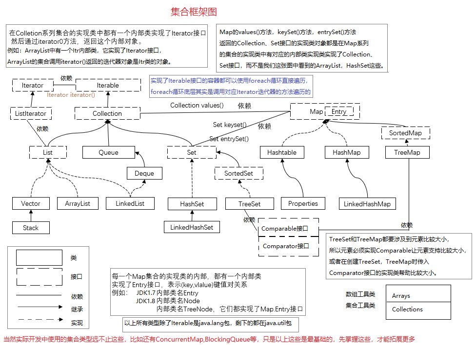
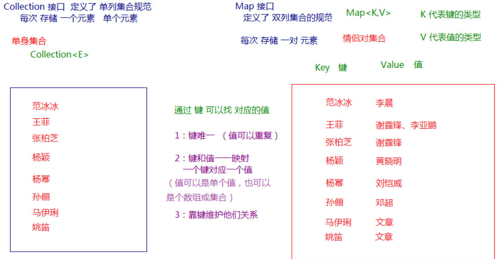
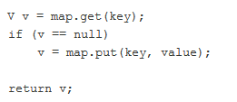
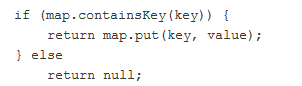
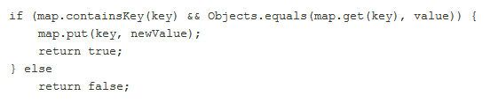
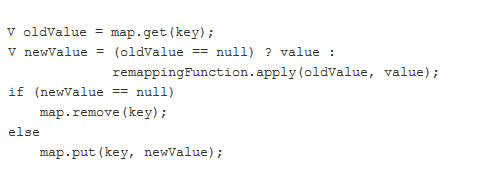
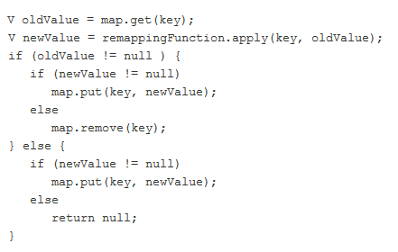
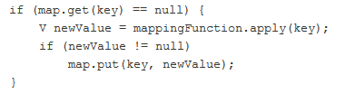
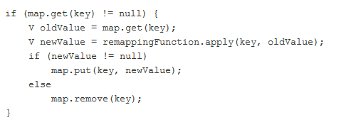
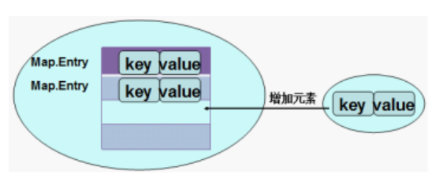

# Map

## 目录

- [概述](#概述)
- [12.6.2 Map常用方法](#1262-Map常用方法)
- [Map集合的遍历](#Map集合的遍历)
- [Map的实现类们](#Map的实现类们)
  - [1、HashMap和Hashtable的区别与联系](#1HashMap和Hashtable的区别与联系)
  - [2、LinkedHashMap](#2LinkedHashMap)
  - [3、TreeMap](#3TreeMap)
  - [4、Properties](#4Properties)
- [Set集合与Map集合的关系](#Set集合与Map集合的关系)



### 概述

现实生活中，我们常会看到这样的一种集合：IP地址与主机名，身份证号与个人，系统用户名与系统用户对象等，这种一一对应的关系，就叫做映射。Java提供了专门的集合类用来存放这种对象关系的对象，即`java.util.Map<K,V>`接口。

我们通过查看`Map`接口描述，发现`Map<K,V>`接口下的集合与`Collection<E>`接口下的集合，它们存储数据的形式不同。

- `Collection`中的集合，元素是孤立存在的（理解为单身），向集合中存储元素采用一个个元素的方式存储。
- `Map`中的集合，元素是成对存在的(理解为夫妻)。每个元素由键与值两部分组成，通过键可以找对所对应的值。
- `Collection`中的集合称为单列集合，`Map`中的集合称为双列集合。
- 需要注意的是，`Map`中的集合不能包含重复的键，值可以重复；每个键只能对应一个值（这个值可以是单个值，也可以是个数组或集合值）。key可以为null



### 12.6.2 Map常用方法

1、添加操作

- V put(K key,V value)   如果Map包含put的key，返回被替代的value值；如果没有，返回null
- void putAll(Map\<? extends K,? extends V> m)

2、删除

- void clear()
- V remove(Object key) 如果Map中找到对应的key删除这个键值对，返回被删除的value；如果没有找到返回null

3、元素查询的操作

- V get(Object key)
- boolean containsKey(Object key)
- boolean containsValue(Object value)
- boolean isEmpty()

4、元视图操作的方法：

- Set\<K> keySet()
- Collection\<V> values()
- Set\<Map.Entry\<K,V>> entrySet()

5、其他方法

- int size()

6、 java8新增的方法

- default V putIfAbsent(K key,V value) 增强put方法 ，查看map中是否存在key，存在不插入，返回擦寻到的键值对的value值；如果查询结果为null 把这个键值对插入；



- default V replace(K key,V value) 仅当它当前映射到某一值时，替换指定的键的条目。



- default **boolean** replace(K key,V oldValue,V newValue)，也会进行替换，但返回值为boolean



- default V merge(K key, V value,

  BiFunction\<? super V,? super V,? extends V> remappingFunction)



- default V getOrDefault(Object key,V defaultValue)  返回指定的键映射的值，或 defaultValue如果这个Map不包含的键映射。此方法没有把数据替换map
- default V compute(K key,BiFunction\<? super K,? super V,? extends V> remappingFunction)



- default V computeIfAbsent(K key,Function\<? super K,? extends V> mappingFunction)



- default V computeIfPresent(K key,

  BiFunction\<? super K,? super V,? extends V> remappingFunction)



```java
public class MapDemo {
    public static void main(String[] args) {
        //创建 map对象
        HashMap<String, String>  map = new HashMap<String, String>();
        //添加元素到集合
        map.put("黄晓明", "杨颖");
        map.put("文章", "马伊琍");
        map.put("邓超", "孙俪");
        System.out.println(map);
        //String remove(String key)
        System.out.println(map.remove("邓超"));
        System.out.println(map);
        // 想要查看 黄晓明的媳妇 是谁
        System.out.println(map.get("黄晓明"));
        System.out.println(map.get("邓超"));    
        Collection collection=map.values;
    }
}
```


> tips:使用put方法时，若指定的键(key)在集合中没有，则没有这个键对应的值，返回null，并把指定的键值添加到集合中。若指定的键(key)在集合中存在，则返回值为集合中键对应的值（该值为替换前的值），并把指定键所对应的值，替换成指定的新值。&#x20;

### Map集合的遍历

Collection集合的遍历：（1）foreach（2）通过Iterator对象遍历

Map的遍历，不能支持foreach，因为Map接口没有继承java.lang.Iterable\<T>接口，也没有实现Iterator iterator()方法。只能用如下方式遍历：

（1）分开遍历：

- 单独遍历所有key
- 单独遍历所有value

（2）成对遍历：

- 遍历的是映射关系Map.Entry类型的对象，Map.Entry是Map接口的内部接口。每一种Map内部有自己的Map.Entry的实现类。在Map中存储数据，实际上是将Key---->value的数据存储在Map.Entry接口的实例中，再在Map集合中插入Map.Entry的实例化对象，如图示：



```java
public class TestMap {
  public static void main(String[] args) {
    HashMap<String,String> map = new HashMap<>();
    map.put("许仙", "白娘子");
    map.put("董永", "七仙女");
    map.put("牛郎", "织女");
    map.put("许仙", "小青");
    
    System.out.println("所有的key:");
    Set<String> keySet = map.keySet();
    for (String key : keySet) {
      System.out.println(key);
    }
    
    System.out.println("所有的value：");
    Collection<String> values = map.values();
    for (String value : values) {
      System.out.println(value);
    }
    
    System.out.println("所有的映射关系");
    Set<Map.Entry<String,String>> entrySet = map.entrySet();
    for (Map.Entry<String,String> entry : entrySet) {
//      System.out.println(entry);
      System.out.println(entry.getKey()+"->"+entry.getValue());
    }
  }
}
```


### Map的实现类们

Map接口的常用实现类：HashMap、TreeMap、LinkedHashMap和Properties。其中HashMap是 Map 接口使用频率最高的实现类。

#### **1、HashMap和Hashtable的区别与联系**

- HashMap和Hashtable都是哈希表。
- HashMap和Hashtable判断两个 key 相等的标准是：两个 key 的hashCode 值相等，并且 equals() 方法也返回 true。因此，为了成功地在哈希表中存储和获取对象，用作键的对象必须实现 hashCode 方法和 equals 方法。
- Hashtable是线程安全的，任何非 null 对象都可以用作键或值。
- HashMap是线程不安全的，并允许使用 null 值和 null 键。

示例代码：添加员工姓名为key，薪资为value

```java
public static void main(String[] args) {
    HashMap<String,Double> map = new HashMap<>();
    map.put("张三", 10000.0);
    //key相同，新的value会覆盖原来的value
    //因为String重写了hashCode和equals方法
    map.put("张三", 12000.0);
    map.put("李四", 14000.0);
    //HashMap支持key和value为null值
    String name = null;
    Double salary = null;
    map.put(name, salary);
    
    Set<Entry<String, Double>> entrySet = map.entrySet();
    for (Entry<String, Double> entry : entrySet) {
      System.out.println(entry);
    }
  }
```


#### **2、LinkedHashMap**

LinkedHashMap 是 HashMap 的子类。此实现与 HashMap 的不同之处在于，后者维护着一个运行于所有条目的双重链接列表。此链接列表定义了迭代顺序，该迭代顺序通常就是将键插入到映射中的顺序（插入顺序）。

示例代码：添加员工姓名为key，薪资为value

```java
public static void main(String[] args) {
    LinkedHashMap<String,Double> map = new LinkedHashMap<>();
    map.put("张三", 10000.0);
    //key相同，新的value会覆盖原来的value
    //因为String重写了hashCode和equals方法
    map.put("张三", 12000.0);
    map.put("李四", 14000.0);
    //HashMap支持key和value为null值
    String name = null;
    Double salary = null;
    map.put(name, salary);
    
    Set<Entry<String, Double>> entrySet = map.entrySet();
    for (Entry<String, Double> entry : entrySet) {
      System.out.println(entry);
    }
  }
```


#### **3、TreeMap**

基于红黑树（Red-Black tree）的 NavigableMap 实现。该映射根据其键的自然顺序进行排序，或者根据创建映射时提供的 Comparator 进行排序，具体取决于使用的构造方法。

代码示例：添加员工姓名为key，薪资为value

```java
package com.atguigu.map;
import java.util.Comparator;
import java.util.Map.Entry;
import java.util.Set;
import java.util.TreeMap;
import org.junit.Test;
public class TestTreeMap {
  @Test
  public void test1() {
    TreeMap<String,Integer> map = new TreeMap<>();
    map.put("Jack", 11000);
    map.put("Alice", 12000);
    map.put("zhangsan", 13000);
    map.put("baitao", 14000);
    map.put("Lucy", 15000);
    
    //String实现了Comparable接口，默认按照Unicode编码值排序
    Set<Entry<String, Integer>> entrySet = map.entrySet();
    for (Entry<String, Integer> entry : entrySet) {
      System.out.println(entry);
    }
  }
  @Test
  public void test2() {
    //指定定制比较器Comparator，按照Unicode编码值排序，但是忽略大小写
    TreeMap<String,Integer> map = new TreeMap<>(new Comparator<String>() {
      @Override
      public int compare(String o1, String o2) {
        return o1.compareToIgnoreCase(o2);
      }
    });
    map.put("Jack", 11000);
    map.put("Alice", 12000);
    map.put("zhangsan", 13000);
    map.put("baitao", 14000);
    map.put("Lucy", 15000);
    
    Set<Entry<String, Integer>> entrySet = map.entrySet();
    for (Entry<String, Integer> entry : entrySet) {
      System.out.println(entry);
    }
  }
}
```


#### **4、Properties**

Properties 类是 Hashtable 的子类，Properties 可保存在流中或从流中加载。属性列表中每个键及其对应值都是一个字符串。

存取数据时，建议使用setProperty(String key,String value)方法和getProperty(String key)方法。

代码示例：

```java
public static void main(String[] args) {
    Properties properties = System.getProperties();
    String p2 = properties.getProperty("file.encoding");//当前源文件字符编码
    System.out.println(p2);
  }
```


### Set集合与Map集合的关系

Set的内部实现其实是一个Map。即HashSet的内部实现是一个HashMap，TreeSet的内部实现是一个TreeMap，LinkedHashSet的内部实现是一个LinkedHashMap。

部分源代码摘要：

HashSet源码：

```java
public HashSet() {
        map = new HashMap<>();
    }
    public HashSet(Collection<? extends E> c) {
        map = new HashMap<>(Math.max((int) (c.size()/.75f) + 1, 16));
        addAll(c);
    }
    public HashSet(int initialCapacity, float loadFactor) {
        map = new HashMap<>(initialCapacity, loadFactor);
    }
    public HashSet(int initialCapacity) {
        map = new HashMap<>(initialCapacity);
    }
  //这个构造器是给子类LinkedHashSet调用的
    HashSet(int initialCapacity, float loadFactor, boolean dummy) {
        map = new LinkedHashMap<>(initialCapacity, loadFactor);
    }
```


LinkedHashSet源码：

```java
public LinkedHashSet(int initialCapacity, float loadFactor) {
        super(initialCapacity, loadFactor, true);//调用HashSet的某个构造器
    }
    public LinkedHashSet(int initialCapacity) {
        super(initialCapacity, .75f, true);//调用HashSet的某个构造器
    }
    public LinkedHashSet() {
        super(16, .75f, true);
    }
    public LinkedHashSet(Collection<? extends E> c) {
        super(Math.max(2*c.size(), 11), .75f, true);//调用HashSet的某个构造器
        addAll(c);
    }
```


TreeSet源码：

```java
public TreeSet() {
        this(new TreeMap<E,Object>());
    }
    public TreeSet(Comparator<? super E> comparator) {
        this(new TreeMap<>(comparator));
    }
    public TreeSet(Collection<? extends E> c) {
        this();
        addAll(c);
    }
    public TreeSet(SortedSet<E> s) {
        this(s.comparator());
        addAll(s);
    }
```


但是，咱们存到Set中只有一个元素，又是怎么变成(key,value)的呢？

以HashSet中的源码为例：

```java
private static final Object PRESENT = new Object();
public boolean add(E e) {
    return map.put(e, PRESENT)==null;
}
public Iterator<E> iterator() {
    return map.keySet().iterator();
}
```


原来是，把添加到Set中的元素作为内部实现map的key，然后用一个常量对象PRESENT对象，作为value。

这是因为Set的元素不可重复和Map的key不可重复有相同特点。Map有一个方法keySet()可以返回所有key。
