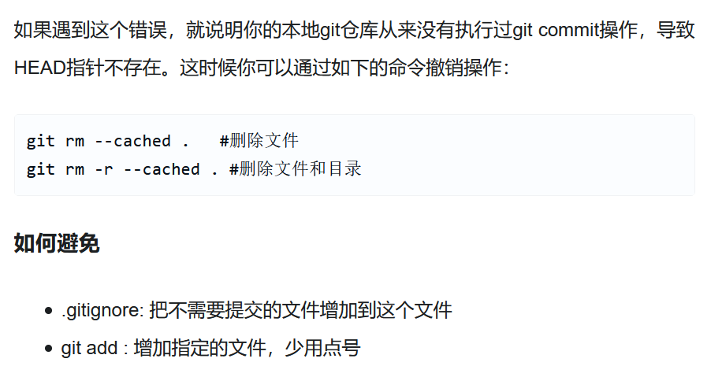

# git

## 目录

- [工作区和暂存区](#工作区和暂存区)
- [提交到远程仓库](#提交到远程仓库)
- [从远程仓库克隆](#从远程仓库克隆)
- [删除文件](#删除文件)
- [查看不同](#查看不同)
- [版本回退](#版本回退)
- [管理修改](#管理修改)
- [撤销修改](#撤销修改)
- [分支操作](#分支操作)
- [合并冲突解决](#合并冲突解决)
- [分支管理](#分支管理)
- [标签管理](#标签管理)
- [创建标签](#创建标签)
- [操作标签](#操作标签)
- [忽略特殊文件](#忽略特殊文件)
- [错误](#错误)

[git 在 idea 的使用](https://blog.csdn.net/xiaobai__lee/article/details/81081128 "git在idea的使用")

[git 在 idea 的使用 2](https://www.cnblogs.com/wangju/p/11808235.html "git在idea的使用2")

[Git Pull Failed 原因和解决办法](https://blog.csdn.net/weixin_44259720/article/details/103024510?utm_medium=distribute.pc_relevant.none-task-blog-BlogCommendFromMachineLearnPai2-2.edu_weight&depth_1-utm_source=distribute.pc_relevant.none-task-blog-BlogCommendFromMachineLearnPai2-2.edu_weight "Git Pull Failed 原因和解决办法")

[git 合并出现 fatal: refusing to merge unrelated histories 错误](https://blog.csdn.net/su1573/article/details/91990437 "git 合并出现 fatal: refusing to merge unrelated histories 错误")

### 工作区和暂存区

**工作区（Working Directory）**

就是你在电脑里能看到的目录

**版本库（Repository）**

工作区有一个隐藏目录`.git`，这个不算工作区，而是 Git 的版本库。

Git 的版本库里存了很多东西，其中最重要的就是称为 stage（或者叫 index）的暂存区，还有 Git 为我们自动创建的第一个分支`master`，以及指向`master`的一个指针叫`HEAD`。

第一步是用`git add`把文件添加进去，实际上就是把文件修改添加到暂存区；

第二步是用`git commit`提交更改，实际上就是把暂存区的所有内容提交到当前分支。

因为我们创建 Git 版本库时，Git 自动为我们创建了唯一一个`master`分支，所以，现在，`git commit`就是往`master`分支上提交更改。

你可以简单理解为，需要提交的文件修改通通放到暂存区，然后，一次性提交暂存区的所有修改。

### 提交到远程仓库

使用步骤

1. 在本地创建 repository mkdir 版本库名
2. cd 版本库名
3. `pwd` 查看当前目录位置
4. git init 把这个目录变为 git 管理的
5. git add 添加文件和目录 ( git add .)
6. git commit -m "注解信息" 提交文件到本地 git 仓库

   git commit 命令执行成功后会告诉你，1 file changed：1 个文件被改动（我们新添加的 readme.txt 文件）；2 insertions：插入了两行内容（readme.txt 有两行内容）。

7. git branch -M master 使用 master 分支
8. git remote add origin github 远程仓库链接 与远程仓库建立关联
9. git push-u origin master 推送 master 分支到远程仓库 第一次操作登录账号

   其后使用`git push origin master`

### 从远程仓库克隆

1. 位于你想克隆的目录下
2. git clone 远程仓库链接

### 删除文件

1. rm 文件
2. git status 查看结果
3. 一是确实要从版本库中删除该文件，那就用命令 git rm 删掉，并且 git commit：
4. 另一种情况是删错了，把误删的文件恢复到最新版本：git checkout -- test.txt

### 查看不同

1. git status 查看提交结果
2. git diff

### 版本回退

1. `git log`命令显示从最近到最远的提交日志。如果嫌输出信息太多，看得眼花缭乱的，可以试试加上`--pretty=oneline`参数
2. `git reset --hard HEAD^ ` 返回上一次提交的版本

   `git reset --hard HEAD^^` 返回上上一次提交的版本

   `git reset --hard HEAD~100` 返回前 100 次提交的版本

   `git reset --hard 版本号（前几位就可）` 到指定版本

   `git reflog` 查看提交操作

### 管理修改

1. 有流程为 `第一次修改 -> git add -> 第二次修改 -> git add -> git commit` 提交的为第一次修改的内容 git 管理的是修改，即 add 添加的文件
2. 提交后，用`git diff HEAD -- readme.txt`命令可以查看工作区和版本库里面最新版本的区别

### 撤销修改

场景 1：当你改乱了工作区某个文件的内容，想直接丢弃工作区的修改时，用命令`git checkout -- file`。

场景 2：当你不但改乱了工作区某个文件的内容，还添加到了暂存区时，想丢弃修改，分两步，第一步用命令`git reset HEAD <file>`，就回到了场景 1，第二步按场景 1 操作。

场景 3：已经提交了不合适的修改到版本库时，想要撤销本次提交，参考[版本回退](https://www.liaoxuefeng.com/wiki/896043488029600/897013573512192 "版本回退")一节，不过前提是没有推送到远程库。

---

### 分支操作

查看分支：`git branch`

创建分支：`git branch <name>`

切换分支：`git checkout <name>`或者`git switch <name>`

创建+切换分支：`git checkout -b <name>`或者`git switch -c <name>`

合并某分支到当前分支：`git merge <name>`

删除分支：`git branch -d <name>`

### 合并冲突解决

当 Git 无法自动合并分支时，就必须首先解决冲突。解决冲突后，再提交，合并完成。

解决冲突就是把 Git 合并失败的文件手动编辑为我们希望的内容，再提交。

用`git log --graph`命令可以看到分支合并图。

### 分支管理

在实际开发中，我们应该按照几个基本原则进行分支管理：

首先，`master`分支应该是非常稳定的，也就是仅用来发布新版本，平时不能在上面干活；

那在哪干活呢？干活都在`dev`分支上，也就是说，`dev`分支是不稳定的，到某个时候，比如 1.0 版本发布时，再把`dev`分支合并到`master`上，在`master`分支发布 1.0 版本；

你和你的小伙伴们每个人都在`dev`分支上干活，每个人都有自己的分支，时不时地往`dev`分支上合并就可以了。

所以，团队合作的分支看起来就像这样：


**小结**

Git 分支十分强大，在团队开发中应该充分应用。

合并分支时，加上`--no-ff`参数就可以用普通模式合并，合并后的历史有分支，能看出来曾经做过合并，而`fast forward`合并就看不出来曾经做过合并。

---

### 标签管理

发布一个版本时，我们通常先在版本库中打一个标签（tag），这样，就唯一确定了打标签时刻的版本。将来无论什么时候，取某个标签的版本，就是把那个打标签的时刻的历史版本取出来。所以，标签也是版本库的一个快照。

Git 的标签虽然是版本库的快照，但其实它就是指向某个 commit 的指针（跟分支很像对不对？但是分支可以移动，标签不能移动），所以，创建和删除标签都是瞬间完成的。

tag 就是一个让人容易记住的有意义的名字，它跟某个 commit 绑在一起

### 创建标签

- 命令`git tag <tagname>`用于新建一个标签，默认为`HEAD`，也可以指定一个 commit id；
- 命令`git tag -a <tagname> -m "blablabla..."`可以指定标签信息；
- 命令`git tag`可以查看所有标签。

### 操作标签

- 命令`git push origin <tagname>`可以推送一个本地标签；
- 命令`git push origin --tags`可以推送全部未推送过的本地标签；
- 命令`git tag -d <tagname>`可以删除一个本地标签；
- 命令`git push origin :refs/tags/<tagname>`可以删除一个远程标签。

### 忽略特殊文件

- 忽略某些文件时，需要在管理的根路径编写`.gitignore`；
- `.gitignore`文件本身要放到版本库里，并且可以对`.gitignore`做版本管理！
  ```text
  *.class
  out
  .idea
  leetcode.iml
  ```

### 错误

1. fatal: Failed to resolve 'HEAD' as a valid ref.&#x20;

   
