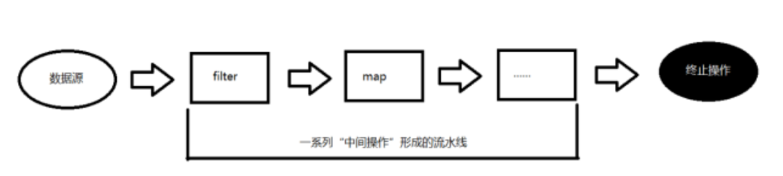

# Stream

## 目录

- [StreamAPI](#StreamAPI)
  - [创建 Stream](#创建Stream)
  - [中间操作](#中间操作)
  - [终结操作](#终结操作)
  - [17.2.4 练习](#1724-练习)

## StreamAPI

Java8 中有两大最为重要的改变。第一个是 Lambda 表达式；另外一个则是 Stream API。

Stream API ( java.util.stream) 把真正的函数式编程风格引入到 Java 中。这是目前为止对 Java 类库最好的补充，因为 Stream API 可以极大提高 Java 程序员的生产力，让程序员写出高效率、干净、简洁的代码。

Stream 是 Java8 中处理集合的关键抽象概念，它可以指定你希望对集合进行的操作，可以执行非常复杂的查找、过滤和映射数据等操作。 使用 Stream API 对集合数据进行操作，就类似于使用 SQL 执行的数据库查询。也可以使用 Stream API 来并行执行操作。简言之，Stream API 提供了一种高效且易于使用的处理数据的方式。

Stream 是数据渠道，用于操作数据源（集合、数组等）所生成的元素序列。"集合讲的是数据，负责存储数据，Stream 流讲的是计算，负责处理数据！“

注意：

①Stream 自己不会存储元素。

②Stream 不会改变源对象。每次处理都会返回一个持有结果的新 Stream。

③Stream 操作是延迟执行的。这意味着他们会等到需要结果的时候才执行。

Stream 的操作三个步骤：

1- 创建 Stream：通过一个数据源（如：集合、数组），获取一个流

2- 中间操作：中间操作是个操作链，对数据源的数据进行 n 次处理，但是在终结操作前，并不会真正执行。

3- 终止操作：一旦执行终止操作，就执行中间操作链，最终产生结果并结束 Stream。



### 创建 Stream

**1、创建 Stream 方式一：通过集合**

Java8 中的 Collection 接口被扩展，提供了两个获取流的方法：

- public default Stream\<E> stream() : 返回一个顺序流
- public default Stream\<E> parallelStream() : 返回一个并行流

**2、创建 Stream 方式二：通过数组**

Java8 中的 Arrays 的静态方法 stream() 可以获取数组流：

- public static \<T> Stream\<T> stream(T\[] array): 返回一个流

重载形式，能够处理对应基本类型的数组：

- public static IntStream stream(int\[] array)：返回一个整型数据流
- public static LongStream stream(long\[] array)：返回一个长整型数据流
- public static DoubleStream stream(double\[] array)：返回一个浮点型数据流

**3、创建 Stream 方式三：通过 Stream 的 of()**

可以调用 Stream 类静态方法 of(), 通过显示值创建一个流。它可以接收任意数量的参数。

- public static\<T> Stream\<T> of(T... values) : 返回一个顺序流

**4、创建 Stream 方式四：创建无限流**

可以使用静态方法 Stream.iterate() 和 Stream.generate(), 创建无限流。

- public static\<T> Stream\<T> iterate(final T seed, final UnaryOperator\<T> f):返回一个无限流
- public static\<T> Stream\<T> generate(Supplier\<T> s) ：返回一个无限流

```java
package com.atguigu.test06;
import java.util.Arrays;
import java.util.List;
import java.util.stream.IntStream;
import java.util.stream.Stream;
import org.junit.Test;
public class Test07StreamCreate {
  @Test
  public void test06(){
    /*
     * Stream<T> iterate(T seed, UnaryOperator<T> f)
     * UnaryOperator接口，SAM接口，抽象方法：
     *
     * UnaryOperator<T> extends Function<T,T>
     *     T apply(T t)
     */
    Stream<Integer> stream = Stream.iterate(1, num -> num+=2);
//    stream = stream.limit(10);
    stream.forEach(System.out::println);
  }

  @Test
  public void test05(){
    Stream<Double> stream = Stream.generate(Math::random);
    stream.forEach(System.out::println);
  }

  @Test
  public void test04(){
    Stream<Integer> stream = Stream.of(1,2,3,4,5);
    stream.forEach(System.out::println);
  }

  @Test
  public void test03(){
    String[] arr = {"hello","world"};
    Stream<String> stream = Arrays.stream(arr);
  }

  @Test
  public void test02(){
    int[] arr = {1,2,3,4,5};
    IntStream stream = Arrays.stream(arr);
  }

  @Test
  public void test01(){
    List<Integer> list = Arrays.asList(1,2,3,4,5);

    //JDK1.8中，Collection系列集合增加了方法
    Stream<Integer> stream = list.stream();
  }
}
```

### 中间操作

多个中间操作可以连接起来形成一个流水线，除非流水线上触发终止操作，否则中间操作不会执行任何的处理！而在终止操作时一次性全部处理，称为"惰性求值“。

**filter(Predicate p)**

接收 Lambda ， 从流中排除某些元素

**distinct()**

筛选，通过流所生成元素的 equals() 去除重复元素

**limit(long maxSize)**

截断流，使其元素不超过给定数量

**skip(long n)**

跳过元素，返回一个扔掉了前 n 个元素的流。若流中元素不足 n 个，则返回一个空流。与 limit(n) 互补

**peek(Consumer** **action)**

接收 Lambda，对流中的每个数据执行 Lambda 体操作

**sorted()**

产生一个新流，其中按自然顺序排序

**sorted(Comparator com)**

产生一个新流，其中按比较器顺序排序

**map(Function f)**

接收一个函数作为参数，该函数会被应用到每个元素上，并将其映射成一个新的元素。

**mapToDouble(ToDoubleFunction f)**

接收一个函数作为参数，该函数会被应用到每个元素上，产生一个新的 DoubleStream。

**mapToInt(ToIntFunction f)**

接收一个函数作为参数，该函数会被应用到每个元素上，产生一个新的 IntStream。

**mapToLong(ToLongFunction f)**

接收一个函数作为参数，该函数会被应用到每个元素上，产生一个新的 LongStream。

**flatMap(Function f)**

接收一个函数作为参数，将流中的每个值都换成另一个流，然后把所有流连接成一个流

```java
package com.atguigu.test06;

import java.util.Arrays;
import java.util.stream.Stream;

import org.junit.Test;

public class Test08StreamMiddle {

  @Test
  public void test12(){
    String[] arr = {"hello","world","java"};
    Arrays.stream(arr)
      .flatMap(t -> Stream.of(t.split("|")))//Function<T,R>接口抽象方法 R apply(T t)  现在的R是一个Stream
      .forEach(System.out::println);
  }


  @Test
  public void test11(){
    String[] arr = {"hello","world","java"};

    Arrays.stream(arr)
      .map(t->t.toUpperCase())
      .forEach(System.out::println);
  }

  @Test
  public void test10(){
    Stream.of(1,2,3,4,5)
      .map(t -> t+=1)//Function<T,R>接口抽象方法 R apply(T t)
      .forEach(System.out::println);
  }

  @Test
  public void test09(){
    //希望能够找出前三个最大值，前三名最大的，不重复
    Stream.of(11,2,39,4,54,6,2,22,3,3,4,54,54)
      .distinct()
      .sorted((t1,t2) -> -Integer.compare(t1, t2))//Comparator接口  int compare(T t1, T t2)
      .limit(3)
      .forEach(System.out::println);
  }

  @Test
  public void test08(){
    long count = Stream.of(1,2,3,4,5,6,2,2,3,3,4,4,5)
      .distinct()
      .peek(System.out::println)  //Consumer接口的抽象方法  void accept(T t)
      .count();
    System.out.println("count="+count);
  }


  @Test
  public void test07(){
    Stream.of(1,2,3,4,5,6,2,2,3,3,4,4,5)
      .skip(5)
      .distinct()
      .filter(t -> t%3==0)
      .forEach(System.out::println);
  }

  @Test
  public void test06(){
    Stream.of(1,2,3,4,5,6,2,2,3,3,4,4,5)
      .skip(5)
      .forEach(System.out::println);
  }

  @Test
  public void test05(){
    Stream.of(1,2,2,3,3,4,4,5,2,3,4,5,6,7)
      .distinct()  //(1,2,3,4,5,6,7)
      .filter(t -> t%2!=0) //(1,3,5,7)
      .limit(3)
      .forEach(System.out::println);
  }


  @Test
  public void test04(){
    Stream.of(1,2,3,4,5,6,2,2,3,3,4,4,5)
      .limit(3)
      .forEach(System.out::println);
  }


  @Test
  public void test03(){
    Stream.of(1,2,3,4,5,6,2,2,3,3,4,4,5)
      .distinct()
      .forEach(System.out::println);
  }


  @Test
  public void test02(){
    Stream.of(1,2,3,4,5,6)
      .filter(t -> t%2==0)
      .forEach(System.out::println);
  }

  @Test
  public void test01(){
    //1、创建Stream
    Stream<Integer> stream = Stream.of(1,2,3,4,5,6);

    //2、加工处理
    //过滤：filter(Predicate p)
    //把里面的偶数拿出来
    /*
     * filter(Predicate p)
     * Predicate是函数式接口，抽象方法：boolean test(T t)
     */
    stream = stream.filter(t -> t%2==0);

    //3、终结操作：例如：遍历
    stream.forEach(System.out::println);
  }
}
```

### 终结操作

终端操作会从流的流水线生成结果。其结果可以是任何不是流的值，例如：List、Integer，甚至是 void。流进行了终止操作后，不能再次使用。

**boolean** **allMatch(Predicate p)**

检查是否匹配所有元素

**boolean** **anyMatch**(**Predicate p**)

检查是否至少匹配一个元素

**boolean** **noneMatch(Predicate p)**

检查是否没有匹配所有元素

**Optional\<T>** **findFirst()**

返回第一个元素

**Optional\<T>** **findAny()**

返回当前流中的任意元素

**long** **count()**

返回流中元素总数

**Optional\<T>** **max(Comparator c)**

返回流中最大值

**Optional\<T>** **min(Comparator c)**

返回流中最小值

**void** **forEach(Consumer c)**

迭代

**T** **reduce(T iden, BinaryOperator b)**

可以将流中元素反复结合起来，得到一个值。返回 T

**U** **reduce(BinaryOperator b)**

可以将流中元素反复结合起来，得到一个值。返回 Optional\<T>

**R** **collect(Collector c)**

将流转换为其他形式。接收一个 Collector 接口的实现，用于给 Stream 中元素做汇总的方法

Collector 接口中方法的实现决定了如何对流执行收集的操作(如收集到 List、Set、Map)。另外， Collectors 实用类提供了很多静态方法，可以方便地创建常见收集器实例。

```java
package com.atguigu.test06;
import java.util.List;
import java.util.Optional;
import java.util.stream.Collectors;
import java.util.stream.Stream;
import org.junit.Test;
public class Test09StreamEnding {

  @Test
  public void test14(){
    List<Integer> list = Stream.of(1,2,4,5,7,8)
        .filter(t -> t%2==0)
        .collect(Collectors.toList());

    System.out.println(list);
  }


  @Test
  public void test13(){
    Optional<Integer> max = Stream.of(1,2,4,5,7,8)
       .reduce((t1,t2) -> t1>t2?t1:t2);//BinaryOperator接口   T apply(T t1, T t2)
    System.out.println(max);
  }

  @Test
  public void test12(){
    Integer reduce = Stream.of(1,2,4,5,7,8)
       .reduce(0, (t1,t2) -> t1+t2);//BinaryOperator接口   T apply(T t1, T t2)
    System.out.println(reduce);
  }

  @Test
  public void test11(){
    Optional<Integer> max = Stream.of(1,2,4,5,7,8)
        .max((t1,t2) -> Integer.compare(t1, t2));
    System.out.println(max);
  }

  @Test
  public void test10(){
    Optional<Integer> opt = Stream.of(1,2,4,5,7,8)
        .filter(t -> t%3==0)
        .findFirst();
    System.out.println(opt);
  }

  @Test
  public void test09(){
    Optional<Integer> opt = Stream.of(1,2,3,4,5,7,9)
        .filter(t -> t%3==0)
        .findFirst();
    System.out.println(opt);
  }

  @Test
  public void test08(){
    Optional<Integer> opt = Stream.of(1,3,5,7,9).findFirst();
    System.out.println(opt);
  }

  @Test
  public void test04(){
    boolean result = Stream.of(1,3,5,7,9)
      .anyMatch(t -> t%2==0);
    System.out.println(result);
  }


  @Test
  public void test03(){
    boolean result = Stream.of(1,3,5,7,9)
      .allMatch(t -> t%2!=0);
    System.out.println(result);
  }

  @Test
  public void test02(){
    long count = Stream.of(1,2,3,4,5)
        .count();
    System.out.println("count = " + count);
  }

  @Test
  public void test01(){
    Stream.of(1,2,3,4,5)
        .forEach(System.out::println);
  }
}
```

### 17.2.4 练习

案例：

现在有两个 ArrayList 集合存储队伍当中的多个成员姓名，要求使用传统的 for 循环（或增强 for 循环）依次进行以下若干操作步骤：

1. 第一个队伍只要名字为 3 个字的成员姓名；存储到一个新集合中。
2. 第一个队伍筛选之后只要前 3 个人；存储到一个新集合中。
3. 第二个队伍只要姓张的成员姓名；存储到一个新集合中。
4. 第二个队伍筛选之后不要前 2 个人；存储到一个新集合中。
5. 将两个队伍合并为一个队伍；存储到一个新集合中。
6. 根据姓名创建 Person 对象；存储到一个新集合中。
7. 打印整个队伍的 Person 对象信息。

Person 类的代码为：

```java
public class Person {
    private String name;
    public Person() {}
    public Person(String name) {
        this.name = name;
    }    
    public String getName() {
        return name;
    }
    public void setName(String name) {
        this.name = name;
    }
    @Override
    public String toString() {
        return "Person{name='" + name + "'}";
    }
}
```

两个队伍（集合）的代码如下：

```java
public static void main(String[] args) {
       //第一支队伍
        ArrayList<String> one = new ArrayList<>();
        one.add("迪丽热巴");
        one.add("宋远桥");
        one.add("苏星河");
        one.add("石破天");
        one.add("石中玉");
        one.add("老子");
        one.add("庄子");
        one.add("洪七公");
        //第二支队伍
        ArrayList<String> two = new ArrayList<>();
        two.add("古力娜扎");
        two.add("张无忌");
        two.add("赵丽颖");
        two.add("张三丰");
        two.add("尼古拉斯赵四");
        two.add("张天爱");
        two.add("张二狗");

    // ....编写代码完成题目要求 
    }
```

参考答案：

```java
public static void main(String[] args) {
       //第一支队伍
        ArrayList<String> one = new ArrayList<>();
        one.add("迪丽热巴");
        one.add("宋远桥");
        one.add("苏星河");
        one.add("石破天");
        one.add("石中玉");
        one.add("老子");
        one.add("庄子");
        one.add("洪七公");

        //第二支队伍
        ArrayList<String> two = new ArrayList<>();
        two.add("古力娜扎");
        two.add("张无忌");
        two.add("赵丽颖");
        two.add("张三丰");
        two.add("尼古拉斯赵四");
        two.add("张天爱");
        two.add("张二狗");
        
    // 第一个队伍只要名字为3个字的成员姓名；
        // 第一个队伍筛选之后只要前3个人；
        Stream<String> streamOne = one.stream().filter(s ‐> s.length() == 3).limit(3);

        // 第二个队伍只要姓张的成员姓名；
        // 第二个队伍筛选之后不要前2个人；
        Stream<String> streamTwo = two.stream().filter(s ‐> s.startsWith("张")).skip(2);

        // 将两个队伍合并为一个队伍；
        // 根据姓名创建Person对象；
        // 打印整个队伍的Person对象信息。
        Stream.concat(streamOne, streamTwo).map(Person::new).forEach(System.out::println);
        
}
```
