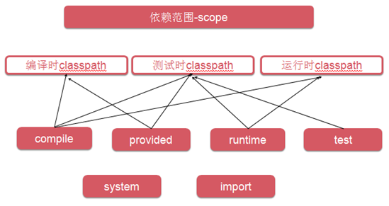
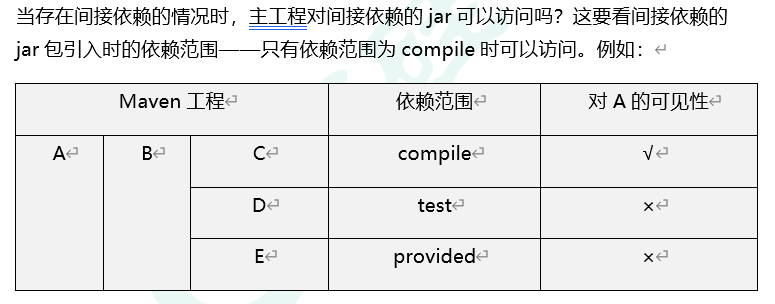

# maven

## 目录

- [maven 的安装](#maven的安装)
- [构建环节](#构建环节)
- [Maven 核心概念](#Maven核心概念)

[maven 菜鸟教程](https://www.runoob.com/maven/maven-tutorial.html "maven菜鸟教程")

#### maven 的安装

**① 检查 JAVA_HOME 环境变量。**

Maven 是使用 Java 开发的，所以必须知道当前系统环境中 JDK 的安装目录。

```text
C:\Windows\System32>echo %JAVA_HOME%
C:\Java\jdk1.8.0_45
```

**② 解压 Maven 的核心程序。**

将 apache-maven-3.6.0-bin.zip 解压到一个**非中文无空格**的目录下。例如：

`D:\Server\apache-maven-3.6.0`

**③ 配置环境变量。**

变量名`M2_HOME `

内容`D:\Server\ apache-maven-3.6.0`

变量名`path`

内容`%M2_HOME%\bin或D:\Server\ apache-maven-3.6.0\bin`

**④ 查看 Maven 版本信息验证安装是否正确**

`mvn -v`

**⑤ 配置本地仓库**

\[1]Maven 默认的本地仓库：`~\.m2\repository`目录。

Tips：\~表示当前用户的家目录。

\[2]Maven 的核心程序并不包含具体功能，仅负责宏观调度。具体功能由插件来完成。Maven 核心程序会到本地仓库中查找插件。如果本地仓库中没有就会从远程中央仓库下载。此时如果不能上网则无法执行 Maven 的具体功能。为了解决这个问题，我们可以将 Maven 的本地仓库指向一个在联网情况下下载好的目录。

\[3]Maven 的核心配置文件位置：

解压目录`\ D:\Server\ apache-maven-3.6.0\conf\settings.xml`

\[4]设置方式

```text
<localRepository>以及准备好的仓库位置</localRepository>
<localRepository>D:/RepMaven</localRepository>

```

**⑥ 这只 maven jdk 版本**

```text
<!--调整maven使用的jdk版本 -->
<profile>
     <id>jdk-1.8</id>
     <activation>
       <activeByDefault>true</activeByDefault>
       <jdk>1.8</jdk>
     </activation>
     <properties>
       <maven.compiler.source>1.8</maven.compiler.source>
       <maven.compiler.target>1.8</maven.compiler.target>
       <maven.compiler.compilerVersion>1.8</maven.compiler.compilerVersion>
     </properties>
</profile>

```

#### 构建环节

① 清理：删除以前的编译结果，为重新编译做好准备。

② 编译：将 Java 源程序编译为字节码文件。

③ 测试：针对项目中的关键点进行测试，确保项目在迭代开发过程中关键点的正确性。

④ 报告：在每一次测试后以标准的格式记录和展示测试结果。

⑤ 打包：将一个包含诸多文件的工程封装为一个压缩文件用于安装或部署。Java 工程对应 jar 包，Web 工程对应 war 包。

⑥ 安装：在 Maven 环境下特指将打包的结果——jar 包或 war 包安装到本地仓库中。

⑦ 部署：将打包的结果部署到远程仓库或将 war 包部署到服务器上运行。

#### Maven 核心概念

Maven 之所以能够实现自动化的构建，和它的设计是紧密相关的。我们对 Maven 的学习就围绕它的九个核心概念展开：
①POM

Project Object Model：项目对象模型。将 Java 工程的相关信息封装为对象作为便于操作和管理的模型。Maven 工程的核心配置。可以说学习 Maven 就是学习 pom.xml 文件中的配置。
② 约定的目录结构

```text
 src
   ——main
   ————java
   ————resources
   ——test
   ————java
   ————resources
   pom.xml

```

③ 坐标

```text
使用如下三个向量在Maven的仓库中唯一的确定一个Maven工程。
[1]groupId：公司或组织的域名倒序+当前项目名称
[2]artifactId：当前项目的模块名称
[3]version：当前模块的版本

如何通过坐标到仓库中查找jar包
[1]将gav三个向量连起来
 com.atguigu.maven+Hello+0.0.1-SNAPSHOT
[2]以连起来的字符串作为目录结构到仓库中查找
 com/atguigu/maven/Hello/0.0.1-SNAPSHOT/Hello-0.0.1-SNAPSHOT.jar
※注意：我们自己的Maven工程必须执行安装操作才会进入仓库。安装的命令是： mvn install

```

④ 依赖管理

```text
直接依赖和间接依赖
如果A依赖B，B依赖C，那么A→B和B→C都是直接依赖，而A→C是间接依赖。
 依赖的范围
当一个Maven工程添加了对某个jar包的依赖后，这个被依赖的jar包可以对应下面几个可选的范围：
 ①compile
[1]main目录下的Java代码可以访问这个范围的依赖
[2]test目录下的Java代码可以访问这个范围的依赖
[3]部署到Tomcat服务器上运行时要放在WEB-INF的lib目录下
例如：对Hello的依赖。主程序、测试程序和服务器运行时都需要用到。
 ②test
[1]main目录下的Java代码不能访问这个范围的依赖
[2]test目录下的Java代码可以访问这个范围的依赖
[3]部署到Tomcat服务器上运行时不会放在WEB-INF的lib目录下
例如：对junit的依赖。仅仅是测试程序部分需要。
 ③provided
[1]main目录下的Java代码可以访问这个范围的依赖
[2]test目录下的Java代码可以访问这个范围的依赖
[3]部署到Tomcat服务器上运行时不会放在WEB-INF的lib目录下
例如：servlet-api在服务器上运行时，Servlet容器会提供相关API，所以部署的时候不需要。
 ④runtime[了解]
[1]main目录下的Java代码不能访问这个范围的依赖
[2]test目录下的Java代码可以访问这个范围的依赖
[3]部署到Tomcat服务器上运行时会放在WEB-INF的lib目录下
例如：JDBC驱动。只有在测试运行和在服务器运行的时候才决定使用什么样的数据库连接。
 ⑤其他：import、system等。

```

各个依赖范围的作用可以概括为下图：



**依赖的传递性**



**依赖的原则：解决 jar 包冲突**

1. 路径最短者优先
2. 先声明者优先

**依赖的排除**

有的时候为了确保程序正确可以将有可能重复的间接依赖排除。排除掉后也可以自行依赖其他版本。

```xml
<!--填写需要排除的依赖-->
<exclusions>
  <exclusion>
    <groupId>log4j</groupId>
    <artifactId>log4j</artifactId>
  </exclusion>
</exclusions>

```

**统一管理目标 jar 包的版本**

```xml
<properties>
  <!--properties标签为自动命名的，在后面的version中填入到${}-->
  <spring.version>5.2.5.RELEASE</spring.version>
</properties>
---
<!--使用${}符号引用约定的版本号-->
<dependency>
  <groupId>org.springframework</groupId>
  <artifactId>spring-core</artifactId>
  <version>${spring.version}</version>
</dependency>

```

⑤ 仓库管理

```text
[1]本地仓库：为当前本机电脑上的所有Maven工程服务。
[2]远程仓库
(1)私服：架设在当前局域网环境下，为当前局域网范围内的所有Maven工程服务。
(2)中央仓库：架设在Internet上，为全世界所有Maven工程服务。
(3)中央仓库的镜像：架设在各个大洲，为中央仓库分担流量。减轻中央仓库的压力，同时更快的响应用户请求。

```

阿里云镜像服务器，配置到 maven 设置文件中

```text
<mirror>
      <id>alimaven</id>
      <mirrorOf>central</mirrorOf>
      <name>aliyun maven</name>
      <url>http://maven.aliyun.com/nexus/content/groups/public</url>
</mirror>

```

⑥ 生命周期

```text
Maven有三套相互独立的生命周期，分别是：
①Clean Lifecycle在进行真正的构建之前进行一些清理工作。
②Default Lifecycle构建的核心部分，编译，测试，打包，安装，部署等等。
③Site Lifecycle生成项目报告，站点，发布站点。

```

⑦ 插件和目标

●Maven 的核心仅仅定义了抽象的生命周期，具体的任务都是交由插件完成的。

● 每个插件都能实现多个功能，每个功能就是一个插件目标。

●Maven 的生命周期与插件目标相互绑定，以完成某个具体的构建任务。

例如：compile 就是插件 maven-compiler-plugin 的一个功能；pre-clean 是插件 maven-clean-plugin 的一个目标。
⑧ 继承

```text
由于非compile范围的依赖信息是不能在"依赖链“中传递的，所以有需要的工程只能单独配置。
此时如果项目需要将各个模块的junit版本统一为4.9，那么到各个工程中手动修改无疑是非常不可取的。使用继承机制就可以将这样的依赖信息统一提取到父工程模块中进行统一管理。
 创建父工程和创建一般的Java工程操作一致，唯一需要注意的是：打包方式处要设置为pom。
---
在子工程中引用父工程
<parent>
  <!-- 父工程坐标 -->
  <groupId>...</groupId>
  <artifactId>...</artifactId>
  <version>...</version>
  <relativePath>从当前目录到父项目的pom.xml文件的相对路径</relativePath>
</parent>
此时如果子工程的groupId和version如果和父工程重复则可以删除。
---
在父工程中管理依赖
将Parent项目中的dependencies标签，用dependencyManagement标签括起来
在子项目中重新指定需要的依赖，删除范围和版本号
<dependencyManagement>
  <dependencies>
    <dependency>
      <groupId>junit</groupId>
      <artifactId>junit</artifactId>
    </dependency>
  </dependencies>
</dependencyManagement>
---
 依赖管理和依赖标签的区别
 dependencyManagement标签
dependencyManagement里只是声明依赖，并不实现引入，因此，子项目需要显示声明依赖。如果不在子项目中声明依赖，是不会从父项目中继承下来的；
子项目中声明该依赖项，并且没有指定具体版本，才会从父项目中继承该配置项，并且version和scope都读取自父pom；
另外，如果子项目中指定了版本号，那么会使用子项目自己指定的jar版本。
 dependencies标签：
相对于dependencyManagement，所有声明在dependencies里的依赖都会自动引入，并默认被所有的子项目继承。
dependencies即使在子项目中不写该依赖项，那么，子项目仍然会从父项目中继承该依赖项（全部继承）

```

⑨ 聚合

```text
为什么要使用聚合？
将多个工程拆分为模块后，需要手动逐个安装到仓库后依赖才能够生效。修改源码后也需要逐个手动进行clean操作。而使用了聚合之后就可以批量进行Maven工程的安装、清理工作。
 如何配置聚合
在总的聚合工程中使用modules/module标签组合，指定模块工程的相对路径即可
<modules>
  <module>A</module>
  <module>B</module>
  <module>C</module>
</modules>

```
