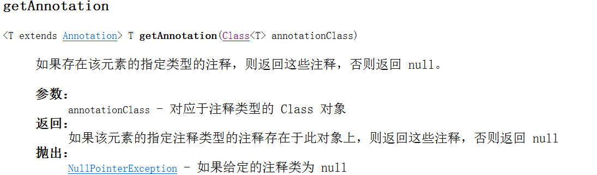
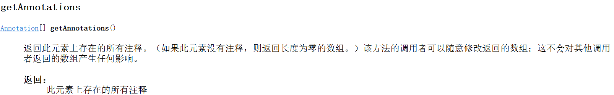
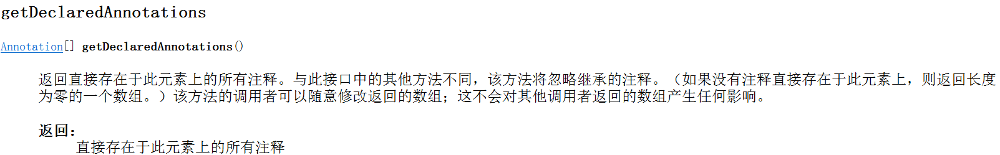
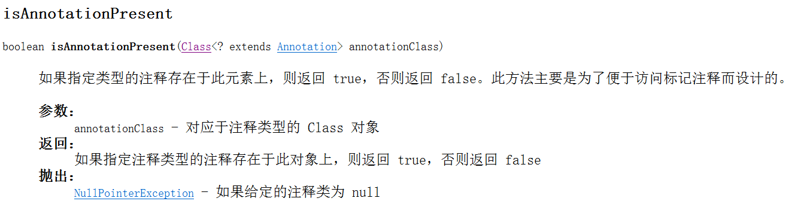

# Get annotation information by reflection

## 目录

- [相关类AnnotatedElement](#相关类AnnotatedElement)

#### 相关类AnnotatedElement









自定义注解

```java
@Retention(RetentionPolicy.RUNTIME)  
@Target(ElementType.METHOD)  
@Documented  
public @interface Author {  
      
    String name(); // 因为没有定义public，所以默认的访问权限为包权限，在定义时没有指定默认值，则使用时必须指定默认值  
    String group();  
  
} 

@Retention(RetentionPolicy.RUNTIME)  
@Target(ElementType.TYPE)  
@Documented  
public @interface Description {  
  
    String value();// 只有一个属性时，最好定义为value，因为可以省略哦:)  
}  

```


使用注解的工具类

```java
@Description(value="这是一个有用的工具类") // value可以省略  
public class Utility {  
  
    @Author(name="wangsheng", group="developer team")  
    public String work() {  
        return "work over!";  
    }  
}  
```


获得注解

```java
public class AnalysisAnnotation {  
      
    public static void main(String[] args) {  
        try {  
              
            // 通过运行时反射API获得annotation信息  
            Class<?> rtClass = Class.forName("com.wsheng.aggregator.annotation.Utility");  
            Method[] methods = rtClass.getMethods();  
              
            boolean descriptionExist = rtClass.isAnnotationPresent(Description.class);  
            if (descriptionExist) {  
                Description description = (Description)rtClass.getAnnotation(Description.class);  
                System.out.println("Utility's Description --- > " + description.value());  
                  
                for (Method method : methods) {  
                    if (method.isAnnotationPresent(Author.class)) {  
                        Author author = (Author)method.getAnnotation(Author.class);
                        System.out.println("Utility's Author ---> " + author.name() + " from " + author.group());  
                    }  
                }  
//也可以使用Annotation[] Annotations=Utility.class.getDeclaredAnnotations();
//Description a= (Description)Annotations[0];
//来获得注解对象
            }  
              
        } catch (ClassNotFoundException e) {  
            e.printStackTrace();  
        }  
    }  
  
}  
```
