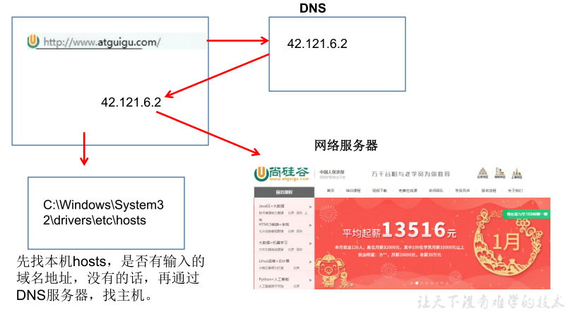

# 网络编程三要素

## 目录

- [1、协议](#1协议)
- [2、IP 地址](#2IP地址)
- [3、端口号](#3端口号)

### 1、协议

- 协议：计算机网络通信必须遵守的规则，已经介绍过了，不再赘述。

### 2、IP 地址

**IP 地址：指互联网协议地址（Internet Protocol Address）**，俗称 IP。IP 地址用来给一个网络中的计算机设备做唯一的编号。假如我们把"个人电脑”比作"一台电话”的话，那么"IP 地址”就相当于"电话号码”。

**IP 地址分类方式一：**

- IPv4：是一个 32 位的二进制数，通常被分为 4 个字节，表示成`a.b.c.d` 的形式，例如`192.168.65.100` 。其中 a、b、c、d 都是 0\~255 之间的十进制整数，那么最多可以表示 42 亿个。
- IPv6：由于互联网的蓬勃发展，IP 地址的需求量愈来愈大，但是网络地址资源有限，使得 IP 的分配越发紧张。

  为了扩大地址空间，拟通过 IPv6 重新定义地址空间，采用 128 位地址长度，每 16 个字节一组，分成 8 组十六进制数，表示成`ABCD:EF01:2345:6789:ABCD:EF01:2345:6789`，号称可以为全世界的每一粒沙子编上一个网址，这样就解决了网络地址资源数量不够的问题。

**IP 地址分类方式二：**

公网地址( 万维网使用)和 私有地址( 局域网使用)。192.168.开头的就是私有址址，范围即为 192.168.0.0--192.168.255.255，专门为组织机构内部使用

**常用命令：**

- 查看本机 IP 地址，在控制台输入：

```java
ipconfig
```

- 检查网络是否连通，在控制台输入：

```java
ping 空格 IP地址
ping 220.181.57.216
```

**特殊的 IP 地址：**

- 本地回环地址(hostAddress)：`127.0.0.1` &#x20;
- 主机名(hostName)：`localhost`

**域名：**

因为 IP 地址数字不便于记忆，因此出现了域名，域名容易记忆，当在连接网络时输入一个主机的域名后，域名服务器(DNS)负责将域名转化成 IP 地址，这样才能和主机建立连接。 -------&#x20;

域名解析



### 3、端口号

网络的通信，本质上是两个进程（应用程序）的通信。每台计算机都有很多的进程，那么在网络通信时，如何区分这些进程呢？

如果说**IP 地址**可以唯一标识网络中的设备，那么**端口号**就可以唯一标识设备中的进程（应用程序）了。

- **端口号：用两个字节表示的整数，它的取值范围是 0\~65535**。
  - 公认端口：0\~1023。被预先定义的服务通信占用，如：HTTP（80），FTP（21），Telnet（23）
  - 注册端口：1024\~49151。分配给用户进程或应用程序。如：Tomcat（8080），MySQL（3306），Oracle（1521）。
  - 动态/ 私有端口：49152\~65535。

如果端口号被另外一个服务或应用所占用，会导致当前程序启动失败。

利用`协议`+`IP地址`+`端口号` 三元组合，就可以标识网络中的进程了，那么进程间的通信就可以利用这个标识与其它进程进行交互。
