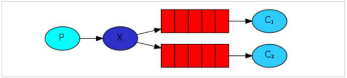

# Publish/Subscribe发布订阅模式

## 目录

- [Fanout 交换机解读](#Fanout-交换机解读)
- [小结 ](#小结-)



而在订阅模型中，多了一个 exchange 角色，而且过程略有变化：&#x20;

\- P：生产者，也就是要发送消息的程序，但是不再发送到队列中，而是发给 X（交换机）&#x20;

\- C：消费者，消息的接受者，会一直等待消息到来。&#x20;

\- Queue：消息队列，接收消息、缓存消息。&#x20;

\- Exchange：交换机，图中的 X。一方面，接收生产者发送的消息。另一方面，知道如何处理消息，例如递交给某个特别队列、递交给所有队列、或是将消息丢弃。到底如何操作，取决于 Exchange 的类型。Exchange 有常见以下 3 种类型：&#x20;

\- Fanout：广播，将消息交给所有绑定到交换机的队列&#x20;

\- Direct：定向，把消息交给符合指定 routing key 的队列&#x20;

\- Topic：通配符，把消息交给符合 routing pattern（路由模式） 的队列
Exchange（交换机）只负责转发消息，不具备存储消息的能力,因此如果没有任何队列与 Exchange 绑定，或者没有符合路由规则的队列，那么消息会丢失！
在广播模式下，消息发送流程是这样的：&#x20;

-可以有多个消费者 -每个消费者有自己的 queue（队列）&#x20;

-每个队列都要绑定到 Exchange（交换机） -生产者发送的消息,只能发送到交换机,交换机来决定要发给哪个队列,生产者无法决定。 -交换机把消息发送给绑定过的所有队列 -队列的消费者都能拿到消息。实现一条消息被多个消费者消费

#### Fanout 交换机解读

说明：&#x20;

1.队列在绑定到交换机的时候不需要指定 routing key&#x20;

2.发送消息的时候也不需要指定 routing key&#x20;

3.凡是发送给交换机的消息都会广播发送到所有与交换机绑定的队列中。

1. 生产者代码
   两个变化：&#x20;

   1）声明 Exchange，不再声明 Queue&#x20;

   2）发送消息到 Exchange，不再发送到 Queue
   ```java
   public class Producer { 
   private final static String EXCHANGE_NAME = "fanout_exchange_test";
   public static void main(String[] args) throws Exception { 
   // 获取到连接 
   Connection connection = ConnectionUtil.getConnection(); 
   // 获取通道 
   Channel channel = connection.createChannel(); 
   // 声明exchange，指定类型为fanout 
   channel.exchangeDeclare(EXCHANGE_NAME, "fanout"); 
   // 消息内容 
   String message = "Hello everyone"; 
   // 发布消息到
   Exchange channel.basicPublish(EXCHANGE_NAME, "", null, message.getBytes()); 
   System.out.println(" [生产者] Sent '" + message + "'");
   channel.close(); 
   connection.close();
   } }
   ```

2. 消费者 1 代码
   ```java
   public class Consumer1 { 
   private final static String QUEUE_NAME = "fanout_exchange_queue_1"; 
   private final static String EXCHANGE_NAME = "fanout_exchange_test";
   public static void main(String[] argv) throws Exception { 
   // 获取到连接 
   Connection connection = ConnectionUtil.getConnection(); 
   // 获取通道 
   Channel channel = connection.createChannel(); 
   // 声明队列 
   channel.queueDeclare(QUEUE_NAME, false, false, false, null); 
   // 绑定队列到交换机 
   channel.queueBind(QUEUE_NAME, EXCHANGE_NAME, ""); 
   // 定义队列的消费者 
   DefaultConsumer consumer = new DefaultConsumer(channel) { 
   // 获取消息，并且处理，这个方法类似事件监听，如果有消息的时候，会被自动调用
   @Override 
   public void handleDelivery(String consumerTag, Envelope envelope,
   AMQP.BasicProperties properties, byte[] body) throws IOException { 
   // body 即消息体 
   String msg = new String(body); 
   System.out.println(" [消费者1] received : " + msg + "!");
   }
   }; 
   // 监听队列，自动返回完成 
   channel.basicConsume(QUEUE_NAME, true, consumer);
   } }
   //要注意代码中：队列需要和交换机绑定 
   ```

   消费者 2 代码和消费者 1 代码完全一致，只不过监听队列不一样，其它都一样
   ```java
   public class Consumer1 { 
   private final static String QUEUE_NAME = "fanout_exchange_queue_2"; 
   private final static String EXCHANGE_NAME = "fanout_exchange_test";
   public static void main(String[] argv) throws Exception { 
   // 获取到连接 
   Connection connection = ConnectionUtil.getConnection(); 
   // 获取通道 
   Channel channel = connection.createChannel(); 
   // 声明队列 
   channel.queueDeclare(QUEUE_NAME, false, false, false, null); 
   // 绑定队列到交换机 
   channel.queueBind(QUEUE_NAME, EXCHANGE_NAME, ""); 
   // 定义队列的消费者 
   DefaultConsumer consumer = new DefaultConsumer(channel) { 
   // 获取消息，并且处理，这个方法类似事件监听，如果有消息的时候，会被自动调用
   @Override 
   public void handleDelivery(String consumerTag, Envelope envelope,
   AMQP.BasicProperties properties, byte[] body) throws IOException { 
   // body 即消息体 
   String msg = new String(body); 
   System.out.println(" [消费者1] received : " + msg + "!");
   }
   }; 
   // 监听队列，自动返回完成 
   channel.basicConsume(QUEUE_NAME, true, consumer);
   } }
   ```


#### 小结&#x20;

交换机需要与队列进行绑定，绑定之后；一个消息可以被多个消费者都收到。 发布订阅模式与工作队列模式的区别
1、工作队列模式不用定义交换机，而发布/订阅模式需要定义交换机。&#x20;

2、发布/订阅模式的生产方是面向交换机发送消息，工作队列模式的生产方是面向队列发 送消息(底层使用默认交换机)。&#x20;

3、发布/订阅模式需要设置队列和交换机的绑定，工作队列模式不需要设置，实际上工作 队列模式会将队列绑 定到默认的交换机 。
