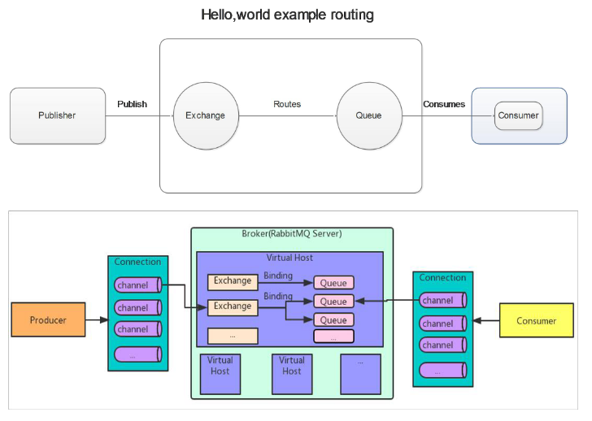

# RabbitMQ

## 目录

- [RabbitMQ 的基础架构图](#RabbitMQ-的基础架构图)
- [RabbitMQ 的六种工作模式](#RabbitMQ-的六种工作模式)
- [安装RabbitMQ](#安装RabbitMQ)

#### RabbitMQ 的基础架构图



概念介绍

1. Broker：接收和分发消息的应用，RabbitMQ Server 就是 Message Broker&#x20;
2. Virtual host：出于多租户和安全因素设计的，把 AMQP 的基本组件划分到一个虚拟 的分组中，类似于网络中的 namespace 概念。当多个不同的用户使用同一个 RabbitMQ server 提供的服务时，可以划分出多个 vhost，每个用户在自己的 vhost 创建 exchange／queue 等&#x20;
3. Connection：publisher／consumer 和 broker 之间的 TCP 连接&#x20;
4. Channel：如果每一次访问 RabbitMQ 都建立一个 Connection，在消息量大的时候 建立 TCP Connection的开销将是巨大的，效率也较低。Channel 是在 connection 内 部建立的逻辑连接，如果应用程序支持多线程，通常每个 thread 创建单独的 channel 进 行通讯，AMQP method 包含了 channel id 帮助客户端和 message broker 识别 channel，所以 channel 之间是完全隔离的。Channel 作为轻量级的 Connection 极 大减少了操作系统建立 TCP connection 的开销
   Exchange:message 到达 broker 的第一站，根据分发规则，匹配查询表中的 routing key，分发消息到 queue 中去。常用的类型有：direct (point-to-point), topic (publish-subscribe) and fanout (multicast)&#x20;
5. Queue：消息最终被送到这里等待 consumer 取走&#x20;
6. Binding：exchange 和 queue 之间的虚拟连接，binding 中可以包含 routing key。Binding 信息被保存到 exchange 中的查询表中，用于 message 的分发依据

#### RabbitMQ 的六种工作模式

RabbitMQ 提供了 6 种模式：简单模式，work 模式，Publish/Subscribe 发布与订阅 模式，Routing 路由模式，Topics 主题模式，RPC 远程调用模式（远程调用，不太算 MQ； 暂不作介绍）；

#### 安装RabbitMQ

获得安装包安装 Erlang、Socat、RabbitMQ

```java
rpm -ivh erlang-21.3.8.9-1.el7.x86_64.rpm 
rpm -ivh socat-1.7.3.2-1.el6.lux.x86_64.rpm
rpm -ivh rabbitmq-server-3.8.1-1.el7.noarch.rpm //如果rabbitmq安装报错，在线安装socat 
yum install -y socat
```


安 装 成 功 后 rabbitmq 命 令 存 放 在 ： /usr/lib/rabbitmq/lib/rabbitmq\_server-3.8.1/sbin/

启用管理插件&#x20;

rabbitmq-plugins enable rabbitmq\_management #开启管理界面&#x20;

RabbitMQ 启停命令&#x20;

```java
systemctl start rabbitmq-server.service
#启动服务
systemctl status rabbitmq-server.service 
systemctl restart rabbitmq-server.service 
systemctl stop rabbitmq-server.service
```


页面测试
在 web 浏览器中输入地址：[http://虚拟机](http://xn--stuw0h6r9a "http://虚拟机") ip:15672/ (要在防火墙中放开该端口号)&#x20;

输入默认账号: guest : guest，默认不允许远程连接

防火墙放开 15672 端口号:&#x20;

firewall-cmd --add-port=15672/tcp --permanent&#x20;

firewall-cmd --reload
方式 1： 比如修改密码、配置等等，例如：

loopback\_users 中的 <<"guest">>,只保留 guest vim /usr/lib/rabbitmq/lib/rabbitmq\_server-3.8.1/ebin/rabbit.app
systemctl restart rabbitmq-server
方式 2:命令行添加新用户：&#x20;

增加管理员账号: rabbitmqctl add\_user admin admin&#x20;

给账号分配角色: rabbitmqctl set\_user\_tags admin administrator&#x20;

修改账号密码： rabbitmqctl change\_password admin 123456&#x20;

查看用户列表： rabbitmqctl list\_users
测试，使用新建账号登录

端口：&#x20;

5672: rabbitMq 的编程语言客户端连接端口

15672：rabbitMq 管理界面端口

25672：rabbitMq 集群的端口

[简单模式](简单模式/简单模式.md "简单模式")

[Work queues 工作队列模式](<Work queues 工作队列模式/Work queues 工作队列模式.md> "Work queues 工作队列模式")

[Publish/Subscribe发布订阅模式](Publish-Subscribe发布订阅模式/Publish-Subscribe发布订阅模式.md "Publish/Subscribe发布订阅模式")

[Routing 路由模式](<Routing 路由模式/Routing 路由模式.md> "Routing 路由模式")

[Topics 通配符模式](<Topics 通配符模式/Topics 通配符模式.md> "Topics 通配符模式")

[模式总结 ](模式总结-/模式总结-.md "模式总结 ")

[Springboot 整合 RabbitMQ
](<Springboot 整合 RabbitMQ-/Springboot 整合 RabbitMQ-.md> "Springboot 整合 RabbitMQ
")
