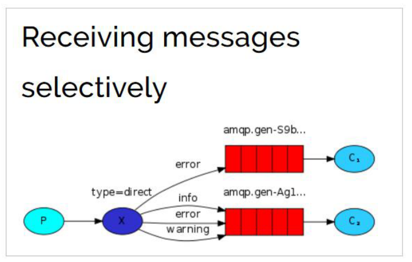
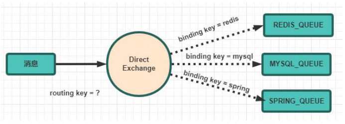

# Routing 路由模式

## 目录

- [代码实现
  ](#代码实现)
- [小结](#小结)

模式说明 有选择性的接收消息
在订阅模式中，生产者发布消息，所有消费者都可以获取所有消息。 在路由模式中，我们将添加一个功能 我们将只能订阅一部分消息。&#x20;

例如，我们只能将 重要的错误消息引导到日志文件（以节省磁盘空间），同时仍然能够在控制台上打印所有日 志消息。
但是，在某些场景下，我们希望不同的消息被不同的队列消费。这时就要用到 Direct 类 型的 Exchange。
路由模式特点：&#x20;

\- 队列与交换机的绑定，不能是任意绑定了，而是要指定一个`RoutingKey`（路由 key）&#x20;

\- 消息的发送方在向 Exchange 发送消息时，也必须指定消息的 `RoutingKey`。&#x20;

\- Exchange 不再把消息交给每一个绑定的队列，而是根据消息的`Routing Key`进行 判断，只有队列的`Routingkey`与消息的 `Routing key`完全一致，才会接收到消息



图解：&#x20;

\- P：生产者，向 Exchange 发送消息，发送消息时，会指定一个 routing key。&#x20;

\- X：Exchange（交换机），接收生产者的消息，然后把消息递交给 与 routing key 完全匹配的队列

\- C1：消费者，其所在队列指定了需要 routing key 为 error 的消息&#x20;

\- C2：消费者，其所在队列指定了需要 routing key 为 info、error、warning 的 消息

#### 代码实现&#xA;

在编码上与 `Publish/Subscribe 发布与订阅模式` 的区别是交换机的类型为： Direct，还有队列绑定交换机的时候需要指定 routing key。



1. 生产者代码&#x20;

   此处我们模拟商品的增删改，发送消息的 RoutingKey 分别是：insert、update、delete
   ```java
   public class Producer { 
   private final static String EXCHANGE_NAME = "direct_exchange_test";
   public static void main(String[] argv) throws Exception { 
   // 获取到连接 
   Connection connection = ConnectionUtil.getConnection(); 
   // 获取通道 
   Channel channel = connection.createChannel(); 
   // 声明exchange，指定类型为direct 
   channel.exchangeDeclare(EXCHANGE_NAME, "direct"); 
   // 消息内容 
   String message = "商品新增了， id = 1001"; 
   // 发送消息，并且指定routing key 为：insert ,代表新增商品 
   channel.basicPublish(EXCHANGE_NAME, "insert", null, message.getBytes()); 
   System.out.println(" [商品服务：] Sent '" + message + "'");
   channel.close(); connection.close();
   } }
   ```

2. 消费者 1&#x20;

   代码 我们此处假设消费者 1 只接收两种类型的消息：更新商品和删除商品。
   ```java
   public class Consumer1 {
   private final static String QUEUE_NAME = "direct_exchange_queue_1"; 
   private final static String EXCHANGE_NAME = "direct_exchange_test";
   public static void main(String[] argv) throws Exception { 
   // 获取到连接 
   Connection connection = ConnectionUtil.getConnection(); 
   // 获取通道 
   Channel channel = connection.createChannel(); 
   // 声明队列 
   channel.queueDeclare(QUEUE_NAME, false, false, false, null);
   // 绑定队列到交换机，同时指定需要订阅的routing key。假设此处需要update和delete消息 
   channel.queueBind(QUEUE_NAME, EXCHANGE_NAME, "update"); 
   channel.queueBind(QUEUE_NAME, EXCHANGE_NAME, "delete");
   // 定义队列的消费者 
   DefaultConsumer consumer = new DefaultConsumer(channel) { 
   // 获取消息，并且处理，这个方法类似事件监听，如果有消息的时候，会被自动调用
   @Override 
   public void handleDelivery(String consumerTag, Envelope envelope,
   AMQP.BasicProperties properties, byte[] body) throws IOException { 
   // body 即消息体 
   String msg = new String(body); 
   System.out.println(" [消费者1] received : " + msg + "!");
   }
   }; 
   // 监听队列，自动ACK 
   channel.basicConsume(QUEUE_NAME, true, consumer);
   } }
   ```

3. 消费者 2

   我们此处假设消费者 2 接收所有类型的消息：新增商品，更新商品和删除商品
   ```java
   public class Consumer2 {
   private final static String QUEUE_NAME = "direct_exchange_queue_2"; 
   private final static String EXCHANGE_NAME = "direct_exchange_test";
   public static void main(String[] argv) throws Exception { 
   // 获取到连接 
   Connection connection = ConnectionUtil.getConnection(); 
   // 获取通道 
   Channel channel = connection.createChannel(); 
   // 声明队列 
   channel.queueDeclare(QUEUE_NAME, false, false, false, null);
   // 绑定队列到交换机，同时指定需要订阅的routing key。订阅 insert、update、 delete
   channel.queueBind(QUEUE_NAME, EXCHANGE_NAME, "insert"); 
   channel.queueBind(QUEUE_NAME, EXCHANGE_NAME, "update"); 
   channel.queueBind(QUEUE_NAME, EXCHANGE_NAME, "delete");
   // 定义队列的消费者 
   DefaultConsumer consumer = new DefaultConsumer(channel) { 
   // 获取消息，并且处理，这个方法类似事件监听，如果有消息的时候，会被自动调用
   @Override 
   public void handleDelivery(String consumerTag, Envelope envelope,
   AMQP.BasicProperties properties, byte[] body) throws IOException { 
   // body 即消息体 
   String msg = new String(body); 
   System.out.println(" [消费者2] received : " + msg + "!");
   }
   }; // 监听队列，自动ACK 
   channel.basicConsume(QUEUE_NAME, true, consumer);
   } }
   ```


#### 小结

Routing 模式要求队列在绑定交换机时要指定 routing key，消息会转发到符合 routing key 的队列。
