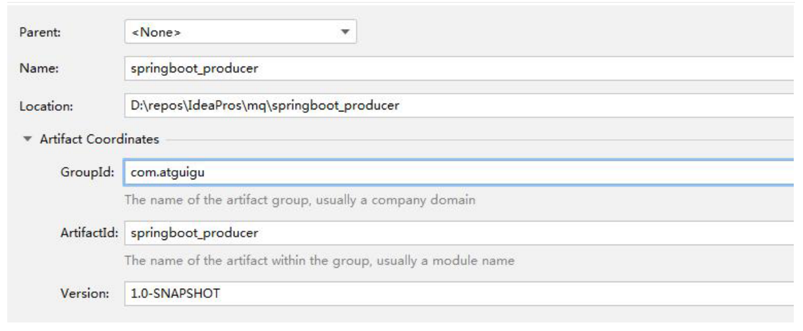
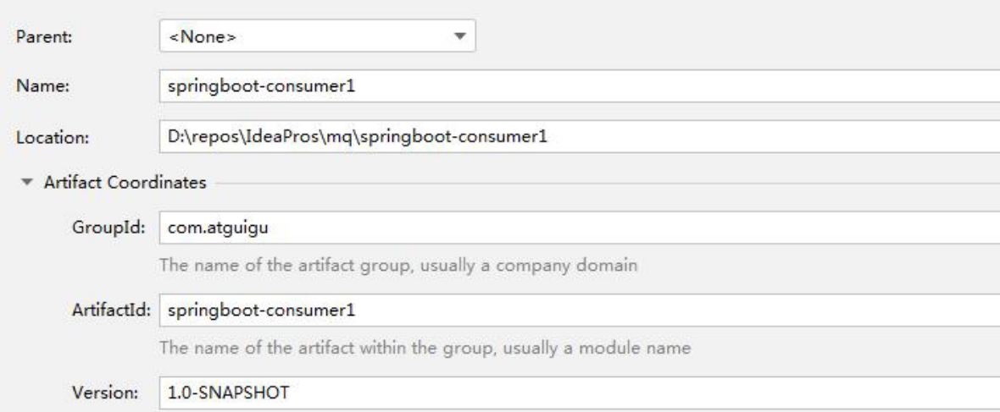

Springboot 整合 RabbitMQ

## 目录

- [生产者](#生产者)
  - [创建 springboot 工程](#创建-springboot-工程)
  - [引入依赖及父工程](#引入依赖及父工程)
  - [创建 application.yml 文件](#创建-applicationyml-文件)
  - [编写启动类、配置类、交换机、队列、绑定队列和交换机](#编写启动类配置类交换机队列绑定队列和交换机)
  - [编写测试类，注入 RabbitTemplate
    ](#编写测试类注入-RabbitTemplate)
  - [消费端](#消费端)
  - [创建工程](#创建工程)
  - [设置 pom 文件](#设置-pom-文件)
  - [编写 application.yml](#编写-applicationyml)
  - [编写启动类](#编写启动类)
  - [编写监听器](#编写监听器)

在 spring boot 项目中只需要引入对应的 amqp 启动器依赖即可，方便的使用 RabbitTemplate 发送消息，使用注解接收消息。

1. 创建生产者 SpringBoot 工程&#x20;
2. 引入 start，依赖坐标&#x20;
   ```java
   <dependency> 
   <groupId>org.springframework.boot</groupId>
   <artifactId>spring-boot-starter-amqp</artifactId> 
   </dependency>
   ```

3. 编写 yml 配置，基本信息配置&#x20;
4. 定义交换机，队列以及绑定关系的配置类&#x20;
5. 注入 RabbitTemplate，调用方法，完成消息发送

### 生产者

#### 创建 springboot 工程



#### 引入依赖及父工程

```java
<parent> 
  <groupId>org.springframework.boot</groupId> 
  <artifactId>spring-boot-starter-parent</artifactId> 
  <version>2.1.4.RELEASE</version>
</parent>
<dependencies> 
  <dependency> 
    <groupId>org.springframework.boot</groupId> 
    <artifactId>spring-boot-starter-amqp</artifactId>
  </dependency> 
  <dependency> 
    <groupId>org.springframework.boot</groupId> 
    <artifactId>spring-boot-starter-test</artifactId>
  </dependency> 
</dependencies>
```


#### 创建 application.yml 文件

```java
spring: 
  rabbitmq: 
    host: 192.168.92.128 
    port: 5672 
    virtual-host: /v1 
    username: root 
    password: 123456
```


#### 编写启动类、配置类、交换机、队列、绑定队列和交换机

启动类

```java
@SpringBootApplication 
public class ProducerApplication { 
public static void main(String[] args) { 
SpringApplication.run(ProducerApplication.class,args);
} 
}
```


配置类

```java
@Configuration 
public class RabbitMQConfig {
public static final String EXCHANGE_NAME = "boot_topic_exchange"; 
public static final String QUEUE_NAME = "boot_queue";
//1.交换机 
@Bean("bootExchange") 
public Exchange bootExchange(){ 
return
ExchangeBuilder.topicExchange(EXCHANGE_NAME).durable(true).build(); 
}
//2.Queue 队列 
@Bean("bootQueue") 
public Queue bootQueue(){ 
return QueueBuilder.durable(QUEUE_NAME).build();
}
//3. 队列和交互机绑定关系 Binding 
/*
1. 知道哪个队列 2. 知道哪个交换机 3. routing key
*/
@Bean 
public Binding bindQueueExchange(@Qualifier("bootQueue") Queue queue,
@Qualifier("bootExchange") Exchange exchange){ 
return BindingBuilder.bind(queue).to(exchange).with("boot.#").noargs();
} }
```


#### 编写测试类，注入 RabbitTemplate&#xA;

测试类一定要和主配置类在同一个包下：&#x20;

@SpringBootTest 替代了 spring-test 中的

@ContextConfiguration 注解，目的 是加载ApplicationContext，启动spring容器。

一般情况下，使用@SpringBootTest 后，Spring 将加载所有被管理的 bean，基本等同于启动了整个服务，此时便可以开始功 能测试

```java
@SpringBootTest 
@RunWith(SpringRunner.class) 
public class SpringBootProducerTest { 
  //1.注入RabbitTemplate 
  @Autowired 
  private RabbitTemplate rabbitTemplate;
  @Test 
  public void testSend(){
  rabbitTemplate.convertAndSend(RabbitMQConfig.EXCHANGE_NAME,"boot.haha","boot mq hello~~~"); 
  }
}
```


#### 消费端

步骤分析:&#x20;

1. 创建消费者 SpringBoot 工程&#x20;
2. 引入 start，依赖坐标&#x20;
   ```java
   <dependency> 
     <groupId>org.springframework.boot</groupId> 
     <artifactId>spring-boot-starter-amqp</artifactId>
   </dependency>
   ```

3. 编写 yml 配置，基本信息配置&#x20;
4. 定义监听类，使用@RabbitListener 注解完成队列监听。

#### 创建工程



#### 设置 pom 文件

```java
<parent> 
  <groupId>org.springframework.boot</groupId> 
  <artifactId>spring-boot-starter-parent</artifactId> 
  <version>2.1.4.RELEASE</version>
</parent>
<dependencies> 
    <dependency> <groupId>org.springframework.boot</groupId> 
    <artifactId>spring-boot-starter-amqp</artifactId>
  </dependency> 
    <dependency> <groupId>org.springframework.boot</groupId> 
    <artifactId>spring-boot-starter-web</artifactId>
  </dependency> 
</dependencies>
```


#### 编写 application.yml

```java
spring: 
  rabbitmq: 
    host: 192.168.92.128 
    port: 5672 
    virtual-host: /v1 
    username: root 
    password: 123456
```


#### 编写启动类

```java
@SpringBootApplication 
public class ProducerApplication { 
public static void main(String[] args) { 
SpringApplication.run(ProducerApplication.class,args);
} 
}
```


#### 编写监听器

```java
@Component 
public class RabbitMQListener {
@RabbitListener(queues = "boot_queue") 
public void ListenerQueue(Message message){ 
//System.out.println(message); 
System.out.println(new String(message.getBody()));
} }
```
