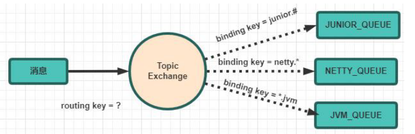
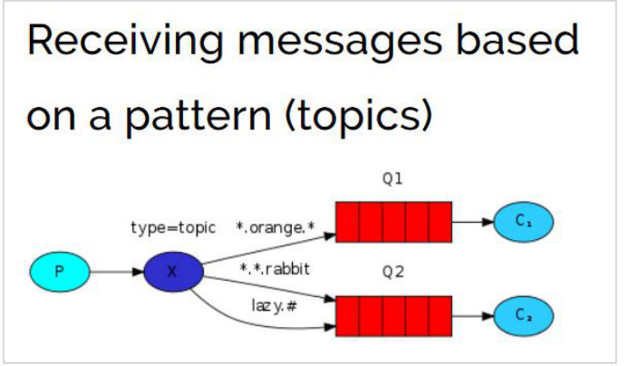

# Topics 通配符模式

Topic 类型与 Direct 相比，都是可以根据`RoutingKey`把消息路由到不同的队列。只 不过`Topic`类型`Exchange`可以让队列在绑定`Routing key` 的时候使用通配符！
Routingkey 一般都是有一个或多个单词组成，多个单词之间以“.“分割，例如： item.insert



通配符规则：

`#`：匹配一个或多个词&#x20;

`*`：匹配不多不少恰好 1 个词
举例：&#x20;

`item.#`：能够匹配`item.insert.abc` 或者 `item.insert`&#x20;

`item.*`：只能匹配\`item.insert



1. 生产者代码
   使用 topic 类型的 Exchange，发送消息的 routing key 有 3 种： `item.insert`、 `item.update`、`item.delete`：

   ```java
   public class Producer {
   private final static String EXCHANGE_NAME = "topic_exchange_test";
   public static void main(String[] argv) throws Exception {
   // 获取到连接
   Connection connection = ConnectionUtil.getConnection();
   // 获取通道
   Channel channel = connection.createChannel();
   // 声明exchange，指定类型为topic
   channel.exchangeDeclare(EXCHANGE_NAME, "topic");
   // 消息内容
   String message = "新增商品 : id = 1001";
   // 发送消息，并且指定routing key 为：insert ,代表新增商品
   channel.basicPublish(EXCHANGE_NAME, "item.insert", null,message.getBytes());
   System.out.println(" [商品服务：] Sent '" + message + "'");
   channel.close();
   connection.close();
   } }
   ```

2. 消费者 1&#x20;

   代码 我们此处假设消费者 1 只接收两种类型的消息：更新商品和删除商品

   ```java
   public class Consumer1 {
   private final static String QUEUE_NAME = "topic_exchange_queue_1";
   private final static String EXCHANGE_NAME = "topic_exchange_test";
   public static void main(String[] argv) throws Exception {
   // 获取到连接
   Connection connection = ConnectionUtil.getConnection();
   // 获取通道
   Channel channel = connection.createChannel();
   // 声明队列
   channel.queueDeclare(QUEUE_NAME, false, false, false, null);
   // 绑定队列到交换机，同时指定需要订阅的routing key。需要 update、delete
   channel.queueBind(QUEUE_NAME, EXCHANGE_NAME, "item.update");
   channel.queueBind(QUEUE_NAME, EXCHANGE_NAME, "item.delete");
   // 定义队列的消费者
   DefaultConsumer consumer = new DefaultConsumer(channel) {
   // 获取消息，并且处理，这个方法类似事件监听，如果有消息的时候，会被自动调用
   @Override
   public void handleDelivery(String consumerTag, Envelope envelope,
   AMQP.BasicProperties properties, byte[] body) throws IOException {
   // body 即消息体
   String msg = new String(body);
   System.out.println(" [消费者1] received : " + msg + "!");
   }
   }; // 监听队列，自动ACK
   channel.basicConsume(QUEUE_NAME, true, consumer);
   } }
   ```

3. 消费者 2
   ```java
   public class Consumer2 {
   private final static String QUEUE_NAME = "topic_exchange_queue_2";
   private final static String EXCHANGE_NAME = "topic_exchange_test";
   public static void main(String[] argv) throws Exception {
   // 获取到连接
   Connection connection = ConnectionUtil.getConnection();
   // 获取通道
   Channel channel = connection.createChannel();
   // 声明队列
   channel.queueDeclare(QUEUE_NAME, false, false, false, null);
   // 绑定队列到交换机，同时指定需要订阅的routing key。订阅 insert、update、 delete
   channel.queueBind(QUEUE_NAME, EXCHANGE_NAME, "item.*");
   // 定义队列的消费者
   DefaultConsumer consumer = new DefaultConsumer(channel) {
   // 获取消息，并且处理，这个方法类似事件监听，如果有消息的时候，会被自动调用
   @Override
   public void handleDelivery(String consumerTag, Envelope envelope,
   AMQP.BasicProperties properties, byte[] body) throws IOException {
   // body 即消息体
   String msg = new String(body);
   System.out.println(" [消费者2] received : " + msg + "!");
   }
   }; // 监听队列，自动ACK
   channel.basicConsume(QUEUE_NAME, true, consumer);
   } }
   ```

小结&#x20;

Topic 主题模式可以实现 `Publish/Subscribe 发布与订阅模式` 和 ` Routing 路 由模式` 的功能；

只是 Topic 在配置 routing key 的时候可以使用通配符，显得更加灵活。
