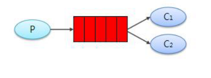
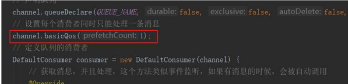

# Work queues 工作队列模式

## 目录

- [代码实现](#代码实现)
- [提高性能](#提高性能)
- [小节](#小节)

工作队列，又称任务队列。主要思想就是避免执行资源密集型任务时，必须等待它执行完成。 相反我们稍后完成任务，我们将任务封装为消息并将其发送到队列。 在后台运行的工作进 程将获取任务并最终执行作业。当你运行许多消费者时，任务将在他们之间共享，但是一个 消息只能被一个消费者获取。



应用场景：对于任务过重或任务较多情况使用工作队列可以提高任务处理的速度。

#### 代码实现

接下来我们来模拟这个流程：&#x20;

P：生产者：任务的发布者&#x20;

C1：消费者，领取任务并且完成任务，假设完成速度较快&#x20;

C2：消费者 2：领取任务并完成任务，假设完成速度慢

面试题：避免消息堆积？&#x20;

1）采用 work queue，多个消费者监听同一队列。&#x20;

2）接收到消息以后，而是通过线程池，异步消费。

1. 生产者
   ```java
   public class Producer {
   private final static String QUEUE_NAME = "test_work_queue";
   public static void main(String[] args) throws Exception { 
   // 获取到连接 
   Connection connection = ConnectionUtil.getConnection(); 
   // 获取通道 
   Channel channel = connection.createChannel(); 
   // 声明队列 
   channel.queueDeclare(QUEUE_NAME, true, false, false, null);
   // 循环发布任务 
   for (int i = 0; i < 50; i++) { 
   // 消息内容 
   String message = "task .. " + i; 
   channel.basicPublish("", QUEUE_NAME, null, message.getBytes()); 
   System.out.println(" [x] Sent '" + message + "'"); 
   Thread.sleep(i * 2);
   } 
   // 关闭通道和连接 
   channel.close(); 
   connection.close();
   } }
   ```

2. 消费者 1
   ```java
   public class Consumer {
     public static void main(String[] args) throws Exception { 
     //1.创建连接 
     Connection connection = ConnectionUtil.getConnection(); 
     //2.创建通道 
     Channel channel = connection.createChannel(); 
     //3.声明队列 
     channel.queueDeclare("simple_queue",true,false,false,null); 
     //4.创建消费者 
     com.rabbitmq.client.Consumer consumer = new DefaultConsumer(channel){ 
     @Override 
     public void handleDelivery(String consumerTag, Envelope envelope,
     AMQP.BasicProperties properties, byte[] body) throws IOException { 
     System.out.println(new String(body));
     //手动进行ACK 
     channel.basicAck(envelope.getDeliveryTag(), false);
     }
     }; 
     //5.监听队列,第二个参数false，手动进行ACK 
     channel.basicConsume("simple_queue", false,consumer);
     }
   }
   ```

3. 消费者 2
   ```java
   public class Consumer {
     public static void main(String[] args) throws Exception { 
     //1.创建连接 
     Connection connection = ConnectionUtil.getConnection(); 
     //2.创建通道 
     Channel channel = connection.createChannel(); 
     //3.声明队列 
     channel.queueDeclare("simple_queue",true,false,false,null); 
     //4.创建消费者 
     com.rabbitmq.client.Consumer consumer = new DefaultConsumer(channel){ 
     @Override 
     public void handleDelivery(String consumerTag, Envelope envelope,
     AMQP.BasicProperties properties, byte[] body) throws IOException { 
     System.out.println(new String(body));
     Thread.sleep(1000);
     //手动进行ACK 
     channel.basicAck(envelope.getDeliveryTag(), false);
     }
     }; 
     //5.监听队列,第二个参数false，手动进行ACK 
     channel.basicConsume("simple_queue", false,consumer);
     }
   }
   ```


两个消费者，一个性能第一个性能高最终结果为，两个都处理了25条数据，交换机平均分发

#### 提高性能

在比较慢的消费者创建队列后我们可以使用 basicQos 方法和 prefetchCount = 1 设 置。 这告诉 RabbitMQ 一次不要向工作人员发送多于一条消息。 或者换句话说，不要向 工作人员发送新消息，直到它处理并确认了前一个消息。 相反，它会将其分派给不是仍然 忙碌的下一个工作人员。



#### 小节

1. 在一个队列中如果有多个消费者，那么消费者之间对于同一个消息的关系是竞争的关系。&#x20;
2. Work Queues 对于任务过重或任务较多情况使用工作队列可以提高任务处理的速度。 例如：短信服务部署多个，只需要有一个节点成功发送即可。
