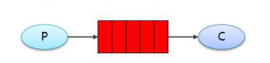

# 简单模式

## 目录

- [工程搭建](#工程搭建)



在上图的模型中，有以下概念：

P：生产者，也就是要发送消息的程序&#x20;

C：消费者：消息的接收者，会一直等待消息到来&#x20;

queue：消息队列，图中红色部分。类似一个邮箱，可以缓存消息；

生产者向其中投递消息， 消费者从其中取出消息 总之：生产者将消息发送到队列，消费者从队列中获取消息，队列是存储消息的缓冲区。 步骤分析:
1.创建工程（生成者、消费者） 2.分别添加依赖 3.编写生产者发送消息 4.编写消费者接收消息

#### 工程搭建

1. 创建maven工程，添加依赖
   ```java
   <dependency> 
   <groupId>com.rabbitmq</groupId> 
   <artifactId>amqp-client</artifactId> 
   <version>5.6.0</version>
   </dependency>
   ```

2. 编写生产者
   ```java
   public class producer {
   static final String QUEUE_NAME = "simple_queue"; 
   public static void main(String[] args) throws IOException, TimeoutException { 
   //1.创建连接工厂 
   ConnectionFactory connectionFactory = new ConnectionFactory(); 
   //2.设置参数
   //主机地址;默认为 
   localhost connectionFactory.setHost("192.168.92.128"); 
   //连接端口;默认为 5672 
   connectionFactory.setPort(5672); 
   //虚拟主机名称;默认为 / 
   connectionFactory.setVirtualHost("/v1");
    //连接用户名；默认为guest
   connectionFactory.setUsername("root"); 
   //连接密码；默认为guest 
   connectionFactory.setPassword("123456");
   //3.创建连接 
   Connection connection = connectionFactory.newConnection(); 
   //4.创建频道 
   Channel channel = connection.createChannel(); 
   //5.声明（创建）队列 
   /** 
   * 参数1：队列名称 
   * 参数2：是否定义持久化队列 
   * 参数3：是否独占本次连接 
   * 参数4：是否在不使用的时候自动删除队列 
   * 参数5：队列其它参数 
   */
   channel.queueDeclare(QUEUE_NAME, true, false, false, null); 
   // 要发送的信息 
   String message = "你好；小兔子！"; 
   /** 
   * 参数1：交换机名称，如果没有指定则使用默认Default Exchage 
   * 参数2：路由key,简单模式可以传递队列名称 
   * 参数3：消息其它属性 
   * 参数4：消息内容 
   */
   //6.发送消息 
   channel.basicPublish("", QUEUE_NAME, null, message.getBytes()); 
   System.out.println("已发送消息：" + message); 
   //7.关闭资源 
   channel.close(); 
   connection.close();
   } 
   }
   ```

3. 编写消费者
   ```java
   //抽取创建 connection 的工具类
   public class ConnectionUtil {
   public static Connection getConnection() throws Exception { 
   //1.创建连接工厂 
   ConnectionFactory connectionFactory = new ConnectionFactory(); 
   //2.设置参数 
   //主机地址;默认为 localhost 
   connectionFactory.setHost("192.168.92.128"); 
   //连接端口;默认为 5672 
   connectionFactory.setPort(5672); 
   //虚拟主机名称;默认为 / 
   connectionFactory.setVirtualHost("/v1"); 
   //连接用户名；默认为guest 
   connectionFactory.setUsername("root"); 
   //连接密码；默认为guest 
   connectionFactory.setPassword("123456");
   //3.创建连接 return 
   connectionFactory.newConnection();
   } 
   }

   public class Consumer { 
   public static void main(String[] args) throws Exception { 
   Connection connection = ConnectionUtil.getConnection(); 
   // 创建频道 Channel 
   channel = connection.createChannel();
   //声明队列 
   channel.queueDeclare(producer.QUEUE_NAME,true,false,false,null); 
   //创建消费者；并设置消息处理 
   DefaultConsumer consumer = new DefaultConsumer(channel){ 
   @Override 
   /** 
   * consumerTag 消息者标签，在channel.basicConsume时候可以指定 
   * envelope 消息包的内容，可从中获取消息id，消息routingkey，交换机，消息和重传标志(收到消息失败后是否需要重新发送) 
   * properties 属性信息 
   * body 消息 
   */
   public void handleDelivery(String consumerTag, Envelope envelope,
   AMQP.BasicProperties properties, byte[] body) throws IOException, UnsupportedEncodingException { 
   //路由key 
   System.out.println("路由key为：" + envelope.getRoutingKey()); 
   //交换机 
   System.out.println("交换机为：" + envelope.getExchange()); 
   //消息id 
   System.out.println("消息id为：" + envelope.getDeliveryTag()); 
   //收到的消息 
   System.out.println("接收到的消息为：" + new String(body,"utf-8")); }
   }; 
   //监听消息 
   /**
   * 参数1：队列名称 
   * 参数2：是否自动确认，设置为true为表示消息接收到自动向mq回复接收到了，mq接收到回复会删除消息，设置为false则需要手动确认 
   * 参数3：消息接收到后回调 
   */
   channel.basicConsume(producer.QUEUE_NAME, true, consumer);
   //不关闭资源，应该一直监听消息 //channel.close(); //connection.close();
   } 
   } 
   ```

4. 消息确认机制 通过刚才的案例可以看出，消息一旦被消费者接收，队列中的消息就会被删除。

   那么问题来了：RabbitMQ 怎么知道消息被接收了呢？ 如果消费者领取消息后，还没执行操作就挂掉了呢？或者抛出了异常？消息消费失败，但是 RabbitMQ 无从得知，这样消息就丢失了！
   因此，RabbitMQ 有一个 ACK 机制。当消费者获取消息后，会向 RabbitMQ 发送回执 ACK， 告知消息已经被接收。不过这种回执 ACK 分两种情况：

   \- 自动 ACK：消息一旦被接收，消费者自动发送 ACK&#x20;

   \- 手动 ACK：消息接收后，不会发送 ACK，需要手动调用
   大家觉得哪种更好呢？
   这需要看消息的重要性：&#x20;

   \- 如果消息不太重要，丢失也没有影响，那么自动 ACK 会比较方便&#x20;

   \- 如果消息非常重要，不容丢失。那么最好在消费完成后手动 ACK，否则接收消息后 就自动 ACK，RabbitMQ 就会把消息从队列中删除。如果此时消费者宕机，那么消 息就丢失了。
   我们之前的测试都是自动 ACK 的，如果要手动 ACK，需要改动我们的代码:
   ```java
   public class Consumer {
     public static void main(String[] args) throws Exception { 
     //1.创建连接 
     Connection connection = ConnectionUtil.getConnection(); 
     //2.创建通道 
     Channel channel = connection.createChannel(); 
     //3.声明队列 
     channel.queueDeclare("simple_queue",true,false,false,null); 
     //4.创建消费者 
     com.rabbitmq.client.Consumer consumer = new DefaultConsumer(channel){ 
     @Override 
     public void handleDelivery(String consumerTag, Envelope envelope,
     AMQP.BasicProperties properties, byte[] body) throws IOException { 
     System.out.println(new String(body));
     //手动进行ACK 
     channel.basicAck(envelope.getDeliveryTag(), false);
     }
     }; 
     //5.监听队列,第二个参数false，手动进行ACK 
     channel.basicConsume("simple_queue", false,consumer);
     } 
   }
   ```

   注意如果日志打印不出来记得加:
   ```java
   <dependency> 
   <groupId>org.slf4j</groupId> 
   <artifactId>slf4j-simple</artifactId> 
   <version>1.7.25</version> 
   <scope>compile</scope>
   </dependency>
   ```
