# mq 消息队列

1. 为什么使用消息队列？

   使用消息队列可以做到异步、削峰、解耦

   1. 异步

      如对于一个商城项目的支付模块，我们遇到支付步骤可能有下单-支付-结束。

      而随着项目的扩大，可能在支付中有其他的步骤如：下单-扣除积分-使用优惠券-支付-发短信-结束。等等一些列的步骤。链路非常长。如果都是顺序执行，可能最后需要消耗很长时间，用户才能获得反馈。

      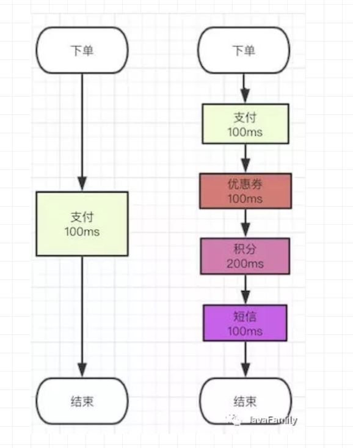

      这时使用异步的方式，我们主要执行支付的步骤，把其他不重要或可以进行延时操作的放到消息队列中，我们就可以大大缩减响应时间。

      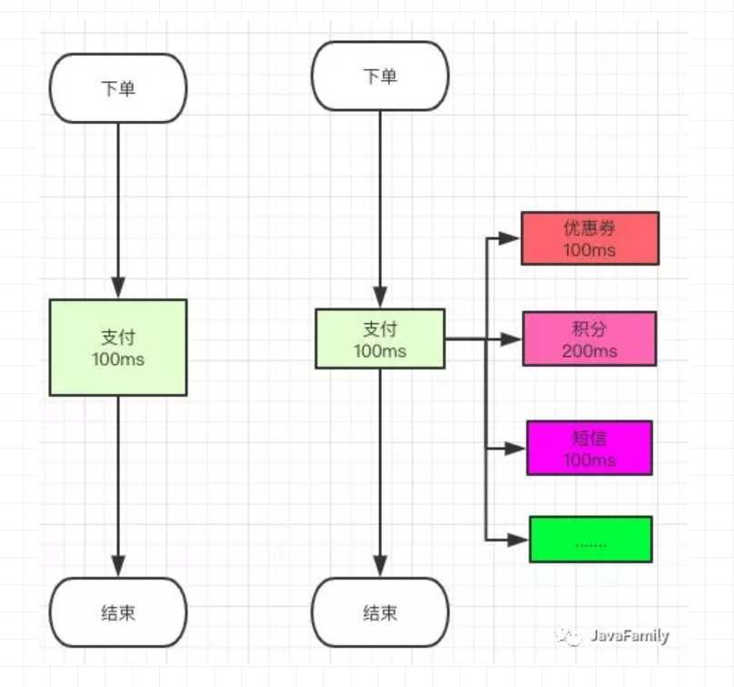

      那这里也可以使用多线程为什么不考虑多线程开发？

      订单流程有扣积分，扣优惠券，发短信，扣库存。。。等业务要调用诸多接口，每次都要调用一个接口然后还要重新发布系统，非常可能会有诸多错误。我们只需要关注支付这一个步骤就可以，此处涉及到使用消息队列的另一个好处**解耦**。

   2. 削峰

      一般的 MySQL，扛到每秒 2k 个请求就差不多了，如果每秒请求到 5k 的话，可能就直接把 MySQL 给打死了，导致系统崩溃，用户也就没法再使用系统了。

      但是高峰期一过，到了下午的时候，就成了低峰期，可能也就 1w 的用户同时在网站上操作，每秒中的请求数量可能也就 50 个请求，对整个系统几乎没有任何的压力。

      举个例子：对于一个日常访问量为 1000 的网站突然访问量上涨到十万以上，且此时的访问量在一段时间后会逐步下降，我们就可以消息队列对请求及进行分批处理，不在处理范围的请求返回一个友好页面，直到访问量可以承受为止。防止服务器宕机。

   3. 解耦

      对于支付模块来说，如果不适用消息队列而是顺序执行，我们需要考虑一些列问题，如调用失败，或时间超时等问题。多个系统直接的关系会非常复杂，省掉了复杂的 try-catch，是我们注重业务而不是代码逻辑。

      即：使用消息队列，A 系统产生一条数据，发送到 消息队列里面去，哪个系统需要数据自己去消息队列里面消费。如果新系统需要数据，直接从消息队列里消费即可；如果某个系统不需要这条数据了，就取消对消息队列消息的消费即可。这样下来，A 系统压根儿不需要去考虑要给谁发送数据，不需要维护这个代码，也不需要考虑人家是否调用成功、失败超时等情况。

      由于现如今都是分布式开发，如果调用失败我们只需要修改对应的模块就可以。

2. 使用消息队列的问题，和处理方案。

   1. 增加了系统的复杂性：需要处理如消息重复消费，消息顺序消费，消息丢失的问题

      1. **消息重复消费**：由于各个系统之间可能可能会有请求失败的情况，这是需要消息队列重新发送消息给失败的系统，但每一个系统都监听者消息队列，此时就会使每一个系统都收到消息。

         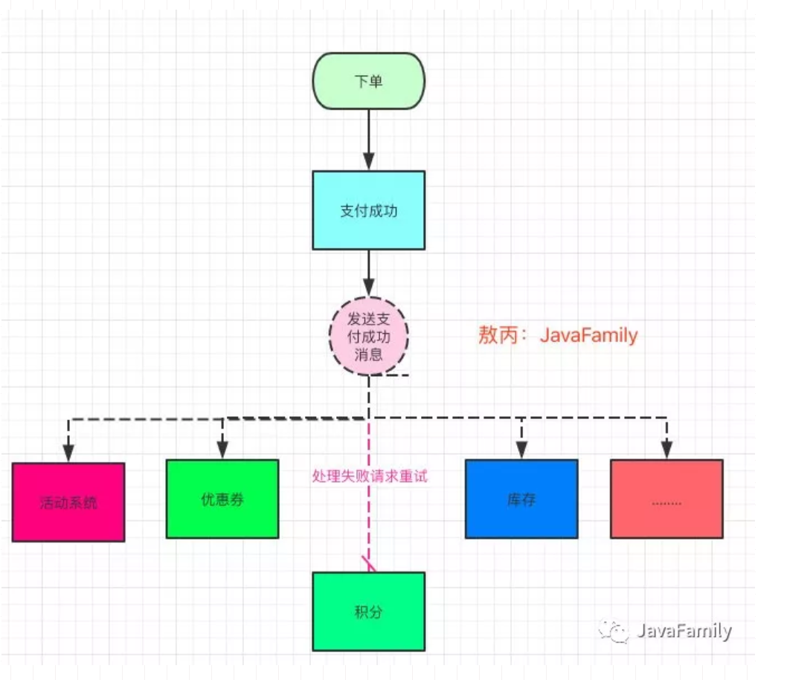

         如：我们的积分系统处理失败了，他这个系统肯定要求你重新发送一次这个消息对吧，积分的系统重新接收并且处理成功了，但是别人的活动，优惠券等等服务也监听了这个消息呀，那不就可能出现活动系统给他加积分加两次，优惠券扣两次这种情况么？

         方案：

         使用接口幂等的方法。

         > 幂等（idempotent、idempotence）是一个数学与计算机学概念，常见于抽象代数中。在编程中一个幂等操作的特点是其任意多次执行所产生的影响均与一次执行的影响相同。幂等函数，或幂等方法，是指可以使用相同参数重复执行，并能获得相同结果的函数。这些函数不会影响系统状态，也不用担心重复执行会对系统造成改变。例如，"setTrue()”函数就是一个幂等函数,无论多次执行，其结果都是一样的.更复杂的操作幂等保证是利用唯一交易号(流水号)实现.
         > 通俗了讲就是你同样的参数调用我这个接口，调用多少次结果都是一个，你加积分同一个订单号你加一次是多少钱，你加 N 次都还是多少钱。
         > 如何保证幂等：

         比如你拿个数据要写库，你先根据主键查一下，如果这数据都有了，你就别插入了，更新一下好吧。 &#x20;
         比如你是写 Redis，那没问题了，反正每次都是 set，天然幂等性。 &#x20;
         比如你不是上面两个场景，那做的稍微复杂一点，你需要让生产者发送每条数据的时候，里面加一个全局唯一的 id，类似订单 id 之类的东西，然后你这里消费到了之后，先根据这个 id 去比如 Redis 里查一下，之前消费过吗？如果没有消费过，你就处理，然后这个 id 写 Redis。如果消费过了，那你就别处理了，保证别重复处理相同的消息即可。

      2. **消息顺序消费**

         通常消息队列可以保证先到队列的消息按照顺序分发给消费者消费来保证顺序，但是一个队列有多个消费者消费的时候，那将失去这个保证，因为这些消息被多个线程并发的消费。

         如：① 一个 queue，有多个 consumer 去消费，这样就会造成顺序的错误，consumer 从 MQ 里面读取数据是有序的，但是每个 consumer 的执行时间是不固定的，无法保证先读到消息的 consumer 一定先完成操作，这样就会出现消息并没有按照顺序执行，造成数据顺序错误。

         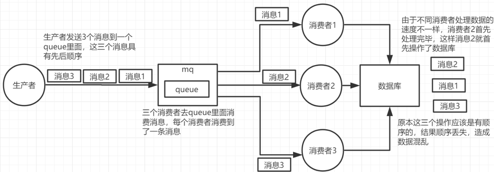

         ② 一个 queue 对应一个 consumer，但是 consumer 里面进行了多线程消费，这样也会造成消息消费顺序错误。

         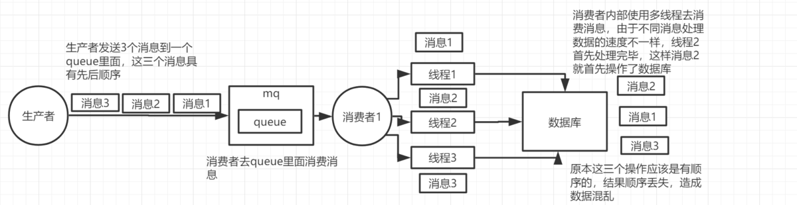

         解决方案：

         从根本上说，异步消息是不应该有顺序依赖的。在消息队列上估计是没法解决。要实现严格的顺序消息，简单且可行的办法就是：保证 生产者- 消息队列 -消费者 是一对一对一的关系。

         如果有顺序依赖的消息，要保证消息有一个 hashKey，类似于数据库表分区的的分区 key 列。保证对同一个 key 的消息发送到相同的队列。A 用户产生的消息（包括创建消息和删除消息）都按 A 的 hashKey 分发到同一个队列。只需要把强相关的两条消息基于相同的路由就行了，也就是说经过 m1 和 m2 的在路由表里的路由是一样的，那自然 m1 会优先于 m2 去投递。而且一个 queue 只对应一个 consumer

         如：

         ① 拆分多个 queue，每个 queue 一个 consumer，就是多一些 queue 而已，确实是麻烦点；这样也会造成吞吐量下降，可以在消费者内部采用多线程的方式取消费。

         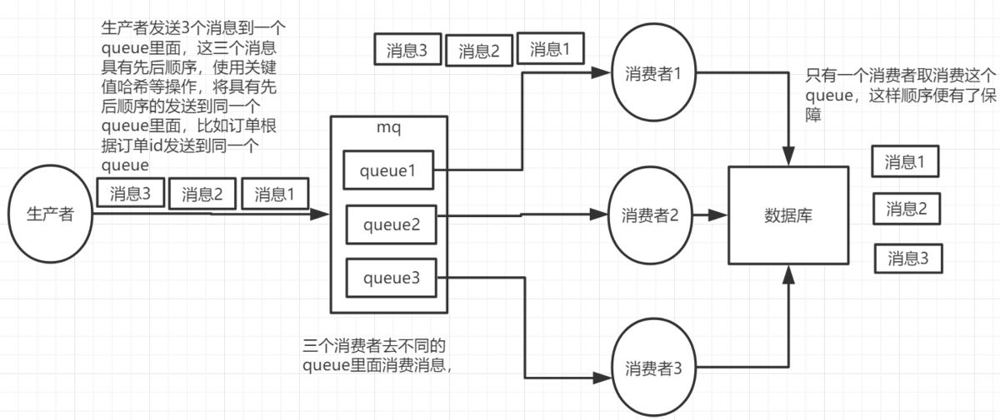

         ② 或者就一个 queue 但是对应一个 consumer，然后这个 consumer 内部用内存队列做排队，然后分发给底层不同的 worker 来处理

         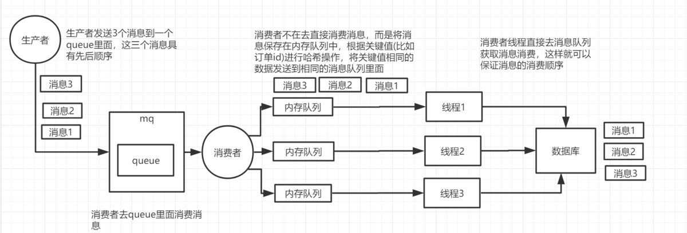

      3. **消息丢失**：

         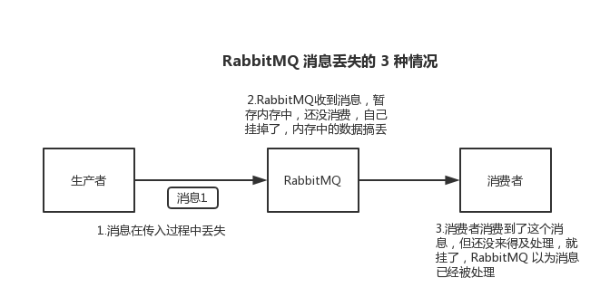

         生产者弄丢了数据

         生产者将数据发送到 RabbitMQ 的时候，可能数据就在半路给搞丢了，因为网络问题啥的，都有可能。

         此时可以选择用 RabbitMQ 提供的事务功能，就是生产者发送数据之前开启 RabbitMQ 事务 channel.txSelect，然后发送消息，如果消息没有成功被 RabbitMQ 接收到，那么生产者会收到异常报错，此时就可以回滚事务 channel.txRollback，然后重试发送消息；如果收到了消息，那么可以提交事务 channel.txCommit。

         ```java
         // 开启事务
         channel.txSelect
         try {
             // 这里发送消息
         } catch (Exception e) {
             channel.txRollback
             // 这里再次重发这条消息
         }
         // 提交事务
         channel.txCommit
         ```

         但是问题是，RabbitMQ 事务机制（同步）一搞，基本上吞吐量会下来，因为太耗性能。

         所以一般来说，如果你要确保说写 RabbitMQ 的消息别丢，可以开启 confirm 模式，在生产者那里设置开启 confirm 模式之后，你每次写的消息都会分配一个唯一的 id，然后如果写入了 RabbitMQ 中，RabbitMQ 会给你回传一个 ack 消息，告诉你说这个消息 ok 了。如果 RabbitMQ 没能处理这个消息，会回调你的一个 nack 接口，告诉你这个消息接收失败，你可以重试。而且你可以结合这个机制自己在内存里维护每个消息 id 的状态，如果超过一定时间还没接收到这个消息的回调，那么你可以重发。

         事务机制和 cnofirm 机制最大的不同在于，事务机制是同步的，你提交一个事务之后会阻塞在那儿，但是 confirm 机制是异步的，你发送个消息之后就可以发送下一个消息，然后那个消息 RabbitMQ 接收了之后会异步回调你的一个接口通知你这个消息接收到了。

         所以一般在生产者这块避免数据丢失，都是用 confirm 机制的。

         RabbitMQ 弄丢了数据

         就是 RabbitMQ 自己弄丢了数据，这个你必须开启 RabbitMQ 的持久化，就是消息写入之后会持久化到磁盘，哪怕是 RabbitMQ 自己挂了，恢复之后会自动读取之前存储的数据，一般数据不会丢。除非极其罕见的是，RabbitMQ 还没持久化，自己就挂了，可能导致少量数据丢失，但是这个概率较小。

         设置持久化有两个步骤：

         创建 queue 的时候将其设置为持久化

         这样就可以保证 RabbitMQ 持久化 queue 的元数据，但是它是不会持久化 queue 里的数据的。

         第二个是发送消息的时候将消息的 deliveryMode 设置为 2

         就是将消息设置为持久化的，此时 RabbitMQ 就会将消息持久化到磁盘上去。

         必须要同时设置这两个持久化才行，RabbitMQ 哪怕是挂了，再次重启，也会从磁盘上重启恢复 queue，恢复这个 queue 里的数据。

         注意，哪怕是你给 RabbitMQ 开启了持久化机制，也有一种可能，就是这个消息写到了 RabbitMQ 中，但是还没来得及持久化到磁盘上，结果不巧，此时 RabbitMQ 挂了，就会导致内存里的一点点数据丢失。

         所以，持久化可以跟生产者那边的 confirm 机制配合起来，只有消息被持久化到磁盘之后，才会通知生产者 ack 了，所以哪怕是在持久化到磁盘之前，RabbitMQ 挂了，数据丢了，生产者收不到 ack，你也是可以自己重发的。

         消费端弄丢了数据

         RabbitMQ 如果丢失了数据，主要是因为你消费的时候，刚消费到，还没处理，结果进程挂了，比如重启了，那么就尴尬了，RabbitMQ 认为你都消费了，这数据就丢了。

         这个时候得用 RabbitMQ 提供的 ack 机制，简单来说，就是你必须关闭 RabbitMQ 的自动 ack，可以通过一个 api 来调用就行，然后每次你自己代码里确保处理完的时候，再在程序里 ack 一把。这样的话，如果你还没处理完，不就没有 ack 了？那 RabbitMQ 就认为你还没处理完，这个时候 RabbitMQ 会把这个消费分配给别的 consumer 去处理，消息是不会丢的。

         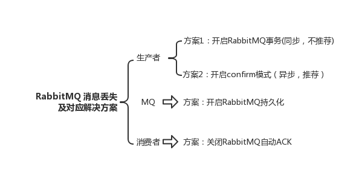

   2. 数据一致性问题：对于支付的消息队列的成功问题，应该都要成功处理，如果有一条失败，均为失败，这里需要用分布式事务。

      分布式事务的使用场景：

      大家可以想一下，你下单流程可能涉及到 10 多个环节，你下单付钱都成功了，但是你优惠券扣减失败了，积分新增失败了，前者公司会被薅羊毛，后者用户会不开心，但是这些都在不同的服务怎么保证大家都成功呢？

      这时可以使用

      1. 两阶段提交（2PC）

         两阶段提交（Two-phase Commit，2PC），通过引入协调者（Coordinator）来协调参与者的行为，并最终决定这些参与者是否要真正执行事务。

         协调者询问参与者事务是否执行成功，参与者发回事务执行结果。

         提交阶段

         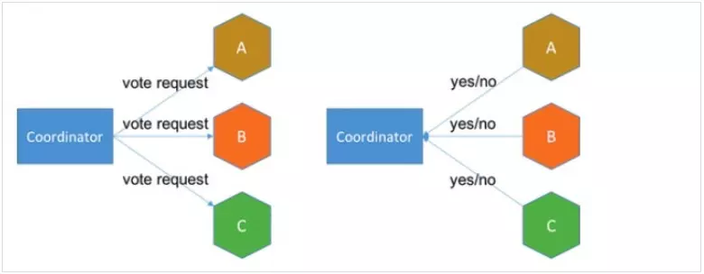

         如果事务在每个参与者上都执行成功，事务协调者发送通知让参与者提交事务；否则，协调者发送通知让参与者回滚事务。

         需要注意的是，在准备阶段，参与者执行了事务，但是还未提交。只有在提交阶段接收到协调者发来的通知后，才进行提交或者回滚。

         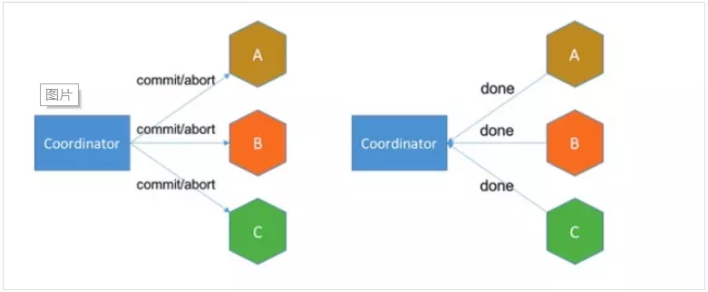

         存在的问题

         同步阻塞 所有事务参与者在等待其它参与者响应的时候都处于同步阻塞状态，无法进行其它操作。

         单点问题 协调者在 2PC 中起到非常大的作用，发生故障将会造成很大影响。特别是在阶段二发生故障，所有参与者会一直等待状态，无法完成其它操作。

         数据不一致 在阶段二，如果协调者只发送了部分 Commit 消息，此时网络发生异常，那么只有部分参与者接收到 Commit 消息，也就是说只有部分参与者提交了事务，使得系统数据不一致。

         太过保守 任意一个节点失败就会导致整个事务失败，没有完善的容错机制。

      2. TCC 其实就是采用的补偿机制，其核心思想是：针对每个操作，都要注册一个与其对应的确认和补偿（撤销）操作。它分为三个阶段：

         Try 阶段主要是对业务系统做检测及资源预留

         Confirm 阶段主要是对业务系统做确认提交，Try 阶段执行成功并开始执行 Confirm 阶段时，默认 Confirm 阶段是不会出错的。即：只要 Try 成功，Confirm 一定成功。

         Cancel 阶段主要是在业务执行错误，需要回滚的状态下执行的业务取消，预留资源释放。

         举个例子，假入 Bob 要向 Smith 转账，思路大概是： 我们有一个本地方法，里面依次调用

         首先在 Try 阶段，要先调用远程接口把 Smith 和 Bob 的钱给冻结起来。

         在 Confirm 阶段，执行远程调用的转账的操作，转账成功进行解冻。

         如果第 2 步执行成功，那么转账成功，如果第二步执行失败，则调用远程冻结接口对应的解冻方法 (Cancel)。

         优点： 跟 2PC 比起来，实现以及流程相对简单了一些，但数据的一致性比 2PC 也要差一些

         缺点： 缺点还是比较明显的，在 2,3 步中都有可能失败。TCC 属于应用层的一种补偿方式，所以需要程序员在实现的时候多写很多补偿的代码，在一些场景中，一些业务流程可能用 TCC 不太好定义及处理。

      3. 本地消息表（异步确保）

         本地消息表与业务数据表处于同一个数据库中，这样就能利用本地事务来保证在对这两个表的操作满足事务特性，并且使用了消息队列来保证最终一致性。

         在分布式事务操作的一方完成写业务数据的操作之后向本地消息表发送一个消息，本地事务能保证这个消息一定会被写入本地消息表中。

         之后将本地消息表中的消息转发到 Kafka 等消息队列中，如果转发成功则将消息从本地消息表中删除，否则继续重新转发。

         在分布式事务操作的另一方从消息队列中读取一个消息，并执行消息中的操作。

         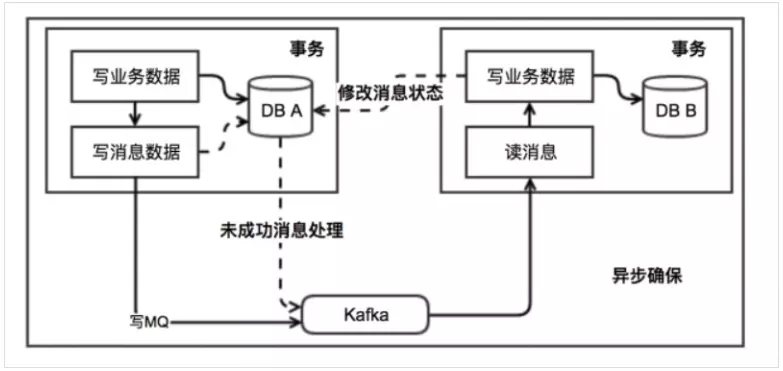

         优点： 一种非常经典的实现，避免了分布式事务，实现了最终一致性。

         缺点： 消息表会耦合到业务系统中，如果没有封装好的解决方案，会有很多杂活需要处理。

      4. MQ 事务消息

         有一些第三方的 MQ 是支持事务消息的，比如 RocketMQ，他们支持事务消息的方式也是类似于采用的二阶段提交，但是市面上一些主流的 MQ 都是不支持事务消息的，比如 RabbitMQ 和 Kafka 都不支持。

         以阿里的 RocketMQ 中间件为例，其思路大致为：

         第一阶段 Prepared 消息，会拿到消息的地址。 第二阶段执行本地事务，第三阶段通过第一阶段拿到的地址去访问消息，并修改状态。

         也就是说在业务方法内要想消息队列提交两次请求，一次发送消息和一次确认消息。如果确认消息发送失败了 RocketMQ 会定期扫描消息集群中的事务消息，这时候发现了 Prepared 消息，它会向消息发送者确认，所以生产方需要实现一个 check 接口，RocketMQ 会根据发送端设置的策略来决定是回滚还是继续发送确认消息。这样就保证了消息发送与本地事务同时成功或同时失败。

         

         优点：  实现了最终一致性，不需要依赖本地数据库事务。

         缺点：  实现难度大，主流 MQ 不支持，RocketMQ 事务消息部分代码也未开源。

   3. 消息队列的可用性问题：如果消息队列挂掉应该怎么办。

      RabbitMQ 的高可用性
      RabbitMQ 是比较有代表性的，因为是基于主从（非分布式）做高可用性的，我们就以 RabbitMQ 为例子讲解第一种 MQ 的高可用性怎么实现。
      RabbitMQ 有三种模式：单机模式、普通集群模式、镜像集群模式。
      单机模式
      单机模式，就是 Demo 级别的，一般就是你本地启动了玩玩儿的 😄，没人生产用单机模式。
      普通集群模式（无高可用性）
      普通集群模式，意思就是在多台机器上启动多个 RabbitMQ 实例，每个机器启动一个。你创建的 queue，只会放在一个 RabbitMQ 实例上，但是每个实例都同步 queue 的元数据（元数据可以认为是 queue 的一些配置信息，通过元数据，可以找到 queue 所在实例）。你消费的时候，实际上如果连接到了另外一个实例，那么那个实例会从 queue 所在实例上拉取数据过来。

      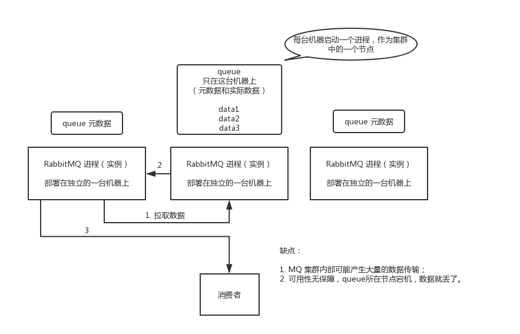

      这种方式确实很麻烦，也不怎么好，没做到所谓的分布式，就是个普通集群。因为这导致你要么消费者每次随机连接一个实例然后拉取数据，要么固定连接那个 queue 所在实例消费数据，前者有数据拉取的开销，后者导致单实例性能瓶颈。
      而且如果那个放 queue 的实例宕机了，会导致接下来其他实例就无法从那个实例拉取，如果你开启了消息持久化，让 RabbitMQ 落地存储消息的话，消息不一定会丢，得等这个实例恢复了，然后才可以继续从这个 queue 拉取数据。
      所以这个事儿就比较尴尬了，这就没有什么所谓的高可用性，这方案主要是提高吞吐量的，就是说让集群中多个节点来服务某个 queue 的读写操作。
      镜像集群模式（高可用性）
      这种模式，才是所谓的 RabbitMQ 的高可用模式。跟普通集群模式不一样的是，在镜像集群模式下，你创建的 queue，无论元数据还是 queue 里的消息都会存在于多个实例上，就是说，每个 RabbitMQ 节点都有这个 queue 的一个完整镜像，包含 queue 的全部数据的意思。然后每次你写消息到 queue 的时候，都会自动把消息同步到多个实例的 queue 上。

      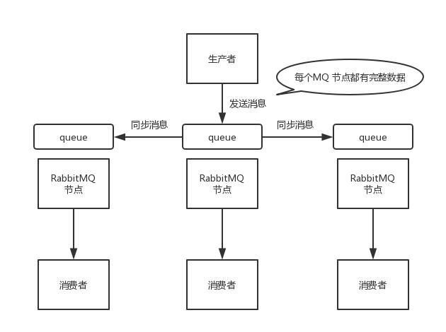

      那么如何开启这个镜像集群模式呢？其实很简单，RabbitMQ 有很好的管理控制台，就是在后台新增一个策略，这个策略是镜像集群模式的策略，指定的时候是可以要求数据同步到所有节点的，也可以要求同步到指定数量的节点，再次创建 queue 的时候，应用这个策略，就会自动将数据同步到其他的节点上去了。
      这样的话，好处在于，你任何一个机器宕机了，没事儿，其它机器（节点）还包含了这个 queue 的完整数据，别的 consumer 都可以到其它节点上去消费数据。坏处在于，第一，这个性能开销也太大了吧，消息需要同步到所有机器上，导致网络带宽压力和消耗很重！第二，这么玩儿，不是分布式的，就没有扩展性可言了，如果某个 queue 负载很重，你加机器，新增的机器也包含了这个 queue 的所有数据，并没有办法线性扩展你的 queue。你想，如果这个 queue 的数据量很大，大到这个机器上的容量无法容纳了，此时该怎么办呢？

[RabbitMQ](RabbitMQ/RabbitMQ.md "RabbitMQ")
