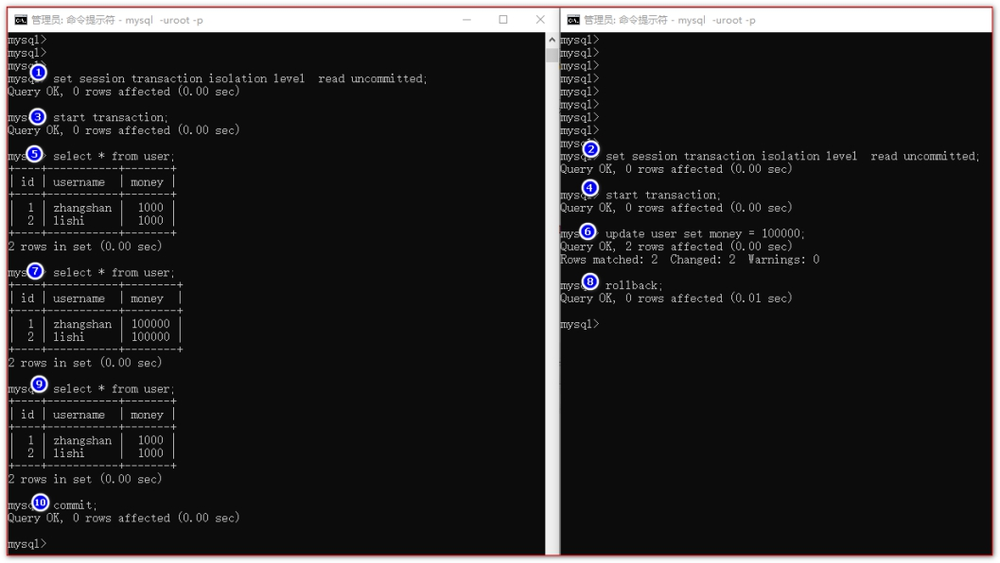
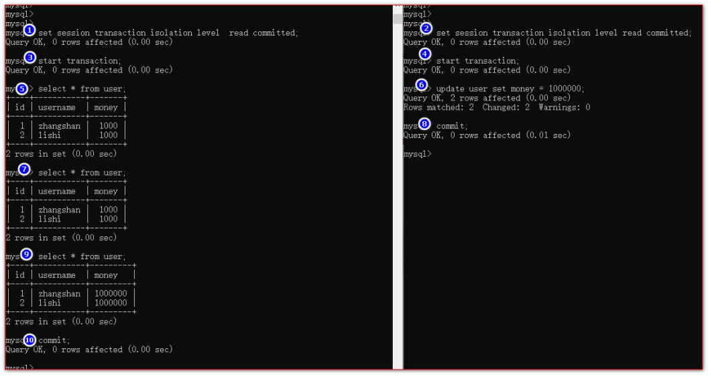
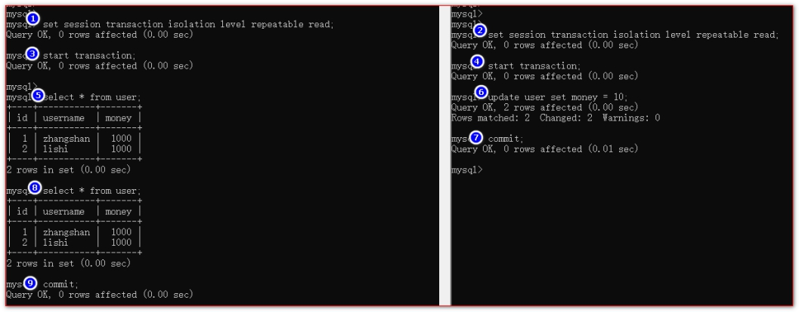
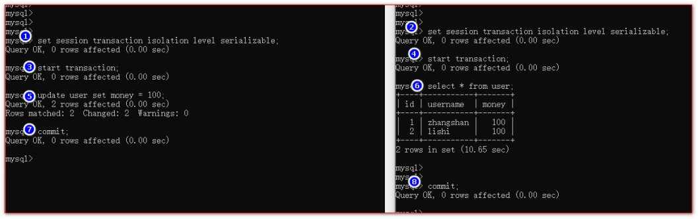

# 事务隔离级别演示

## 目录

- [什么是脏读？](#什么是脏读)
- [什么是不可重复读？](#什么是不可重复读)
- [什么是幻读？](#什么是幻读)
- [演示隔离级别](#演示隔离级别)
- [画图解释四种隔离级别:](#画图解释四种隔离级别)

数据库事务隔离级别,是为了解决数据库高并发过程中,事务与事务之间数据的安全问题.

数据库有四种事务隔离级别：

一：读未提交  read uncommitted

二：读已提交  read committed      Oracle默认

三：可重复读  repeatable read      mysql默认

四：串行事务  serializable (读写不并行)

由事务隔离级别产生的几个常见问题:

读未提交，可导致----->>>> 脏读

读已提交，可导致----->>>> 不可重复读

重复读，可导致  ----->>>> 幻读

### 什么是脏读？

脏读,就是查询到的数据,不是真实有效的数据.( 这个数据可能会随时被回滚 )

### 什么是不可重复读？

完美解决脏读

不可重复读,是指多次查询相同的数据.得到的结果不是完全一样(commit).(Oracle)

### 什么是幻读？

A:开启事务,执行update,commit

B:开启事务,执行select,查询到的数据必须是自身commit后看到的真实有效数据

幻读是指,多次查询相同的数据,得到的结果都跟第一次一样.(但其实,查询的数据已经被修改\[有插入,有修改,有删除])(MySQL)

### 演示隔离级别

1.查看当前会话隔离级别

**select @@tx\_isolation;**

2.查看系统当前隔离级别

**select @@global.tx\_isolation;**

3.设置当前会话隔离级别

**set session transaction isolation level read uncommitted;    设置读未提交**

**set session transaction isolation level read committed;      设置读已提交**

**set session transaction isolation level repeatable read;      设置可重复读**

**set session transaction isolation level serializable;           设置串行化**

4.开启事务

**start transaction;**

5.提交事务

**commit;**

6.回滚事务

**rollback;**

### 画图解释四种隔离级别:

13.1、读未提交导致脏读的演示：

13.2、读已提交导致不可重复读演示：

12.3、可重复读导致幻读的演示

13.4、串行化事务的演示

