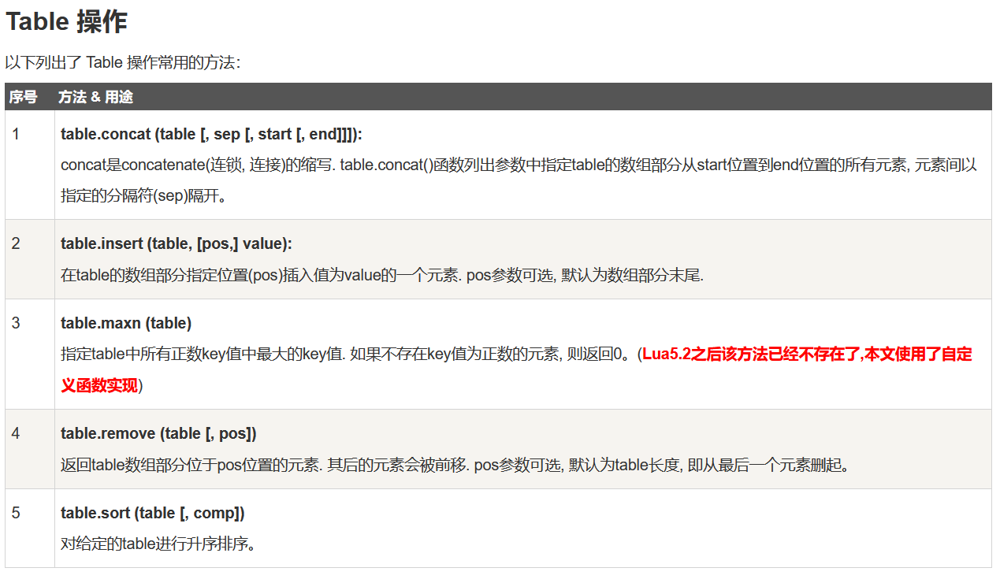

# Lua table表

table 是 Lua 的一种数据结构用来帮助我们创建不同的数据类型，如：数组、字典等。

Lua table 使用关联型数组，你可以用任意类型的值来作数组的索引，但这个值不能是 nil。

Lua table 是不固定大小的，你可以根据自己需要进行扩容。

Lua也是通过table来解决模块（module）、包（package）和对象（Object）的。 例如string.format表示使用"format"来索引table string。

table(表)的构造

构造器是创建和初始化表的表达式。表是Lua特有的功能强大的东西。最简单的构造函数是{}，用来创建一个空表。可以直接初始化数组:

```lua
-- 初始化表
mytable = {}

-- 指定值
mytable[1]= "Lua"

-- 移除引用
mytable = nil
-- lua 垃圾回收会释放内存
```


当我们为 table a 并设置元素，然后将 a 赋值给 b，则 a 与 b 都指向同一个内存。如果 a 设置为 nil ，则 b 同样能访问 table 的元素。如果没有指定的变量指向a，Lua的垃圾回收机制会清理相对应的内存。



```lua
当我们获取 table 的长度的时候无论是使用 # 还是 table.getn 其都会在索引中断的地方停止计数，而导致无法正确取得 table 的长度。

可以使用以下方法来代替：

function table_leng(t)
  local leng=0
  for k, v in pairs(t) do
    leng=leng+1
  end
  return leng;
end
```
