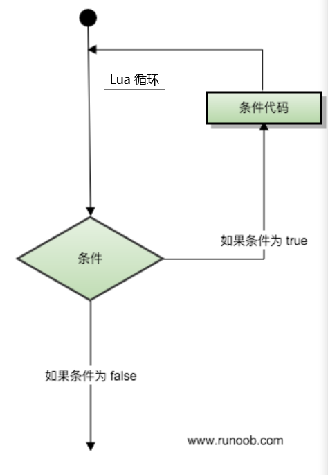
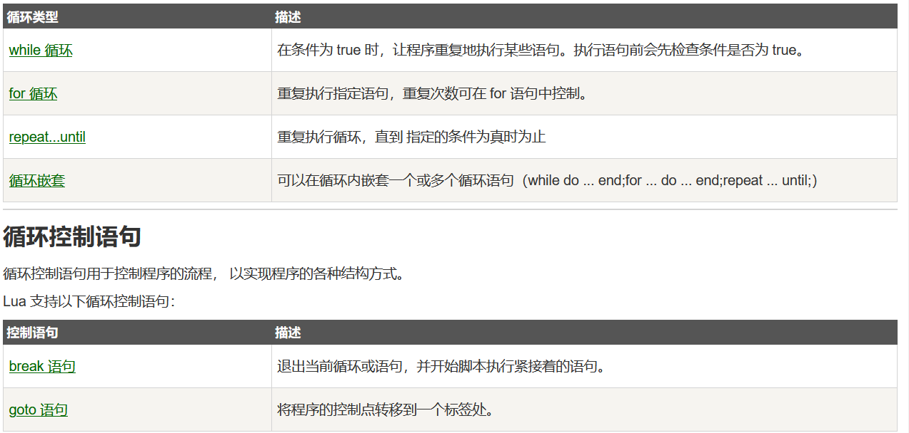

# Lua循环

## 目录

- [while循环](#while循环)
- [for循环](#for循环)
- [repeat...until 循环](#repeatuntil-循环)
- [嵌套循环](#嵌套循环)

很多情况下我们需要做一些有规律性的重复操作，因此在程序中就需要重复执行某些语句。

一组被重复执行的语句称之为循环体，能否继续重复，决定循环的终止条件。

循环结构是在一定条件下反复执行某段程序的流程结构，被反复执行的程序被称为循环体。

循环语句是由循环体及循环的终止条件两部分组成的。





#### while循环

```lua
Lua 编程语言中 while 循环语法：

while(condition)
do
   statements
end

---
a=10
while( a < 20 )
do
   print("a 的值为:", a)
   a = a+1
end 
```


#### for循环

Lua 编程语言中 for语句有两大类：：

- 数值for循环

```lua
Lua 编程语言中数值 for 循环语法格式:

for var=exp1,exp2,exp3 do  
    <执行体>  
end  
var 从 exp1 变化到 exp2，每次变化以 exp3 为步长递增 var，并执行一次 "执行体"。exp3 是可选的，如果不指定，默认为1。
---
for i=1,f(x) do
    print(i)
end
 
for i=10,1,-1 do
    print(i)
end 
---
for的三个表达式在循环开始前一次性求值，以后不再进行求值。比如上面的f(x)只会在循环开始前执行一次，其结果用在后面的循环中。

验证如下:
实例
#!/usr/local/bin/lua  
function f(x)  
    print("function")  
    return x*2  
end  
for i=1,f(5) do print(i)  
end

以上实例输出结果为：

function
1
2
3
4
5
6
7
8
9
10 
```


- 泛型for循环

泛型 for 循环通过一个迭代器函数来遍历所有值，类似 java 中的 foreach 语句。

```lua
 #!/usr/local/bin/lua  
days = {"Sunday","Monday","Tuesday","Wednesday","Thursday","Friday","Saturday"}  
for i,v in ipairs(days) do  print(v) end  

以上实例输出结果为：

Sunday
Monday
Tuesday
Wednesday
Thursday
Friday
Saturday
```


#### repeat...until 循环

Lua 编程语言中 repeat...until 循环语句不同于 for 和 while循环，for 和 while 循环的条件语句在当前循环执行开始时判断，而 repeat...until 循环的条件语句在当前循环结束后判断。

```lua
Lua 编程语言中 repeat...until 循环语法格式:

repeat
   statements
until( condition )

---
 --[ 变量定义 --]
a = 10
--[ 执行循环 --]
repeat
   print("a的值为:", a)
   a = a + 1
until( a > 15 )

执行以上代码，程序输出结果为：

a的值为:    10
a的值为:    11
a的值为:    12
a的值为:    13
a的值为:    14
a的值为:    15 
```


#### 嵌套循环

```lua
Lua 编程语言中 for 循环嵌套语法格式:

for init,max/min value, increment
do
   for init,max/min value, increment
   do
      statements
   end
   statements
end

Lua 编程语言中 while 循环嵌套语法格式:

while(condition)
do
   while(condition)
   do
      statements
   end
   statements
end

Lua 编程语言中 repeat...until 循环嵌套语法格式:

repeat
   statements
   repeat
      statements
   until( condition )
until( condition )

除了以上同类型循环嵌套外，我们还可以使用不同的循环类型来嵌套，如 for 循环体中嵌套 while 循环。
```
